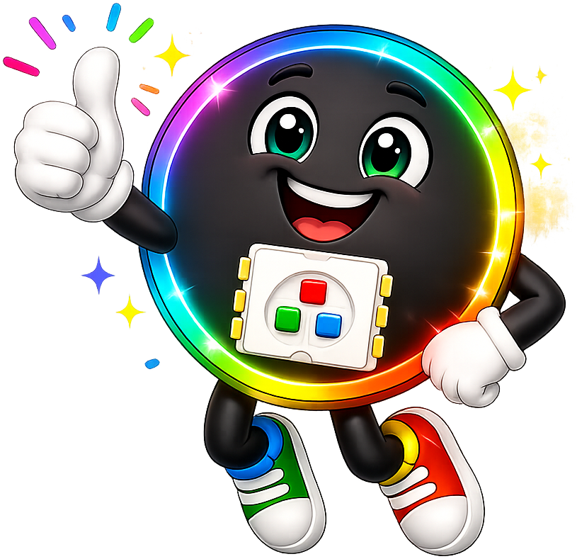

# Python Basics: Variables, Data Types, and Operators

## Summary

Covers Python's core building blocks: variables and assignment, all fundamental data types (integers, floats, strings, booleans, lists, tuples), mathematical and comparison operators, string operations, imports, and code indentation.

## Concepts Covered

This chapter covers the following 23 concepts from the learning graph:

1. Python Programming Language
2. Variable
3. Variable Assignment
4. Integer Data Type
5. Float Data Type
6. String Data Type
7. Boolean Data Type
8. List Data Type
9. Tuple Data Type
10. None Value
11. Type Conversion
12. Mathematical Operators
13. Comparison Operators
14. Logical Operators
15. Import Statement
16. Module System
17. Code Indentation Rules
18. Python Comments
19. String Concatenation
20. List Indexing
21. Tuple Immutability
22. Modulo Operator
23. Integer Division

## Prerequisites

This chapter builds on concepts from:

- [Chapter 1: Introduction and Computational Thinking Foundations](../01-intro-and-computational-thinking/index.md)

---

!!! tip "Pixel says..."
    
    Welcome to Chapter 2! We're about to learn the building blocks of every Python program. Variables, data types, and operators are the tools you'll use in every single LED project. Let's light this up!

## What You'll Learn

By the end of this chapter, you'll be able to:

- Create variables and store different kinds of data in them
- Recognize and use Python's six main data types
- Write math expressions and comparisons using operators
- Import modules to add extra power to your programs
- Write clean, correctly indented Python code with helpful comments

## What You'll Need

For this chapter you don't need any hardware — just Thonny and your Raspberry Pi Pico. All the short examples run in Thonny's Shell panel (the REPL window at the bottom).

## Python: The Language of This Course

**Python** is a programming language — a set of words and rules that computers understand. Think of it like a recipe language. You write the steps, and the Pico follows them exactly.

Python was created in 1991 by Guido van Rossum. It's now one of the most popular languages in the world. Scientists, game developers, and makers all use it.

We use a special version called **MicroPython**. MicroPython is Python that runs on tiny computers like the Raspberry Pi Pico. It packs almost all of Python's features into a very small space.

Here's the simplest Python program you can write. This single line prints a greeting to the screen:

```python
print("Hello, world!")   # This line shows text in the Shell panel
```

Run it in Thonny's Shell. You should see `Hello, world!` appear immediately.

## Variables: Named Storage

A **variable** is a named storage spot for a piece of information. Think of it like a labeled box. You put something inside, give the box a name, and use that name whenever you need what's inside.

**Variable assignment** means placing a value into a variable. In Python, you use the equals sign (`=`) to assign a value. The variable name goes on the left, and the value goes on the right:

```python
color_name = "red"       # Store the text "red" in color_name
led_brightness = 200     # Store the number 200 in led_brightness
is_on = True             # Store True in is_on
```

After assignment, you can read the value back by using the variable's name:

```python
color_name = "red"
print(color_name)        # Prints: red
```

!!! info "Pixel thinks..."
    
    Variable names can use letters, numbers, and underscores. Always start with a letter — not a number. So `led_1` is fine, but `1_led` won't work. Python is also case-sensitive: `Color` and `color` are two different variables. Use lowercase_with_underscores for all your variable names.

Here are the naming rules to remember:

- No spaces in names — use underscores: `strip_length`, not `strip length`
- Python keywords (`for`, `if`, `while`) can't be used as variable names
- Choose names that describe what's stored: `red_brightness` is great, `x` is not

## Data Types: What Kind of Thing Is It?

Every value in Python has a **data type** — a category that describes what kind of information it is. Python has six types you'll use in this course.

Before we look at each type in detail, here's a quick overview:

| Data Type | Example | What It Stores |
|-----------|---------|----------------|
| Integer | `255` | Whole numbers (no decimal) |
| Float | `2.5` | Numbers with a decimal point |
| String | `"red"` | Text characters |
| Boolean | `True` | True or False only |
| List | `[255, 0, 0]` | Ordered, changeable collection |
| Tuple | `(255, 0, 0)` | Ordered, unchangeable collection |

Let's explore each one.

### Integers: Whole Numbers

An **integer** (often shortened to **int**) is a whole number with no decimal point. Integers can be positive, negative, or zero.

```python
num_pixels = 30     # How many LEDs on the strip
red_channel = 255   # Maximum brightness for red
blue_channel = 0    # Blue is completely off
```

You'll use integers constantly in NeoPixel programming. Color values always range from 0 to 255 — all integers.

### Floats: Decimal Numbers

A **float** (short for "floating-point number") is a number that includes a decimal point.

```python
brightness_scale = 0.75   # 75% brightness
speed = 1.5               # 1.5 seconds per animation frame
```

Use floats when whole numbers aren't precise enough — like setting brightness to 37.5%.

### Strings: Text

A **string** is a piece of text. You create a string by wrapping characters in quotation marks — either single quotes (`'`) or double quotes (`"`).

```python
color_name = "rainbow"
message = 'Hello, coder!'
empty = ""              # An empty string — still a valid string
```

**String concatenation** means joining two strings together using the `+` operator. The following code joins two strings and prints the combined result:

```python
first = "Moving"
second = " Rainbow"
full = first + second   # full is now "Moving Rainbow"
print(full)             # Prints: Moving Rainbow
```

### Booleans: True or False

A **boolean** (or **bool**) can only hold one of two values: `True` or `False`. Always capitalize both words exactly that way.

```python
strip_is_on = True
animation_running = False
```

Booleans are the building blocks of decisions. When you ask "is the button pressed?" the answer is always a boolean.

### Lists: Ordered and Changeable

A **list** is a collection of values stored in order. You create a list with square brackets `[ ]`, separating items with commas.

```python
rgb_color = [255, 100, 0]   # Orange: red=255, green=100, blue=0
steps = [0, 7, 14, 21, 28]  # Five pixel positions
```

Lists are **changeable** — you can add, remove, or update items after you create them.

**List indexing** means accessing one item from a list by its position number. Python counts from 0, not 1. So the first item sits at index 0, the second at index 1, and so on:

```python
rgb_color = [255, 100, 0]
red = rgb_color[0]    # Gets 255 — the first item
green = rgb_color[1]  # Gets 100 — the second item
blue = rgb_color[2]   # Gets 0 — the third item
```

!!! warning "Watch out!"
    
    Python counts from 0, not 1. The first item is at index `[0]`, not `[1]`. If your list has 3 items, the valid indexes are 0, 1, and 2. Trying to access index 3 on a 3-item list will cause an error — and it surprises a lot of beginners!

### Tuples: Ordered and Unchangeable

A **tuple** is like a list — but once you create it, you can't change it. You create a tuple with parentheses `( )`.

```python
RED = (255, 0, 0)
GREEN = (0, 255, 0)
BLUE = (0, 0, 255)
WHITE = (255, 255, 255)
```

**Tuple immutability** means tuples are "locked." You can read items from a tuple, but you can't add, remove, or change them after creation. This is exactly why color constants in NeoPixel code use tuples — you don't want to accidentally overwrite `RED`.

```python
RED = (255, 0, 0)
print(RED[0])    # 255 — reading is fine
# RED[0] = 128  # This would raise a TypeError — tuples can't be changed
```

You index a tuple the same way you index a list — using `[position]`.

### None: No Value Yet

**None** is a special value that means "nothing" or "no value yet." It's used when a variable needs to exist but doesn't have a meaningful value at the moment.

```python
last_button_press = None   # No button pressed yet
```

You'll see `None` used as a placeholder before a variable gets its real value.

Now let's practice identifying all six types interactively:

#### Diagram: Python Data Type Explorer

<iframe src="../../sims/python-data-type-explorer/main.html" width="100%" height="520px" scrolling="no"></iframe>

<details markdown="1">
<summary>Python Data Type Explorer</summary>
Type: microsim
**sim-id:** python-data-type-explorer<br/>
**Library:** p5.js<br/>
**Status:** Specified

Bloom Level: Understand (L2)
Bloom Verb: classify, identify
Learning Objective: Students classify Python values by data type — given a displayed value, they select its type from six options and receive feedback that connects the type to an LED programming context.

Instructional Rationale: The classify objective (L2 Understand) calls for a prediction-then-reveal pattern, not animation. Students see a value, commit to a type selection, then receive confirmation with an explanation. Prediction before reveal is the key retrieval-practice mechanism for retention at this level.

Canvas layout:
- Top area: A large "value card" showing a Python value in monospace font on a dark background (e.g., `42`, `"hello"`, `True`, `3.14`, `[1,2,3]`, `(255,0,0)`, `None`)
- Center area: Seven labeled type buttons — Integer, Float, String, Boolean, List, Tuple, None — arranged in a row or two rows on narrow screens
- Bottom area: Feedback panel showing correct/incorrect result with an explanation and an LED code example
- Progress bar: "Question X of 15" shown below the value card

Visual elements:
- Value card: Large rounded rectangle, dark background, white monospace text, border color matches type (blue=int, cyan=float, green=string, yellow=bool, orange=list, purple=tuple, gray=none) — border only shown AFTER student answers
- Type buttons: Pill-shaped, highlight on hover, turn green (correct) or amber (incorrect) after selection
- Feedback panel: Warm green background (correct) or amber (not quite) with two lines of text: (1) why this value is that type, (2) an LED example using this value

Data Visibility Requirements:
Stage 1: Show value card with value visible, border color hidden
Stage 2: Student clicks a type button
Stage 3: Reveal correct type, color the border, show feedback:
- Why: e.g., "255 is an integer — it's a whole number with no decimal point"
- LED example: e.g., "In NeoPixel code: `strip[0] = (255, 0, 0)` — 255 is the red channel value"
Stage 4: "Next" button advances to a new value

Values to cycle through (15 total):
- `42` → Integer
- `3.14` → Float
- `"hello"` → String
- `True` → Boolean
- `[255, 0, 0]` → List
- `(128, 0, 200)` → Tuple
- `None` → None
- `0` → Integer
- `0.5` → Float
- `"Moving Rainbow"` → String
- `False` → Boolean
- `[1, 2, 3, 4, 5]` → List
- `(255, 255, 255)` → Tuple
- `255` → Integer
- `""` → String (empty string)

Controls:
- Seven type buttons (one per type)
- "Next Value" button — shown after student answers, advances to next card
- "Shuffle" button — randomizes card order for replay

Responsive design: Canvas width fills container; font sizes and button layout scale with canvas width; buttons reflow to two rows on narrow screens.
</details>

## Type Conversion: Changing From One Type to Another

Sometimes you need to convert a value from one type to another. This is called **type conversion**.

Python has three built-in functions for the most common conversions. Before seeing examples, here's what each one does:

- `int()` — converts to an integer, cutting off any decimal
- `float()` — converts to a float, adding a decimal point
- `str()` — converts to a string of text

Now let's see each one in action:

```python
# String to integer
brightness_text = "200"               # This is a string — you can't do math with it yet
brightness_number = int(brightness_text)  # Now it's the integer 200

# Integer to float
speed = 3
speed_float = float(speed)            # Now it's 3.0

# Integer to string
channel_value = 255
channel_text = str(channel_value)     # Now it's the string "255"
```

Type conversion matters in NeoPixel code. If a sensor returns a reading as a string, you must convert it to an integer before using it as a color value.

!!! tip "Pixel's tip"
    
    You can check a variable's type with `type()`. In the REPL, try `print(type(255))` — you'll see `<class 'int'>`. And `print(type(3.14))` shows `<class 'float'>`. This is great for debugging when a value isn't behaving the way you expect!

## Operators: Making Things Happen

**Operators** are symbols that perform actions on values. Python has three groups you'll use constantly.

### Mathematical Operators

Mathematical operators do arithmetic. You already know most from math class. Let's look at each one before summarizing them in a table:

```python
red = 100 + 55       # 155 — addition
steps = 30 - 5       # 25 — subtraction
double = 128 * 2     # 256 — multiplication
half = 100 / 2       # 50.0 — division (result is always a float)
quotient = 100 // 3  # 33 — integer division (drops any remainder)
remainder = 100 % 3  # 1 — modulo (just the leftover)
squared = 4 ** 2     # 16 — exponentiation
```

Two operators deserve extra attention: **integer division** (`//`) and the **modulo operator** (`%`). They always work as a pair. When you divide 100 by 3:

- `100 // 3` gives `33` — how many full groups of 3 fit into 100
- `100 % 3` gives `1` — what's left over after those 33 full groups

The modulo operator shows up constantly in LED animation. It lets a pixel position wrap around the strip instead of falling off the end:

```python
import config

position = 47
strip_length = config.NUMBER_PIXELS   # e.g., 30
wrapped = position % strip_length     # 47 % 30 = 17
```

If your strip has 30 LEDs and `position` reaches 47, then `47 % 30 = 17` — the pixel appears at position 17 instead of past the end of the strip.

Now that you've seen every operator in action, here's a complete reference:

| Operator | Symbol | Example | Result | LED Use |
|----------|--------|---------|--------|---------|
| Addition | `+` | `100 + 55` | `155` | Increase a color channel |
| Subtraction | `-` | `255 - 50` | `205` | Decrease brightness |
| Multiplication | `*` | `128 * 2` | `256` | Scale a color value |
| Division | `/` | `255 / 2` | `127.5` | Split brightness (float result) |
| Integer Division | `//` | `255 // 2` | `127` | Split brightness (whole number) |
| Modulo | `%` | `47 % 30` | `17` | Wrap pixel position around strip |
| Exponent | `**` | `2 ** 8` | `256` | Calculate bit-range sizes |

### Comparison Operators

**Comparison operators** compare two values and always return a boolean — either `True` or `False`. Before looking at the table, note that the result is never a number: it's always one of those two words.

| Operator | Meaning | Example | Result |
|----------|---------|---------|--------|
| `==` | Equal to | `255 == 255` | `True` |
| `!=` | Not equal to | `100 != 200` | `True` |
| `<` | Less than | `50 < 100` | `True` |
| `>` | Greater than | `200 > 255` | `False` |
| `<=` | Less than or equal | `100 <= 100` | `True` |
| `>=` | Greater than or equal | `200 >= 255` | `False` |

Notice that `==` (two equals signs) tests whether two values are the same, while `=` (one equals sign) assigns a value. Mixing these up is one of the most common Python mistakes!

```python
brightness = 200
print(brightness == 255)   # False — not at maximum
print(brightness < 255)    # True — below maximum brightness
```

### Logical Operators

**Logical operators** combine booleans. You use them to check multiple conditions at the same time. There are three logical operators: `and`, `or`, and `not`.

Before seeing code, here's what each one means in plain English:

- `and` — True only if **both** sides are True
- `or` — True if **at least one** side is True
- `not` — flips True to False, and False to True

```python
button_pressed = True
strip_on = False

print(button_pressed and strip_on)   # False — both must be True
print(button_pressed or strip_on)    # True — at least one is True
print(not button_pressed)            # False — flips True to False
```

Now let's try all three operator groups in a hands-on simulation:

#### Diagram: Python Operator Playground

<iframe src="../../sims/python-operator-playground/main.html" width="100%" height="560px" scrolling="no"></iframe>

<details markdown="1">
<summary>Python Operator Playground</summary>
Type: microsim
**sim-id:** python-operator-playground<br/>
**Library:** p5.js<br/>
**Status:** Specified

Bloom Level: Apply (L3)
Bloom Verb: calculate, use, demonstrate
Learning Objective: Students apply Python's mathematical, comparison, and logical operators to LED-themed problems and observe the result of each expression.

Instructional Rationale: Apply (L3) calls for a parameter-exploration or interactive calculator pattern. Students select an operator, enter operands, and see the Python result alongside a plain-English LED interpretation. Prediction challenges are included so students commit to an answer before seeing the result — strengthening Apply-level encoding over purely passive observation.

Canvas layout:
- Top row: Three category tabs — Math | Comparison | Logic — active tab highlighted in blue
- Center panel: Left operand input, operator display (large, centered), right operand input
- Result panel: Shows the Python expression and its result (e.g., `47 % 30 = 17`)
- LED Interpretation panel: Explains what this result means in an LED context
- Challenge panel: A pre-loaded challenge problem for the student to solve before revealing the answer

Visual elements:
- Three tabs: styled as segmented control at top; active tab has solid blue background
- Operand inputs: Large text fields (100px wide), border highlights on focus
- Operator display: Large centered symbol (font-size 36px) in a rounded box between the operands
- Result value: Large (font-size 48px), color-coded: blue for numbers, green for True, red for False
- LED interpretation: Small text panel below result — e.g., "If your strip has 30 LEDs and a pixel is at position 47, it wraps to position 17"

Available operators:
- Math tab (dropdown): +, -, *, /, //, %, **
- Comparison tab (dropdown): ==, !=, <, >, <=, >=
- Logic tab: operands become True/False dropdowns; operator dropdown has: and, or, not (not uses only left operand)

Data Visibility Requirements:
Stage 1: Student selects a tab and operator
Stage 2: Student enters operand values (or selects True/False for Logic)
Stage 3: Result updates live as student types: show full expression `100 % 30 = 10`
Stage 4: LED interpretation panel updates with a real NeoPixel context for this exact calculation

Challenge problems (pre-loaded, student must enter answer before "Reveal" button):
- Math: "A strip has 30 LEDs. A pixel is at position 47. Where does it appear? Enter: 47 % 30"
- Comparison: "Red channel = 128, Blue channel = 255. Is red brighter? Enter: 128 > 255"
- Logic: "Button A is pressed (True). Button B is not pressed (False). Are BOTH pressed? Select: True and False"

Responsive design: Canvas fills container width; operator display and inputs scale with canvas width; tabs reflow to vertical on very narrow screens.
</details>

## Import Statements and Modules

Python's built-in features are powerful, but sometimes you need extra tools. That's where **modules** come in.

A **module** is a collection of ready-made code that someone else wrote and packaged for you to use. Python's **module system** lets you load these tools into your program with a single line.

An **import statement** loads a module. The syntax is simple: `import module_name`. After importing, you access the module's functions and values using a dot (`.`):

```python
import utime
utime.sleep(1)           # Pause for 1 second — the utime module provides this
```

The four modules you'll use most in this course are:

```python
import utime      # Time tools: sleep(), ticks_ms()
import urandom    # Random numbers: randint()
import neopixel   # NeoPixel LED control: NeoPixel class
import machine    # Hardware control: Pin, PWM, ADC
```

We also import a `config` module that stores your hardware settings — things like how many LEDs are on your strip:

```python
import config
print(config.NUMBER_PIXELS)   # e.g., 30 — how many LEDs
print(config.NEOPIXEL_PIN)    # The GPIO pin the strip connects to
```

Here's a complete short program that uses imports to blink all LEDs red for one second:

```python
import config
import neopixel
import utime

# Create the strip object
strip = neopixel.NeoPixel(config.NEOPIXEL_PIN, config.NUMBER_PIXELS)

# Turn all pixels red
for i in range(config.NUMBER_PIXELS):
    strip[i] = (255, 0, 0)
strip.write()     # Send color data to the LEDs

utime.sleep(1)    # Wait 1 second

# Turn all pixels off
for i in range(config.NUMBER_PIXELS):
    strip[i] = (0, 0, 0)
strip.write()
```

Every LED on your strip should flash red for one second, then turn off.

!!! success "You've got this!"
    
    Imports might feel like magic at first — they're not. They're shortcuts! Instead of writing hundreds of lines of NeoPixel control code yourself, `import neopixel` gives you all of that for free. Programming is full of tools like this. Using them is smart, not lazy.

## Code Indentation Rules

Python uses **indentation** — the spaces at the start of a line — to understand how code is organized. This is different from most other languages, which use curly braces `{ }` for grouping.

A **block** is a group of lines that belong together. All lines in the same block must have the same amount of indentation. Lines outside the block return to a smaller indentation level.

Before seeing a code example, here are the two things Python checks:

1. Every block must be indented the same amount as its peers
2. Lines inside a block must be indented more than the line that opened the block

```python
# CORRECT — lines inside the if block are indented 4 spaces
is_on = True
if is_on:
    print("LED is on!")     # 4 spaces — inside the if block
    print("Glowing bright") # 4 spaces — still inside the block
print("Always runs")        # 0 spaces — outside the if block
```

The standard is **4 spaces** per indentation level. Thonny adds them automatically when you press Enter after `if`, `for`, `while`, or `def`. Do not mix tabs and spaces — Python treats them as different sizes and raises an error.

Here's what a wrong indentation looks like:

```python
# WRONG — IndentationError!
is_on = True
if is_on:
print("LED is on!")    # Missing indentation — Python won't run this
```

Try this in Thonny and you'll see `IndentationError: expected an indented block`. That error is Python's way of saying "I expected indented lines here."

Let's explore correct and incorrect indentation visually:

#### Diagram: Code Indentation Explorer

<iframe src="../../sims/code-indentation-explorer/main.html" width="100%" height="500px" scrolling="no"></iframe>

<details markdown="1">
<summary>Code Indentation Explorer</summary>
Type: microsim
**sim-id:** code-indentation-explorer<br/>
**Library:** p5.js<br/>
**Status:** Specified

Bloom Level: Understand (L2)
Bloom Verb: identify, interpret
Learning Objective: Students identify which lines of a Python snippet are correctly indented, which have errors, and explain what block each line belongs to.

Instructional Rationale: Identify/interpret (L2 Understand) calls for a classify-and-explain pattern. The student clicks a line to see its block membership highlighted, then clicks "Check Indentation" to receive color-coded feedback on all lines simultaneously. Immediate feedback on individual lines before the whole-snippet check builds understanding step by step.

Canvas layout:
- Left panel (60%): A Python code snippet displayed in monospace font on a dark background (Thonny-like). Each line is a clickable row. Line numbers shown on the left margin.
- Right panel (40%): Feedback area showing:
  - Block membership for the last clicked line: "This line is at indentation level 1 — inside the `if` block"
  - After "Check Indentation": color-coded verdict for every line

Visual elements:
- Code font: monospace, 14px, white on dark gray background
- Block-level bracket overlays on left: vertical colored lines connecting lines that belong to the same block (level 0 = white, level 1 = blue, level 2 = orange)
- Line highlights: green border = correct indentation, red border = error
- Feedback panel: white background, plain text, 13px

Code examples (cycle with "Next Example" button, 4 examples total):

Example 1 (correct — single if block):
```
is_on = True
if is_on:
    print("LED is on")
    print("Glowing!")
print("Outside the if block")
```

Example 2 (error — missing indentation):
```
brightness = 100
if brightness > 50:
print("Bright!")
```
Error on line 3: should be indented 4 spaces.

Example 3 (correct — nested blocks):
```
for i in range(30):
    if i % 2 == 0:
        print("Even pixel:", i)
    print("Pixel:", i)
```

Example 4 (error — inconsistent indentation):
```
for i in range(5):
    print(i)
      print("extra spaces")
```
Error on line 3: 6 spaces instead of 4.

Interactive features:
- Click any line → highlight that line, show block membership in right panel
- "Check Indentation" button → color all lines green/red and show error explanations for bad lines
- "Show Fix" button → reveal the corrected version side by side with the original
- "Next Example" button → advance to the next code snippet

Responsive design: Panel layout is side-by-side on wide screens, stacks vertically on narrow screens. Font size scales down on narrow screens to keep line content visible.
</details>

## Python Comments

A **comment** is a note inside your code that Python completely ignores. Comments are for humans — they help you (and your teammates) understand what code does and why.

You create a comment with the hash symbol `#`. Everything to the right of `#` on that line is ignored by Python:

```python
# Set up the LED strip — this runs once when the program starts
import config
import neopixel

strip = neopixel.NeoPixel(config.NEOPIXEL_PIN, config.NUMBER_PIXELS)

strip[0] = (255, 0, 0)   # Red: full red, no green or blue
strip.write()             # Send the colors to the physical LEDs
```

The best comments explain **why** you made a choice — not **what** the code does (the code already shows that). Here's the difference:

```python
# Not very helpful — just restates the code
red = 255   # Set red to 255

# More helpful — explains the reason
red = 255   # WS2812B max channel value; values above 255 are ignored
```

While you're learning, it's great to add "what" comments too. They help you trace your own thinking as you read back through your code.

## Try It Yourself

**Challenge 1 — Four Types:** Create four variables, one of each type: an integer, a float, a string, and a boolean. Name each variable to describe an LED project property. Add a comment on each line. Then print all four variables.

**Challenge 2 — Wrap the Pixel:** A moving pixel starts at position 0 and jumps by 7 steps at a time. Your strip has 30 LEDs. Write a program that prints the pixel's position after each of 6 jumps — and wraps it around the strip using the modulo operator so it never goes past position 29.

```python
# Starter code for Challenge 2
import config

strip_length = config.NUMBER_PIXELS   # 30 LEDs
step_size = 7
position = 0

for step in range(6):
    position = (position + step_size) % strip_length
    print("Jump", step + 1, "→ position", position)
```

Run this and you should see six position values, all between 0 and 29.

## Check Your Understanding

Answer these questions in your head first. Then check your answers below.

1. What is the difference between a **list** and a **tuple**? Why would you use a tuple for a color constant like `RED`?

2. A variable holds `speed = "2.5"` as a string. You need it as a float for a calculation. What single function call converts it?

3. Your strip has 25 LEDs. A position variable reaches `62`. What does `62 % 25` equal? What does that tell you about where the pixel appears?

4. What does `color == "red"` do? What does `color = "red"` do? Why do these behave completely differently?

5. Python finds an error in this code. What is the problem?

```python
brightness = 100
if brightness > 50:
print("Bright!")
```

??? question "Show answers"
    1. A list uses `[ ]` and **can be changed** after creation. A tuple uses `( )` and is **unchangeable (immutable)**. Use a tuple for color constants like `RED = (255, 0, 0)` because you don't want any part of your code accidentally changing the value of `RED`.

    2. `speed = float("2.5")` — the `float()` function converts the string to the number `2.5`.

    3. `62 % 25 = 12`. The pixel appears at position 12. After dividing 62 by 25, you get 2 remainder 12 — so the pixel wraps to position 12 on the strip.

    4. `color == "red"` is a **comparison** — it checks if `color` holds `"red"` and returns `True` or `False`. `color = "red"` is an **assignment** — it stores the string `"red"` into `color`. Using `=` when you mean `==` (or vice versa) is one of the most common Python bugs!

    5. The `print` line is missing indentation. It should be indented 4 spaces because it belongs inside the `if` block. Python raises an `IndentationError` when a block opener like `if` isn't followed by indented lines.

!!! success "Chapter complete!"
    
    You did it! You now know the building blocks of every Python program — variables, six data types, operators, imports, indentation, and comments. Every LED animation you'll ever write uses exactly these tools. You're already glowing, coder. Now let's go make the LEDs glow too!

## What's Next

In [Chapter 3](../03-python-functions-modules-practices/index.md), you'll learn how to wrap code into reusable **functions** and discover the programming principles — like DRY ("Don't Repeat Yourself") — that make your programs cleaner and easier to build on.
