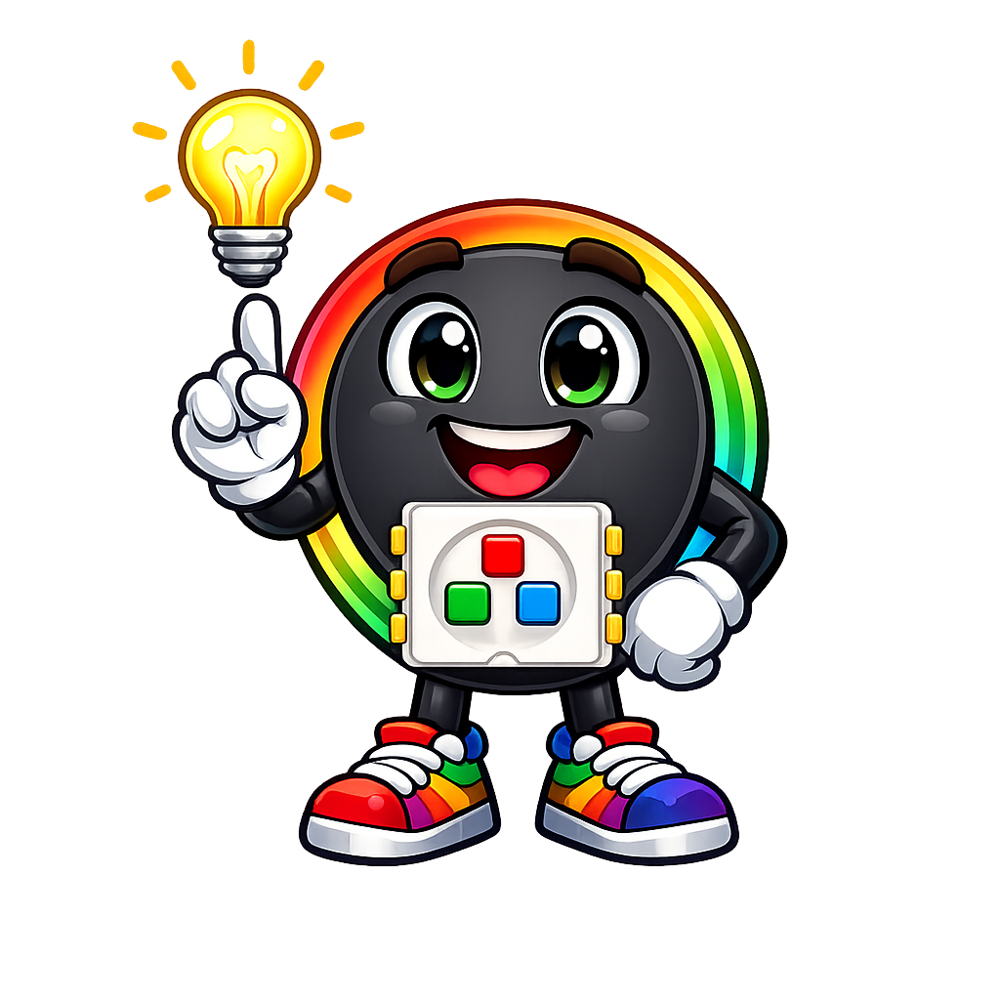

# Intermediate Animation Techniques

## Summary

Covers fade in/out, theater chase, ripple, bounce, random walk, brightness scaling factor, color trail fading, animation speed control, offset and phase, multi-pattern programs, pattern composition, and the mathematical timing behind animation delays.

## Concepts Covered

This chapter covers the following 22 concepts from the learning graph:

1. Fade In and Out
2. Color Wipe Animation
3. Moving Pixel Animation
4. Bounce Animation
5. Moving Bands Pattern
6. Theater Chase Pattern
7. Ripple Animation
8. Random Walk Animation
9. Animation Speed Control
10. Brightness Scaling Factor
11. Color Trail with Fading
12. Animation Loop Structure
13. Frame Rate Concept
14. Chase Group Size
15. Ripple Decay Rate
16. Brightness Array
17. Animation Parameterization
18. Color Palette Selection
19. Speed Parameter
20. Delay Function Selection
21. Offset and Phase
22. Time Delay Calculation

## Prerequisites

This chapter builds on concepts from:

- [Chapter 1: Introduction and Computational Thinking Foundations](../01-intro-and-computational-thinking/index.md)
- [Chapter 2: Python Basics: Variables, Data Types, and Operators](../02-python-variables-types-operators/index.md)
- [Chapter 3: Python Functions, Modules, and Programming Best Practices](../03-python-functions-modules-practices/index.md)
- [Chapter 4: Python Control Flow, Loops, and Error Handling](../04-python-control-flow-loops/index.md)
- [Chapter 6: MicroPython APIs, GPIO Control, and Electrical Fundamentals](../06-micropython-apis-and-electronics/index.md)
- [Chapter 7: Color Theory: The RGB Color Model and Color Mixing](../07-rgb-color-theory/index.md)
- [Chapter 9: NeoPixel Programming: Pixels, Colors, and the NeoPixel Library](../09-neopixel-programming/index.md)
- [Chapter 11: Mathematics for LED Programming](../11-math-for-led-programming/index.md)
- [Chapter 12: Basic LED Animation Patterns](../12-basic-animation-patterns/index.md)

---

!!! tip "Pixel says..."
    
    Welcome to Chapter 13! The patterns in Chapter 12 were like single notes. Now you're learning chords — animations that combine position tracking, fading trails, speed parameters, and phase offsets. These are the effects that make people stop and say "whoa!" Let's light this up!

## What You'll Learn

By the end of this chapter, you'll be able to:

- Implement fade in/out, color wipe, moving pixel, and bounce animations
- Build the theater chase and moving bands patterns
- Create a ripple effect that expands from a center point
- Use brightness arrays to create trail effects
- Add speed parameters and phase offsets to animations
- Explain what frame rate is and how delay affects it

## What You'll Need

- Raspberry Pi Pico with NeoPixel strip connected
- Thonny IDE connected
- Chapters 11 and 12 fresh in your mind

---

## Animation Architecture: Parameters and Speed

Before building new patterns, let's talk about **animation parameterization** — designing animations with variables you can easily change.

A well-parameterized animation has a few key variables at the top:

- **Speed parameter** — controls how fast the animation runs (often a delay in ms, or a step size)
- **Color palette selection** — the color(s) used
- **Chase group size**, **ripple decay rate**, etc. — pattern-specific constants

The **frame rate concept** describes how many frames run per second. Frame rate (fps) = 1000 / delay_ms. A delay of 50 ms = 20 fps. A delay of 16 ms ≈ 60 fps. Faster frame rates make animations look smoother, but your Pico can only compute so fast.

**Delay function selection** — choose between `utime.sleep_ms()` for simple fixed delays and `utime.ticks_ms()` for time-based animation where the delay adapts to computation time.

**Time delay calculation** for a target frame rate:
\[ \text{delay\_ms} = \frac{1000}{\text{target\_fps}} \]

For 30 fps: `delay_ms = 1000 / 30 ≈ 33 ms`. For 50 fps: `delay_ms = 20 ms`.

---

## Pattern: Fade In and Out

**Fade In and Out** smoothly increases the brightness of the strip to full, then decreases back to zero.

Before the code, here's the key idea: a **brightness scaling factor** multiplies the base color. Scaling from 0.0 to 1.0 fades in; from 1.0 back to 0.0 fades out.

```python
BASE_COLOR = (200, 100, 0)   # orange base
STEPS = 50                    # steps from dark to full brightness

def fade(strip, color, steps, delay_ms):
    for step in range(steps):
        scale = step / (steps - 1)   # 0.0 to 1.0
        r = int(color[0] * scale)
        g = int(color[1] * scale)
        b = int(color[2] * scale)
        for i in range(config.NUMBER_PIXELS):
            strip[i] = (r, g, b)
        strip.write()
        utime.sleep_ms(delay_ms)

while True:
    fade(strip, BASE_COLOR, STEPS, 20)   # fade in
    # Run fade in reverse for fade out
    for step in range(STEPS - 1, -1, -1):
        scale = step / (STEPS - 1)
        r = int(BASE_COLOR[0] * scale)
        g = int(BASE_COLOR[1] * scale)
        b = int(BASE_COLOR[2] * scale)
        for i in range(config.NUMBER_PIXELS):
            strip[i] = (r, g, b)
        strip.write()
        utime.sleep_ms(20)
```

You should see the strip gently breathing orange — brightening, then dimming, then repeating.

---

## Pattern: Color Wipe Animation

The **Color Wipe Animation** lights pixels one at a time from left to right, then clears them left to right. It's like drawing a line, then erasing it.

This introduces **sequential pixel lighting** — updating pixels one at a time instead of all at once.

```python
def color_wipe(strip, color, delay_ms):
    for i in range(config.NUMBER_PIXELS):
        strip[i] = color
        strip.write()
        utime.sleep_ms(delay_ms)

def color_clear(strip, delay_ms):
    for i in range(config.NUMBER_PIXELS):
        strip[i] = (0, 0, 0)
        strip.write()
        utime.sleep_ms(delay_ms)

while True:
    color_wipe(strip, (0, 200, 100), 30)   # wipe green-cyan
    color_clear(strip, 20)
```

You should see a green-cyan color sweep across the strip, then disappear from left to right.

---

## Pattern: Moving Pixel Animation and Bounce

The **Moving Pixel Animation** moves a single lit pixel across the strip. The **Bounce Animation** adds a direction variable so the pixel reverses when it hits either end.

Two key concepts:
- **Position Tracking Variable** — stores which pixel is currently lit
- **Direction Variable** — `1` for moving right, `-1` for moving left

```python
pos = 0
direction = 1
COLOR = (200, 0, 100)   # pink-red

while True:
    # Clear all pixels
    for i in range(config.NUMBER_PIXELS):
        strip[i] = (0, 0, 0)

    strip[pos] = COLOR   # light only the current pixel
    strip.write()

    pos += direction

    # Bounce logic: reverse direction at either end
    if pos >= config.NUMBER_PIXELS - 1:
        direction = -1
    elif pos <= 0:
        direction = 1

    utime.sleep_ms(30)
```

You should see a single pink-red pixel bounce back and forth across the strip.

**Bounce logic** is the pattern you'll use every time motion needs to reverse at a boundary. Always check both ends: `>= NUM_PIXELS - 1` catches the right end, `<= 0` catches the left.

!!! tip "Pixel's tip"
    
    The order matters in bounce logic. Check `>= NUM_PIXELS - 1` first — if you checked `<= 0` first, you'd reverse direction before the pixel ever reaches the left end on the very first iteration.

---

## Pattern: Color Trail with Fading

A **Color Trail with Fading** keeps a **brightness array** — one brightness value per pixel — and decays all values each frame while placing a bright value at the moving pixel's position.

Before reading the code: `trail[i]` holds the current brightness of pixel `i`. Each frame, every brightness value is multiplied by DECAY (a value less than 1.0), making it dimmer. The head pixel is set to maximum brightness.

```python
trail = [0] * config.NUMBER_PIXELS   # brightness per pixel
DECAY = 0.85
pos = 0

while True:
    # Decay all brightness values
    for i in range(config.NUMBER_PIXELS):
        trail[i] = int(trail[i] * DECAY)

    # Set head pixel to maximum
    trail[pos] = 200

    # Update the strip from the brightness array
    for i in range(config.NUMBER_PIXELS):
        strip[i] = (trail[i], 0, int(trail[i] * 0.3))   # red with slight blue trail

    strip.write()
    pos = (pos + 1) % config.NUMBER_PIXELS
    utime.sleep_ms(40)
```

You should see a bright head pixel moving around the strip, leaving a decaying red-purple trail behind it.

---

## Pattern: Moving Bands

The **Moving Bands Pattern** creates blocks of color that advance across the strip. Think of it as multiple colored pixels moving together as a group.

**Chase group size** determines how wide each band is. An offset advances each frame to create motion.

```python
BAND_SIZE = 5    # width of each colored band
offset = 0

COLORS = [
    (200, 0, 0),    # red
    (0, 200, 0),    # green
    (0, 0, 200),    # blue
    (0, 0, 0),      # gap (off)
]
CYCLE = BAND_SIZE * len(COLORS)

while True:
    for i in range(config.NUMBER_PIXELS):
        band_index = ((i + offset) // BAND_SIZE) % len(COLORS)
        strip[i] = COLORS[band_index]

    strip.write()
    offset = (offset + 1) % CYCLE
    utime.sleep_ms(40)
```

You should see colored bands of red, green, and blue scrolling across the strip with gaps between them.

---

## Pattern: Theater Chase

The **Theater Chase** pattern creates a marquee effect: alternating groups of lit and unlit pixels, with the groups advancing each frame. The classic "movie theater" effect.

Before the code, the key parameter is **chase group size** — how many pixels are in each lit group.

```python
CHASE_SIZE = 3    # pixels on, then 3 pixels off, repeating
step = 0

while True:
    for i in range(config.NUMBER_PIXELS):
        if (i + step) % (CHASE_SIZE * 2) < CHASE_SIZE:
            strip[i] = (200, 150, 0)   # amber/warm
        else:
            strip[i] = (0, 0, 0)        # off

    strip.write()
    step = (step + 1) % (CHASE_SIZE * 2)
    utime.sleep_ms(60)
```

You should see groups of three amber pixels chasing each other across the strip.

**Offset and Phase** are the key concepts here. The `step` variable is the offset — it shifts which pixels are "in phase" to be lit. As step advances from 0 to 5 and wraps back, the pattern appears to move.

---

## Pattern: Ripple Animation

The **Ripple Animation** creates expanding brightness waves from a center point. Each frame, the brightness of each pixel is determined by its distance from the center, shifted by the ripple phase.

Before reading the code, the key variables:
- `center` — the pixel index the ripple originates from
- `phase` — how far the ripple has traveled
- `ripple_decay_rate` — how quickly amplitude falls with distance

```python
import math

center = config.NUMBER_PIXELS // 2   # middle of the strip
phase = 0

while True:
    for i in range(config.NUMBER_PIXELS):
        distance = abs(i - center)           # distance from center
        brightness = math.cos((distance - phase) * 0.6)   # ripple formula
        brightness = max(0, brightness)      # no negative brightness
        b = int(brightness * 200)
        strip[i] = (0, 0, b)   # blue ripple

    strip.write()
    phase += 1
    utime.sleep_ms(30)
```

You should see blue brightness waves appearing to expand outward from the center of the strip. The **ripple decay rate** (controlled by the `0.6` multiplier) sets how many ripples are visible at once.

#### Diagram: Ripple Animation Mechanics

<details markdown="1">
<summary>Interactive simulation: ripple expanding from center</summary>
Type: interactive-infographic
**sim-id:** ripple-animation-sim
**Library:** p5.js
**Status:** Specified

A p5.js MicroSim showing a horizontal row of 20 pixel circles. A center pixel is marked with a small dot. A **Pulse** button triggers a ripple — a brightness wave that expands from the center outward. As the wave passes each pixel, that pixel brightens then dims. The wave reaches the strip edges and disappears. Controls: a **Decay** slider (0.2–0.9) showing how quickly the ripple fades with distance; a **Speed** slider (slow/fast); a **Loop** checkbox for continuous pulsing. A live formula display shows the current brightness for the highlighted pixel based on `cos((distance - phase) * decay_rate)`. Canvas: 700 × 280 px. Responds to window resize.

Learning objective: Analyzing — the student can explain how phase and distance combine to produce the ripple pattern.
</details>

---

## Pattern: Random Walk Animation

The **Random Walk Animation** moves a pixel that doesn't bounce — instead, it randomly steps left or right each frame. Over time, it explores the strip unpredictably.

```python
import urandom

pos = config.NUMBER_PIXELS // 2   # start in the middle
trail = [0] * config.NUMBER_PIXELS
DECAY = 0.9

while True:
    for i in range(config.NUMBER_PIXELS):
        trail[i] = int(trail[i] * DECAY)

    trail[pos] = 255

    for i in range(config.NUMBER_PIXELS):
        strip[i] = (0, int(trail[i] * 0.5), trail[i])   # blue-green trail

    strip.write()

    # Random step: -1 or +1
    step = 1 if urandom.randint(0, 1) == 0 else -1
    pos = max(0, min(config.NUMBER_PIXELS - 1, pos + step))   # clamp to strip edges

    utime.sleep_ms(60)
```

You should see a bright blue-green point wandering left and right, leaving a fading trail. Unlike the bounce pattern, the motion is unpredictable.

---

## Try It Yourself

1. **Dual bounce:** Create a bounce animation with TWO pixels moving in opposite directions. When they meet, make them briefly flash white.

2. **Parameterize chase:** Turn the theater chase into a function with parameters: `theater_chase(strip, color, group_size, delay_ms)`. Try it with different group sizes.

3. **Ripple from edge:** Modify the ripple to start from pixel 0 instead of the center. How does the effect change?

4. **Combine wipe and fade:** Write a color wipe that gets brighter as it progresses (first pixel at 10% brightness, last pixel at 100%).

---

## Check Your Understanding

1. What does the "brightness scaling factor" do in a fade animation?
2. What is a "direction variable" and what two values does it hold?
3. How does the theater chase create the illusion of movement?
4. What does a **brightness array** store?
5. What is the role of the "ripple decay rate"?
6. How does a random walk differ from a bounce animation?
7. What formula converts delay_ms to frames per second?

---

!!! success "Chapter complete!"
    
    Intermediate level unlocked! You built fade, wipe, bounce, theater chase, ripple, and random walk — each using a different combination of position tracking, brightness arrays, decay, and phase. Every animation in this chapter could be the centerpiece of a costume or display project. You're genuinely building effects now!

## What's Next

In [Chapter 14](../14-advanced-animation-patterns/index.md), you'll tackle the most challenging effects — heartbeat, Larson scanner, comet tail, and LED clock displays — using brightness envelopes, scanner parameters, and sine-based breathing.
