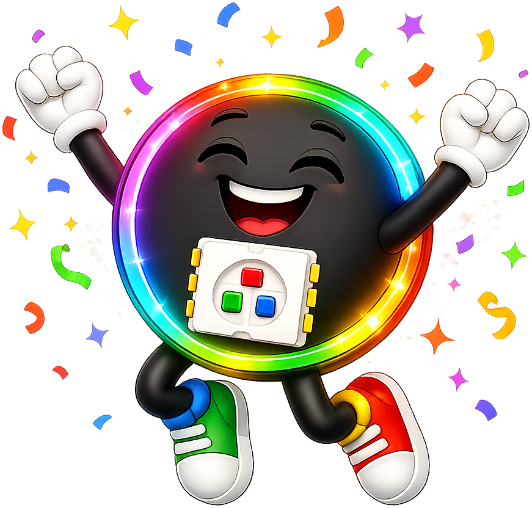

# Circuit Assembly: Resistors, Transistors, and Circuit Types

## Summary

Builds on electronics theory with transistor switch circuits, transistor current gain, static and dynamic LED circuits, LED dimmer circuits, analog nightlight circuits, series and parallel configurations, battery capacity, battery life formula, heat dissipation, component power ratings, and short circuit prevention.

## Concepts Covered

This chapter covers the following 23 concepts from the learning graph:

1. Transistor Collector Terminal
2. Transistor Emitter Terminal
3. Transistor Current Gain
4. Transistor as Switch
5. Voltage Divider Circuit
6. Voltage Divider Formula
7. Static LED Circuit
8. Dynamic LED Circuit
9. LED Dimmer Circuit
10. Transistor Driver Circuit
11. Analog Nightlight Circuit
12. Resistance Measurement
13. Voltage Measurement
14. Series Circuit
15. Parallel Circuit
16. Battery Capacity
17. Battery Life Formula
18. LED Current Draw
19. Heat Dissipation
20. Component Power Rating
21. Voltage Regulator
22. Buck Converter
23. Short Circuit Prevention

## Prerequisites

This chapter builds on concepts from:

- [Chapter 1: Introduction and Computational Thinking Foundations](../01-intro-and-computational-thinking/index.md)
- [Chapter 6: MicroPython APIs, GPIO Control, and Electrical Fundamentals](../06-micropython-apis-and-electronics/index.md)
- [Chapter 15: Electronics Fundamentals: Resistance, Ohm's Law, and Components](../15-electronics-fundamentals/index.md)

---

!!! tip "Pixel says..."
    
    Welcome to Chapter 16! This is where theory becomes practice on a breadboard. You'll build real circuits — a transistor switch, an LED dimmer, and an analog nightlight. You'll also learn to calculate battery life for your projects. Let's build something. Let's light this up!

## What You'll Learn

By the end of this chapter, you'll be able to:

- Wire a transistor as a switch controlled by a GPIO pin
- Build a voltage divider circuit and calculate its output voltage
- Describe the difference between static and dynamic LED circuits
- Build an LED dimmer circuit using PWM and a transistor
- Build an analog nightlight circuit using a photoresistor
- Compare series and parallel circuits
- Calculate expected battery life for an LED project
- Explain heat dissipation and component power ratings
- Prevent short circuits through good wiring habits

## What You'll Need

- Breadboard
- Jumper wires
- 2N2222 NPN transistor
- LED (any color)
- Resistors: 220 Ω, 1 kΩ, 10 kΩ
- Photoresistor (LDR)
- Raspberry Pi Pico connected to Thonny

---

## The Transistor as a Switch

In Chapter 15 you learned the three terminals of an NPN transistor: base, collector, and emitter. Now you'll use them to build a **transistor driver circuit** — a circuit where the Pico controls a transistor that switches an LED.

Before wiring, here's how the three terminals connect:

- **Transistor Base Terminal** — connects to a GPIO output pin through a resistor (typically 1 kΩ). When GPIO goes HIGH, a small base current flows.
- **Transistor Collector Terminal** — connects to the LED (through a current-limiting resistor) and then to +5 V.
- **Transistor Emitter Terminal** — connects to GND.

The **transistor current gain** (β, or "beta") determines how much collector current you get per milliamp of base current. For the 2N2222, β ≈ 100. So a 1 mA base current allows up to 100 mA of collector current — enough to drive many LEDs.

**Transistor as Switch** wiring steps:

1. Connect the Pico's GP0 to the transistor base through a 1 kΩ resistor
2. Connect the transistor collector to the LED's anode (positive lead)
3. Connect the LED cathode (negative lead) to the 5 V supply through a 220 Ω resistor (or connect directly through the resistor to the positive supply — either direction works, they differ in circuit topology)
4. Connect the transistor emitter to GND

The MicroPython code to control this circuit:

```python
import machine, utime

control = machine.Pin(0, machine.Pin.OUT)   # GP0 drives the transistor base

while True:
    control.high()      # turns ON the transistor → LED on
    utime.sleep(1)
    control.low()       # turns OFF the transistor → LED off
    utime.sleep(1)
```

You should see the LED blink on and off controlled entirely by the Pico's GPIO signal.

---

## Static vs. Dynamic LED Circuits

Two circuit types appear throughout LED projects:

A **Static LED Circuit** connects an LED directly to a fixed power supply with a resistor. The LED is always on at a fixed brightness. No microcontroller needed. Used for indicator lights and simple decorations.

A **Dynamic LED Circuit** connects the LED to a microcontroller output (directly or via transistor). The code controls when the LED turns on, off, or changes brightness. This is how all NeoPixel programs work.

The comparison:

| Circuit Type | Control | Brightness | Complexity |
|---|---|---|---|
| Static | None — always on | Fixed | Low |
| Dynamic (GPIO direct) | Microcontroller on/off | Fixed or PWM-dimmed | Medium |
| Dynamic (transistor) | Microcontroller via transistor | Up to high current | Higher |

---

## Voltage Divider Circuit

A **voltage divider** uses two resistors in series to produce an output voltage between 0 and the supply voltage. It's essential for reading variable-resistance sensors like the photoresistor.

Before the formula, here's the circuit: R1 is connected from the supply voltage (V_in) to the midpoint. R2 is connected from the midpoint to GND. The output voltage (V_out) is measured at the midpoint.

The **Voltage Divider Formula** is:

\[ V_{\text{out}} = V_{\text{in}} \times \frac{R_2}{R_1 + R_2} \]

Example: V_in = 3.3 V, R1 = 10 kΩ, R2 = 10 kΩ:

\[ V_{\text{out}} = 3.3 \times \frac{10000}{10000 + 10000} = 3.3 \times 0.5 = 1.65 \text{ V} \]

For a photoresistor circuit, R2 is the LDR (resistance changes with light). As light increases, the LDR resistance drops, so V_out also drops — which you can read with `ADC.read_u16()`.

---

## LED Dimmer Circuit

An **LED Dimmer Circuit** uses PWM from the Pico to control a transistor, which controls LED brightness. This is more powerful than driving an LED directly from GPIO — the transistor can handle much more current.

The MicroPython code to dim the LED with a PWM signal on the transistor base:

```python
import machine

pwm = machine.PWM(machine.Pin(0))   # PWM on GP0
pwm.freq(1000)                       # 1000 Hz frequency

# Set to 30% brightness
pwm.duty_u16(int(65535 * 0.3))
```

You should see the LED glow at about 30% brightness. Change the multiplier (0.0 to 1.0) to adjust brightness.

#### Diagram: Transistor Driver and Dimmer Circuit


<iframe src="../../sims/transistor-circuit-diagrams/main.html" width="100%" height="402px" scrolling="no"></iframe>
[Run Transistor Driver and Dimmer Circuit Fullscreen](../../sims/transistor-circuit-diagrams/main.html)

<details markdown="1">
<summary>Interactive circuit diagram: transistor switch and dimmer</summary>
Type: interactive-infographic
**sim-id:** transistor-circuit-diagrams
**Library:** p5.js
**Status:** Specified

A p5.js circuit diagram with two side-by-side panels, selectable via tabs:

**Tab 1 — Transistor Switch:** Shows a 2N2222 transistor schematic with labeled Base, Collector, Emitter. Connections shown: GP0 → 1kΩ resistor → Base; Collector → 220Ω resistor → LED → +5V; Emitter → GND. A toggle button labeled "GP0 HIGH / LOW" animates current flow (glowing arrows) and lights/dims the LED symbol. Clicking each component shows a tooltip: "1kΩ limits base current to ~2 mA", "220Ω limits LED current to ~14 mA", etc.

**Tab 2 — PWM Dimmer:** Same circuit but the toggle becomes a PWM duty cycle slider (0–100%). As the slider moves, the LED symbol changes brightness proportionally. Canvas: 700 × 400 px. Responds to window resize.

Learning objective: Applying — the student can trace current flow through a transistor driver circuit and predict the LED brightness given a duty cycle.
</details>

---

## Analog Nightlight Circuit

The **Analog Nightlight Circuit** turns on an LED automatically when it gets dark, using a photoresistor and a voltage divider to detect light level.

Before reading the code, here's the wiring:
- A voltage divider with a 10 kΩ fixed resistor and a photoresistor (LDR) as R2
- The midpoint (between fixed resistor and LDR) connects to ADC0 (GP26)
- In bright light: LDR resistance is low → V_out is low → ADC reads low value
- In darkness: LDR resistance is high → V_out is high → ADC reads high value

```python
import machine

ldr = machine.ADC(26)
led = machine.Pin(15, machine.Pin.OUT)

DARK_THRESHOLD = 40000   # adjust this for your lighting conditions

while True:
    reading = ldr.read_u16()

    if reading > DARK_THRESHOLD:
        led.high()   # dark → LED on
    else:
        led.low()    # bright → LED off
```

You should see the LED turn on when you cover the photoresistor with your hand, and turn off when you uncover it.

**Resistance Measurement** and **Voltage Measurement** with your multimeter let you characterize your LDR in both bright and dark conditions, helping you choose the right `DARK_THRESHOLD`.

---

## Series and Parallel Circuits

Two fundamental circuit configurations appear in all electronics work. Understanding them helps you predict current and voltage behavior.

**Series Circuit** — components are connected end-to-end in a single path. The same current flows through every component. The total resistance is the sum of all individual resistances:

\[ R_{\text{total}} = R_1 + R_2 + R_3 + \ldots \]

Implication: if one component in a series circuit breaks, the whole circuit stops working (like old Christmas lights).

**Parallel Circuit** — components are connected side-by-side between the same two nodes. The voltage across every component is the same. The total resistance is less than any single resistor:

\[ \frac{1}{R_{\text{total}}} = \frac{1}{R_1} + \frac{1}{R_2} + \ldots \]

Implication: if one component in a parallel circuit breaks, the others keep working. Most LED strips connect pixels in parallel — one pixel failing doesn't knock out the rest.

The following table summarizes:

| Feature | Series | Parallel |
|---|---|---|
| Current | Same through all | Splits among branches |
| Voltage | Splits among components | Same across all |
| One breaks | All stop | Others keep working |
| Total resistance | Increases (R₁+R₂) | Decreases (less than R₁) |

---

## Battery Capacity and Battery Life

**Battery capacity** is the total charge a battery can deliver, measured in **milliamp-hours (mAh)**. A 2000 mAh battery can supply 2000 mA for one hour, or 200 mA for ten hours, or 20 mA for 100 hours.

The **Battery Life Formula** is:

\[ \text{Battery life (hours)} = \frac{\text{Battery capacity (mAh)}}{\text{Current draw (mA)}} \]

To apply this to your project, you need the total **LED current draw**. Remember: each NeoPixel draws up to 20 mA at full white, but at 30% brightness it draws about 6 mA.

Example: 30-pixel strip at 30% brightness on a 2000 mAh USB power bank:

\[ \text{Current} = 30 \times 6 \text{ mA} = 180 \text{ mA} \]
\[ \text{Battery life} = \frac{2000}{180} \approx 11 \text{ hours} \]

That's a comfortable runtime for a Halloween costume.

---

## Heat Dissipation and Component Power Ratings

Every component dissipates some power as heat. When a component dissipates more power than its **component power rating**, it overheats and may fail.

**Heat dissipation** in a resistor:

\[ P = I^2 \times R \]

For example, a 220 Ω resistor with 20 mA flowing:

\[ P = (0.020)^2 \times 220 = 0.088 \text{ W} = 88 \text{ mW} \]

Standard 1/4 W resistors (250 mW rating) handle this easily. If you ever calculate a power higher than the resistor's rating, choose a larger physical size (1/2 W or 1 W).

---

## Voltage Regulators and Buck Converters

Two devices manage voltage for your projects:

A **Voltage Regulator** is a chip that takes an input voltage and provides a stable, lower output voltage. For example, a 7805 regulator takes 7–12 V input and provides a stable 5 V output. Simple, but dissipates the extra voltage as heat.

A **Buck Converter** (step-down converter) is a more efficient alternative. It uses high-frequency switching to convert a higher voltage to a lower one with minimal heat loss. Common in hobby projects for powering 5 V LED strips from a 12 V power adapter.

For this course, USB power (5 V) and the Pico's 3.3 V regulator cover all our needs — you won't need an external regulator unless you're powering many LEDs from a high-voltage supply.

---

## Short Circuit Prevention

Good habits prevent short circuits before they happen. The most important rules:

- **Route power wires clearly** — red wires along the top rail (power), black or dark wires along the bottom rail (GND). Keep them visually separate.
- **Check before powering on** — trace every power connection to ensure no accidental short exists before connecting USB.
- **Add resistors to every LED** — a bare LED connected directly across 5 V without a resistor is a short circuit with a light show; it will burn out instantly.
- **Use a fuse or polyfuse** for high-current battery projects — a fuse blows instead of your wiring if a short occurs.

!!! warning "Watch out!"
    
    The most dangerous moment in any project is the first power-on after new wiring. Before plugging in, pause and trace every red wire to ensure it goes through at least one resistor or component before reaching GND. That two-second check has saved many projects.

---

## Try It Yourself

1. **Transistor switch:** Wire the transistor driver circuit and use the blink code to control it. Verify that removing the 1 kΩ base resistor causes the LED to stay on (the GPIO is now driving more current — add the resistor back immediately!).

2. **Battery life calculation:** Your project uses 20 pixels at 50% brightness. How long will it run on a 1000 mAh LiPo battery?

3. **Voltage divider calculation:** If R1 = 10 kΩ and R2 = 4.7 kΩ with a 3.3 V supply, what is V_out?

4. **Nightlight calibration:** Measure your LDR resistance with a multimeter in a bright room and in a darkened room. Calculate the expected V_out in both conditions using the voltage divider formula.

---

## Check Your Understanding

1. What are the three terminals of an NPN transistor?
2. What does transistor current gain (β) mean in practice?
3. What is the voltage divider formula?
4. Why can one pixel in a NeoPixel strip fail without breaking the others? (Hint: think about series vs. parallel.)
5. A battery is rated at 3000 mAh. Your project draws 150 mA. How many hours will it run?
6. What is a buck converter and when do you use one?
7. Name two habits that prevent short circuits.

---

!!! success "Chapter complete!"
    
    You built real circuits! A transistor switch, a voltage divider, and an analog nightlight — each one a complete hardware-software system. You also know how to calculate battery life and protect against short circuits. You're doing real hardware engineering now. That's worth celebrating!

## What's Next

In [Chapter 17](../17-power-and-battery-systems/index.md), you'll go deep on batteries — comparing all the common types, learning about charging circuits, and calculating safe power systems for wearable projects.
