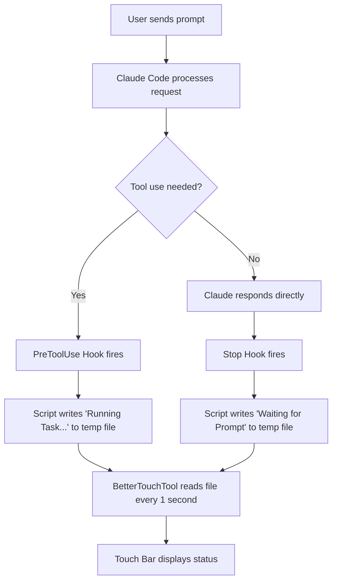

# Using Claude Code to Update the MacBook Touch Bar Status

This guide shows how to display Claude Code status notifications directly on your MacBook Pro Touch Bar, providing visual feedback when Claude is working, waiting for input, or needs your attention.

## Overview

The MacBook Pro Touch Bar (2016-2020 models) can display dynamic status updates from Claude Code using BetterTouchTool and a simple shell script. This creates a seamless workflow where you can see Claude's status at a glance without switching windows.


## Status Indicators

| Status | Icon | Display Text | When It Appears |
|--------|------|--------------|-----------------|
| Running Task | ⚙ | Running Task... | Claude is executing a tool |
| Waiting for Prompt | 💬 | Waiting for Prompt | Claude finished and awaits your next input |
| Task Complete | ✓ | Task Complete | Claude finished a specific task |
| Question Waiting | ? | Question Waiting | Claude has a question for you |
| Permission Needed | ⚠ | Permission Needed | Claude needs permission to proceed |
| Waiting for Input | ⏳ | Waiting for Input | Claude is waiting for your response |
| Context Warning | ⚡ | Context Warning | Context window is almost full |

## Requirements

- MacBook Pro with Touch Bar (2016-2020 models)
- macOS 10.12.2 or later
- [BetterTouchTool](https://folivora.ai/) - Touch Bar customization app
- Claude Code CLI installed

## Installation

### Step 1: Install BetterTouchTool

```bash
brew install --cask bettertouchtool
```

After installation, open BetterTouchTool and grant the required accessibility permissions when prompted.

### Step 2: Make the Notification Script Executable

```bash
chmod +x /path/to/moving-rainbow/src/macbook-status-bar/claude-notify-simple.sh
```

### Step 3: Configure the Touch Bar Widget

1. Open **BetterTouchTool**
2. Select **Touch Bar** in the dropdown at the top
3. Click the **+** button to add a new trigger
4. Select **Shell Script / Task Widget**
5. Configure the widget with these settings:

| Setting | Value |
|---------|-------|
| Script | `/bin/cat /tmp/claude-code-status.txt` |
| Execute script every | 1 seconds |
| Launch Path | /bin/bash |
| Parameters | -c |

6. Click **Run Script Now** to test - the Result field should show the current status

You can also change the Setting for the Better Touch Tool:


### Step 4: Configure Claude Code Hooks

Add the following hooks to your `~/.claude/settings.json` file. These hooks automatically update the Touch Bar when Claude's state changes:

```json
{
  "hooks": {
    "PreToolUse": [
      {
        "matcher": "",
        "hooks": [
          {
            "type": "command",
            "command": "/path/to/claude-notify-simple.sh running"
          }
        ]
      }
    ],
    "Stop": [
      {
        "matcher": "",
        "hooks": [
          {
            "type": "command",
            "command": "/path/to/claude-notify-simple.sh prompt"
          }
        ]
      }
    ]
  }
}
```

Replace `/path/to/` with the actual path to your script (e.g., `/Users/yourname/Documents/ws/moving-rainbow/src/macbook-status-bar/`).

**Important:** After modifying `settings.json`, restart Claude Code for the hooks to take effect.

### Step 5: Test the Notifications

Run these commands to see the status change on your Touch Bar:

```bash
# Show "Running Task..."
./src/macbook-status-bar/claude-notify-simple.sh running

# Show "Waiting for Prompt"
./src/macbook-status-bar/claude-notify-simple.sh prompt

# Show "Task Complete"
./src/macbook-status-bar/claude-notify-simple.sh flash

# Show "Question Waiting"
./src/macbook-status-bar/claude-notify-simple.sh question

# Show "Permission Needed"
./src/macbook-status-bar/claude-notify-simple.sh permission

# Show "Waiting for Input"
./src/macbook-status-bar/claude-notify-simple.sh waiting

# Show "Context Warning"
./src/macbook-status-bar/claude-notify-simple.sh context

# Clear the status
./src/macbook-status-bar/claude-notify-simple.sh off
```

## How It Works

The notification system uses a simple file-based approach combined with Claude Code hooks:



### The Flow

1. **User submits a prompt** to Claude Code
2. **Claude decides to use a tool** (like Bash, Read, Write, etc.)
3. **PreToolUse hook fires** → Script writes "⚙ Running Task..." to `/tmp/claude-code-status.txt`
4. **BetterTouchTool polls** the file every second and displays the content
5. **Claude finishes responding**
6. **Stop hook fires** → Script writes "💬 Waiting for Prompt" to the temp file
7. **Touch Bar updates** to show Claude is ready for your next input

## Understanding Claude Code Hooks

Claude Code hooks are shell commands that execute automatically when specific events occur. They allow you to extend Claude Code's functionality without modifying its source code.

### Hook Types Used in This Project

| Hook | When It Fires | Our Usage |
|------|---------------|-----------|
| `PreToolUse` | Before Claude executes any tool | Show "Running Task..." |
| `Stop` | When Claude finishes responding | Show "Waiting for Prompt" |

### Hook Configuration Structure

```json
{
  "hooks": {
    "HookName": [
      {
        "matcher": "",
        "hooks": [
          {
            "type": "command",
            "command": "/path/to/script.sh argument"
          }
        ]
      }
    ]
  }
}
```

- **HookName**: The event that triggers the hook (e.g., `PreToolUse`, `Stop`)
- **matcher**: Filter to match specific tools (empty string `""` matches all)
- **type**: Must be `"command"` for shell commands
- **command**: The full path to the script with any arguments

### Available Hook Events

| Hook Event | Description |
|------------|-------------|
| `PreToolUse` | Fires before any tool is executed |
| `PostToolUse` | Fires after a tool completes |
| `Stop` | Fires when Claude finishes a response |
| `UserPromptSubmit` | Fires when user submits a prompt |
| `Notification` | Fires for various notification events |

### Using Matchers

The `matcher` field filters which tools trigger the hook:

```json
{
  "PreToolUse": [
    {
      "matcher": "Bash",
      "hooks": [{ "type": "command", "command": "/path/to/script.sh bash-running" }]
    },
    {
      "matcher": "Read",
      "hooks": [{ "type": "command", "command": "/path/to/script.sh reading-file" }]
    },
    {
      "matcher": "",
      "hooks": [{ "type": "command", "command": "/path/to/script.sh running" }]
    }
  ]
}
```

## The Shell Script

The notification script is simple and well-commented for easy customization:

```bash
#!/bin/bash
#
# Claude Code Touch Bar Notification Script
#
# This script writes status text to a temp file that BetterTouchTool
# reads and displays on the MacBook Pro Touch Bar.
#
# Architecture:
#   Claude Code Hook → This Script → Temp File → BTT Widget → Touch Bar
#
# Usage:
#   ./claude-notify-simple.sh <status>
#   ./claude-notify-simple.sh <status> --notify  (also shows macOS notification)
#
# Statuses:
#   running    - Claude is executing a tool (⚙ Running Task...)
#   prompt     - Claude is waiting for input (💬 Waiting for Prompt)
#   flash      - Task completed successfully (✓ Task Complete)
#   question   - Claude has a question (? Question Waiting)
#   permission - Permission needed (⚠ Permission Needed)
#   waiting    - Waiting for user input (⏳ Waiting for Input)
#   context    - Context window warning (⚡ Context Warning)
#   off/clear  - Clear the status display

# Temp file location - BTT reads this file every second
STATUS_FILE="/tmp/claude-code-status.txt"

# Map status argument to display text with emoji
case "$1" in
    running)
        # Used by PreToolUse hook - shows while Claude executes tools
        echo "⚙ Running Task..." > "$STATUS_FILE"
        ;;
    prompt)
        # Used by Stop hook - shows when Claude is ready for next prompt
        echo "💬 Waiting for Prompt" > "$STATUS_FILE"
        ;;
    flash)
        # Manual trigger for task completion
        echo "✓ Task Complete" > "$STATUS_FILE"
        ;;
    question)
        # Claude is asking a question
        echo "? Question Waiting" > "$STATUS_FILE"
        ;;
    permission)
        # Claude needs permission to proceed
        echo "⚠ Permission Needed" > "$STATUS_FILE"
        ;;
    waiting)
        # Generic waiting state
        echo "⏳ Waiting for Input" > "$STATUS_FILE"
        ;;
    context)
        # Warning: context window is almost full
        echo "⚡ Context Warning" > "$STATUS_FILE"
        ;;
    off|clear)
        # Clear the Touch Bar status
        echo "" > "$STATUS_FILE"
        ;;
    *)
        # Show usage if invalid argument
        echo "Usage: $0 [running|prompt|flash|question|permission|waiting|context|off]"
        exit 1
        ;;
esac
```

## Adding Native macOS Notifications

The script also supports native macOS notifications with sound alerts. Add `--notify` flag:

```bash
./claude-notify-simple.sh flash --notify
```

This displays a macOS notification banner in addition to updating the Touch Bar.

## Complete Example Configuration

Here's a complete `~/.claude/settings.json` with Touch Bar hooks:

```json
{
  "hooks": {
    "PreToolUse": [
      {
        "matcher": "",
        "hooks": [
          {
            "type": "command",
            "command": "/Users/dan/Documents/ws/moving-rainbow/src/macbook-status-bar/claude-notify-simple.sh running"
          }
        ]
      }
    ],
    "Stop": [
      {
        "matcher": "",
        "hooks": [
          {
            "type": "command",
            "command": "/Users/dan/Documents/ws/moving-rainbow/src/macbook-status-bar/claude-notify-simple.sh prompt"
          }
        ]
      }
    ]
  }
}
```

## Troubleshooting

### Touch Bar not updating

1. Ensure BetterTouchTool is running
2. Check **Touch Bar Settings** > **Enable BetterTouchTool Touch Bar** is checked
3. Verify the script works: `cat /tmp/claude-code-status.txt`
4. Click **Run Script Now** in BTT to test

### Widget shows X icon

The script returned empty or failed. Test manually:

```bash
/bin/cat /tmp/claude-code-status.txt
```

If empty, run a notification command first:

```bash
./claude-notify-simple.sh running
```

### Touch Bar not visible

Press the **fn** key to toggle between system Touch Bar and BetterTouchTool Touch Bar.

### Hooks not working

1. Verify `~/.claude/settings.json` has valid JSON syntax
2. Check the script path is absolute (starts with `/`)
3. Ensure the script is executable: `chmod +x claude-notify-simple.sh`
4. **Restart Claude Code** after modifying settings.json

### Test hooks manually

```bash
# Simulate PreToolUse hook
/path/to/claude-notify-simple.sh running
sleep 2

# Simulate Stop hook
/path/to/claude-notify-simple.sh prompt
```

## Comparison with Pi 500+ Keyboard

This project also supports [RGB LED notifications on the Raspberry Pi 500+ keyboard](../02-pi-500-keyboard/). Here's how they compare:

| Feature | Pi 500+ Keyboard | MacBook Touch Bar |
|---------|------------------|-------------------|
| Visual Indicator | Function key LEDs (F1-F3) | Touch Bar widget |
| Text Display | None (LED colors only) | Full text + emoji |
| Colors | HSV LED colors | Text-based |
| Hardware | Raspberry Pi 500+ | MacBook Pro 2016-2020 |
| API | RPiKeyboardConfig | BetterTouchTool |
| Hook Integration | Same hooks system | Same hooks system |

## Source Files

The source code for this feature is located in:

```
src/macbook-status-bar/
├── README.md                 # Detailed documentation
├── claude-notify.py          # Python script (advanced)
├── claude-notify-simple.sh   # Shell script (recommended)
├── btt-preset.json          # BetterTouchTool preset
└── sample-hooks.json        # Example Claude Code hooks
```

## References

- [BetterTouchTool Documentation](https://docs.folivora.ai/)
- [Claude Code Hooks Documentation](https://docs.anthropic.com/en/docs/claude-code/hooks)
- [Pi 500+ Keyboard Notifications](../02-pi-500-keyboard/)
