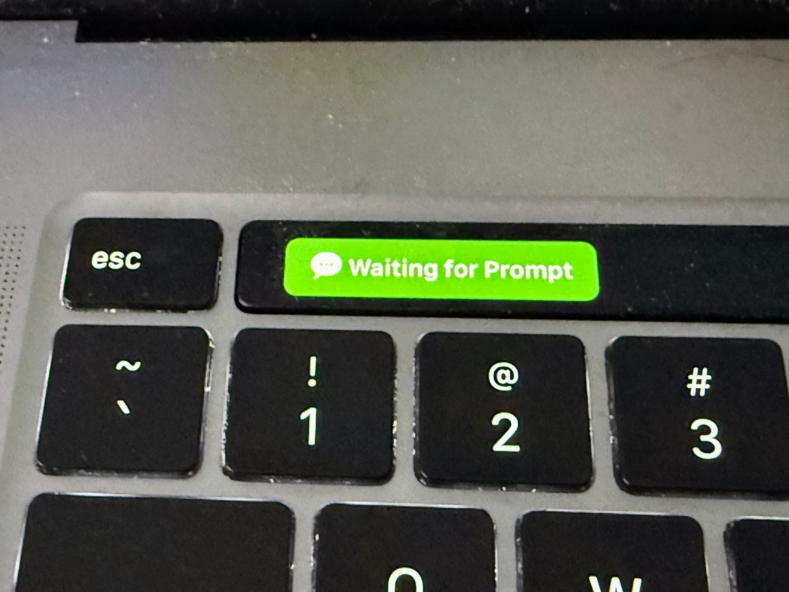
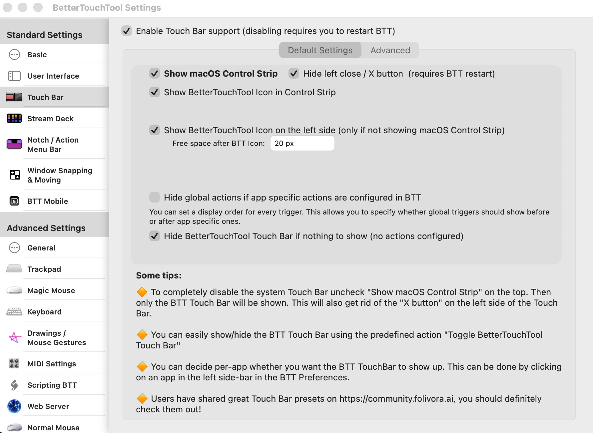
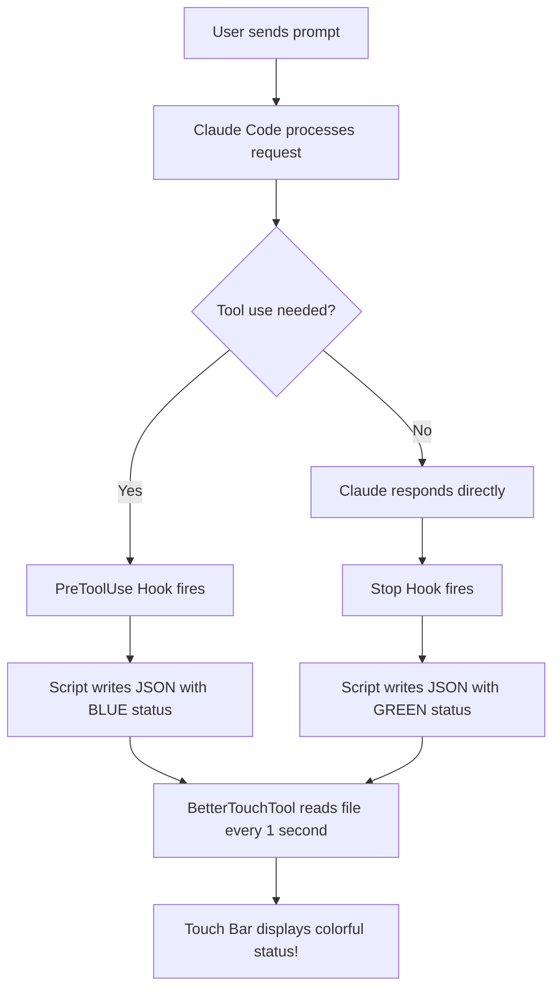

# Using Claude Code to Update the MacBook Touch Bar Status



Transform your MacBook Pro Touch Bar into a beautiful, color-coded status display for Claude Code! This fantastic feature gives you instant visual feedback when Claude is working, waiting for input, or needs your attention - all with vibrant, eye-catching colors.

## Overview

The MacBook Pro Touch Bar (2016-2020 models) becomes an incredibly useful productivity tool when paired with Claude Code. Using BetterTouchTool and a clever shell script, you'll enjoy dynamic, colorful status updates that let you know exactly what Claude is doing at a glance - no need to switch windows or check the terminal!


## Beautiful Color-Coded Status Indicators

Each status has its own distinctive color, making it instantly recognizable:

| Status | Icon | Display Text | Background Color | When It Appears |
|--------|------|--------------|------------------|-----------------|
| Running Task | ⚙ | Running Task... | **Blue** | Claude is hard at work executing a tool |
| Waiting for Prompt | 💬 | Waiting for Prompt | **Green** | Claude is ready and waiting for your next brilliant idea |
| Task Complete | ✓ | Task Complete | **Bright Green** | Success! Claude finished a specific task |
| Question Waiting | ? | Question Waiting | **Royal Blue** | Claude has a question for you |
| Permission Needed | ⚠ | Permission Needed | **Yellow** | Claude needs your permission to proceed |
| Waiting for Input | ⏳ | Waiting for Input | **Red** | Claude is blocked and needs your response |
| Context Warning | ⚡ | Context Warning | **Orange** | Heads up! Context window is getting full |

The color scheme is thoughtfully designed:
- **Green** = Ready/Success (go ahead!)
- **Blue** = Working/Thinking (Claude is busy)
- **Yellow** = Attention needed (permission request)
- **Red** = Blocked (waiting for you)
- **Orange** = Warning (context limit approaching)

## Requirements

- MacBook Pro with Touch Bar (2016-2020 models)
- macOS 10.12.2 or later
- [BetterTouchTool](https://folivora.ai/) - The amazing Touch Bar customization app
- Claude Code CLI installed

## Quick and Easy Installation

### Step 1: Install BetterTouchTool

Getting started is a breeze with Homebrew:

```bash
brew install --cask bettertouchtool
```

After installation, open BetterTouchTool and grant the required accessibility permissions when prompted. You're almost there!

### Step 2: Make the Notification Script Executable

```bash
chmod +x /path/to/moving-rainbow/src/macbook-status-bar/claude-notify-simple.sh
```

### Step 3: Configure the Touch Bar Widget

Setting up BetterTouchTool is straightforward:

1. Open **BetterTouchTool**
2. Select **Touch Bar** in the dropdown at the top
3. Click the **+** button to add a new trigger
4. Select **Shell Script / Task Widget**
5. Configure the widget with these settings:

| Setting | Value |
|---------|-------|
| Script | `/bin/cat /tmp/claude-code-status.txt` |
| Execute script every | 1 seconds |
| Launch Path | /bin/bash |
| Parameters | -c |

6. Click **Run Script Now** to test - you should see a beautiful colored status appear!

You can also fine-tune your settings here:



### Step 4: Configure Claude Code Hooks

Now for the magic! Add these hooks to your `~/.claude/settings.json` file to automatically update the Touch Bar when Claude's state changes:

```json
{
  "hooks": {
    "PreToolUse": [
      {
        "matcher": "",
        "hooks": [
          {
            "type": "command",
            "command": "/path/to/claude-notify-simple.sh running"
          }
        ]
      }
    ],
    "Stop": [
      {
        "matcher": "",
        "hooks": [
          {
            "type": "command",
            "command": "/path/to/claude-notify-simple.sh prompt"
          }
        ]
      }
    ]
  }
}
```

Replace `/path/to/` with the actual path to your script (e.g., `/Users/yourname/Documents/ws/moving-rainbow/src/macbook-status-bar/`).

**Important:** After modifying `settings.json`, restart Claude Code for the hooks to take effect.

### Step 5: Enjoy the Colorful Experience!

Test all the wonderful status colors:

```bash
# Beautiful blue - "Running Task..."
./src/macbook-status-bar/claude-notify-simple.sh running

# Lovely green - "Waiting for Prompt"
./src/macbook-status-bar/claude-notify-simple.sh prompt

# Bright green success - "Task Complete"
./src/macbook-status-bar/claude-notify-simple.sh flash

# Royal blue - "Question Waiting"
./src/macbook-status-bar/claude-notify-simple.sh question

# Attention-grabbing yellow - "Permission Needed"
./src/macbook-status-bar/claude-notify-simple.sh permission

# Urgent red - "Waiting for Input"
./src/macbook-status-bar/claude-notify-simple.sh waiting

# Warning orange - "Context Warning"
./src/macbook-status-bar/claude-notify-simple.sh context

# Clear the status
./src/macbook-status-bar/claude-notify-simple.sh off
```

## How the Magic Works

The notification system uses a brilliantly simple file-based approach combined with Claude Code hooks:



### The Delightful Flow

1. **You submit a prompt** to Claude Code
2. **Claude decides to use a tool** (like Bash, Read, Write, etc.)
3. **PreToolUse hook fires** → Touch Bar turns **blue** with "⚙ Running Task..."
4. **BetterTouchTool polls** the file every second and displays the colorful content
5. **Claude finishes responding**
6. **Stop hook fires** → Touch Bar turns **green** with "💬 Waiting for Prompt"
7. **You smile** knowing exactly when Claude is ready for your next input!

## Understanding Claude Code Hooks

Claude Code hooks are powerful shell commands that execute automatically when specific events occur. They let you extend Claude Code's functionality in creative ways - like this gorgeous Touch Bar integration!

### Hook Types Used in This Project

| Hook | When It Fires | Our Usage | Color |
|------|---------------|-----------|-------|
| `PreToolUse` | Before Claude executes any tool | Show "Running Task..." | Blue |
| `Stop` | When Claude finishes responding | Show "Waiting for Prompt" | Green |

### Hook Configuration Structure

```json
{
  "hooks": {
    "HookName": [
      {
        "matcher": "",
        "hooks": [
          {
            "type": "command",
            "command": "/path/to/script.sh argument"
          }
        ]
      }
    ]
  }
}
```

- **HookName**: The event that triggers the hook (e.g., `PreToolUse`, `Stop`)
- **matcher**: Filter to match specific tools (empty string `""` matches all)
- **type**: Must be `"command"` for shell commands
- **command**: The full path to the script with any arguments

### Available Hook Events

| Hook Event | Description |
|------------|-------------|
| `PreToolUse` | Fires before any tool is executed |
| `PostToolUse` | Fires after a tool completes |
| `Stop` | Fires when Claude finishes a response |
| `UserPromptSubmit` | Fires when user submits a prompt |
| `Notification` | Fires for various notification events |

### Using Matchers for Even More Control

The `matcher` field lets you create different colors for different tools:

```json
{
  "PreToolUse": [
    {
      "matcher": "Bash",
      "hooks": [{ "type": "command", "command": "/path/to/script.sh bash-running" }]
    },
    {
      "matcher": "Read",
      "hooks": [{ "type": "command", "command": "/path/to/script.sh reading-file" }]
    },
    {
      "matcher": "",
      "hooks": [{ "type": "command", "command": "/path/to/script.sh running" }]
    }
  ]
}
```

## The Colorful Shell Script

The script outputs JSON that BetterTouchTool uses to create beautiful colored widgets. Here's how the color magic happens:

```bash
#!/bin/bash
#
# Claude Code Touch Bar Notification Script
# ==========================================
#
# This script writes JSON status to a temp file that BetterTouchTool
# reads and displays on the MacBook Pro Touch Bar with gorgeous colors!
#
# JSON Format for BetterTouchTool:
#   {
#     "text": "Display Text",
#     "background_color": "R,G,B,A",   (0-255 for each)
#     "font_color": "R,G,B,A",          (0-255 for each)
#     "font_size": 12
#   }

STATUS_FILE="/tmp/claude-code-status.txt"
FONT_SIZE=12

# Color Definitions (RGBA format)
WHITE="255,255,255,255"
BLACK="0,0,0,255"
GREEN_BG="34,139,34,255"       # Forest green - ready states
BRIGHT_GREEN_BG="0,180,0,255"  # Bright green - success
BLUE_BG="30,144,255,255"       # Dodger blue - working states
ROYAL_BLUE_BG="65,105,225,255" # Royal blue - questions
YELLOW_BG="255,200,0,255"      # Gold - permission needed
RED_BG="220,20,60,255"         # Crimson - blocked states
ORANGE_BG="255,140,0,255"      # Dark orange - warnings

case "$1" in
    running)
        # Blue background - Claude is working hard!
        cat > "$STATUS_FILE" << EOF
{"text":"⚙ Running Task...","background_color":"${BLUE_BG}","font_color":"${WHITE}","font_size":${FONT_SIZE}}
EOF
        ;;
    prompt)
        # Green background - Ready for your next brilliant idea!
        cat > "$STATUS_FILE" << EOF
{"text":"💬 Waiting for Prompt","background_color":"${GREEN_BG}","font_color":"${WHITE}","font_size":${FONT_SIZE}}
EOF
        ;;
    flash)
        # Bright green - Success!
        cat > "$STATUS_FILE" << EOF
{"text":"✓ Task Complete","background_color":"${BRIGHT_GREEN_BG}","font_color":"${WHITE}","font_size":${FONT_SIZE}}
EOF
        ;;
    question)
        # Royal blue - Claude has a question
        cat > "$STATUS_FILE" << EOF
{"text":"? Question Waiting","background_color":"${ROYAL_BLUE_BG}","font_color":"${WHITE}","font_size":${FONT_SIZE}}
EOF
        ;;
    permission)
        # Yellow with black text - High visibility warning
        cat > "$STATUS_FILE" << EOF
{"text":"⚠ Permission Needed","background_color":"${YELLOW_BG}","font_color":"${BLACK}","font_size":${FONT_SIZE}}
EOF
        ;;
    waiting)
        # Red - Needs your attention now!
        cat > "$STATUS_FILE" << EOF
{"text":"⏳ Waiting for Input","background_color":"${RED_BG}","font_color":"${WHITE}","font_size":${FONT_SIZE}}
EOF
        ;;
    context)
        # Orange - Warning about context
        cat > "$STATUS_FILE" << EOF
{"text":"⚡ Context Warning","background_color":"${ORANGE_BG}","font_color":"${WHITE}","font_size":${FONT_SIZE}}
EOF
        ;;
esac
```

## Adding Native macOS Notifications

Want even more notification goodness? The script supports native macOS notifications with delightful sound alerts. Just add the `--notify` flag:

```bash
./claude-notify-simple.sh flash --notify
```

This displays a macOS notification banner with sound in addition to updating the colorful Touch Bar!

## Complete Example Configuration

Here's a complete `~/.claude/settings.json` with Touch Bar hooks ready to go:

```json
{
  "hooks": {
    "PreToolUse": [
      {
        "matcher": "",
        "hooks": [
          {
            "type": "command",
            "command": "/Users/dan/Documents/ws/moving-rainbow/src/macbook-status-bar/claude-notify-simple.sh running"
          }
        ]
      }
    ],
    "Stop": [
      {
        "matcher": "",
        "hooks": [
          {
            "type": "command",
            "command": "/Users/dan/Documents/ws/moving-rainbow/src/macbook-status-bar/claude-notify-simple.sh prompt"
          }
        ]
      }
    ]
  }
}
```

## Troubleshooting

### Touch Bar not updating

1. Ensure BetterTouchTool is running
2. Check **Touch Bar Settings** > **Enable BetterTouchTool Touch Bar** is checked
3. Verify the script works: `cat /tmp/claude-code-status.txt`
4. Click **Run Script Now** in BTT to test

### Widget shows X icon

The script returned empty or failed. Test manually:

```bash
/bin/cat /tmp/claude-code-status.txt
```

If empty, run a notification command first:

```bash
./claude-notify-simple.sh running
```

### Colors not showing

Make sure BetterTouchTool is configured to parse JSON output. The script outputs JSON in this format:
```json
{"text":"💬 Waiting for Prompt","background_color":"34,139,34,255","font_color":"255,255,255,255","font_size":12}
```

### Touch Bar not visible

Press the **fn** key to toggle between system Touch Bar and BetterTouchTool Touch Bar.

### Hooks not working

1. Verify `~/.claude/settings.json` has valid JSON syntax
2. Check the script path is absolute (starts with `/`)
3. Ensure the script is executable: `chmod +x claude-notify-simple.sh`
4. **Restart Claude Code** after modifying settings.json

### Test hooks manually

```bash
# Watch the blue color appear!
/path/to/claude-notify-simple.sh running
sleep 2

# Now see it turn green!
/path/to/claude-notify-simple.sh prompt
```

## Comparison with Pi 500+ Keyboard

This project also supports [RGB LED notifications on the Raspberry Pi 500+ keyboard](../02-pi-500-keyboard/). Both are fantastic options - here's how they compare:

| Feature | Pi 500+ Keyboard | MacBook Touch Bar |
|---------|------------------|-------------------|
| Visual Indicator | Function key LEDs (F1-F3) | Touch Bar widget |
| Text Display | None (LED colors only) | Full text + emoji |
| Colors | HSV LED colors | Beautiful RGBA colors |
| Hardware | Raspberry Pi 500+ | MacBook Pro 2016-2020 |
| API | RPiKeyboardConfig | BetterTouchTool |
| Hook Integration | Same hooks system | Same hooks system |
| Color Customization | Via Python script | Via shell script JSON |

Both give you that wonderful "at a glance" awareness of what Claude is doing!

## Source Files

The source code for this fantastic feature is located in:

```
src/macbook-status-bar/
├── README.md                 # Detailed documentation
├── claude-notify.py          # Python script (advanced)
├── claude-notify-simple.sh   # Shell script with colors (recommended)
├── btt-preset.json          # BetterTouchTool preset
└── sample-hooks.json        # Example Claude Code hooks
```

## References

- [BetterTouchTool Documentation](https://docs.folivora.ai/)
- [Claude Code Hooks Documentation](https://docs.anthropic.com/en/docs/claude-code/hooks)
- [Pi 500+ Keyboard Notifications](../02-pi-500-keyboard/)

---

Enjoy your beautiful, colorful Touch Bar status display! It's like having a friendly traffic light that tells you exactly when Claude is ready for your next command.
