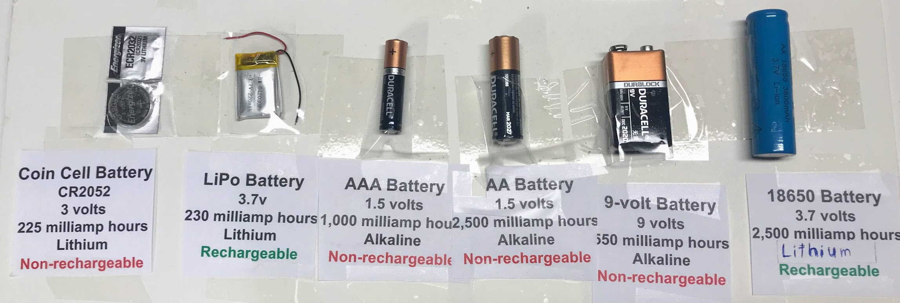
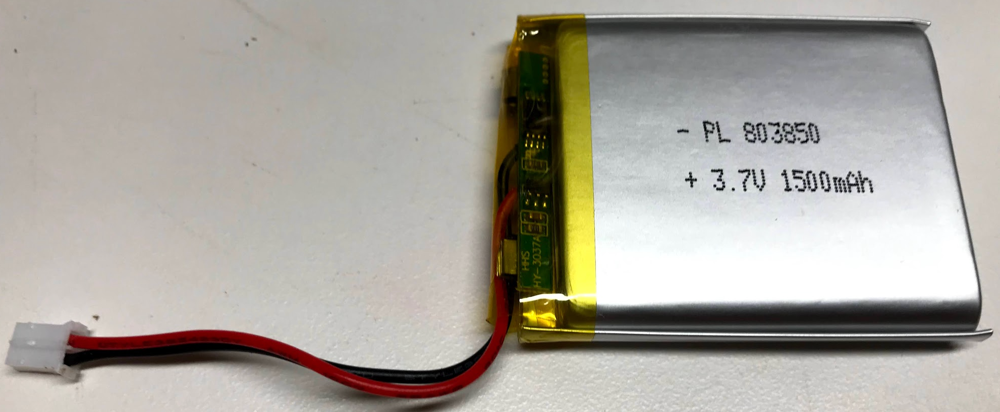
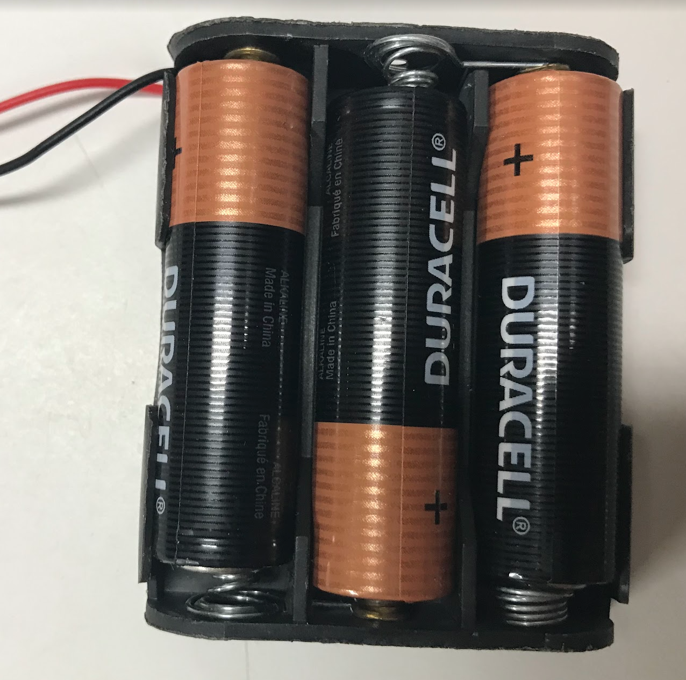
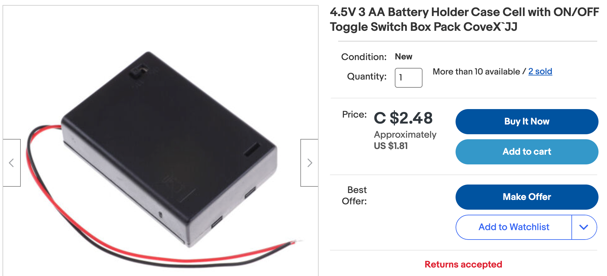
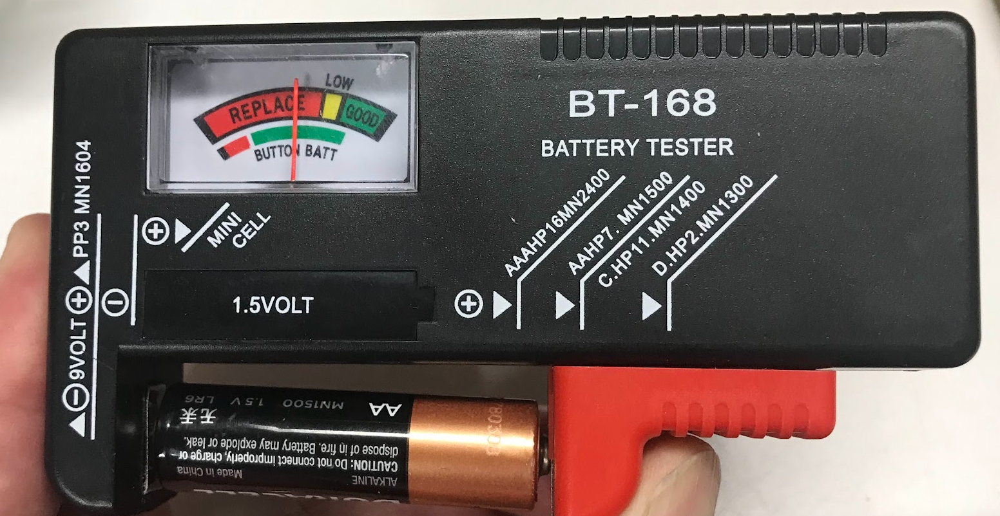
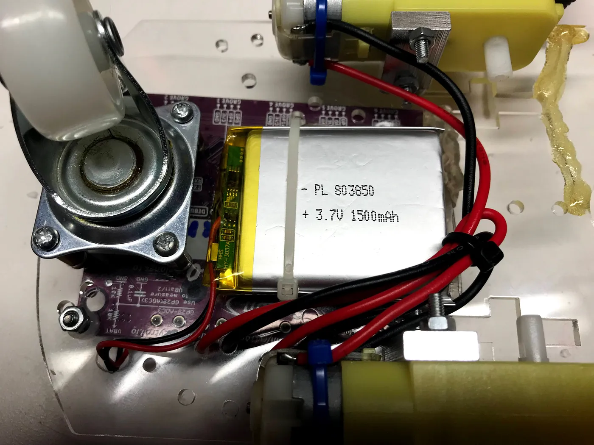
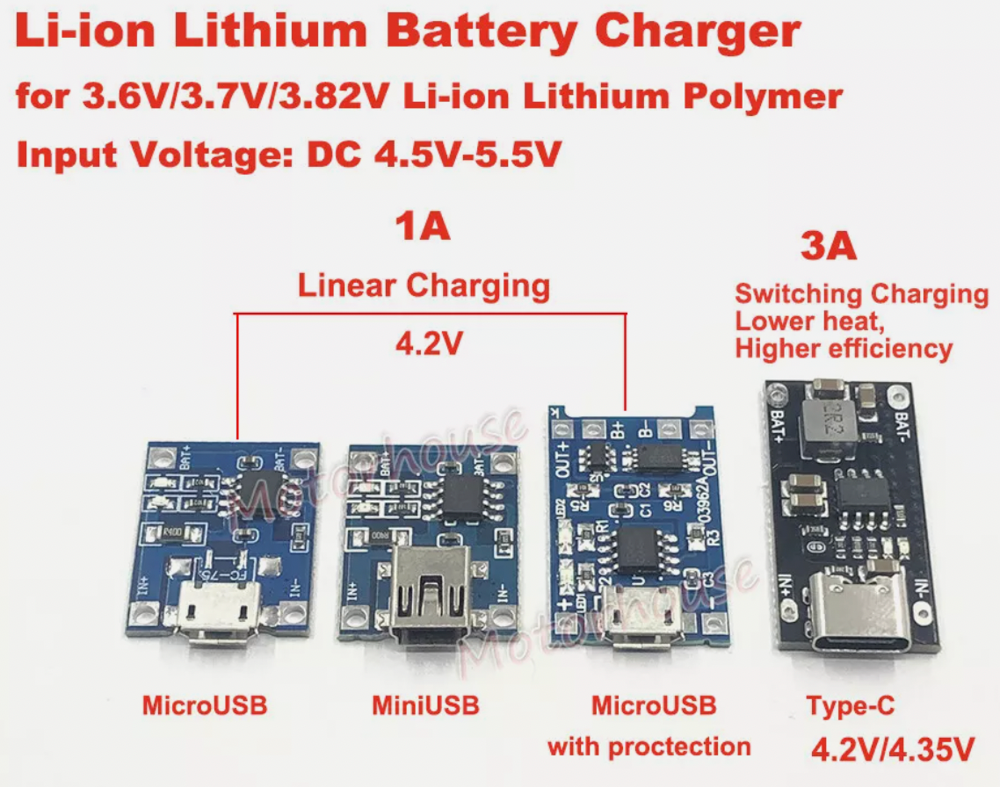
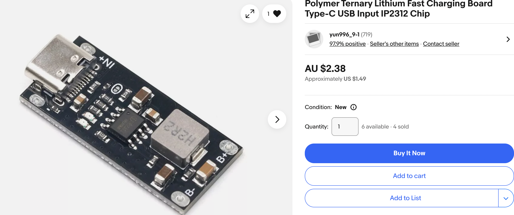

# Batteries for Potable LED Costumes

Although we start teaching how to program LED strips using a USB power source,
after you master a few patterns it is time to go portable!  This
guide will help you understand the tradeoffs of using different types
of batteries on your projects.

## Terminology

When we compare batteries, one of the first concepts to understand is how much energy a battery can hold.
In this section we will use the concept of [milliamp hours](../glossary.md#milliamp-hours) or mAh.  Although you don't
need to know the details now, you should know that the bigger the number, the longer the battery will
last.  A battery that stores 250 mAh is a small battery and will run out of power quickly.  
A battery pack that stores 10,000 mAh will power a large set of LED lights for many hours.

## Types of Batteries

In this section we will learn about the seven major types of batteries we use to power our LED creations.

Here are the types:

1. Coin cell batteries (CR2052)
1. Flat LiPo batteries
1. AA AAA alkaline batters
1. 9-volt batteries
1. Large LiPo Batteries in 18650 cells
1. USB Battery Packs (various sizes)

### Coin Cell Batteries

Coin cell batteries (like the CR2032) are small, round, flat batteries about the size of a nickel or quarter. They look like silver coins, which is how they got their name. These batteries are commonly found in watches, calculators, and small LED decorations.

**Key Features:**
- **Capacity:** Very small, typically 200-250 mAh
- **Voltage:** 3 volts
- **Size:** About 20mm diameter, very thin
- **Cost:** $1-2 each

**When to Use Them:**
Coin cell batteries work well for very small LED projects with just 1-3 LED noodles or a single NeoPixel that you want to run for a few hours. They're great for simple blinking badges or small decorations where you need something tiny and lightweight.

**Limitations:**
- Not rechargeable - you throw them away when they're dead
- Very limited power - can only light a few small LEDs
- Only last 2-4 hours with LEDs running
- Can't handle high-power LED strips

**Safety:** These batteries are relatively safe, but keep them away from small children who might swallow them.

### Flat LiPo Batteries

This image shows a rechargeable LiPo battery that holds about 1,500 milliamp hours.

### AA and AAA Batteries

AA and AAA batteries are the most common batteries you'll find at any store. They're the cylindrical batteries used in TV remotes, flashlights, and toys. AA batteries are larger than AAA batteries, so they hold more energy.

**Key Features:**
- **Capacity:**
  - AA: 2000-3000 mAh
  - AAA: 800-1200 mAh
- **Voltage:** 1.5 volts each (use 3 together for 4.5V to power 5V projects)
- **Cost:** $0.50-2 per battery depending on type

**When to Use Them:**
AA and AAA batteries are excellent for LED costumes because:
- Easy to find at any store
- Safe for kids to handle
- Battery packs are inexpensive (3-AA holders cost about $1)
- Can power medium-sized LED strips for several hours
- Available in rechargeable versions (NiMH)

**Testing**

Testing AA battery packs is simple.  You can purchase a small battery tester on eBay for a few dollars.
You can also use a volt-meter to check in the voltage is close to 1.5 volts.  A voltage of under 1.2 volts
means the battery is low on power.

**Battery Pack Configuration:**
To power a 5-volt LED strip, use **three AA batteries in a holder**. Three batteries × 1.5V = 4.5V, which is close enough to 5V to work perfectly with NeoPixel strips.

**Limitations:**
- Bulkier and heavier than flat LiPo batteries
- Battery holders can be awkward to attach to costumes
- Non-rechargeable alkaline batteries create waste
- Voltage drops as they drain (projects may get dimmer over time)

**Safety:** Very safe - the most beginner-friendly battery option.

### USB Power Packs

{ width="300" }

USB power packs (also called portable chargers or power banks) are the rechargeable battery packs used to charge phones on the go. They have USB ports that output 5 volts - perfect for LED projects!

**Key Features:**
- **Capacity:** Varies widely from 2,000 mAh (small) to 20,000+ mAh (large)
- **Voltage:** 5 volts (exactly what NeoPixels need!)
- **Weight:** Ranges from 2 oz (small) to 12 oz (large)
- **Cost:** $10-30 depending on capacity

**When to Use Them:**
USB power packs are ideal for larger LED projects:
- Perfect for 30-144 pixel LED strips
- Can power your project for many hours (even all night)
- Rechargeable via any USB charger
- Easy to connect with a USB cable
- Built-in safety circuits prevent overcharging and short circuits

**Choosing the Right Size:**
- **Small (5,000 mAh):** Powers 30 LEDs for 4-6 hours
- **Medium (10,000 mAh):** Powers 60 LEDs for 6-8 hours
- **Large (20,000 mAh):** Powers 144 LEDs all night long

**Limitations:**
- Heavier than other options (can feel heavy in pockets)
- More expensive initially (but saves money over time)
- Size can be bulky for small costumes
- Some auto-shutoff if current draw is too low

**Safety:** Very safe - includes multiple protection circuits. Great for beginners and advanced users.

### LiPo Batteries

!!! warning
    LiPo batteries are much more dangerous than traditional alkaline batteries. If not
    handled properly they may catch on fire. Although LiPo batteries
    can hold far more power, they should not be used with small children without adult supervision.

LiPo (Lithium Polymer) batteries are rechargeable flat batteries commonly used in drones, RC cars, and professional electronics. They pack a lot of energy into a thin, lightweight package.

**Key Features:**
- **Capacity:** Typically 500-2000 mAh for costume use
- **Voltage:** 3.7 volts (one cell)
- **Weight:** Very light - much lighter than AA batteries for the same capacity
- **Cost:** $5-15 depending on capacity
- **Shape:** Flat rectangular pouches that fit nicely in costumes

**When to Use Them:**
LiPo batteries are excellent when you need:
- Lightweight power for wearable projects
- Thin profile to hide in costume seams
- Good capacity without bulk
- Professional-looking installations

**Important Safety Rules:**

1. **Never puncture or cut** a LiPo battery - it can catch fire
2. **Don't overcharge** - use proper LiPo chargers only (see charging section below)
3. **Don't over-discharge** - never drain below 3.0V per cell
4. **Watch for puffing** - if battery swells up, stop using immediately
5. **Store safely** - keep at room temperature, away from metal objects
6. **Use protection circuits** - always use a charging/protection board

**Limitations:**
- Requires special handling and charging circuits
- Can be dangerous if mishandled
- Need protection circuits to prevent damage
- More expensive than alkaline batteries
- Require adult supervision for young students

**Safety:** Medium to high risk - requires knowledge and care. Only use with adult supervision and proper charging equipment.

### 9-Volt Batteries

9-volt batteries are rectangular batteries with two snap connectors on top. You'll recognize them from smoke detectors and guitar effects pedals.

**Key Features:**
- **Capacity:** 400-600 mAh (relatively small)
- **Voltage:** 9 volts (too high for NeoPixels without a voltage regulator)
- **Size:** Small rectangular shape
- **Cost:** $3-5 per battery

**When to Use Them:**
9-volt batteries are not ideal for LED strips because:
- The 9V output is too high - you need a voltage regulator to step down to 5V
- Relatively low capacity means short run time
- More expensive per mAh than other options
- Not commonly used in modern LED projects

**Better Alternatives:**
Instead of 9V batteries, consider:
- Three AA batteries (4.5V, much higher capacity)
- USB power packs (5V, rechargeable)
- LiPo batteries with proper circuits (3.7V, lightweight)

**Limitations:**
- Requires voltage regulator (adds cost and complexity)
- Poor capacity compared to alternatives
- Inefficient for LED applications
- Battery snaps can come loose easily

**When They Make Sense:**
The only time to use a 9V battery is if you already have one and need a quick temporary test. For any real project, choose a different battery type.

**Safety:** Safe to handle like AA batteries.

### 18650 Cells

18650 cells are cylindrical rechargeable lithium batteries that look like oversized AA batteries. The name "18650" comes from their size: 18mm diameter and 65mm long. These are the same batteries used in laptop battery packs and electric cars.

**Key Features:**
- **Capacity:** 2000-3500 mAh per cell
- **Voltage:** 3.7 volts per cell
- **Size:** About the size of two AA batteries
- **Cost:** $5-10 per cell
- **Lifespan:** Can be recharged 500-1000 times

**When to Use Them:**
18650 cells are great for advanced projects:
- Very high capacity in a small size
- Excellent for projects needing long runtime
- Used in multi-cell packs (2S = 7.4V, 3S = 11.1V)
- Professional-grade power solution
- Can handle high current draw

**Important Notes:**
- Must be purchased with **protection circuits** built in
- Need a special charger or charging module
- Multiple cells should be matched (same capacity and age)
- Require battery holders or spot-welding to connect

**Safety Considerations:**
- Similar safety concerns to LiPo batteries
- Must use cells with protection circuits
- Never use damaged cells
- Requires proper charging equipment
- Adult supervision recommended

**Limitations:**
- More advanced option requiring electronics knowledge
- Need special chargers or charging circuits
- Cylindrical shape harder to hide in costumes
- Requires proper battery holders
- Can be dangerous if not handled properly

**When They Make Sense:**
Use 18650 cells for:
- High-power LED installations
- Long-runtime projects (all-night events)
- Projects where you're already using them (existing battery packs)
- When you need maximum capacity in a small space

**Safety:** Medium to high risk - similar to LiPo batteries. Requires knowledge and adult supervision.

## Comparison Table

| Battery Type | Capacity (mAh) | Voltage | Rechargeable | Danger Level | Best For | Cost |
|--------------|---------------|---------|--------------|--------------|----------|------|
| **Coin Cell (CR2032)** | 200-250 | 3V | No | Low | Tiny 1-3 LED projects, badges | $1-2 each |
| **AA Batteries (3×)** | 2000-3000 | 4.5V | Optional* | Low | Beginner costumes, medium LED strips | $1.50-6 for 3 |
| **AAA Batteries (3×)** | 800-1200 | 4.5V | Optional* | Low | Small lightweight projects | $1-4 for 3 |
| **USB Power Pack** | 2000-20000+ | 5V | Yes | Low | Large LED strips, all-night events | $10-30 |
| **Flat LiPo** | 500-2000 | 3.7V | Yes | Medium-High | Professional wearables, thin profile | $5-15 |
| **9-Volt** | 400-600 | 9V** | Optional* | Low | Not recommended for LEDs | $3-5 |
| **18650 Cells** | 2000-3500 | 3.7V | Yes | Medium-High | High-power, long-runtime projects | $5-10 each |

\* Rechargeable NiMH versions available
\*\* Requires voltage regulator for LED use

### Quick Selection Guide

**For Beginners (Ages 8-12):**
- Start with **3 AA batteries** - safest and easiest option
- Upgrade to **USB power pack** when comfortable

**For Intermediate Students (Ages 13+):**
- Use **USB power packs** for most projects
- Try **flat LiPo batteries** with adult supervision for wearables

**For Advanced Projects:**
- **Flat LiPo** with protection circuits for professional wearables
- **18650 cells** for maximum capacity in compact size
- Always use proper charging circuits and adult supervision

## Battery Life Calculator

[Battery Life Calculator](../led-noodles/calculating-battery-life.md)

## LiPo Battery Charging Modules

Many of our projects use rechargeable LiPo
batteries.  However, we can't just plug these
into a 5v source to recharge them.  We need
a small circuit that will do two things:

1. Limit the current that goes into the batter when charging
2. Cut off the battery when it is draining to make sure
that it does not fully drain the battery.  Draining a LiPo
battery fully can reduce it's recharging potential

There are two main types of battery charing boards
that we use in our projects.  They
have different power ratings.
They both cost around $1 on eBay.

## TC4056 1 Amp LiPo Battery Charger

This is the most common and is fine for most
projects that don't need high current for fast
recharging. It is called a "linear charger"

[Search for "TC4056" on eBay](https://www.ebay.com/sch/i.html?_nkw=TC4056)

## IP2312 3 Amp LiPo Battery Charger

The IP2312 is a higher power version of the charger.
It is used when you have larger batteries and want
faster charging.

[Search for "IP2312" on eBay](https://www.ebay.com/sch/i.html?_nkw=IP2321)

[IP2312](https://www.ebay.com/sch/i.html?_nkw=IP2312&_sacat=0&_from=R40&_trksid=p2332490.m570.l1313) Polymer Ternary Lithium Fast Charging Board Type-C USB Input IP2312 Chip

I'd be happy to compare the TC4056 and IP2312 LiPo battery management boards for powering LED strips. Let me search for the most up-to-date information about these boards to give you an accurate comparison.

## TC4056 vs IP2312 LiPo Battery Management Boards Comparison

Based on my research, here's a detailed comparison of the TC4056 and IP2312 LiPo battery management boards for powering LED strips:

### TC4056 Overview

The TC4056 (also known as TP4056) is a widely used linear charging controller IC for single-cell lithium-ion/LiPo batteries with the following characteristics:

- Uses constant-current/constant-voltage (CC/CV) charging method
- Maximum charging current of 1A, programmable through an external resistor (Rprog)
- Fixed charging voltage of 4.2V
- Thermal feedback to automatically adjust charging current to limit chip temperature
- Input voltage range of 4V-8V, making it compatible with USB power

Protection features (when paired with protection circuits like DW01A):
- Overcharge protection (safely charges to 4.2V)
- Overcurrent and short-circuit protection
- Trickle charge for battery reconditioning

### IP2312 Overview

The IP2312 is a newer alternative battery management IC with key differences:

- Uses synchronous switch step-down (buck converter) charging architecture
- Maximum charging current of 3A (three times that of TC4056)
- Very high charging efficiency of 94% at 3.7V/2A
- Integrates all protection features in a single IC
- Operating frequency of 750KHz
- Supports intelligent current adjustment to prevent pulling on adapters

### Key Differences

#### 1. Charging Efficiency and Heat Dissipation

- **TC4056:** Uses linear voltage regulation which dissipates excess energy as heat, making it less efficient. This leads to significant heat generation during charging, particularly at higher currents.

- **IP2312:** Uses a buck converter architecture rather than linear regulation, achieving 94% conversion efficiency. This results in very little heat production even when charging at full potential.

#### 2. Maximum Charging Current

- **TC4056:** Limited to 1A maximum charging current.

- **IP2312:** Supports up to 3A charging current, making it suitable for larger capacity batteries or faster charging.

#### 3. Integration

- **TC4056:** Typically requires additional ICs (like DW01A and 8205A) for complete battery protection.

- **IP2312:** Has all protection features integrated in a single IC, simplifying board design and reducing component count.

#### 4. Real-world Performance

In direct comparisons:
- The IP2312 produces much less heat than the TC4056 when charging at comparable currents
- The IP2312's charging current gradually reduces as battery voltage increases, starting at maximum when the battery is fully discharged and then reducing to a nominal value of 1.5-1A

### Pros and Cons for LED Strip Power Applications

#### TC4056

**Pros:**
- Widely available and very inexpensive
- Simple circuit design
- Well-documented with extensive community support
- Adequate for smaller LED strips with lower power requirements
- Works well with USB power sources

**Cons:**
- Significant heat generation limits practical charging current
- Lower efficiency means wasted power
- May require heat sinks for sustained operation
- Not ideal for high-power LED strips due to current limitations
- Should not be used to simultaneously charge a battery and power a load

#### IP2312

**Pros:**
- Much higher efficiency (94%) means less wasted power
- Minimal heat generation even at high currents
- Higher charging current (up to 3A) supports larger batteries
- All-in-one solution with integrated protection
- Better suited for high-power LED strip applications

**Cons:**
- Less widely available than TC4056
- Typically more expensive
- Less community documentation and support
- More complex implementation

### Tradeoffs for Powering LED Strips

When powering LED strips from LiPo batteries, these tradeoffs are important to consider:

1. **Power Requirements:** For high-power LED strips (>1A), the IP2312 is clearly superior due to its higher current capability and efficiency.

2. **Heat Management:** The TC4056's heat generation can be problematic in enclosed spaces or when powering LED strips for extended periods, while the IP2312's higher efficiency results in cooler operation.

3. **Battery Life:** The IP2312's higher efficiency translates to less energy wasted during charging, potentially extending battery life and providing more power to your LED strips.

4. **Cost vs Performance:** The TC4056 is adequate and cost-effective for smaller, lower-power LED strips, while the IP2312 is worth the additional cost for high-power applications or where efficiency is critical.

5. **Simultaneous Operation:** If you need to power LED strips while charging the battery, the IP2312 is better suited due to its design, although proper circuit design is still important.

In conclusion, for powering LED strips, the IP2312 offers superior performance, particularly for high-brightness or extended use cases, while the TC4056 remains a viable economical option for lower-power applications where maximum efficiency isn't critical.

## References 

[Components 101: TP4056A Li-ion Battery Charging/Discharging Module](https://components101.com/modules/tp4056a-li-ion-battery-chargingdischarging-module)
