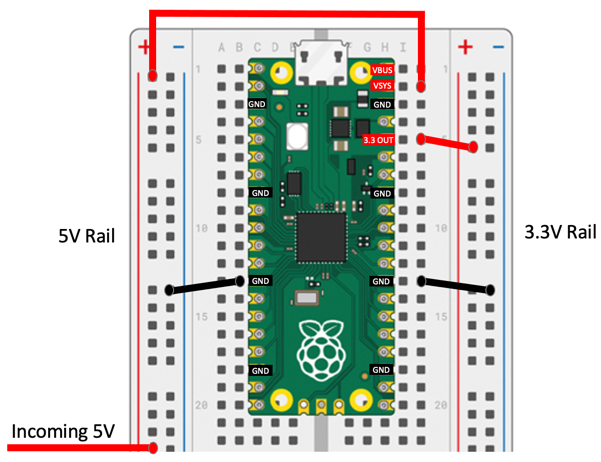

# Circuit Connections

Because this guide is focused on teaching computational thinking, we don't spend much time on circuits and wiring diagrams.  We try to keep the circuits and wiring diagrams as simple as possible.

For the basic NeoPixel strip are only three wires you need to conn

