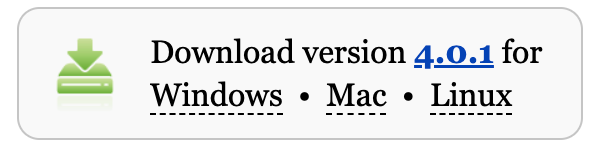
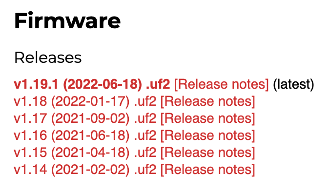
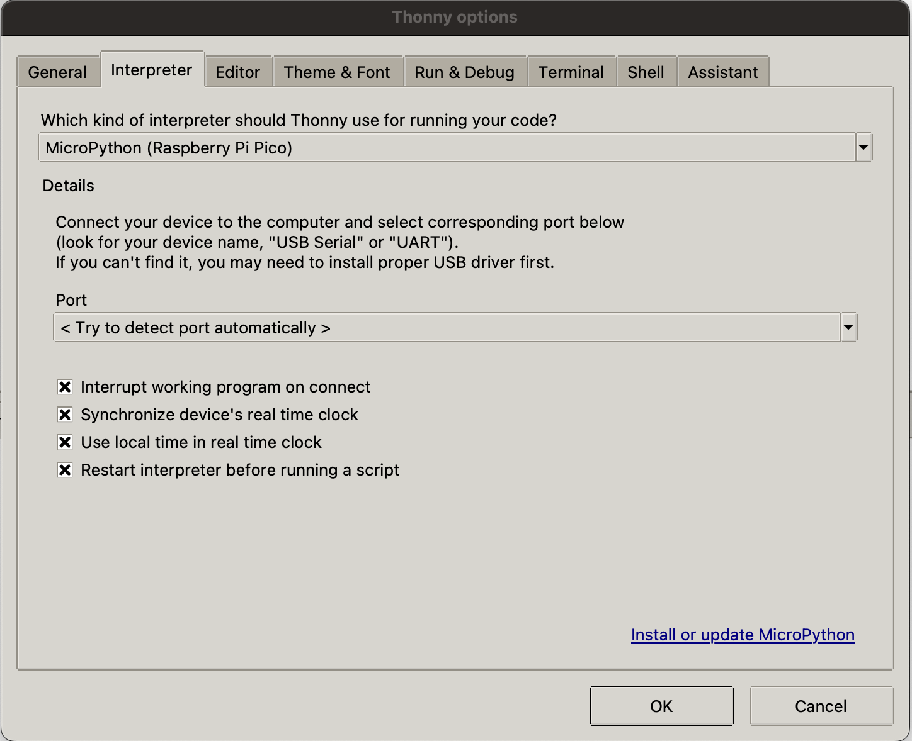
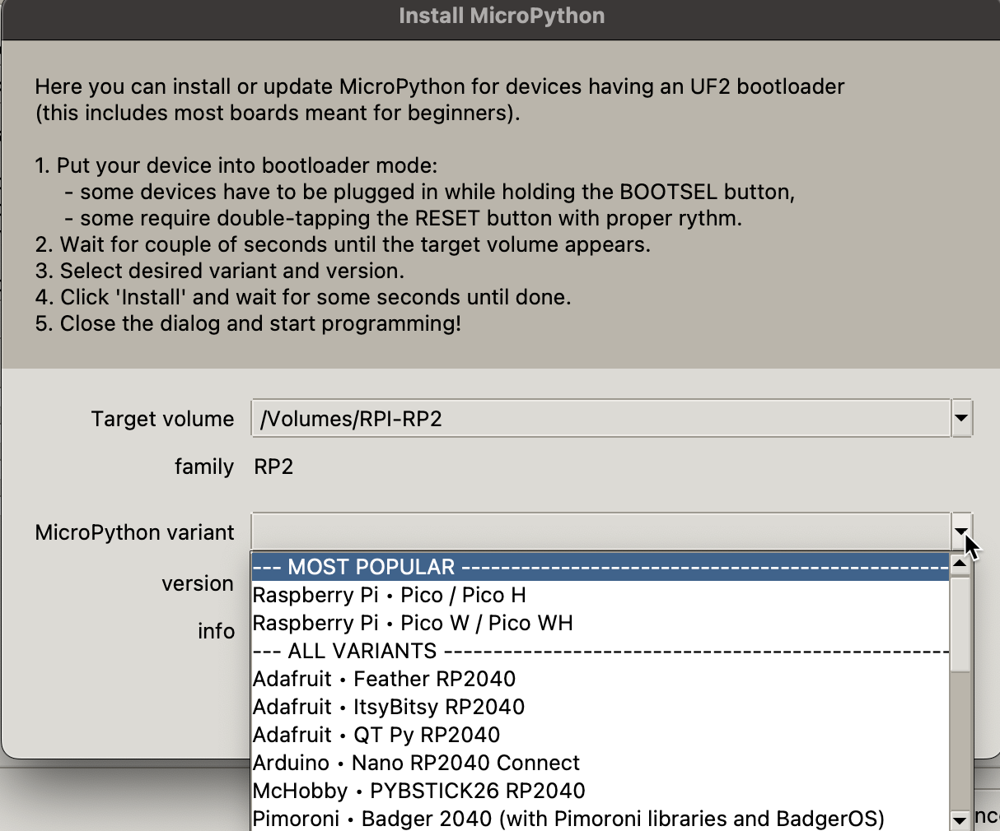
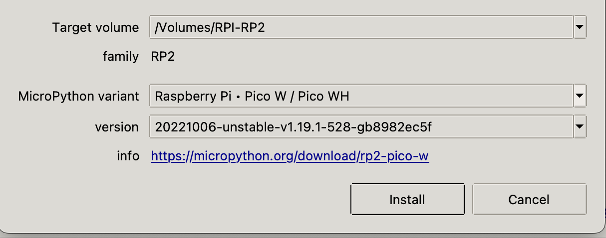
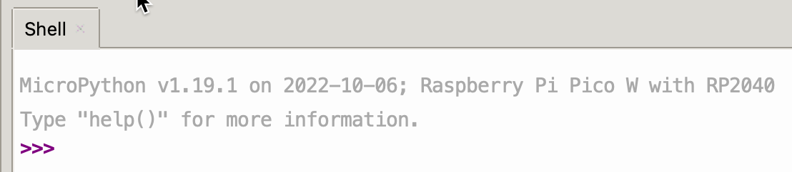
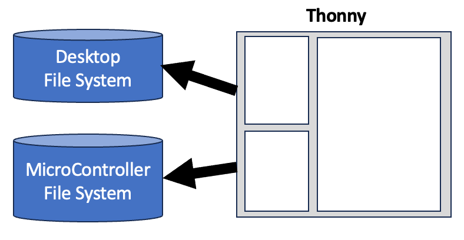

# Desktop Setup

In this lesson, we will review the steps to get your PC or Mac setup to use the free open source [Thonny](https://thonny.org/) Python Integrated Development Environment (IDE).  We will assume you are using either the Raspberry Pi Pico or the Raspberry Pi Pico "W" for thee lessons.

## About Thonny

Thonny is an ideal tool for writing MicroPython code for students just getting started.  It is free, simple to use, and it runs on PCs running Windows, Macs and Linux systems such as the Raspberry Pi.

## Step 1: Install Thonny

The installation of Thonny will vary depending on the type of computer you are using.  For both Windows and Mac, you must first download an installer program. The links to these downloads are on the main [Thonny page](https://thonny.org/):



For all the versions of Linux, you can open the command shell and type in the correct installation command.  For people using the Raspberry Pi operating system, Thonny may already be included in your software.

## Thonny Versions

These screen images were done with [Thonny Version 4.0.4](https://github.com/thonny/thonny/releases/tag/v4.0.1).  We also tested the steps on Thonny version 4.1.2 and the seem to work fine.

## Step 2: Configure the MicroPython Firmware

After you first plug in a Raspberry Pi Pico, you will need to install the correct runtime library for the Pico.  This just takes a minute and you will only have to do it once for each microcontroller.

Since version 4.0.0 Thonny can detect the microcontroller you are using and download the firmware.

### Manually Downloading the Firmware

There are occasions when the automatic firmware download in Thonny may not work.  In this case, you will need to manually download the firmware from the MicroPython website.

Here are the links to the Pico Firmware (called RP2-pico):

[Raspberry Pi Pico Firmware](https://micropython.org/download/rp2-pico/)



## Step 3: Configure Interpreter

Thonny is designed to automatically detect the correct device and configure the right interpreter.  You can verify this by using the Thonny **Tools** -> **Options** menu and move to the **Interperter** tab.



Note that the *MicroPython (Raspberry Pi Pico)* is selected.

### Thonny Firmware List

You can also get a list of all the different versions of firmware by going directly to the MicroPython site.  Here is what that list will look like:



After you select a runtime version, Thonny will give you the details about this version.




After Thonny installs the new firmware on the Pico it instructs the Pico to "restart" using the new firmware.  This makes the USB drive appear to be removed without a disconnect and results in an error.  This is normal so don't worry.




## Debugging Tips

When debugging your Thonny installation, it is important to understand the steps that happen when you plug your Raspberry Pi Pico into the computer.

**Step 1: Plugging the USB Device** The Pico appears as a USB device on your computer when you plug it in.  The operating system should send a request to the USB device asking it for its ID.

**Step 2: Probing for the USB ID** The Pico will respond with a device ID number.  This number reflects two items: the company that made the device (Vendor ID) and the device product type (Product ID).  If you are using a power-only USB cable this number will **never** get to the operating system.  This means that the data wires are not present in your USB cable or one of the wires is broken or not connecting.

**Step 3: Looking Up the USB Driver** The operating system will take this USB ID and then look-up the right software and then run that software.  In UNIX and Mac systems this will amount to making the USB device appear in the ```/dev/cu*``` area.  On Windows it will be a COM port.

```sh
ls -l /dev/cu.usb*

crw-rw-rw-  1 root  wheel  0x9000001 Dec 25 08:41 /dev/cu.usbmodem101
```

Note that the exact port name might change.  The example above is ```cu.usbmodem101```.

If this device does not immediately appear, then you should double-check your cable and make sure the operating system registers the USB device.

If you know your cable works fine by testing it on other devices then you may have to reboot your computer.

### Automatic Power Draw Shutoff

If your USB port is drawing too much power, then many computers will disable the port.  This can happen if you are trying to display too many LEDs or a motor.  You will see a message such as "USB Port Disabled". 

Your computer manufacturer will tell you what the maximum current each USB port allows.  This is typically about 1 amp, but it varies based on your computer and what other devices are connected to your computer.

The best way to debug this is to purchase a low-cost USB current monitor and monitor how much current your project is using.  If you are using an LED-strip
then make sure you test the current with all the pixels fully on (255,255,255).

[USB Current Monitor Search on eBay](https://www.ebay.com/sch/i.html?_from=R40&_nkw=USB+current+monitor&_sacat=0&_sop=15)

In general, each NeoPixel at full brightness will draw up to 20 milliamps and the Pico will also draw about 20  milliamps.

For projects that require more than about 500 milliamps, it is strongly recommended that you use an externally powered USB hub.

### Debugging the USB Port

#### Mac System Profiler

On MacOS we can use the ```system_profiler``` command:


```sh
system_profiler SPUSBDataType

USB:

    USB 3.1 Bus:

      Host Controller Driver: AppleT8112USBXHCI

    USB 3.1 Bus:

      Host Controller Driver: AppleT8112USBXHCI

        Board in FS mode:

          Product ID: 0x0005
          Vendor ID: 0x2e8a
          Version: 1.00
          Serial Number: e66141040396962a
          Speed: Up to 12 Mb/s
          Manufacturer: MicroPython
          Location ID: 0x00100000 / 1
          Current Available (mA): 500
          Current Required (mA): 250
          Extra Operating Current (mA): 0

```

Note that you can see both the Product ID, Vendor ID Manufacturer (MicroPython) and the mode (File System mode) that the device was connected.  The current available and current required are also listed, although these numbers might be somewhat conservative.  They are used for the estimation of current only.

## Checking out the Moving Rainbow Code from GitHub

You don't need to copy and paste the code samples one-by-one into
your local file system.  GitHub allows you to download all the
code on the Moving Rainbow site by running the following command:

```sh
# create a projects area to checkout your code
mkdir ~/projects
cd projects
# make a copy of the repo on your local hard drive
git clone https://github.com/dmccreary/moving-rainbow
cd moving-rainbow
# open the files in your file manager
open .
```

You can now go directly to the source for the LED strip labs that have two buttons:

```sh
cd src/led-strip-two-buttons
```

Once you have done this step you can make the top Files region of Thonny point
to the source area and then click the upper right corner that has the "Upload to /"
menu.  Make sure the bottom area is set to the root, not the /lib area.

The following video shows these steps:

<iframe width="560" height="315" src="https://www.youtube.com/embed/LMx8JeWZrt0?si=1ZUSq9ffbmXu_PaU" title="YouTube video player" frameborder="0" allow="accelerometer; autoplay; clipboard-write; encrypted-media; gyroscope; picture-in-picture; web-share" allowfullscreen></iframe>

## Understanding Thonny and File Systems



To understand how Thonny works, we want to have a clear visual picture of the two parallel file systems that Thonny uses.

1. Thonny is launched from your desktop or laptop computer.  The Files window at the top will always be open to that file system.
2. Thonny also displays the file system on the **microcontroller** on the bottom window.  It displays this
window after you successfully connect through the correct
port.

You can run a program in Thonny from either file system.  But there is one strict rule.  If you
