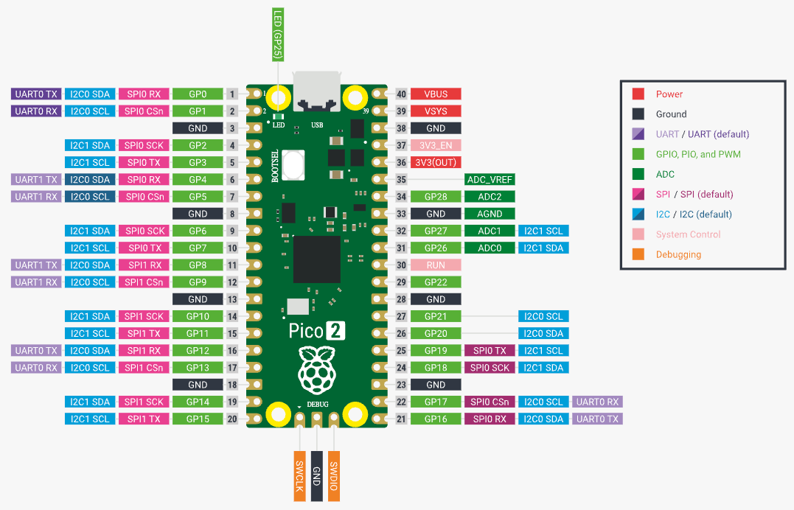
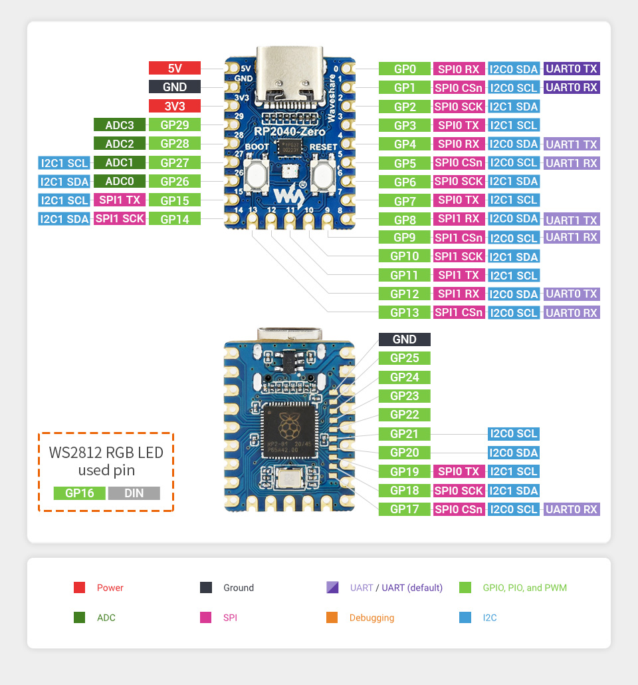

# Moving Rainbow Development Boards

## Raspberry Pi Pico

[Raspberry Pi Pico webpage](https://www.raspberrypi.com/documentation/microcontrollers/pico-series.html)

<!--

-->

[Raspberry Pi Pico Pinout](https://www.raspberrypi.com/documentation/microcontrollers/images/pico-2-r4-pinout.svg)

## RP2040-Zero

[Waveshare.com Web Page](https://www.waveshare.com/wiki/RP2040-Zero)

- RP2040 microcontroller chip designed by Raspberry Pi in the United Kingdom.
- Dual-core Arm Cortex M0+ processor, flexible clock running up to 133 MHz.
- 264KB of SRAM, and 2MB of on-board Flash memory.
- USB-C connector, keeps it up to date, easier to use.
- The castellated module allows soldering direct to carrier boards.
- USB 1.1 with device and host support.
- Low-power sleep and dormant modes.
- Drag-and-drop programming using mass storage over USB.
- 29 × multi-function GPIO pins (20× via edge pinout, others via solder points).
- 2 × SPI, 2 × I2C, 2 × UART, 4 × 12-bit ADC, 16 × controllable PWM channels.
- Accurate clock and timer on-chip.
- Temperature sensor.
- Accelerated floating-point libraries on-chip.
- 8 × Programmable I/O (PIO) state machines for custom peripheral support.

