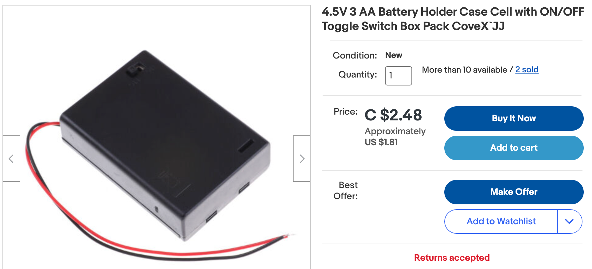
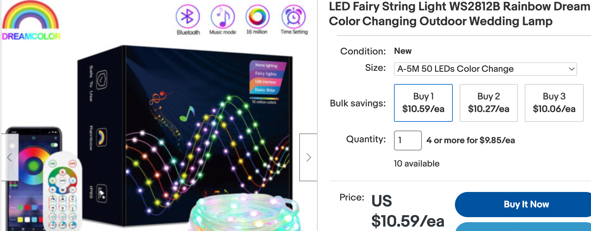

# Moving Rainbow Kits

These lesson plans are designed to be used with a Raspberry Pi Pico and an addressable LED strip.  The total parts cost is typically under $10

## Standard Parts

Our standard kit contains the following parts:

1. A Raspberry Pi Pico ($4) or "W" ($6) with header pins soldered in place
2. A 1/2-size solderless breadboard (400 ties) ($2)
3. A 30-pixel addressable RGB LED strip (WS2812B) ($2)
4. 3 terminal screw header (optional)
5. Two momentary push buttons
6. 22 gauge wires

## Optional Parts

## USB Connectors

Most of our classrooms will also have the right USB cables for these boards.  If you have a PC or a Mac you will need a USB-A-to-micro-USB or for a Mac, you will need USB-C-to-micro-USB connector.

## Batteries and Battery Packs

If you are using these kits to make a costume, you can also purchase a battery pack that holds 3 AA batteries or a USB power pack used to recharge phones.  We find that even the small 2,500 milliamp hour packs will power a costume of 60 LEDs for many hours (depending on the brightness of the pattern)

## LED Strip and Rings

There are hundreds of variations of WS2812B LED strips and fairy lights.  We usually purchase them in 1-meter strips with 60 pixels per meter.  Since 2020 there are now very lightweight fairy lights that are ideal for lighting up costumes.

[EBay Search for SW2812B](https://www.ebay.com/sch/i.html?_nkw=WS2812B)

If you are creating costumes that might get wet in the rain, we suggest getting the versions that are encased in a waterproof silicon tube or in a waterproof silicon coating.

## LED Fairy Lights

