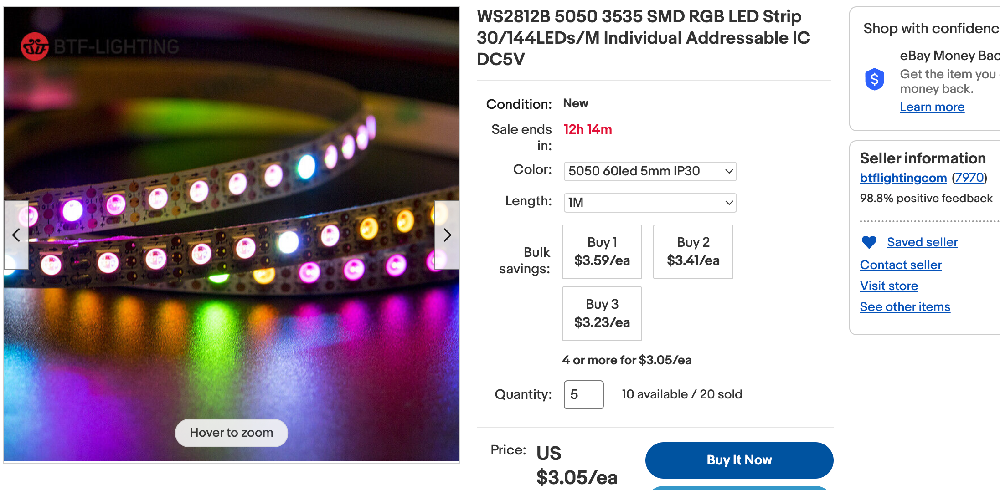
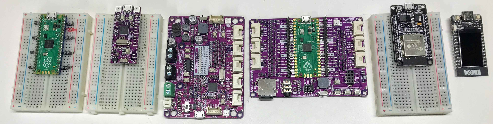
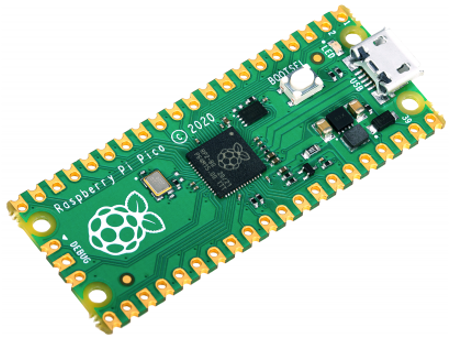
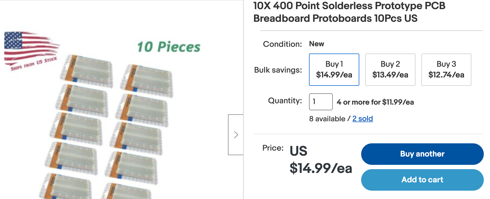
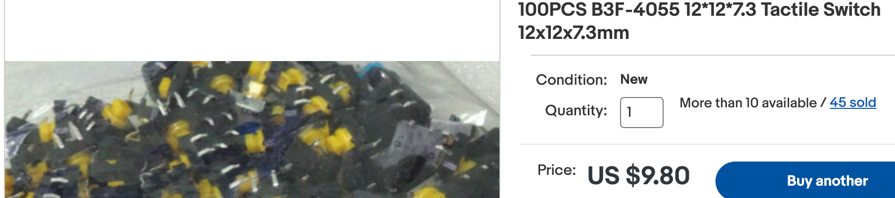
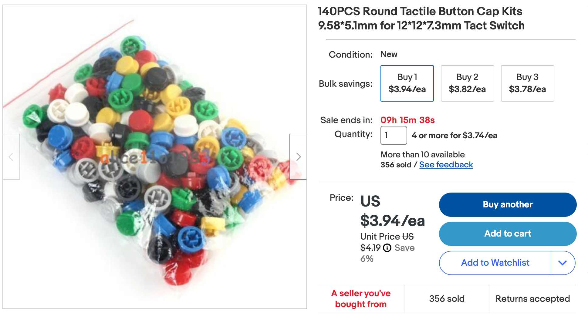
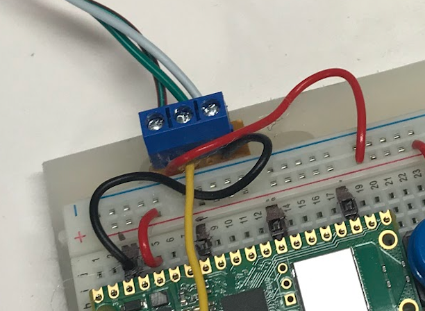
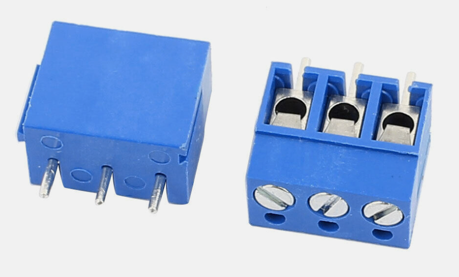
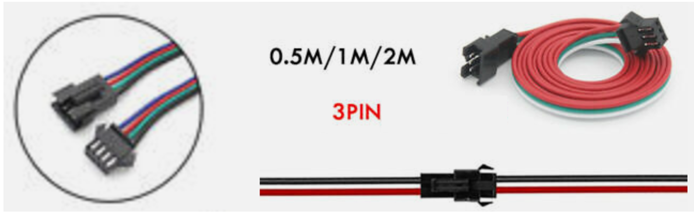

# Purchasing Your Own Parts

In many school-based programs and coding clubs, the parts used in these lessons will be purchased for you.  Very often they will be pre-assembled and all the software preloaded before the classes begin.  This guide is for mentors, parents and students who would like to build their own systems at home.

You can easily create your own projects based on the Moving Rainbow kits and software.  You can do this by purchasing parts on online sites such as e-Bay or Amazon.  If you are a good planner you can purchase parts from China that take longer to arrive, but they can cost significantly less than parts that ship overnight on Amazon.  This guide provides sample links to both e-Bay and Amazon, but be aware that these sites change frequently.

## WS-2812B LED Strip

You can purchase the LED strips for around $3.00 per meter if you shop around on e-Bay.  The above was from seller [btflightingcom](https://www.ebay.com/usr/btflightingcom?_trksid=p2047675.m3561.l2559).  We use the 60 pixels/meter type without waterproofing for our indoor classes.  People that create costumes use the waterproof varieties.

Some of these parts are also called "NeoPixels".

NeoPixels are parts that contain three LEDs and logic to process an incoming data stream.  Each NeoPixel will look at the incoming data and extract the 8-bit values for its own red, green and blue LED brightness.  It then sends the data signal on to the next NeoPixel.

## Soldering

Many of the parts you purchase online might require some soldering to make them easy to use.  We recommend that you get a soldering iron and solder and watch a YouTube video on how to solder.  Kids should always have adult supervision and you should check with your school or classroom policy before you bring a soldering iron to school.

## Headers

Many of the Pico's don't come with headers.  You can purchase 100 40-pin breakaway headers for about $10 dollars on e-Bay.

Part Description: 40-Pin Male Header 0.1" 2.54mm Connectors

## MicroControllers

## Raspberry Pi Pico

We use the Raspberry Pi Pico (far left) because it only costs about $4.

It also mounts directly on the breadboard after we add the header pins.

## NeoPixels

## Header Pins

If your Microcontrollers do not come with header pins, you can purchase about 100 of them on e-Bay for about $11.

[100pcs Pitch 1x40 Pins 2.54mm Male Single Row Male Pin Header Strip](https://www.ebay.com/itm/171936190989?hash=item280832120d%3Ag%3AQdMAAOSwEetV-YW%7E&LH_BIN=1)

## Breadboards

We use 400-tie 1/2 size breadboards.  You can purchase them on [E-Bay](https://www.ebay.com/sch/185138/i.html?_nkw=solderless+Breadboard) for around $1.50 each in quantity 10.

## Momentary Push Buttons

Tactile Switches

We use these buttons 

Part Description: 100PCS B3F-4055 12*12*7.3 Tactile Switch 12x12x7.3mm

The caps are 140PCS Round Tactile Button Cap Kits 9.58*5.1mm for 12*12*7.3mm Tact Switch on [eBay](https://www.ebay.com/itm/401225666722)

## Screw Headers

We attach screw headers to the plexiglass base that we put the kits on.  This allows
us to change the LED strip or ring for each project with just a screwdriver.  This
is key because many classrooms don't allow soldering irons in the classrooms.

We purchase screw headers on eBay

## LED Strip 3-Pin SM JST Connectors

We purchase our LED strips in 1-meter lengths of 60 pixels per meter.  When
they arrive, they have both a male and a female 3-pin SM JST connector on the ends.
This allows these LED strips to be connected end-to-end for strips that are longer
than 1 meter.

[LED Strip 3-Pin SM JST Part Listing on eBay](https://www.ebay.com/itm/324513055781)

## Boxes

Our students love to put their projects into clear boxes so they can simply throw them in their backpacks and show their friends.  We use clear boxes that you can purchase at [The Container Store](https://www.containerstore.com/)

[Shallow Narrow Stackable Rectangle Clear 8-1/4" x 3-1/2" x 1-1/2" h $3.99 SKU:10051084](https://www.containerstore.com/s/gift-packaging/gift-boxes/12d?productId=10032168)

These boxes have a clear detachable lid that shows off the interior wiring of their kits.

## MicroPython Site

For more parts, see the [CoderDojoTC MicroPython website](https://www.coderdojotc.org/micropython/).

