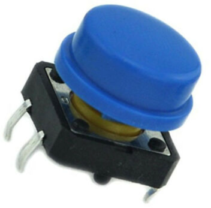

# Purchasing Your Own Parts

In many school based programs and coding clubs, the parts used in these lessons will be purchased for you.  Very often they will be pre-assembled and all the software preloaded before the classes begin.  This guild is for parents and students that would like to build your own systems at home.

You can easily create your own projects based on the Moving Rainbow kits and software.  You can do this by purchasing parts on on-line sites such as e-Bay or Amazon.  If you are a good planner you can purchase parts from China that take longer to arrive, but they can cost significantly less than parts that ship overnight on Amazon.  This guide provides sample links to both e-Bay and Amazon, but we aware that these site change frequently.

## Soldering

Many of the parts you purchase online might require some soldering to make them easy to use.  We recommend that you get a soldering iron and solder and watch a YouTube video on how to solder.  Kids should always have adult supervision and you should check with your school or classroom policy before you bring a soldering iron to school.

## MicroControllers

## Raspberry Pi Pico

We use the Raspberry Pi Pico (far left) because it only costs about $4.

It also mounts directly on the breadboard after we add the header pins.

## NeoPixels

## Header Pins

If your Microcontrollers do not come with header pins, you can purchase about 100 of them on e-Bay for about $11.

[100pcs Pitch 1x40 Pins 2.54mm Male Single Row Male Pin Header Strip](https://www.ebay.com/itm/171936190989?hash=item280832120d%3Ag%3AQdMAAOSwEetV-YW%7E&LH_BIN=1)

## NeoPixel Rings

## Raspberry Pi Pico

## Breadboards

## Momentary Push Buttons

## Boxes

Our students love to put their projects into clear boxes so they can simply throw them in their backpacks and show their friends.  We use clear boxes that you can purchase at [The Container Store](https://www.containerstore.com/)

[Shallow Narrow Stackable Rectangle Clear 8-1/4" x 3-1/2" x 1-1/2" h $3.99 SKU:10051084](https://www.containerstore.com/s/gift-packaging/gift-boxes/12d?productId=10032168)

These boxes have a clear detachable lid that shows off the interior wiring of their kits.

## MicroPython Site

For more parts, see the MicroPython site here:

