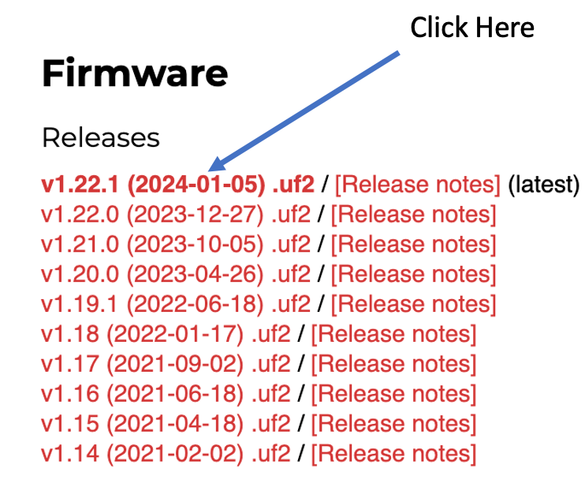
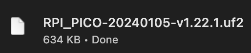
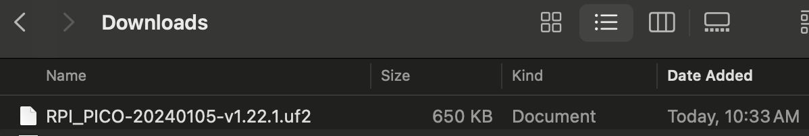
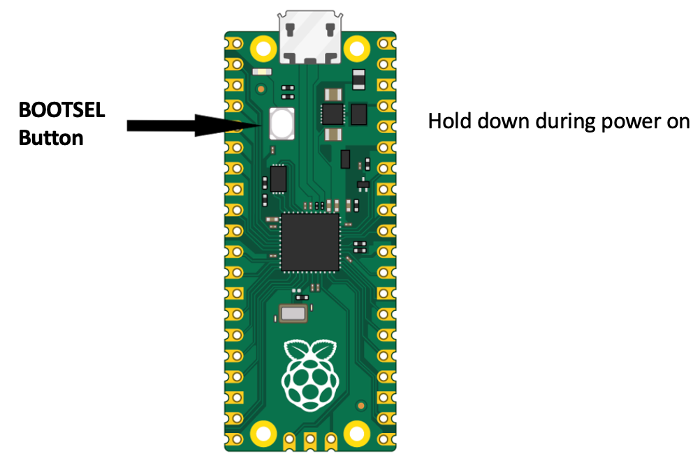
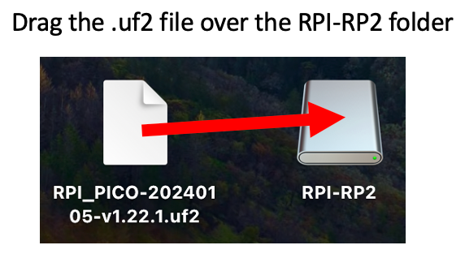
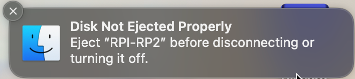
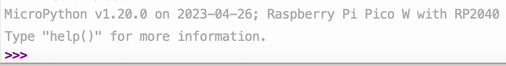
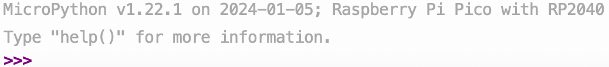
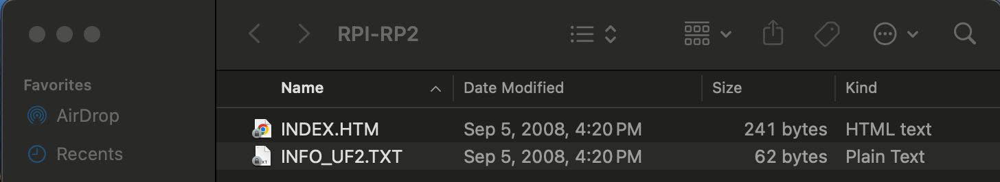

# How to Update Firmware on the Raspberry Pi Pico

Both the Raspberry Pi Foundation and the MicroPython development
teams keep improving the software we use in our classrooms.
These changes are usually small and don't impact our classrooms.
However, occasionally there are "breaking changes" that we
need to adapt our devices and code examples.

When this happens we need to update the firmware on our classroom
Raspberry Pi Pico.  This is easy to do.  It takes under five
minutes to do your first one and the process can be streamlined
for subsequent devices.

## Steps

Here are the key steps:

1. Download the new firmware from here: https://micropython.org/download/RPI_PICO/
2. Hold down the BOOTSEL button while you turn on the Pico (that is the key step)
3. Drag the new file into the folder that pops up.  It should take under 10 seconds to download.

Let's now review these three steps in detail.

### Step 1: Downloading the new firmware image

The firmware that we use for the Raspberry Pi Pico (not the W) is stored
here:

[https://micropython.org/download/RPI_PICO/](https://micropython.org/download/RPI_PICO/)

When you go to this page, you will see a list of the latest releases.  It will
look like this:



Note that the top line is in red color but has the black label "(latest)" next to it.  That is the
one we use almost all the time.  We only go back to a prior if there is a bug
in the latest release or our code is incompatible with the latest release.

To do the download, you need to click on this first line.  The text is
in red and is in the first part of the line.  The second part of the line
is a link to the release notes.

After I click on this link the download should automatically start up.  
The file is about 640K bytes (under 1 megabyte) and it should finish
in under five seconds.



On most computers, the new file will now appear in your "Downloads" folder.
You can identify it because it has the extension "UF2" for "USB Flashing Format".
The "2" is for the two "Fs" and the fact that the extension "UFF" was already taken.



#### Sidebar: What is the UF2 format?

The extension ".uf2" stands for "USB Flashing Format". It is used primarily for microcontrollers, like the Raspberry Pi Pico, in the context of firmware updates or software uploads. This format is particularly designed to make it easy to flash a device over USB without needing a special flashing tool or software. The UF2 file contains the firmware that is to be uploaded to the microcontroller. When connected to a computer, the Raspberry Pi Pico can appear as a USB storage device, and the UF2 file can be dragged and dropped onto it to update the firmware or load new software. This simplicity and convenience are significant advantages, especially for educational purposes or for hobbyists who might not have extensive experience with programming microcontrollers.

### Step 2: Press the BOOTSEL Button During Power-Up



Our next step is to locate the BOOTSEL button on the Pico.  It
is a small white oval button on the top of the Pico.  Now hear
is the tricky part.  You must hold this button down when you
boot up the Pico.  This process makes the Pico look like
a USB hard drive.  Your PC or MAC will then open it up
as a folder on your desktop.

I usually hold the BOOTSEL with one hand and then plug the Pico USB
cable into a PC or laptop with the other hand.  This can be a bit
tricky if the laptop is on a slippery surface.  After you
do this a folder called RPI-RP2 should automatically appear
on your desktop.


### Step 3: Drag the Firmware to the Folder



You are now all set to copy the new firmware to the Raspberry Pi folder.
One way to do this is by dragging the new .uf2 file over the 
Since the fill is small, this should take under 10 seconds.

You can also select the .uf2 file and select the "copy" menu.  Then
select the new RPI-RP2 folder and do a "paste".

After the file is copied you will get a "Disk Not Ejected Properly" warning
like this:

This is normal.  You can just close the warning panel.

#### Verifying the Upgrade Worked

After this step is done, you can open your Thonny IDE and verify that
the firmware matches the version you just uploaded to the Pico.

You can do this by pressing the STOP/Restart Backend button and look
at the prompt in the Shell window.

Example before firmware upgrade:

Note that the version is now **v1.20.0**

Example after firmware upgrade:

Note that the version is now **v1.22.1**

#### Side Note on Boot Select Files

After you hold the BOOTSEL down and power up you will see the RPI-RP2 folder. If you open the Folder RPI-RP2 you you will see the following.



This has two very small files.  If you click on the index.htm file your
browser will go to the Raspberry Pi documentation website.

The other info.text

```
UF2 Bootloader v1.0
Model: Raspberry Pi RP2
Board-ID: RPI-RP2
```

This shows you that the Raspberry Pi

## Alternative Methods

If you have problems finding the BOOTSEL button or holding it down
when you plug in the USB cable, you can also use a command line
tool to perform the firmware update.

You can also use Thonny to perform the update.

These methods are covered in the [Raspberry Pi Pico Documentation Getting Started Guide](https://projects.raspberrypi.org/en/projects/getting-started-with-the-pico/3).

## NeoPixel Update

One of the key changes that was done to the firmware
in 2021 was the inclusion of the NeoPixel library into
the MicroPython firmware.  The key change is that
the syntax of how we set pixel values changes
from a function call in an external library to directly writing to
the NeoPixel array.  The new syntax is:

```py
strip[i] = (red, green, blue)
strip.write()
```

If you have old code that used the strip.set(i, red, green, blue)
format you can either change the syntax (strongly recommended)
or load the old neopixel library and use it.

We don't suggest using the library because it is one more
complicated step and makes our examples less portable.  If
we use the built-in NeoPixel library our code will
be consistent with the other examples on the internet.

## Framebuffer Drawing Update

One other change that happened was when the MicroPython firmware library extended
the framebuffer drawing library to include both ellipse and polygon drawing functions.
Before this update, each display driver needed to include their own individual functions
for drawing shapes beyond the basic rectangular drawing functions.  After this update, all our drawing libraries that used framebuffers could call
functions directly in firmware.  This made the functions uniform across all
our libraries.


