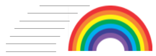

# Welcome to the MicroPython Moving Rainbow Website!



## About the Moving Rainbow Project

Moving Rainbow is a way to learn the basics of programming using LED strips.  We use low-cost components so you can build entire projects and costumes with 100s of LEDs for under $20.  Since 2014 we have been building low-cost kits that teach all the concepts of [Computational Thinking](https://www.coderdojotc.org/CoderDojoTC/computational-thinking/)](https://www.coderdojotc.org/CoderDojoTC/computational-thinking/).

!!! Note
    We are no longer accepting pull requests for Arduino C code.  Because we can get Raspberry Pi Pico processors for $4 that run Python we have moved
    all our Moving Rainbow code over to Python.

## Getting Started

Our getting started guide has three parts:

1. About Moving Rainbow
1. Code Savvy Kits
2. Build Your Own from Parts
3. Desktop Setup

## Raspberry Pi Pico

The Raspberry Pi Pico cost only $4 and runs Python.  All our labs use this processor.


## Breadboards

In our projects we use 1/2 sized breadboard with 400 tie points.


## Mode Buttons
A "mode" is a way of having a single Arduino program run multiple patterns on the LED strip.  Each mode has a number associated with it
starting with 0 and continuing to the number of patterns we have in our program.

In this section we will add two mode buttons.  One button will make the pattern mode go to the next mode.  The other button will go to the previous mode.

## Programming the LED strip


Each of our example programs will have at least three sections:

1. The preamble - this constains the library directives and initialization of static unchanging variables
2. The setup() function - this function is run once with the Arduion first starts up
3. The loop function - this function runs continually as long at the Arduino has power

Sample Blink Program

```python

```
