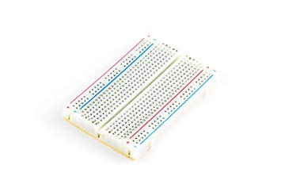

# Welcome to the Moving Rainbow Website!

## About the Moving Rainbow Project

Moving Rainbow is a way to learn the basics of programming using fun LED strips.  
We use low-cost components so you can build entire projects and costumes with 100s of LEDs for under $10.
Since 2014 we have been building low-cost kits that teach all the concepts of [Computational Thinking](./teachers-guide/computational-thinking.md).

Since 2014 we have been designing and programming low-cost kits that teach the concepts 
of [Computational Thinking](./teachers-guide/computational-thinking.md).

## Main Chapters

You can get started with the main [chapters](./chapters/index.md) that will
guide you though the main parts of the course.

## Hands-On Projects

If you have access to our Moving Rainbow hardware kits, you can go right to
the hands on [started guide](./getting-started/index.md).  This guide several parts:

1. About Moving Rainbow
1. Sample Hardware Kits
1. Lessons
2. Building Your Own Kits from Parts
3. Desktop Setup

## Build Your Own Kits

We have a detailed guide on how you can build your own kits by purchasing low-cost parts.
Here is an example of our parts list for getting started:

1. Raspberry Pi [Pico](./img/raspberry-pi-pico.png) ($3.99 from MicroCenter)
2. Half sized [solderless breadboard](img/breadboard.jpg) (about $2 on eBay)
3. LED Strip ($6 for a 1 meter 60-pixel strip on [eBay](./img/led-strip-ebay-listing.png))
4. USB cable
4. Hookup wire

That is it!  You can easily build these kits on your own for your entire classroom.

### Breadboards

In our projects we use 1/2 sized breadboard with 400 tie points.

## Mode Buttons
A "mode" is a way of having a single Arduino program run multiple patterns on the LED strip.
Each mode has a number associated with it
starting with 0 and continuing to the number of patterns we have in our program.

In this section we will add two mode buttons.  One button will make the pattern mode go to the next mode.  The other button will go to the previous mode.

## Other Resources

See our [Teachers Guide](./teachers-guide/index.md) for anyone teaching students about computational thinking.

See our incredible [Glossary](./glossary.md) for over 200 terms and examples of how we use these terms in this course.

!!! Note
    We are no longer accepting pull requests for Arduino C code.  Because we can get Raspberry Pi Pico processors for $4 that run Python we have moved
    all our Moving Rainbow code over to Python.