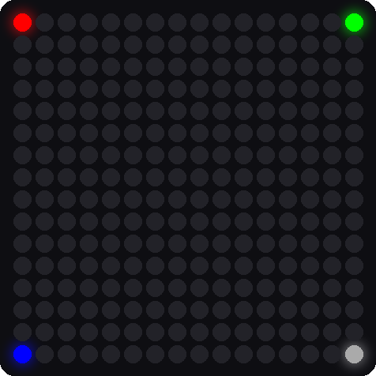

# Lab 7: X-Y Corners

!!! tip "Pixel says..."
    
    Counting from 0 to 255 is fine for a walk. To draw a picture, you want to say column 3, row 2.
    Let's write a helper that does that math. Let's light this up!

**Program file:** [`07-xy-corners.py`](https://github.com/dmccreary/moving-rainbow/blob/master/src/kits/16x16-matrix-accel/07-xy-corners.py)

## What you'll learn

- How a column (x) and a row (y) name a spot on the matrix
- How to write your own **function** with `def`
- How to turn x and y into a pixel number
- How the `%` sign finds odd and even rows

## What you'll need

- Your kit, with the matrix wired as shown in the [Kit Guide](index.md)
- `config.py` saved on the Pico
- Thonny open and connected to your Pico
- The pixel numbers picture from [Lab 6: Walk the Pixels](06-walk-pixels.md)

## The program

This program draws one pixel in each corner of the matrix. It uses a function named `xy` to turn a column and a row into a pixel number.

```python title="07-xy-corners.py"
--8<-- "src/kits/16x16-matrix-accel/07-xy-corners.py"
```

Run it. Four pixels light up, one in each corner:

- Red is in the upper-left corner.
- Green is in the upper-right corner.
- Blue is in the lower-left corner.
- White is in the lower-right corner.

```text
Test 07: X-Y Corners (version 1.0.0)
red = (0,0)  green = (15,0)  blue = (0,15)  white = (15,15)
```

{ width="320" }

*This picture was drawn by a computer simulator, so your real matrix may look a little different.*

## How it works

### Two numbers name a spot

Think of the matrix like a map. The **x** number says which column, counting from the left. The **y** number says which row, counting from the top. Both start at 0. So `(0, 0)` is the upper-left corner, and `(15, 15)` is the lower-right corner.

!!! info "Key idea"
    In a computer picture, y counts *down* from the top. That is the opposite of the graphs you draw in math class, where y counts up.

### Write a function

```python
def xy(x, y):
    # row y starts at pixel y * width; odd rows run backwards on a zig-zag panel
    if SERPENTINE and y % 2 == 1:
        return y * MATRIX_WIDTH + (MATRIX_WIDTH - 1 - x)
    return y * MATRIX_WIDTH + x
```

A **function** is a named recipe. The word `def` starts the recipe. The words in parentheses, `x` and `y`, are the **parameters**, which are the ingredients you hand to the recipe. The word `return` hands back the answer.

On this kit, `SERPENTINE` is `False`, so Python skips the `if` and runs the last line: `y * MATRIX_WIDTH + x`. That means *row number times 16, plus column number*.

Here are some worked examples:

| Call | Math | Pixel number |
|------|------|--------------|
| `xy(0, 0)` | 0 × 16 + 0 | 0 |
| `xy(15, 0)` | 0 × 16 + 15 | 15 |
| `xy(3, 2)` | 2 × 16 + 3 | 35 |
| `xy(0, 15)` | 15 × 16 + 0 | 240 |
| `xy(15, 15)` | 15 × 16 + 15 | 255 |

Check these against the pixel numbers picture in Lab 6. Pixel 35 is in row 2, column 3.

### What does `%` do?

The `%` sign gives the **remainder** after dividing. `y % 2` is the remainder when you divide the row number by 2. That is 0 for even rows and 1 for odd rows. So `y % 2 == 1` is a test for an odd row. A zig-zag panel runs its odd rows backwards, so the function flips x for those rows with `MATRIX_WIDTH - 1 - x`.

### Use the function

```python
strip[xy(0, 0)] = (60, 0, 0)
strip[xy(last_x, 0)] = (0, 60, 0)
```

The variable `last_x` holds 15, the number of the last column. Calling `xy(last_x, 0)` hands back 15, and `strip[15]` is the upper-right corner. Notice how you never write the pixel number yourself. The function does it.

## Try it yourself

1. Draw the center. Add the line `strip[xy(8, 8)] = (60, 60, 0)` before `strip.write()`. First work out the pixel number with the table above as a guide. The answer is 8 × 16 + 8 = 136.
2. Draw a diagonal line. Add these lines before `strip.write()`. What shape do you see?

    ```python
    for i in range(16):
        strip[xy(i, i)] = (0, 40, 40)
    ```

3. Predict, then test. Change `SERPENTINE = False` to `True` in `config.py` and save it on the Pico. Which corners move? Change it back when you are done.

## Check your understanding

1. In `(x, y)`, which number is the column and which is the row?
2. What pixel number does `xy(2, 3)` give? Show your math.
3. What does the word `return` do in a function?
4. What does `y % 2 == 1` ask?

!!! success "Lab complete!"
    
    You wrote your own function! Now you can draw anywhere with just two numbers.

**What's next:** In [Lab 8: Row and Column Sweep](08-row-column-sweep.md), you will use `xy` in loops to draw lines of light.
