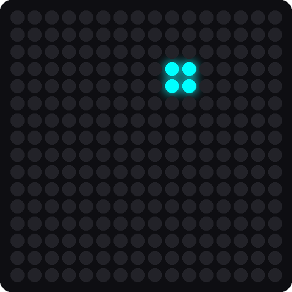

# Lab 10: Accelerometer Bubble

!!! tip "Pixel says..."
    
    Time to put the sensor in charge of the lights! Tip your kit and watch a glowing dot slide toward the low side.
    Let's light this up!

**Program file:** [`10-accel-bubble.py`](https://github.com/dmccreary/moving-rainbow/blob/master/src/kits/16x16-matrix-accel/10-accel-bubble.py)

## What you'll learn

- How to turn a tilt number into a pixel position
- How a small function does the math for both x and y
- How `FLIP_X`, `FLIP_Y`, and `SWAP_XY` fix the direction
- How nested loops draw a 2×2 dot

## What you'll need

- Your whole kit: the matrix and the accelerometer, wired as shown in the [Kit Guide](index.md)
- `config.py` saved on the Pico
- Thonny open and connected to your Pico
- The `xy` function from [Lab 7](07-xy-corners.md) and the readings from [Lab 9](09-accel-print.md)

## The program

This program draws a small blue-green dot. The dot slides toward whichever side of the kit is lowest.

```python title="10-accel-bubble.py"
--8<-- "src/kits/16x16-matrix-accel/10-accel-bubble.py"
```

Run it and tilt the kit. The 2×2 dot slides toward the low side. Hold the kit level and the dot sits near the middle.

```text
Test 10: Accelerometer Bubble (version 1.0.0)
```

{ width="320" }

*This picture was drawn by a computer simulator, so your real matrix may look a little different.*

## How it works

### Turn g into a column

```python
def to_column(g, size):
    # -1 g -> 0, 0 g -> middle, +1 g -> size - 2 (leaves room for the 2x2 dot)
    position = round((g + 1) / 2 * (size - 2))
    return max(0, min(size - 2, position))
```

The sensor gives a tilt between -1 and +1. The matrix needs a column between 0 and 14 (14 leaves room for a two-pixel-wide dot). The math in the middle stretches one range onto the other:

1. Add 1, so the tilt goes from 0 to 2.
2. Divide by 2, so it goes from 0 to 1.
3. Multiply by `size - 2`, so it goes from 0 to 14.

Here is the math for a 16-pixel-wide matrix:

| Tilt (g) | Math | Column |
|----------|------|--------|
| -1 | (-1 + 1) / 2 × 14 | 0 |
| 0 | (0 + 1) / 2 × 14 | 7 |
| 0.25 | (0.25 + 1) / 2 × 14 = 8.75 | 9 |
| 1 | (1 + 1) / 2 × 14 | 14 |

The last line, `max(0, min(size - 2, position))`, keeps the answer between 0 and 14, even if a hard shake pushes g past 1.

The same function works for the rows. We give it the tilt in y and the matrix height.

### Fix the direction

```python
FLIP_X = False
FLIP_Y = True
SWAP_XY = False
```

How you mount the sensor decides which way its x and y numbers point. These three settings turn them around so the dot slides *down* the hill. `FLIP_Y = True` makes the program use `-gy` instead of `gy`. `SWAP_XY` would trade x and y. If your dot slides the wrong way, change one of these settings and run it again.

### Draw the 2×2 dot

```python
for dx in range(2):
    for dy in range(2):
        strip[xy(col + dx, row + dy)] = (0, 40, 40)
```

This is a nested loop from Lab 8. Both `dx` and `dy` count 0, 1. So the loop colors four pixels: the one at `(col, row)` and the three next to it. Together they make a 2×2 square.

!!! info "Key idea"
    A **mapping** takes numbers from one range and stretches them onto another range. Sensors, games, and graphs all use mappings.

## Try it yourself

1. Change the color of the dot from `(0, 40, 40)` to something you like. Keep the numbers small.
2. Flip an axis. Change `FLIP_X = False` to `FLIP_X = True`. Predict what changes, then tilt the kit left and right.
3. Draw a bigger dot. A 3×3 dot needs four changes. Use `range(3)` in each of the two loops. Change `size - 2` to `size - 3` in two places inside `to_column`. Can you find all four?

## Check your understanding

1. What range of tilt numbers does the sensor give? What range of columns does the matrix need?
2. In `to_column`, what column comes out when the tilt is 0?
3. What does `FLIP_Y = True` do?
4. How many pixels light up in the dot? How does a nested loop make them?

!!! success "Lab complete!"
    
    You made lights follow gravity! That mapping idea shows up in every game you will ever play.

**What's next:** In [Lab 11: Sloshing Water](11-sloshing-water.md), the whole matrix becomes a pan of water that sloshes.
