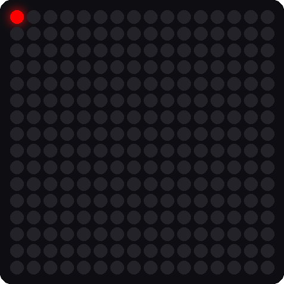
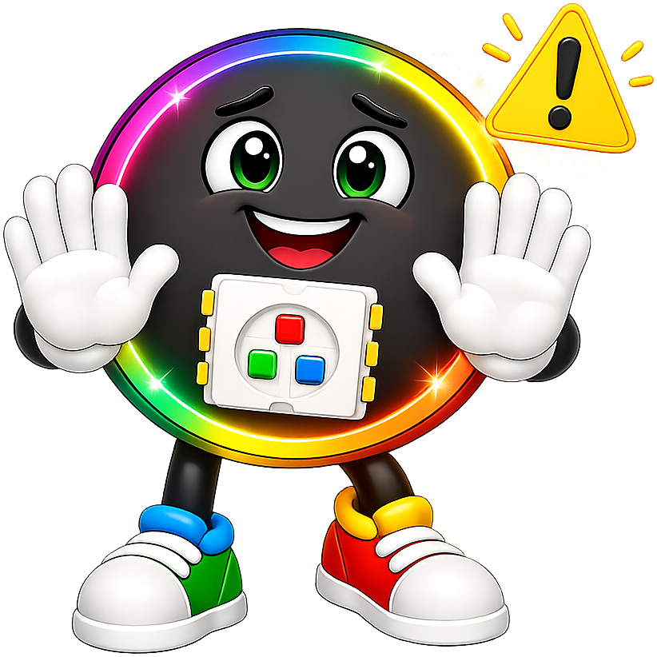

# Lab 4: First Pixel

!!! tip "Pixel says..."
    
    Now we light up the matrix! One pixel is plenty. We'll make it red, then green, then blue. Those three colors are
    the secret behind every other color. Let's light this up!

**Program file:** [`04-first-pixel.py`](https://github.com/dmccreary/moving-rainbow/blob/master/src/kits/16x16-matrixs-accel/04-first-pixel.py)

## What you'll learn

- How a color is three numbers: red, green, and blue
- How `strip[0]` picks the first pixel
- Why nothing changes until you call `strip.write()`
- How a `for` loop can go through a list of names and colors
- How to check the color order of your matrix

## What you'll need

- Your kit, with the matrix wired to GP0 as shown in the [Kit Guide](index.md#step-2-wire-the-16x16-matrix)
- `config.py` saved on the Pico
- Thonny open and connected to your Pico

## The program

This program lights pixel 0, the pixel in the upper-left corner, in red, then green, then blue. It does this over and over.

```python title="04-first-pixel.py"
--8<-- "src/kits/16x16-matrixs-accel/04-first-pixel.py"
```

Run it. The corner pixel is red for one second, then green, then blue, and then it starts again. The Shell tells you which color to expect.

```text
Test 04: First Pixel (version 1.0.0)
Pixel 0 should be red
Pixel 0 should be green
Pixel 0 should be blue
```

{ width="320" }

*This picture was drawn by a computer simulator, so your real matrix may look a little different.*

## How it works

### Make the strip object

```python
strip = NeoPixel(Pin(NEOPIXEL_PIN), NUMBER_PIXELS)
```

A **NeoPixel** is the trade name for a pixel that has its own tiny chip inside. This line tells Python about your matrix. It names the data pin, `NEOPIXEL_PIN`, which is 0. It also says how many lights there are: `NUMBER_PIXELS`, which is 256. Your matrix is one long chain of pixels, so the code calls it a **strip**.

### A color is three numbers

```python
colors = [("red", (40, 0, 0)), ("green", (0, 40, 0)), ("blue", (0, 0, 40))]
```

A **tuple** is a short group of values in parentheses. A color tuple has three numbers: **red, green, blue**, in that order. Each number goes from 0 (none) to 255 (the most). So `(40, 0, 0)` is a little red and no green or blue.

The square brackets make a **list**, which is a group of things in order. This list holds three pairs. Each pair has a name and a color.

We use 40 and not 255 to keep the light gentle on your eyes.

### Go through the list

```python
for name, color in colors:
    print("Pixel 0 should be", name)
    strip[0] = color
    strip.write()
    sleep(1)
```

A `for` loop takes one pair from the list each time around. The words `name, color` give the two halves of the pair their own names. Then the loop prints the name, sets pixel 0 to that color, and waits one second.

Look at `strip[0] = color`. The number in the brackets is the pixel's **index** (its place in the line). Computers start counting at 0, so pixel 0 is the *first* pixel.

!!! info "Key idea"
    `strip[0] = color` only writes a note in the Pico's memory. The matrix does not change until `strip.write()` sends the colors down the data wire.

!!! warning "If the colors look wrong"
    
    If the Shell says red but you see green, your pixels use a different color order. Some pixel chips want green first. Tell your teacher. They can fix it for the whole kit with one setting.

## Try it yourself

1. Mix a new color. Add `("yellow", (40, 40, 0))` to the list. Red plus green makes yellow. Predict what you will see.
2. Make white and pink. What numbers would you use? Try `(40, 40, 40)` for white.
3. Light a different pixel. Change `strip[0]` to `strip[255]`. Which corner lights up?

## Check your understanding

1. What are the three numbers in a color, and in what order?
2. Which pixel does `strip[0]` pick? Why is it called 0 and not 1?
3. What happens if you leave out `strip.write()`?
4. What is the difference between a list and a tuple in this program?

!!! success "Lab complete!"
    
    You lit your first pixel and mixed three colors. Every light show you will ever make starts with this.

**What's next:** In [Lab 5: Fill Colors](05-fill-colors.md), you will light all 256 pixels and do the safety math.
