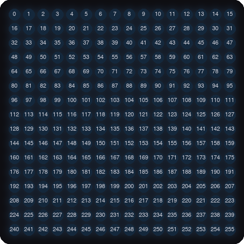

# Lab 6: Walk the Pixels

!!! tip "Pixel says..."
    
    I'm going for a walk, and I'm visiting every pixel on the matrix! Watch my path. It will tell us how
    the pixels are numbered. Let's light this up!

**Program file:** [`06-walk-pixels.py`](https://github.com/dmccreary/moving-rainbow/blob/master/src/kits/16x16-matrixs-accel/06-walk-pixels.py)

## What you'll learn

- How the 256 pixels are numbered from 0 to 255
- How `strip[i]` with a loop variable picks each pixel in turn
- How to erase a pixel in memory
- What a **zig-zag** (serpentine) panel is, and how to tell if yours is one

## What you'll need

- Your kit, with the matrix wired as shown in the [Kit Guide](index.md)
- `config.py` saved on the Pico
- Thonny open and connected to your Pico
- A quick look at [Lab 05: Move a Pixel](../../labs/05-move.md) in the base labs. It uses the same idea

## The program

This program lights one pixel at a time, in purple, starting at pixel 0 and ending at pixel 255.

```python title="06-walk-pixels.py"
--8<-- "src/kits/16x16-matrixs-accel/06-walk-pixels.py"
```

Run it. A purple pixel starts in the upper-left corner and runs along the top row from left to right. Then it jumps to the start of the second row and runs left to right again. It takes about eight seconds to visit all 256 pixels.

```text
Test 06: Walk the Pixels (version 1.0.0)
```

Here are the pixel numbers on this kit's matrix. Pixel 0 is in the upper-left corner. Each row has 16 pixels.

{ width="480" }

*This picture was drawn by a computer simulator.*

## How it works

### Let the loop pick the pixel

```python
for i in range(NUMBER_PIXELS):
    strip[i] = (40, 0, 40)
```

The variable `i` is the counter from the `for` loop. Each time around, `i` gets one bigger: 0, 1, 2, and so on up to 255. So `strip[i]` lights a different pixel each time. The color `(40, 0, 40)` is red plus blue, which makes purple.

### Write, wait, erase

```python
strip.write()
sleep(0.03)
strip[i] = (0, 0, 0)    # erased by the next write()
```

First `strip.write()` shows the pixel. Then `sleep(0.03)` holds it for three hundredths of a second. The last line turns pixel `i` off *in memory*. The matrix does not change yet. The next trip lights pixel `i + 1`. Its `strip.write()` sends the whole picture: old pixel off, new pixel on.

One write per step is a rule of this kit. The matrix needs a short quiet moment after each write. Two writes in a row can leave it too little time.

!!! info "Key idea"
    Row 0 holds pixels 0 to 15, row 1 holds 16 to 31, and so on. For a pixel in row `y` and column `x`, the number is `y * 16 + x`. You will use this in the next lab.

### What is a zig-zag panel?

Some 16x16 panels are wired in a zig-zag. Row 0 runs left to right, row 1 runs right to left, and the line keeps snaking back and forth. On those panels the pixel after 15 sits at the *right* end of row 1.

This kit's matrix has rows that all run left to right, so `SERPENTINE = False` in `config.py`. Watch your walk. If the purple pixel zig-zags instead, change `SERPENTINE` to `True` in `config.py`. Save it on the Pico and run the program again.

## Try it yourself

1. Change the speed. Set `sleep(0.03)` to `sleep(0.01)`. Time how long a trip takes. How long should it take?
2. Walk only the top row. Change `range(NUMBER_PIXELS)` to `range(16)`. Then change it to `range(16, 32)`. Which row do you see now?
3. Walk down the left edge. Change `range(NUMBER_PIXELS)` to `range(0, 256, 16)`. The third number in `range` is the step size. Why does this walk down a column?
4. Walk backwards. Use `range(255, -1, -1)`. Where does the walk begin now?

## Check your understanding

1. What is the number of the pixel in the upper-left corner? What about the lower-right corner?
2. What does `i` stand for in `strip[i]`?
3. How many pixels are in each row? Which pixel starts row 2?
4. About how long does one trip take at `sleep(0.03)`? How did you work it out?
5. What would a zig-zag panel do differently?

!!! success "Lab complete!"
    
    You mapped all 256 pixels! Knowing the numbers is the key to drawing anywhere you like.

**What's next:** In [Lab 7: X-Y Corners](07-xy-corners.md), you will write a function that finds pixel numbers.
