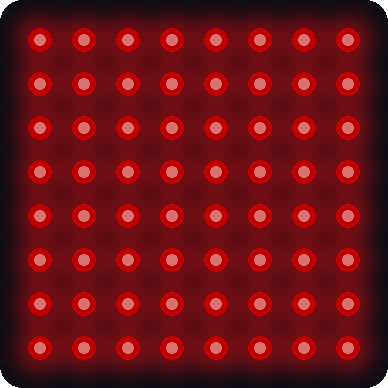

# Lab 5: Fill Colors

!!! tip "Pixel says..."
    
    One pixel is cute. 64 pixels is a party! But a big party needs big power, so we'll do some math first.
    Let's light this up!

**Program file:** [`05-fill-colors.py`](https://github.com/dmccreary/moving-rainbow/blob/master/src/kits/8x8-matrix-accel/05-fill-colors.py)

## What you'll learn

- How a `for` loop with `range` visits every pixel
- How to fill the whole matrix with one color
- How much power lit pixels use
- Why the kit has a `LEVEL` setting
- How to check that your power supply holds up

## What you'll need

- Your kit, with the matrix wired as shown in the [Kit Guide](index.md)
- `config.py` saved on the Pico
- Thonny open and connected to your Pico

## The program

This program fills the whole matrix with red, then green, then blue, then white. Each color stays for one and a half seconds.

```python title="05-fill-colors.py"
--8<-- "src/kits/8x8-matrix-accel/05-fill-colors.py"
```

Run it. The whole matrix changes color every one and a half seconds. The colors are gentle on purpose. If your Pico disconnects or the lights flicker when white appears, stop the program and read the power section below.

```text
Lab 05: Fill Colors (version 1.0.0)
Fill: red
Fill: green
Fill: blue
Fill: white
```

{ width="320" }

*This picture was drawn by a computer simulator, so your real matrix may look a little different.*

## How it works

### Read the setting

```python
LEVEL = config.LEVEL
```

`config.LEVEL` is a number in your `config.py` file. In this kit it is 20. All four colors use `LEVEL` as their biggest number, like `(LEVEL, 0, 0)` for red. If you change `LEVEL` in `config.py`, every color follows.

### Fill every pixel

```python
for i in range(NUMBER_PIXELS):
    strip[i] = color
strip.write()
```

`range(NUMBER_PIXELS)` counts from 0 up to 63. That is 64 numbers, because the last number is not included. The loop sets every pixel to the same color. Then one `strip.write()` sends all the colors at once.

### The power math

Every pixel has three tiny lights inside. Each light uses a little electricity. A **milliamp** (mA) is a small amount of electric current. One pixel at full white, `(255, 255, 255)`, uses about 60 mA. That works out to about 0.078 mA for each color number.

A **USB** (Universal Serial Bus) port gives about 500 mA. Let's check the white fill:

| Step | Math | Answer |
|------|------|--------|
| Color numbers in one white pixel | 20 + 20 + 20 | 60 |
| Color numbers in 64 pixels | 64 × 60 | 3,840 |
| Current | 3,840 × 0.078 | about 300 mA |

That is safely under the 500 mA that USB supplies. White is the biggest fill in this program, so `LEVEL = 20` leaves room to spare. Now see what full power would need:

| Step | Math | Answer |
|------|------|--------|
| Color numbers in one pixel at full white | 255 + 255 + 255 | 765 |
| Color numbers in 64 pixels | 64 × 765 | 48,960 |
| Current | 48,960 × 0.078 | about 3,800 mA, or 3.8 amps |

!!! warning "Watch out!"
    
    Never fill all 64 pixels with big numbers like 255. A USB port cannot supply 3.8 amps. The Pico may restart, or the wires and the matrix could get hot.

## Try it yourself

1. Work out on paper how many mA the **red** fill uses at `LEVEL = 20`. Use the table above as a guide. The answer is about 100 mA.
2. Work out on paper what the white fill would need if `LEVEL = 40`. Do not run it. Compare your answer with 500 mA.
3. Find the biggest safe `LEVEL`. Try 30, 33, and 35 on paper. Which is the biggest one that keeps the white fill under 500 mA?
4. Change the order of the colors in the list. Which color do you want to see first?

## Check your understanding

1. What does `range(NUMBER_PIXELS)` count from and to?
2. Why does the program use `LEVEL` and not 255?
3. Which fill uses the most power: red, green, blue, or white? Why?
4. What would happen if all 64 pixels used `(255, 255, 255)`?

!!! success "Lab complete!"
    
    You lit all 64 pixels and kept the power safe. That's math protecting your kit!

**What's next:** In [Lab 6: Walk the Pixels](06-walk-pixels.md), one pixel visits every spot to show the numbering.
