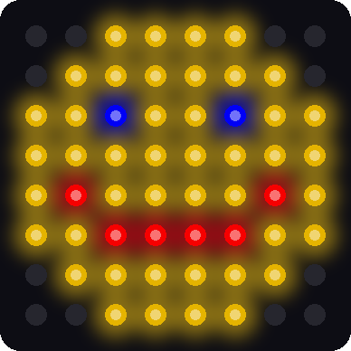
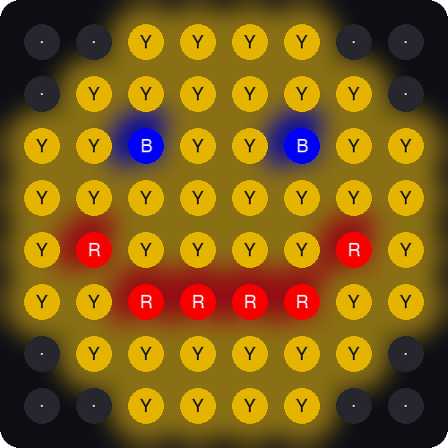

# Lab 9: Smiley Face

!!! tip "Pixel says..."
    
    You can light any pixel you like. So let's draw a face! You'll type the picture with letters,
    and your code will turn each letter into a color. Let's light this up!

**Program file:** [`09-smiley-face.py`](https://github.com/dmccreary/moving-rainbow/blob/master/src/kits/8x8-matrix-accel/09-smiley-face.py)

## What you'll learn

- How to write a picture as 8 lines of text
- How a **dictionary** works as a color key
- How two numbers in brackets pick one letter out of a picture
- How nested loops turn a whole picture into colored pixels
- How to change the picture and draw your own

## What you'll need

- Your kit, with the matrix wired as shown in the [Kit Guide](index.md)
- `config.py` saved on the Pico
- Thonny open and connected to your Pico
- The `xy` function from [Lab 7](07-xy-corners.md) and nested loops from [Lab 8](08-row-column-sweep.md)

## The program

This program draws a yellow smiley face with blue eyes and a red smile.

```python title="09-smiley-face.py"
--8<-- "src/kits/8x8-matrix-accel/09-smiley-face.py"
```

Run it. A smiley face fills the matrix and stays there. Click the red **Stop** button when you want it to end.

```text
Lab 09: Smiley Face (version 1.0.0)
```

{ width="320" }

*This picture was drawn by a computer simulator, so your real matrix may look a little different.*

## How it works

### A picture made of letters

```python
SMILEY = [
    "..YYYY..",
    ".YYYYYY.",
    "YYBYYBYY",
    "YYYYYYYY",
    "YRYYYYRY",
    "YYRRRRYY",
    ".YYYYYY.",
    "..YYYY..",
]
```

Squint at those lines. You can already see the face! A piece of text in quotes is called a **string**. This list holds 8 strings, one for each row of the matrix. Each string has 8 letters, one for each pixel in that row.

Here is the same picture with every letter sitting on its own pixel:

{ width="400" }

*This picture was drawn by a computer simulator.*

### The color key

```python
COLORS = {
    ".": (0, 0, 0),         # off
    "Y": (28, 22, 0),       # yellow
    "B": (0, 0, 32),        # blue
    "R": (32, 0, 0),        # red
}
```

A map has a key that tells you what each symbol means. This is the key for our picture. In Python it is called a **dictionary**. A dictionary holds pairs. The first half of a pair is the thing you look up, and the second half is the answer.

So `COLORS["Y"]` looks up the letter Y and hands back `(28, 22, 0)`, which is yellow. A dot hands back `(0, 0, 0)`, which means off.

### Pick one letter

```python
letter = picture[y][x]
```

This line uses two sets of brackets. The first one, `picture[y]`, picks a row, which is one string. The second one, `[x]`, picks one letter from that string. Both count from 0.

| You write | What Python does | Answer |
|-----------|------------------|--------|
| `SMILEY[2]` | Take row 2 | `"YYBYYBYY"` |
| `SMILEY[2][0]` | Take letter 0 of row 2 | `"Y"` |
| `SMILEY[2][2]` | Take letter 2 of row 2 | `"B"` |
| `SMILEY[5][3]` | Take letter 3 of row 5 | `"R"` |

### Draw the whole picture

```python
def draw(picture):
    # look at every letter and give the pixel in the same spot its color
    for y in range(MATRIX_HEIGHT):
        for x in range(MATRIX_WIDTH):
            letter = picture[y][x]
            strip[xy(x, y)] = COLORS[letter]
    strip.write()
```

This is the nested loop from Lab 8. The outer loop walks down the rows. The inner loop walks across each row. For every spot, the code reads the letter, looks up its color, and sets that pixel.

The loops touch all 64 pixels. Then one `strip.write()` sends the whole picture at once.

!!! info "Key idea"
    The picture is **data**, and `draw` is the code that reads it. To change the picture, you change the data. The code stays the same.

### How much power does a face use?

Count the letters: 44 are Y, 2 are B, and 6 are R. Add up the color numbers the same way you did in Lab 5.

| Letter | Color numbers in one pixel | Pixels | Total |
|--------|----------------------------|--------|-------|
| Y | 28 + 22 + 0 = 50 | 44 | 2,200 |
| B | 32 | 2 | 64 |
| R | 32 | 6 | 192 |
| **All** | | **52** | **2,456** |

2,456 × 0.078 is about 190 mA. That is well under the 500 mA that a **USB** (Universal Serial Bus) port supplies. Small color numbers keep a full picture safe.

## Try it yourself

1. Change the eye color. In `COLORS`, change the numbers after `"B"` to `(0, 28, 0)`. Both eyes turn green. Why did one change fix both eyes?
2. Turn the smile into a frown. Swap rows 4 and 5 of the picture so they look like this:

    ```python
        "YYRRRRYY",
        "YRYYYYRY",
    ```

3. Add a new color. Add the line `"P": (32, 6, 14),` to `COLORS` for pink. Then change a few letters in the picture to `P` to give your face rosy cheeks.
4. Draw your own picture. Replace the 8 strings with your own. Here is a heart to get you started. Every string must have exactly 8 letters.

    ```python
    SMILEY = [
        ".RR..RR.",
        "RRRRRRRR",
        "RRRRRRRR",
        "RRRRRRRR",
        ".RRRRRR.",
        "..RRRR..",
        "...RR...",
        "........",
    ]
    ```

If you see `KeyError`, you used a letter that is not in `COLORS`. That's a puzzle to solve! Add the letter to the key, or fix the typing slip. If you see `IndexError`, one of your strings has fewer than 8 letters.

## Check your understanding

1. What does a dot mean in the picture?
2. What letter does `SMILEY[2][5]` give? Count from 0.
3. What is a dictionary? What does `COLORS["R"]` hand back?
4. How many strings are in the picture? How many letters are in each string?
5. Why does `strip.write()` come after both loops and not inside them?

!!! success "Lab complete!"
    
    You drew a picture with code! Every image on every screen starts the same way: a grid of colors.

**What's next:** In [Lab 10: Picture Show](10-picture-show.md), your buttons will flip through a whole gallery of pictures.
