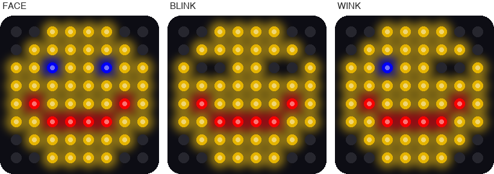

# Lab 11: Winking Face

!!! tip "Pixel says..."
    
    Our smiley has been staring at us for two labs. Let's make them blink! Show a few pictures
    one after another, and a still face comes alive. Let's light this up!

**Program file:** [`11-winking-face.py`](https://github.com/dmccreary/moving-rainbow/blob/master/src/kits/8x8-matrix-accel/11-winking-face.py)

## What you'll learn

- What an **animation** is, and what a **frame** is
- How a list of pairs can hold a picture and a time
- How a `for` loop plays the frames in order
- How the time on each frame changes the feeling of the motion
- How to make an animation of your own

## What you'll need

- Your kit, with the matrix wired as shown in the [Kit Guide](index.md)
- `config.py` saved on the Pico
- Thonny open and connected to your Pico
- The `draw` function from [Lab 9](09-smiley-face.md)

## The program

This program makes the smiley face blink both eyes, and then wink one eye, over and over.

```python title="11-winking-face.py"
--8<-- "src/kits/8x8-matrix-accel/11-winking-face.py"
```

Run it. The face looks at you for two seconds. It blinks very quickly. It looks at you again, and then it gives you a slow wink.

```text
Lab 11: Winking Face (version 1.0.0)
```

{ width="600" }

*This picture was drawn by a computer simulator, so your real matrix may look a little different.*

## How it works

### Three pictures that are almost the same

An **animation** is a set of pictures shown one after another, fast enough that they seem to move. Each picture is called a **frame**. Cartoons work this way too.

This program has three pictures: `FACE`, `BLINK`, and `WINK`. Look closely and you will find that only row 2 is different.

| Picture | Row 2 | What the eyes do |
|---------|-------|------------------|
| `FACE` | `"YYBYYBYY"` | Both eyes are open (two blue pixels) |
| `BLINK` | `"Y..YY..Y"` | Both eyes are closed (two short dark lines) |
| `WINK` | `"YYBYY..Y"` | The left eye is open and the right eye is closed |

A closed eye is drawn with two dots. Dots are dark pixels, so the eye becomes a little dark line.

### A list of frames

```python
FRAMES = [
    (FACE, 2.0),
    (BLINK, 0.15),
    (FACE, 1.5),
    (WINK, 0.5),
]
```

`FRAMES` is a list of pairs. Each pair has a picture and a number of seconds. Read it like a script for a play. Show the face for 2 seconds, blink for 0.15 seconds, and so on.

Notice that `FACE` is in the list twice. A picture can be used as many times as you like.

### Play the frames

```python
while True:
    for picture, seconds in FRAMES:
        draw(picture)
        sleep(seconds)
```

The `for` loop takes one pair at a time. The words `picture, seconds` give the two halves their own names. The loop draws the picture and then waits. When the list runs out, `while True` starts it again from the top.

How long is one trip through the list? Add up the times: 2.0 + 0.15 + 1.5 + 0.5 = 4.15 seconds.

### Time is part of the picture

A real blink is fast, so the `BLINK` frame lasts only 0.15 seconds. A wink is slow and on purpose, so the `WINK` frame lasts half a second. Change those two numbers and the same pictures tell a different story.

!!! info "Key idea"
    An animation is pictures plus time. The pictures say *what* you see, and the times say *how it feels*.

## Try it yourself

1. Make a sleepy face. Change the `BLINK` time from `0.15` to `1.0`. How does the face seem now?
2. Wink the other eye. Change row 2 of `WINK` to `"Y..YYBYY"`. Which eye closes?
3. Add a surprise. Add this picture below `WINK`, then add the line `(SURPRISE, 0.8),` at the end of `FRAMES`.

    ```python
    SURPRISE = [
        "..YYYY..",
        ".YYYYYY.",
        "YYBYYBYY",
        "YYYYYYYY",
        "YYYRRYYY",
        "YYYRRYYY",
        ".YYYYYY.",
        "..YYYY..",
    ]
    ```

4. Make a beating heart. Replace the three pictures and `FRAMES` with the code below. The small heart and the big heart take turns.

    ```python
    BIG = [
        ".RR..RR.",
        "RRRRRRRR",
        "RRRRRRRR",
        "RRRRRRRR",
        ".RRRRRR.",
        "..RRRR..",
        "...RR...",
        "........",
    ]

    SMALL = [
        "........",
        "..R..R..",
        ".RRRRRR.",
        ".RRRRRR.",
        "..RRRR..",
        "...RR...",
        "........",
        "........",
    ]

    FRAMES = [
        (BIG, 0.15),
        (SMALL, 0.15),
        (BIG, 0.15),
        (SMALL, 0.7),
    ]
    ```

## Check your understanding

1. What is a frame?
2. Which row is different in the three face pictures?
3. How long does one full trip through `FRAMES` take? Show your math.
4. What two things does each item in `FRAMES` hold?
5. What would the face look like if every frame lasted 0.05 seconds?

!!! success "Lab complete!"
    
    You made a picture move! Cartoons, video games, and movies are all frames shown in a row.

**What's next:** In [Lab 12: Scrolling Message](12-scrolling-message.md), your own words will slide across the matrix.
