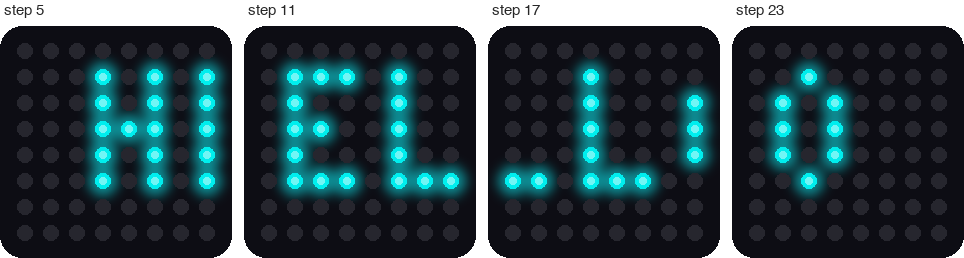

# Lab 12: Scrolling Message

!!! tip "Pixel says..."
    
    Eight pixels is too narrow for a whole word. So we'll slide the word past, one column at a time,
    like a sign in a shop window. Then you can make it say anything! Let's light this up!

**Program files:** [`12-scrolling-message.py`](https://github.com/dmccreary/moving-rainbow/blob/master/src/kits/8x8-matrix-accel/12-scrolling-message.py) and [`font.py`](https://github.com/dmccreary/moving-rainbow/blob/master/src/kits/8x8-matrix-accel/font.py)

## What you'll learn

- How every letter is a tiny picture, kept in a **font**
- How to join many small pictures into one long strip
- How a sliding **window** shows part of something bigger
- How to change the message, the color, and the speed

## What you'll need

- Your kit, with the matrix wired as shown in the [Kit Guide](index.md)
- These files saved on the Pico: `config.py`, `font.py`, and `12-scrolling-message.py`
- Thonny open and connected to your Pico
- The animation idea from [Lab 11](11-winking-face.md)

## The program

This program scrolls the words HELLO WORLD! across the matrix from right to left.

```python title="12-scrolling-message.py"
--8<-- "src/kits/8x8-matrix-accel/12-scrolling-message.py"
```

Run it. The matrix starts dark. Blue-green letters slide in from the right, cross the matrix, and leave on the left. Then the message starts again. One trip takes about seven seconds.

```text
Lab 12: Scrolling Message (version 1.0.0)
The message is 63 columns long
```

{ width="640" }

*This picture was drawn by a computer simulator, so your real matrix may look a little different.*

## How it works

### A letter is a tiny picture

A **font** is a set of pictures, one for each letter. Ours lives in the module `font.py`. Every letter is 5 pixels tall. An `X` is a lit pixel and a dot is a dark one. Here are H and I.

```python title="font.py (lines 18 to 19)"
--8<-- "src/kits/8x8-matrix-accel/font.py:18:19"
```

Each letter holds five short strings, one for each row. Stack the five strings for H and you can see it:

```text
X . X
X . X
X X X
X . X
X . X
```

Most letters are 3 pixels wide. The letter M needs 5, because it has more bumps.

### Build one long strip

The matrix shows columns, so the program turns each letter on its side. It reads down each column of the letter and makes a string of 5 letters.

| Column of H | Read from top to bottom | String |
|-------------|-------------------------|--------|
| Left | X, X, X, X, X | `"XXXXX"` |
| Middle | dot, dot, X, dot, dot | `"..X.."` |
| Right | X, X, X, X, X | `"XXXXX"` |

The function `build_columns` does this for every letter in the message. It adds one empty column after each letter, so the letters do not touch. It also puts 8 empty columns at the start and 8 at the end. Those let the message slide in from a dark matrix and slide all the way out.

Two small helpers make the function friendly. `message.upper()` turns small letters into capitals, because the font only has capitals. And `font.LETTERS.get(letter, font.LETTERS["?"])` looks up a letter. If the font does not have it, you get a question mark.

### Slide a window along the strip

{ width="700" }

*This picture was drawn by a computer simulator. It shows the strip for the shorter message HELLO.*

Here is the trick. The letters never move! The whole message is one long strip. The matrix is a **window** that shows 8 columns of it. Each step, the window moves one column to the right. To your eyes, the letters slide to the left.

```python
for start in range(len(columns) - MATRIX_WIDTH + 1):
    draw_window(columns, start)
    sleep(SCROLL_DELAY)
```

The variable `start` is the first column in the window. The strip for HELLO WORLD! has 63 columns, and the window is 8 wide. So `start` goes from 0 to 55, which is 56 steps: 63 - 8 + 1 = 56.

Each step waits 0.12 seconds. So one trip takes 56 × 0.12 = 6.72 seconds.

!!! info "Key idea"
    A small screen can show something much bigger than itself. It shows one window at a time and slides the window along. Your phone does this every time you scroll.

## Try it yourself

1. Say something new. Change `MESSAGE = "HELLO WORLD!"` to your own name. The font has capital letters, numbers, a space, and `!`, `?`, `.` and `-`.
2. Change the speed. Set `SCROLL_DELAY = 0.05`, then `SCROLL_DELAY = 0.3`. Which one is easier to read?
3. Change the color. Set `COLOR = (30, 0, 20)`. Keep the numbers small.
4. Try a letter the font does not have. Put `@` in your message. What shows up, and why?
5. Make rainbow letters. Add this list below the `COLOR` line.

    ```python
    RAINBOW = [(30, 0, 0), (30, 10, 0), (24, 20, 0), (0, 30, 0), (0, 0, 30), (16, 0, 28)]
    ```

    Then, inside `draw_window`, change the line that ends with `= COLOR` to this line. Each column of the strip keeps its own color as it slides.

    ```python
                strip[xy(x, TOP_ROW + row)] = RAINBOW[(start + x) % len(RAINBOW)]
    ```

## Check your understanding

1. How tall is every letter in the font? How wide are most letters?
2. Why does the program add empty columns at the start and the end of the strip?
3. What does `message.upper()` do, and why does the program need it?
4. A strip is 40 columns long. How many steps does one trip take? Show your math.
5. Do the letters move, or does the window move?

!!! success "Lab complete!"
    
    Your matrix can talk now! You fit a long message onto a tiny screen with one sliding window.

**What's next:** In [Lab 13: Accelerometer Print](13-accel-print.md), you will read the tilt sensor and watch the numbers change.
