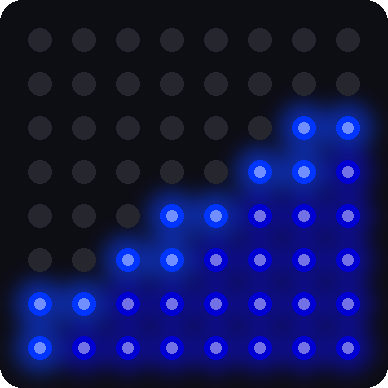

# Lab 15: Sloshing Water

!!! tip "Pixel says..."
    
    Ready for a splash? Your matrix is about to become a pan of blue water. Rock it back and forth and
    watch the water slosh! Let's light this up!

**Program files:** [`15-sloshing-water.py`](https://github.com/dmccreary/moving-rainbow/blob/master/src/kits/8x8-matrix-accel/15-sloshing-water.py) and [`sloshing_water.py`](https://github.com/dmccreary/moving-rainbow/blob/master/src/kits/8x8-matrix-accel/sloshing_water.py)

## What you'll learn

- How a **module** lets one file borrow code from another
- How to fill exactly half the pixels by sorting
- How a spring makes motion that overshoots and wobbles
- How to change settings and predict the result

## What you'll need

- Your whole kit: the matrix and the accelerometer, wired as shown in the [Kit Guide](index.md)
- These files saved on the Pico: `config.py`, `font.py`, `kit.py`, `sloshing_water.py`, and `15-sloshing-water.py`
- Thonny open and connected to your Pico
- The tilt ideas from [Lab 13](13-accel-print.md) and [Lab 14](14-accel-bubble.md)

## The program

This lab has two files. The short one, `15-sloshing-water.py`, is the one you run. It starts the module.

```python title="15-sloshing-water.py"
--8<-- "src/kits/8x8-matrix-accel/15-sloshing-water.py"
```

The real work lives in the **module** `sloshing_water.py`. You met modules in Lab 10: a module is a Python file that other programs can load with `import`. It also uses `kit.py`. This helper module sets up the matrix, the sensor, and the buttons for every program from here on. Keeping the water in its own module lets Lab 18 load it as one of its modes.

Run `15-sloshing-water.py`. Stand the kit upright, like a picture frame. The bottom half of the matrix fills with blue water. Then rock the kit slowly back and forth. The water tilts, overshoots, and sloshes before it settles.

```text
Lab 15: Sloshing Water (version 1.0.0)
```

{ width="280" }
{ width="280" }

*These pictures were drawn by a computer simulator, so your real matrix may look a little different.*

## How it works

### A pan seen from the side

Picture the matrix as a square pan, seen from the side. Half of the pixels are water. The matrix has 64 pixels, so the water always uses 32 of them: 64 ÷ 2 = 32. When you tilt the pan, the water changes shape, but the amount never changes.

### Find the deepest pixels

```python title="sloshing_water.py (lines 56 to 70)"
--8<-- "src/kits/8x8-matrix-accel/sloshing_water.py:56:70"
```

The numbers `nx` and `ny` point downhill. For each pixel, `depth` tells how far downhill it sits. Standing upright, `nx` is 0 and `ny` is 1. Then the depth is just the row number, so the bottom row is deepest.

Here is the clever part. The line `sorted(depth)` puts all 64 depths in order from smallest to biggest. The number at position 32 becomes the `cutoff`. Every pixel at or deeper than the cutoff is water. That is exactly 32 pixels, however the pan is tilted.

The tiny `nudge` number added to each depth breaks ties, so two pixels never have exactly the same depth. The pixels just below the surface get the brighter `SURFACE_COLOR`, and that makes the shiny top line.

!!! info "Key idea"
    Sorting solves the "exactly half" problem. Instead of figuring out where the line should go, the program lines up all the pixels and picks the middle.

### The water follows on a spring

```python title="sloshing_water.py (lines 99 to 102)"
--8<-- "src/kits/8x8-matrix-accel/sloshing_water.py:99:102"
```

If the water always pointed exactly downhill, it would flip instantly and look stiff. Real water is lazy. So the program uses a **spring**, like a weight hanging on a rubber band. Gravity (the `target`) is where the weight is pulled to. The water's own idea of "down" (`sx` and `sy`) is the weight on the band.

- `SPRING * (target_x - sx)` pulls the water toward the real down. A bigger `SPRING` pulls harder.
- `DAMPING * vx` is friction. It slows the motion down. A bigger `DAMPING` stops the wobble sooner.
- `vx` is the speed, and `sx` is the position. Each trip through the loop, the speed changes a little, and then the position changes a little.

With a small `DAMPING`, the water overshoots, swings back, and rings a few times. That is the slosh you see.

### What if the board is flat?

```python title="sloshing_water.py (lines 88 to 91)"
--8<-- "src/kits/8x8-matrix-accel/sloshing_water.py:88:91"
```

When the kit lies flat, there is no "downhill" along the board, so the numbers are tiny and jumpy. The check `size >= MIN_TILT` ignores tiny tilts. The water stays where it was until you tilt the board enough.

## Try it yourself

Open `sloshing_water.py` in Thonny, change a number near the top, and save it onto the Pico. Predict first!

1. Set `SPRING = 40`, then `SPRING = 200`. Which one sloshes faster?
2. Set `DAMPING = 0.5`, then `DAMPING = 8`. Which one keeps sloshing longer?
3. Change the amount of water. Set `WATER_PIXELS = NUMBER_PIXELS // 4`. How much of the pan is full now? How many pixels is that?
4. Change the water color. Find `WATER_COLOR` and `SURFACE_COLOR`. Keep the numbers small, because many pixels light at once.

## Check your understanding

1. Why does the water always light exactly 32 pixels?
2. What does `sorted(depth)` do, and why does the program use it?
3. What do `SPRING` and `DAMPING` change about the water?
4. Why does the water stay still when the kit lies flat?

!!! success "Lab complete!"
    
    You built a pan of water out of 64 lights and a sensor! That was real physics in a tiny box.

**What's next:** In [Lab 16: Tilt-a-Maze](16-tilt-a-maze.md), you will play a game that builds its own mazes.
