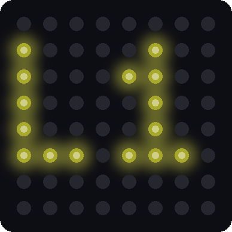
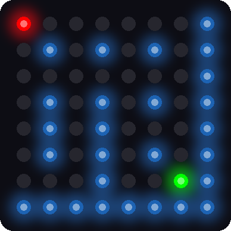
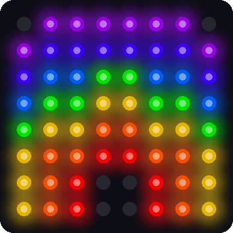
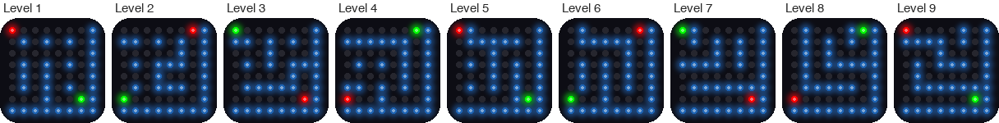
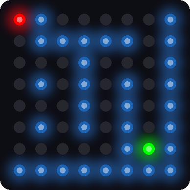
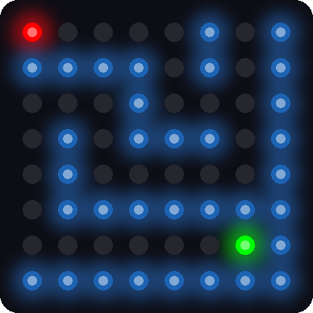

# Lab 16: Tilt-a-Maze

!!! tip "Pixel says..."
    
    It's game time! Roll the red ball through a maze of light blue walls to the green hole. There are nine
    levels, and each one is a little harder. Let's light this up!

**Program files:** [`16-tilt-a-maze.py`](https://github.com/dmccreary/moving-rainbow/blob/master/src/kits/8x8-matrix-accel/16-tilt-a-maze.py) and [`tilt_a_maze.py`](https://github.com/dmccreary/moving-rainbow/blob/master/src/kits/8x8-matrix-accel/tilt_a_maze.py)

## What you'll learn

- How a computer can build a maze with a few simple rules
- How a **seed** makes "random" numbers repeat
- How a game gets harder from level to level
- How the ball's speed depends on how far you tilt
- How the game draws the level numbers and a rainbow

## What you'll need

- Your whole kit, wired as shown in the [Kit Guide](index.md)
- These files saved on the Pico: `config.py`, `font.py`, `kit.py`, `tilt_a_maze.py`, and `16-tilt-a-maze.py`
- Thonny open and connected to your Pico
- The `xy` function from [Lab 7](07-xy-corners.md) and the tilt from [Lab 14](14-accel-bubble.md)

## The program

Like Lab 15, this lab has a short file that you run and a module with the real code.

```python title="16-tilt-a-maze.py"
--8<-- "src/kits/8x8-matrix-accel/16-tilt-a-maze.py"
```

Run `16-tilt-a-maze.py`. The matrix first shows **L1**, and then the first maze appears. Your red ball waits in the upper-left corner. The green hole waits in the opposite corner. Tilt the kit to roll the ball. A bigger tilt rolls it faster.

When the ball falls into the hole, the hole flashes green and the next level title appears. The Shell reports your score:

```text
Lab 16: Tilt-a-Maze (version 1.0.0)
Level 1
Level 1 solved in 14 moves
Level 2
```

Beat level 9 and a rainbow glows across the matrix. Then the game starts over.

{ width="240" }
{ width="240" }
{ width="240" }

*These pictures were drawn by a computer simulator, so your real matrix may look a little different.*

## How it works

### Building a maze from cells

The maze uses the matrix as a grid of **cells**. A cell is one pixel. Between two cells sits a wall pixel that is either standing or knocked down. So a 4 by 4 grid of cells fills the matrix, and cell `(cx, cy)` lives at pixel `(2 * cx, 2 * cy)`. The last column and the last row are the right and bottom walls.

Here is the recipe for a maze. A **recipe** like this is called an **algorithm**.

1. Start in the upper-left cell. Mark it as visited.
2. Look at the cells next door that you have not visited.
3. Pick one, knock down the wall between, and move there.
4. If every neighbor has been visited, back up one cell.
5. Stop when you have backed all the way to the start.

```python title="tilt_a_maze.py (lines 94 to 114)"
--8<-- "src/kits/8x8-matrix-accel/tilt_a_maze.py:94:114"
```

The list `path` remembers where you have been. The loop `while len(path) > 0` keeps going until you have backed up to the start. The line `random_number(len(options))` picks one of the open neighbors. When there are no options, `path.pop()` removes the last cell, which is the "back up" step.

This recipe visits every cell and leaves exactly one way between any two cells. Every cell can be reached, and no path runs in a circle.

### Random, but the same every time

```python title="tilt_a_maze.py (lines 79 to 82)"
--8<-- "src/kits/8x8-matrix-accel/tilt_a_maze.py:79:82"
```

A computer cannot truly pick a number at random. It follows a rule that scrambles the last number into a new one. If you start with the same first number, called the **seed**, you get the same list every time.

The game gives each level its own seed in `MAZE_SEEDS`. So level 4 is the same maze every time. The seeds were chosen so the shortest route grows as the levels go up.

### Each level is a little harder

After the recipe finishes, the game knocks down a few more walls. Those make shortcuts. Early levels get the most shortcuts, and the last two levels get none.

| Level | Shortcuts | Shortest route (steps) |
|-------|-----------|------------------------|
| 1 | 6 | 12 |
| 2 | 4 | 12 |
| 3 | 3 | 16 |
| 4 | 2 | 16 |
| 5 | 2 | 20 |
| 6 | 1 | 20 |
| 7 | 1 | 24 |
| 8 | 0 | 24 |
| 9 | 0 | 28 |

Here are all nine mazes. The red ball starts in a different corner each level, and the green hole is always in the opposite corner.

{ width="700" }

Compare a middle level with the last one. Level 5 still has two shortcuts. Level 9 has only one way through.

{ width="240" }
{ width="240" }

*These pictures were drawn by a computer simulator.*

After a level, the Shell shows how many moves *you* used. Level 1's shortest route is 12 steps. If the Shell says `Level 1 solved in 12 moves`, you took the perfect path!

### A tilt rolls the ball

```python title="tilt_a_maze.py (lines 163 to 166)"
--8<-- "src/kits/8x8-matrix-accel/tilt_a_maze.py:163:166"
```

The variable `size` is the strongest tilt. A tilt smaller than `TILT_MIN` does nothing. A bigger tilt makes `speed` go from 0 up to 1. The `interval` is how long the ball waits before its next step, in milliseconds. It is 260 for a gentle tilt and 90 for a big one.

For example, a tilt of 0.525 is halfway between `TILT_MIN` (0.25) and `TILT_FULL` (0.8). That gives a `speed` of 0.5, so `interval` is 260 − (260 − 90) × 0.5 = 175 milliseconds.

!!! info "Key idea"
    A game is a loop that reads the player, updates the world, and draws the picture. This one can do it up to a hundred times a second.

### Titles and the rainbow

The level title is drawn with the tiny pixel font from [Lab 12](12-scrolling-message.md). Each letter is 3 pixels wide and 5 pixels tall, so two of them fit across the matrix. The rainbow is a set of seven rings. Each pixel finds its distance from the bottom-middle of the matrix. That distance picks its color.

## Try it yourself

Open `tilt_a_maze.py` in Thonny, change a number near the top, and save it onto the Pico.

1. Play a shorter game. Set `LAST_LEVEL = 3`. Then you can see the rainbow quickly.
2. Make the ball faster. Lower `STEP_FAST_MS` from 90 to 50. Is the game easier or harder?
3. Get a perfect score. Play level 1 and try to match the shortest route of 12 moves.
4. Change a color. Set `BALL_COLOR = (40, 40, 0)`. Keep the numbers small.

## Check your understanding

1. What is an algorithm? Which algorithm builds the maze?
2. What is a seed, and why does the same seed make the same maze?
3. How does the game make level 9 harder than level 1?
4. What happens to the ball's speed when you tilt farther?
5. Why does the Shell print your number of moves after each level?

!!! success "Lab complete!"
    
    You played a game that builds its own mazes! Algorithms like this one make real video games.

**What's next:** In [Lab 17: Tilt-a-Sketch](17-tilt-a-sketch.md), the tilt becomes your pen, and you draw your own pictures.
