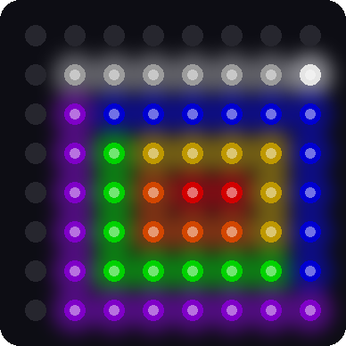

# Lab 17: Tilt-a-Sketch

!!! tip "Pixel says..."
    
    You've drawn pictures by typing letters. Now let's draw by tilting! A blinking dot is your pen.
    Tip the kit and it rolls, leaving a trail of color behind. Let's light this up!

**Program file:** [`17-tilt-a-sketch.py`](https://github.com/dmccreary/moving-rainbow/blob/master/src/kits/8x8-matrix-accel/17-tilt-a-sketch.py)

## What you'll learn

- How a list can remember a whole picture while you draw it
- How a few variables hold the **state** of the pen
- How the word `not` flips `True` to `False` and back
- How to spot a shake with the tilt sensor
- How to draw in layers: the picture first, then the pen on top

## What you'll need

- Your whole kit: the matrix, the accelerometer, and both buttons, wired as shown in the [Kit Guide](index.md)
- These files saved on the Pico: `config.py`, `font.py`, `kit.py`, and `17-tilt-a-sketch.py`
- Thonny open and connected to your Pico
- The rolling ball from [Lab 16](16-tilt-a-maze.md) and the pictures from [Lab 9](09-smiley-face.md)

## The program

This program turns the kit into a drawing toy. You tilt to move the pen, and the pen paints every pixel it rolls over.

```python title="17-tilt-a-sketch.py"
--8<-- "src/kits/8x8-matrix-accel/17-tilt-a-sketch.py"
```

Run it and hold the kit flat. A red dot blinks near the middle. Tip the kit a little and the dot rolls toward the low side, leaving a red line. Hold the kit level to stop.

| To do this | Do this |
|------------|---------|
| Move the pen | Tilt the kit. A bigger tilt moves it faster |
| Change the pen color | Press Button 1 |
| Lift the pen, or put it back down | Press Button 2 |
| Erase the whole picture | Shake the kit hard |

When the pen is lifted, it blinks white and does not paint. That is how you move to a new spot without leaving a line. The Shell tells you what is happening:

```text
Lab 17: Tilt-a-Sketch (version 1.0.0)
Button 1: next color. Button 2: pen up or down. Shake: erase.
Pen color: red
Pen color: orange
Pen up
Pen down
Shake! The picture is erased.
```

{ width="320" }

*This picture was drawn by a computer simulator. A script tilted a pretend kit to draw the spiral, so your real drawing will look different.*

## How it works

### A list that remembers the picture

```python title="17-tilt-a-sketch.py (lines 43 to 53)"
--8<-- "src/kits/8x8-matrix-accel/17-tilt-a-sketch.py:43:53"
```

The list `canvas` holds 64 colors, one for every pixel. It starts with every spot set to off. When the pen rolls over a spot, the program stores the pen's color there. A real **canvas** is the cloth a painter paints on.

Why not paint straight onto the matrix? Because the pen blinks. The blinking pen would wipe out the pixel under it. So the picture stays safe in `canvas`, and the matrix is redrawn from it each time something changes.

The four variables after it are the **state** of the pen. State means everything the program must remember right now. That is where the pen is, whether it is down, and which color it holds.

The function `spot(x, y)` turns a column and a row into a place in the list. It uses the same math as `xy` from Lab 7: row times 8, plus column.

### Draw in layers

```python title="17-tilt-a-sketch.py (lines 59 to 71)"
--8<-- "src/kits/8x8-matrix-accel/17-tilt-a-sketch.py:59:71"
```

The function `show` draws in two layers. First the nested loop copies the whole `canvas` to the matrix. Then the pen is drawn on top.

The pen blinks so that you can find it. When the pen is down, it flips between a bright copy of its color and off. When the pen is up, it flips between white and the picture underneath.

### Buttons change the state

```python title="17-tilt-a-sketch.py (lines 104 to 109)"
--8<-- "src/kits/8x8-matrix-accel/17-tilt-a-sketch.py:104:109"
```

Look at the line `pen_down = not pen_down`. The word `not` flips a value. If `pen_down` was `True`, it becomes `False`. If it was `False`, it becomes `True`. One button can switch something on and off this way.

Button 1 works like the picture show in Lab 10. It adds 1 to `color_number` and uses `%` to wrap around after the last color.

### Shake to erase

```python title="17-tilt-a-sketch.py (lines 116 to 124)"
--8<-- "src/kits/8x8-matrix-accel/17-tilt-a-sketch.py:116:124"
```

The numbers `gx` and `gy` are the pull along the board, left to right and top to bottom. The `if` line joins them into one number: the total pull along the board. It squares each one, adds them, and takes the square root. The `** 0.5` part is the square root.

Gravity alone can never pull harder than about 1 g. A shake can. So if the total goes above `SHAKE_G`, which is 1.7, the program knows you shook the kit.

Here is one example. A shake gives `gx` = 1.5 and `gy` = 1.0.

| Step | Math | Answer |
|------|------|--------|
| Square each one | 1.5 × 1.5 and 1.0 × 1.0 | 2.25 and 1.00 |
| Add them | 2.25 + 1.00 | 3.25 |
| Take the square root | the square root of 3.25 | about 1.80 |

1.80 is bigger than 1.7, so the picture is erased. The loop sets every spot in `canvas` back to off.

### Stay on the matrix

```python title="17-tilt-a-sketch.py (lines 139 to 146)"
--8<-- "src/kits/8x8-matrix-accel/17-tilt-a-sketch.py:139:146"
```

The pen takes one step at a time, the same way the ball did in the maze. Before it moves, this check makes sure the new spot is on the matrix. Columns and rows both go from 0 to 7. If the new spot would be off the edge, the pen stays where it is.

!!! info "Key idea"
    A drawing program keeps two things apart: the picture it remembers and the picture it shows. The pen, the blinking, and the erasing all change what is shown without losing what is remembered.

## Try it yourself

1. Draw the first letter of your name. Use Button 2 to lift the pen between lines.
2. Add a pen color. Add the line `("pink", (24, 4, 12)),` to the `PEN_COLORS` list. How many presses of Button 1 does it take to reach pink?
3. Start in a corner. Change `pen_x = kit.WIDTH // 2` to `pen_x = 0`, and do the same for `pen_y`. Where does the pen start now?
4. Make the pen slower. Raise `STEP_FAST_MS` from 140 to 300. Is it easier to draw neat lines?
5. Change the shake. Set `SHAKE_G = 1.2`. Draw something, then stand the kit up on its edge and tap it. What happens? Why is 1.7 a safer number?

## Check your understanding

1. What does the list `canvas` remember? How many items does it hold?
2. What does the word `not` do to `pen_down`?
3. Why can a slow tilt never erase the picture?
4. The pen is at column 7 and you tilt to the right. What does the pen do, and which line of code decides that?
5. Why does the program draw the pen *after* it draws the canvas?

!!! success "Lab complete!"
    
    You built your own drawing toy! You are the artist now, and gravity is your paintbrush.

**What's next:** In [Lab 18: Modes](18-modes.md), you will load twelve light shows from one menu with your two buttons.
