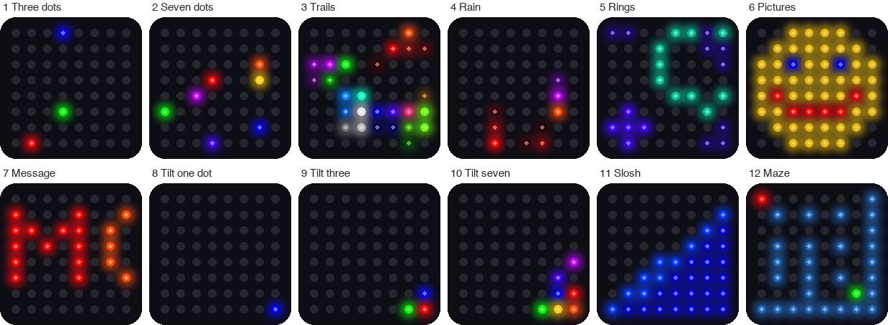

# Lab 18: Modes

!!! tip "Pixel says..."
    
    Now we put it all together! One program, twelve light shows, and two buttons to switch between them.
    Let's light this up!

**Program file:** [`18-modes.py`](https://github.com/dmccreary/moving-rainbow/blob/master/src/kits/8x8-matrix-accel/18-modes.py)

## What you'll learn

- How one program can load other programs only when it needs them
- How a list of settings picks what each mode does
- How `try` and `except` catch a button press and change modes
- Why the Pico's memory matters
- How to add a mode of your own

## What you'll need

- Your whole kit: the matrix, the accelerometer, and both buttons, wired as shown in the [Kit Guide](index.md)
- **Every** `.py` file from the kit folder saved on the Pico. The quickest way is `./upload-code.sh` (see [Get the Code onto the Pico](index.md#get-the-code-onto-the-pico))
- Thonny open and connected to your Pico
- Ideas from [Lab 3: Button Test](03-button-test.md), [Lab 10](10-picture-show.md), [Lab 15](15-sloshing-water.md), and [Lab 16](16-tilt-a-maze.md)

## The program

This program is the mode machine. Button 1 (GP14) loads the next mode. Button 2 (GP15) loads the previous one. When a mode starts, the matrix shows the mode number for a moment.

```python title="18-modes.py"
--8<-- "src/kits/8x8-matrix-accel/18-modes.py"
```

Run it. You should see a **1** on the matrix, then three slow dots bouncing. Press Button 1 to move on. Each press loads the next mode.

```text
Lab 18: Modes (version 1.0.0)
Mode 1 - Three dots (module bounce_dots)
  RAM free: 209264 bytes
Mode 2 - Seven dots (module bounce_dots)
```

The `RAM free` number depends on your Pico. Here are the twelve modes:

{ width="700" }

*This picture was drawn by a computer simulator, so your real matrix may look a little different.*

| Mode | Show | Uses the tilt? |
|------|------|----------------|
| 1 | Three slow bouncing dots (red, green, blue) | No |
| 2 | Seven faster dots, one for each color of the rainbow | No |
| 3 | Twelve colors that leave small trails | No |
| 4 | Rainbow rain | No |
| 5 | Ripple rings | No |
| 6 | Picture show: the gallery from Lab 10 slides past | No |
| 7 | A scrolling message in rainbow letters | No |
| 8 | One blue dot that rolls as you tilt | Yes |
| 9 | Three dots that roll and bounce off each other | Yes |
| 10 | Seven rainbow dots that roll and bounce off each other | Yes |
| 11 | Sloshing water (Lab 15) | Yes |
| 12 | Tilt-a-maze (Lab 16) | Yes |

## How it works

### One module for each show

Each show lives in its own **module**. A module is a Python file that other programs can load. Some modules do double duty:

| Module | Used by |
|--------|---------|
| `kit.py` | Every mode: sets up the matrix, sensor, and buttons |
| `bounce_dots.py` | Modes 1, 2, and 3 |
| `rain.py` | Mode 4 |
| `rings.py` | Mode 5 |
| `picture_show.py` | Mode 6 (with the pictures from `pictures.py`) |
| `scroll_text.py` | Mode 7 (with the letters from `font.py`) |
| `tilt_balls.py` | Modes 8, 9, and 10 |
| `sloshing_water.py` | Mode 11 (and Lab 15) |
| `tilt_a_maze.py` | Mode 12 (and Lab 16) |

Modes 1, 2, and 3 all use `bounce_dots`, but they act differently. The difference comes from the settings.

### A list of modes

```python title="18-modes.py (lines 36 to 57)"
--8<-- "src/kits/8x8-matrix-accel/18-modes.py:36:57"
```

`MODES` is a list. Each item has three parts: a name, the module to load, and the **settings** to give that module. The settings are a **dictionary**, like the color key in Lab 9. It is a set of labels with values, written in curly braces. For mode 1, the dictionary says `"speed": 2.5`. For mode 2, it says `"speed": 4`. The `bounce_dots` module reads these settings and acts differently each time.

Items with `None` have no settings. They do not need any.

### Load a mode only when you need it

```python title="18-modes.py (lines 69 to 87)"
--8<-- "src/kits/8x8-matrix-accel/18-modes.py:69:87"
```

The loop picks the current item from the list: `name, module_name, settings = MODES[mode]`. Then `__import__(module_name)` loads that module right now, from its name. The line `module.run(settings)` starts the show.

When you leave a mode, `unload` deletes the module from Python's list of loaded modules. `gc.collect()` is the **garbage collector**. It frees the memory that nothing uses anymore. A Pico has only about 230 thousand bytes of memory, called **RAM** (random access memory). Loading one mode at a time keeps plenty free. The `RAM free` line in the Shell shows you.

The last line, `mode = (mode + step) % len(MODES)`, moves to the next mode. The `%` sign gives the remainder, so after mode 12 the count wraps back to mode 1. Button 2 gives a `step` of -1, so mode 1 wraps back to mode 12.

### How a button stops a show

A show runs in a loop that never ends. How can a button press get out? The shows use `kit.wait` instead of `sleep`. Here is the code from `kit.py`:

```python title="kit.py (lines 81 to 84)"
--8<-- "src/kits/8x8-matrix-accel/kit.py:81:84"
```

```python title="kit.py (lines 111 to 118)"
--8<-- "src/kits/8x8-matrix-accel/kit.py:111:118"
```

The `wait` function sleeps in 10 millisecond pieces. After each piece it calls `check()`, which looks at both buttons. If one was just pressed, `check()` **raises** a `ModeChange`. An **exception** is Python's way of shouting, stop what you are doing! The shout travels out of the show. The `except kit.ModeChange` line in `18-modes.py` catches it. That line reads the `step` from the exception: 1 for Button 1 and -1 for Button 2. Then the loop starts the next mode.

!!! info "Key idea"
    A program can be built from parts that you swap in and out. With separate modules, a new show needs one new file and one new line in a list.

## Try it yourself

1. Visit all twelve modes with Button 1. Then press Button 2 on mode 1. Which mode comes up?
2. Tilt the kit during modes 1 to 7. Does anything change? Try again in modes 8 to 10. Why?
3. Change the message. In `MODES`, find `"text": "MOVING RAINBOW!"` and put in your own words. Use capital letters.
4. Add a mode of your own. Create a new file named `color_cycle.py`, save it on the Pico, and add one line to `MODES`.

    ```python
    # color_cycle.py: fills the matrix with one color at a time
    import kit

    def run(settings):
        index = 0
        while True:
            # dim the color, because all 64 pixels light at once
            color = kit.dim(kit.RAINBOW[index], 0.4)
            for i in range(kit.NUMBER_PIXELS):
                kit.strip[i] = color
            kit.strip.write()
            index = (index + 1) % len(kit.RAINBOW)
            kit.wait(700)
    ```

    Then add this line at the end of the `MODES` list in `18-modes.py`, right before the closing `]`:

    ```python
        ("Color cycle", "color_cycle", None),
    ```

    Run `18-modes.py` and press Button 2 on mode 1 to jump to your new mode 13.

## Check your understanding

1. What is a module? Name two modules from this kit.
2. How do modes 1, 2, and 3 use the same module but look different?
3. What does `__import__(module_name)` do?
4. What happens when you press a button during a show?
5. Why does the program unload a mode when you leave it?

!!! success "Kit complete!"
    
    You wired a kit, drew pictures, and built a program that loads twelve shows! You are a real light-maker now.

**What's next:** Make your own mode, or head to the [Hands on Labs](../../labs/index.md) to learn more patterns for LED strips.
