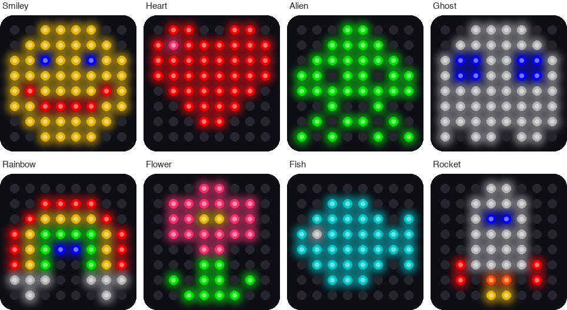
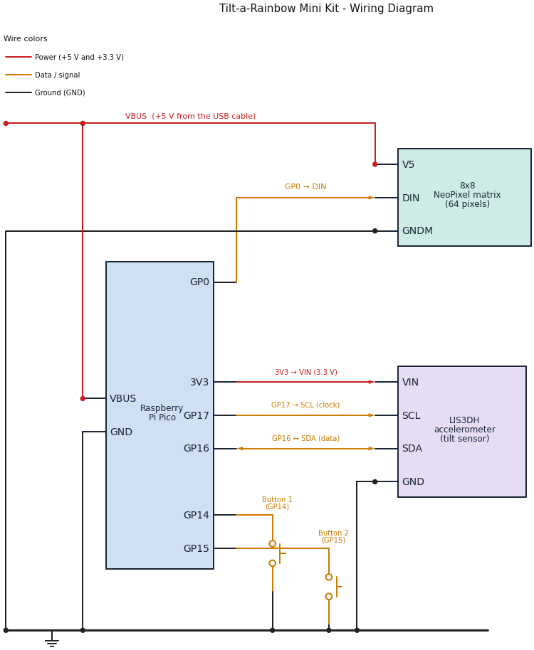
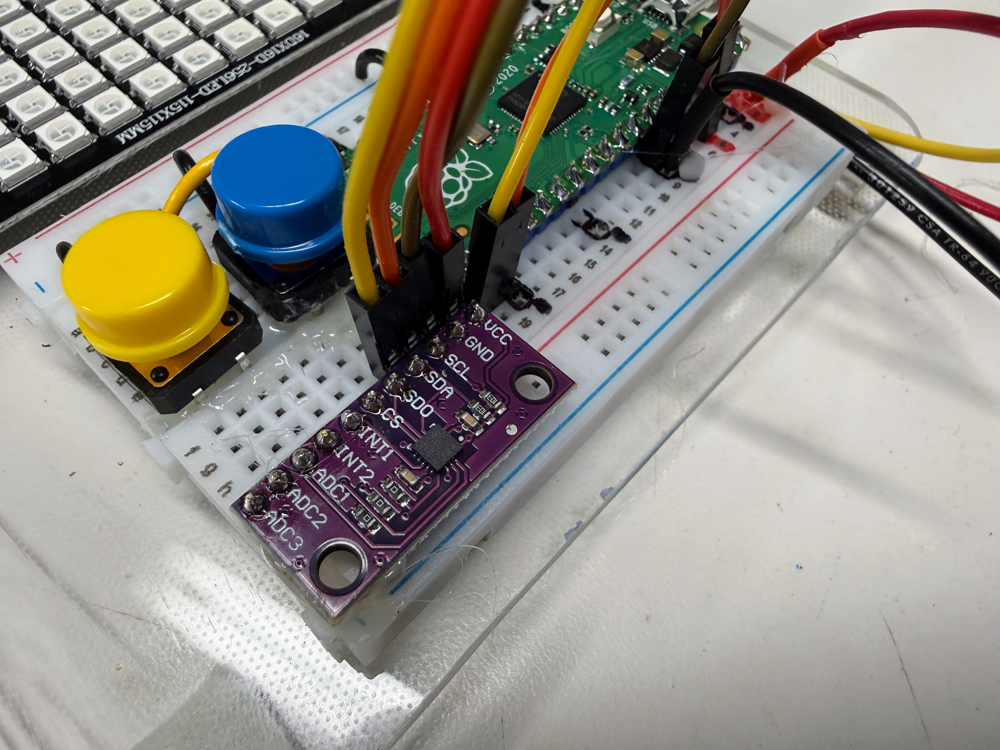

# Tilt-a-Rainbow Mini Kit

{ width="640" }

{ width="640" }

*These pictures were drawn by a computer simulator, so the lights on your real kit may look a little different.*

!!! tip "Pixel says..."
    
    Welcome, light-maker! This kit has 64 lights and a sensor that feels which way is down.
    You'll draw faces, scroll your name, and roll lights by tilting. Let's light this up!

This kit is the little sibling of the [Tilt-a-Rainbow Kit](../16x16-matrix-accel/index.md).
It uses the same Pico, the same sensor, and the same buttons, with a smaller matrix.
A small matrix is perfect for drawing, so this kit adds five drawing labs.

## What you'll learn

After this guide you will be able to:

1. Wire a light matrix, a tilt sensor, and two buttons to a Raspberry Pi Pico.
2. Test each part by itself before you put them together.
3. Turn a row and a column into a pixel number.
4. Draw pictures, animations, and scrolling words.
5. Read the tilt sensor and use it to move lights.
6. Run twelve different light shows from one program.

## What you'll need

- The kit parts in the table below
- A computer with [Thonny](../../getting-started/desktop-setup.md) installed
- A USB **data** cable (see the warning below)
- About 90 minutes for the first few labs

## Kit Contents

Check each part off before you start.

| Part | Approximate Cost | What it does |
|------|------------------|--------------|
| Raspberry Pi Pico | $4.00 | The small computer that runs your code |
| 8x8 NeoPixel matrix | $4.00 | 64 lights in 8 rows and 8 columns. Each light is a **pixel** |
| LIS3DH accelerometer | $5.00 | A sensor that feels tilt and movement |
| Push buttons (QTY=2) | $0.50 | Buttons you press to change pictures and modes |
| Breadboard and jumper wires | $3.50 | Connect the parts with no soldering. Your kit may use a different kind of wire |
| Micro USB cable | $2.50 | Carries your code and the power |
| **Total cost** | **$19.50** | |

*These are single-kit estimates from October 2026. Prices change, and buying parts in packs costs less.*

!!! warning "Check your USB cable"
    
    Make sure your cable is a **data cable**, not a charge-only cable. A charge-only cable
    powers the Pico, but your computer cannot see it. That looks exactly like a broken Pico.

## What Is an Accelerometer?

An **accelerometer** is a sensor that measures how fast something speeds up or slows down.
It also feels the pull of gravity, which is always pulling toward the ground.

Think of a tiny ball inside a box. Tip the box, and the ball rolls toward the low side.
The accelerometer works like that ball. It tells your code which way is down.

The sensor reports its answer in a unit called **g**. One g is the pull of Earth's gravity.
When the kit lies flat, the sensor reads about 1 g straight down. When the kit stands on its edge,
the same 1 g shows up along a different direction. Your code reads those numbers and moves the lights.

## How the Parts Connect



Follow the colors: **red** wires carry *power*, **amber** wires carry *data and button signals*,
and **black** wires are *ground*. A dot means two wires are joined. Wires that cross with no dot
are *not* joined.

Do these steps in order. Never wire a Pico that has the USB cable plugged in.

### Step 1: Place the Pico

1. Unplug the USB cable from the Pico.
2. Push the Pico into the breadboard with the **USB connector at the top**.
3. Check that the pins on both sides sit in different breadboard rows, so no two pins touch.

With the USB connector at the top, the pin in the top-left corner is pin 1, called **GP0**.
Each pin has a number and a name. The names that start with **GP** are *general purpose pins*
(pins your code can control). The numbers count down the left side, then up the right side.

### Step 2: Wire the 8x8 matrix

The matrix has three wires. Connect them in this order: **ground first, then power, then data.**

1. Connect the matrix **GND** (ground) wire to any `GND` pin on the Pico. Pin 38 works well.
2. Connect the matrix **5V** (power) wire to `VBUS`, which is pin 40. This is the 5 volts that comes from the USB cable. Some panels print +5V or VCC.
3. Connect the matrix **DIN** (data in) wire to `GP0`, which is pin 1.

| Matrix wire | Goes to | Pico pin |
|-------------|---------|----------|
| GND (ground) | Any `GND` pin | Pin 38 works well |
| 5V (power) | `VBUS` | Pin 40 |
| DIN (data in) | `GP0` | Pin 1 |

!!! warning "Watch out!"
    
    A matrix has an input end and an output end. Look for the letters **DIN** (data in) and **DOUT**
    (data out), or for small arrows. Wire the Pico to DIN. A matrix wired to DOUT stays dark,
    and the wiring looks perfect the whole time.

### Step 3: Wire the LIS3DH accelerometer

{ width="560" }

*This photo shows the same sensor and buttons on the bigger Tilt-a-Rainbow Kit. Your wiring is the same.*

The accelerometer talks to the Pico over two wires. This way of talking is called **I2C**
(say "eye-squared-see"). One wire is **SDA**, the data wire. The other is **SCL**, the
clock wire that keeps both sides in step.

1. Connect the accelerometer **VIN** (power in) pin to `3V3 (OUT)`, which is pin 36. Some boards print VCC instead of VIN. They mean the same thing.
2. Connect the accelerometer **GND** pin to any `GND` pin. Pin 23 is right next to the other wires.
3. Connect the accelerometer **SCL** pin to `GP17`, which is pin 22. Some boards print SCK instead of SCL.
4. Connect the accelerometer **SDA** pin to `GP16`, which is pin 21.

| Accelerometer pin | Pico pin | Pico name | What it does |
|-------------------|----------|-----------|--------------|
| VIN (or VCC) | Pin 36 | `3V3 (OUT)` | Power in, 3.3 volts |
| GND | Pin 23 | `GND` | Ground |
| SCL (or SCK) | Pin 22 | `GP17` | Clock |
| SDA | Pin 21 | `GP16` | Data |

!!! warning "Use 3.3 volts for the sensor"
    
    Connect the accelerometer to `3V3 (OUT)`, never to `VBUS`. Many sensor boards can be damaged by 5 volts.
    Only the matrix uses the 5 volt `VBUS` pin.

### Step 4: Wire the two buttons

Push each button into the breadboard so its legs **straddle the center channel**, the groove down the middle.
Each button needs two wires.

1. Connect one side of **Button 1** to `GP14`, which is pin 19.
2. Connect the other side of Button 1 to the ground rail.
3. Connect one side of **Button 2** to `GP15`, which is pin 20.
4. Connect the other side of Button 2 to the ground rail.

| Button | One side goes to | The other side goes to |
|--------|------------------|------------------------|
| Button 1 | `GP14` (pin 19) | The ground rail |
| Button 2 | `GP15` (pin 20) | The ground rail |

You do not need resistors. The Pico has **internal pull-up resistors**. These tiny resistors inside the chip
hold a pin at 3.3 volts until something pulls it down. So a pin reads **1** when the button is up
and **0** when you press it. Pressed means zero!

These buttons have four legs, in two joined pairs. Wire across the button, from one corner to the opposite corner,
and you will always be on the right pair.

## The Pin Map

Every program in this kit reads its pin numbers from one file called `config.py`.

```python title="config.py"
--8<-- "src/kits/8x8-matrix-accel/config.py"
```

Because every program starts with `import config`, you never have to remember pin numbers.
You write `config.NEOPIXEL_PIN` and the right number fills in. If your wiring is different,
change the number in this one file and every program follows along.

## Get the Code onto the Pico

**Uploading** means copying files from your computer onto the Pico. The Pico keeps them even after you unplug it.

The quickest way uses a helper program named `mpremote`. A grown-up helper can run this command from the kit's folder:

```bash
# copy every program in this folder onto the Pico
./upload-code.sh
```

It should say `Uploading 30 file(s) to Pico...` and end with a list of files.

You can also copy files one at a time with Thonny. Open a file, choose **File > Save as**, pick
**Raspberry Pi Pico**, and keep the same file name. You do not need all 30 files for the first labs:

| Labs | Files the Pico needs |
|------|----------------------|
| Lab 1 | Only the lab file itself |
| Labs 2 to 9, 11, 13 and 14 | `config.py`, plus the lab file |
| Lab 10 | `config.py`, `pictures.py`, plus the lab file |
| Lab 12 | `config.py`, `font.py`, plus the lab file |
| Labs 15 and 16 | `config.py`, `font.py`, `kit.py`, the lab file, and its module (`sloshing_water.py` or `tilt_a_maze.py`) |
| Lab 17 | `config.py`, `font.py`, `kit.py`, plus the lab file |
| Lab 18 | Everything: all 30 files |

## Your Labs

Do the labs in order. Each one tests one idea, and the first few test your wiring.
If something breaks later, you already know which parts work.

| Lab | Program | What you do |
|-----|---------|-------------|
| [Lab 1: Blink the Onboard LED](./01-blink-onboard-led.md) | `01-blink-onboard-led.py` | Check that Python runs on your Pico |
| [Lab 2: Hardware Probe](./02-probe.md) | `02-probe.py` | Test your wiring, your buttons, and the sensor |
| [Lab 3: Button Test](./03-button-test.md) | `03-button-test.py` | See your two buttons work |
| [Lab 4: First Pixel](./04-first-pixel.md) | `04-first-pixel.py` | Light one pixel red, green, and blue |
| [Lab 5: Fill Colors](./05-fill-colors.md) | `05-fill-colors.py` | Light all 64 pixels safely |
| [Lab 6: Walk the Pixels](./06-walk-pixels.md) | `06-walk-pixels.py` | Watch one pixel visit all 64 spots |
| [Lab 7: X-Y Corners](./07-xy-corners.md) | `07-xy-corners.py` | Turn a column and a row into a pixel number |
| [Lab 8: Row and Column Sweep](./08-row-column-sweep.md) | `08-row-column-sweep.py` | Sweep lines of light across the matrix |
| [Lab 9: Smiley Face](./09-smiley-face.md) | `09-smiley-face.py` | Draw a picture from 8 lines of letters |
| [Lab 10: Picture Show](./10-picture-show.md) | `10-picture-show.py` | Flip through eight pictures with your buttons |
| [Lab 11: Winking Face](./11-winking-face.md) | `11-winking-face.py` | Make a picture move with frames |
| [Lab 12: Scrolling Message](./12-scrolling-message.md) | `12-scrolling-message.py` | Slide your own words across the matrix |
| [Lab 13: Accelerometer Print](./13-accel-print.md) | `13-accel-print.py` | Read the tilt sensor |
| [Lab 14: Accelerometer Bubble](./14-accel-bubble.md) | `14-accel-bubble.py` | Slide a dot by tilting the kit |
| [Lab 15: Sloshing Water](./15-sloshing-water.md) | `15-sloshing-water.py` | Make a pan of water that sloshes |
| [Lab 16: Tilt-a-Maze](./16-tilt-a-maze.md) | `16-tilt-a-maze.py` | Roll a ball through nine mazes |
| [Lab 17: Tilt-a-Sketch](./17-tilt-a-sketch.md) | `17-tilt-a-sketch.py` | Draw your own picture by tilting |
| [Lab 18: Modes](./18-modes.md) | `18-modes.py` | Switch between twelve light shows with your buttons |

## Power Safety

A USB port can supply about 500 milliamps (mA). One pixel at full white uses about 60 mA.
All 64 pixels at full white would need about 3,800 mA, which is 3.8 amps. That is far too much for USB.

So the programs in this kit keep the color numbers small. `LEVEL = 20` in `config.py` is the
color number the programs use when all 64 pixels light at once. Labs that light only a few pixels can use bigger numbers.
Lab 5 shows you the math.

## Troubleshooting

| What you see | What to try |
|--------------|-------------|
| Thonny cannot find the Pico | Try a different USB cable. Use a data cable, not a charge-only cable |
| `ImportError: no module named 'config'` | Save `config.py` onto the Pico (see **Get the Code onto the Pico**) |
| `ImportError` naming `pictures`, `font` or `kit` | Save that file onto the Pico too. The table above lists what each lab needs |
| The matrix stays dark | Check that the data wire goes to DIN, not DOUT. Check the 5 volt and ground wires |
| Colors come out in the wrong order | Run Lab 4. See the note there about color order |
| A picture looks scrambled in every other row | Run Lab 6. Your panel may be a zig-zag panel, so change `SERPENTINE` in `config.py` |
| Lab 2 says `No I2C devices found` | Check VIN, GND, SCL, and SDA. Check that SDA and SCL are not swapped |
| A button does nothing | Run Lab 3. Check both legs are on the correct side of the center channel |
| A dot rolls the wrong way when you tilt | Change `FLIP_X`, `FLIP_Y`, or `SWAP_XY` in `kit.py` (or in Lab 14) |
| The Pico restarts when many pixels light | The lights are drawing too much power. Lower `LEVEL` in `config.py` |

## Words to Know

| Word | What it means |
|------|---------------|
| **Pixel** | One light on the matrix |
| **Matrix** | A grid of lights in rows and columns |
| **Accelerometer** | A sensor that feels tilt and movement |
| **g** | One g is the pull of Earth's gravity |
| **I2C** | A two-wire way for parts to talk to the Pico |
| **GPIO** | A pin your code can read or control (short for general purpose input/output) |
| **Color key** | A list of letters and the color each one stands for |
| **Frame** | One picture in an animation |
| **Font** | A set of tiny pictures, one for each letter |
| **Module** | A Python file that other programs can load and use |
| **Config file** | One file that holds every pin number and setting |

## Check your understanding

1. Which pin does the matrix's data wire connect to? Which pins connect the accelerometer?
2. Why does the accelerometer connect to `3V3 (OUT)` and not to `VBUS`?
3. A button reads 1 when you do nothing. What does it read when you press it?
4. Why does one file called `config.py` help when your wiring is different?

!!! success "Kit complete!"
    
    You have wired a whole kit: lights, a sensor, and buttons. Now let's teach them tricks!

**What's next:** Start with [Lab 1: Blink the Onboard LED](./01-blink-onboard-led.md).

## Source Code

The whole kit lives in one folder, [`src/kits/8x8-matrix-accel/`](https://github.com/dmccreary/moving-rainbow/tree/master/src/kits/8x8-matrix-accel).
The wiring diagram is drawn by `circuit-diagram.py` in that folder.
