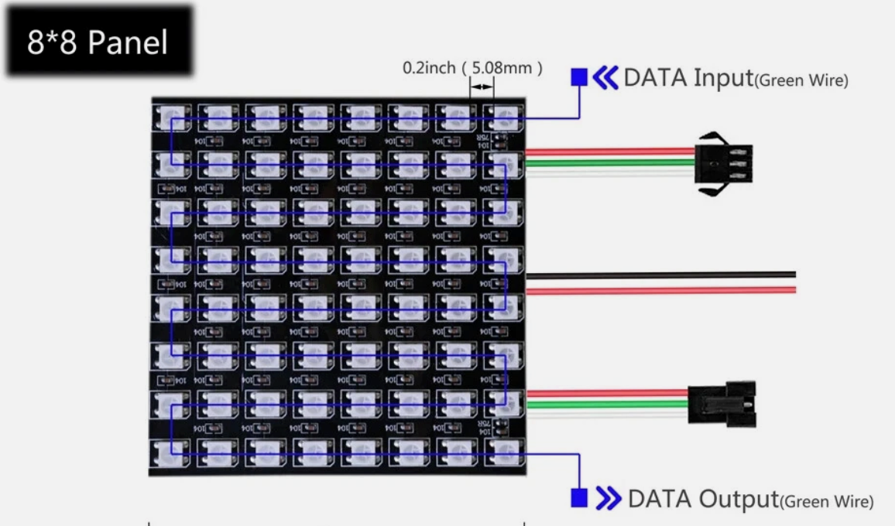

# 8x8 NeoPixel Matrix Project



You can purchase an 8x8 NeoPixel matrix panel on ebay for about $12.00.
They contain 64 RGB pixels that can be easily be programmed using our
the standard NeoPixel library that comes built-in to the MicroPython
run time.

## Sample Code

```python
from machine import Pin
from neopixel import NeoPixel
from utime import sleep

NEOPIXEL_PIN = 1
ROWS = 8
COLS = 8
NUMBER_PIXELS = ROWS * COLS
# Allocate memory for the NeoPixel matrix
matrix = NeoPixel(Pin(NEOPIXEL_PIN), NUMBER_PIXELS)

def wheel(pos):
    # Input a value 0 to 255 to get a color value.
    # The colors are a transition r - g - b - back to r.
    if pos < 0 or pos > 255:
        return (0, 0, 0)
    if pos < 85:
        return (255 - pos * 3, pos * 3, 0)
    if pos < 170:
        pos -= 85
        return (0, 255 - pos * 3, pos * 3)
    pos -= 170
    return (pos * 3, 0, 255 - pos * 3)

def write_pixel(x, y, value):
    if y >= 0 and y < ROWS and x >=0 and x < COLS:
        # odd count rows 1, 3, 5 the wire goes from bottup
        if x % 2: 
            matrix[(x+1)*ROWS - y - 1] = value             
        else: # even count rows, 0, 2, 4 the wire goes from the top down up
            matrix[x*ROWS + y] = value
while True:
    for o in range(0, 255):
        for i in range(0, 8):
            for j in range(0,8):
                color = (o + i + j*8) % 255
                print(i,j,color)
                write_pixel(i, j, wheel(color) )
        matrix.write()
        sleep(.001)
```

