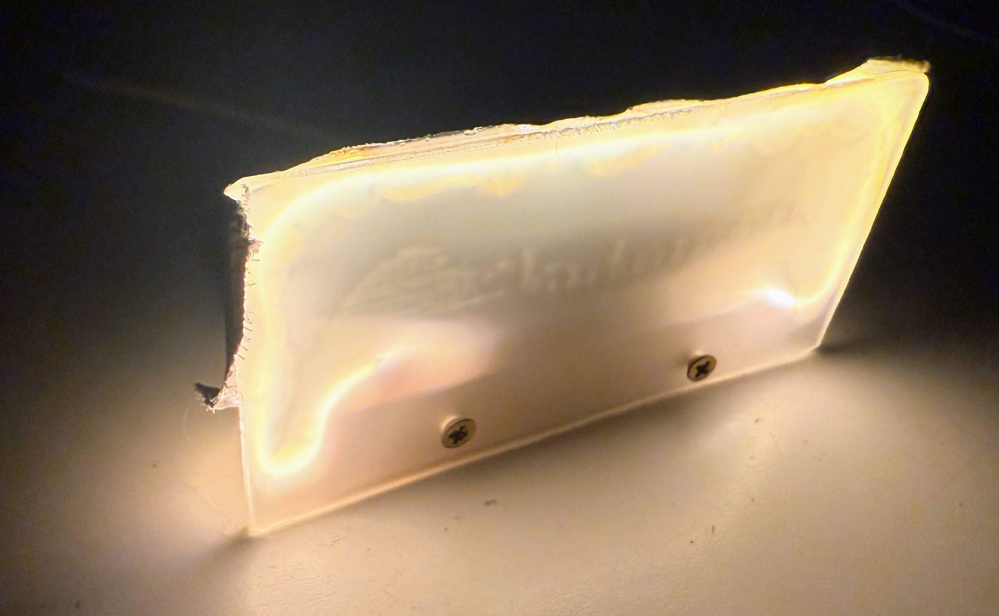

# Analog Nightlight

<iframe width="560" height="315" src="https://www.youtube.com/embed/UL0QA__359A?si=Wt0u9v6oWYtrnt7C" title="YouTube video player" frameborder="0" allow="accelerometer; autoplay; clipboard-write; encrypted-media; gyroscope; picture-in-picture; web-share" referrerpolicy="strict-origin-when-cross-origin" allowfullscreen></iframe>

[Link to Video](https://youtu.be/UL0QA__359A)

## How it Works

### Nightlight Parameters

First, let's define two terms:

1. The `sensitivity` of the nightlight is how dark the room needs to be before the nightlight turns `ON`.  A high sensitivity means just a little bit of light will make the light go on.  A low sensitivity means the light will stay on even during dusk.
2. The `brightness` of the nightlight is how bright the LED noodle will shine.  Having a nightlight that is too bright makes it annoying to our sensitive eyes at night.  A brightness that is too low will not help us orient ourselves in the room at night.

The key is that we can adjust both the sensitivity and the brightness of our LED noodle nightlight.

### Circuit Functionality Explained

The nightlight circuit has three parts.

1. The left side is a voltage divider circuit.  On the top is a 100K "pull up" resistor and on the bottom is the "pull down" photoresistor.  When light is present, the resistance of the photoresistor goes down, which pulls the center node of the circuit closer to ground.  When it is dark, the photoresistor has a high resistance.  This has the opposite effect, and the center node rises towards +5 volts.

2. The center of the nightlight circuit is the amplifying switch.  A 10K current limiting resistor connects the central node of the voltage divider to the base of the transistor.  At the top of the resistor is the collector that connects the transistor to the LED through a 10 ohm resistor.  At the bottom of the transistor is the emitter that connects directly to ground.  The key is that when the base floats high, the resistance of the transistor is low, and that causes current to flow through the LED.

3. The right side of the circuit is the LED.  When the transistor resistance is low, the current flows from the 5 volt rail, through the LED and a 10 ohm resistor, through the transistor and to ground.  We call this 10 ohm resistor the brightness limiting resistor.  When the base voltage is low we get the `ON` state of the nightlight.  When the transistor resistance is high the LED is we get little current through the LED so we get the 'OFF` state.  So you can see that when there is no light on the photoresistor, the base is pulled high, which turns on the LED!  We have a nightlight.

The sensitivity of the nightlight is determined by the resistance of the upper "pull-up" resistor.  A value of 100K means that the room needs to be almost completely dark before the nightlight goes on.  A lower value of the pull-up resistor like 50K means that just a little darkness will make the nightlight go on.  You can try different values from 30K to 200K for the pull-up resistor to see the effect of the value of the resistor.  You can also use a 100K potentiometer to adjust the sensitivity of the nightlight.

The resistor that is in series with the LED determines the brightness of the 5 volt LED noodle.  We picked a value of 10 ohms because an almost zero resistance wire just makes the LED noodle too bright for our room.  If you wanted a very dim nightlight 

## Sample Circuit Diagrams

 

This nightlight project uses a simple transistor circuit
to turn a LED noodle on when the room is dark.

Here are the parts list

Here's the information formatted as a Markdown table:

| Part Name | Estimated Cost | Notes |
|-----------|---------------|-------|
| 5-Volt LED Noodle | $1-$3 | Available in five colors |
| Photoresistor | $0.20 | |
| 2N2222 NPN Transistor | $0.20 | |
| 10K resistor | $0.10 | |
| Perforated breadboard | $0.10 | |
| USB wall adapter | $2.00 | |

You can also add a 100K potentiometer to adjust the brightness level that the nightlight turns on.

