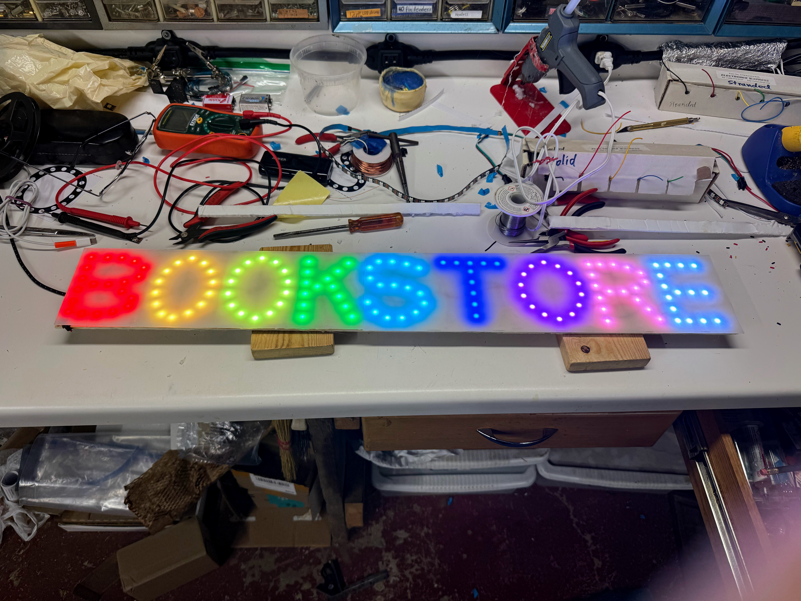

# BookStore Sign

The Bookstore Sign is a 134 pixel sign that displays the
word "Bookstore" using NeoPixels.

The source code is here:

[https://github.com/dmccreary/moving-rainbow/tree/master/src/bookstore-sign](https://github.com/dmccreary/moving-rainbow/tree/master/src/bookstore-sign)

## User Guide

The user guide is a short document that describes
the sign and the modes.  It includes a table
that describes the default power on mode
and the other sign modes.  To change a mode
you can click the buttons on the back of the sign.

[User Guide](./user-guide.md)

## Programmer's Guide

The programmer's guide describes how
you can change the python code in the main.py
to change the patterns.

[Programmer's Guide](./programmers-guide.md)