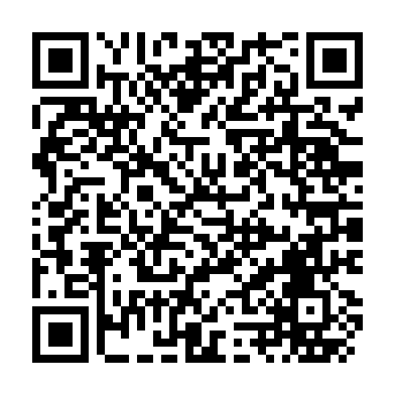

# Moving Rainbow Bookstore Sign User Guide

This is a user guide for the Moving Rainbow Bookstore Sign kit.

The sign is 4.5 inches high and 30 inches wide and spells out the word
**BOOKSTORE**. It is powered through a 5-volt mini-USB connector.

On the back of the sign are two buttons — one yellow and one blue. The
buttons change the *mode* of the sign, and each mode shows a different
pattern of color and motion. One button moves to the next pattern and the
other moves back to the previous one. The modes wrap around, so pressing
past the last pattern returns you to the start.

## When You Power It On

The sign starts in **Mode 0 (Auto-Cycle)**. In this mode it automatically
steps through all six color patterns on its own, showing each one for 60
seconds before moving to the next.

Press either button at any time to leave auto-cycle and lock the sign on a
single pattern. From there, use the buttons to step forward or backward
through the patterns.

## Modes

The sign has seven modes. Mode 0 plays every pattern automatically; modes 1
through 6 each hold the sign on a single pattern.

### Mode 0 — Auto-Cycle

Automatically steps through every pattern below, showing each one for 60
seconds before moving on. This is the mode the sign starts in.

### Mode 1 — Color Letters

Each letter of BOOKSTORE glows its own steady color, forming a rainbow across
the whole word.

### Mode 2 — Rainbow Flow

The full rainbow spectrum scrolls smoothly across the sign.

### Mode 3 — Rainbow Solid

The whole sign glows a single color that slowly cycles through the rainbow.

### Mode 4 — Color Sparkle

Every pixel drifts through random colors on its own, so the whole sign
shimmers.

### Mode 5 — Color Wipe

The whole sign holds one bright color, then wipes to the next.

### Mode 6 — Comet

A bright dot races across the sign, leaving a fading tail behind it.

