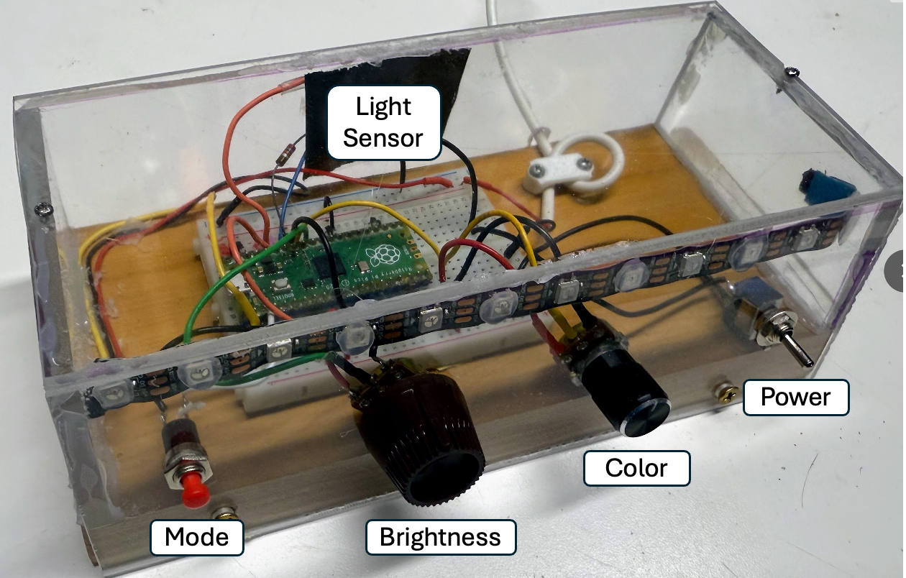

# Digital Nightlight



The digital nightlight kit uses a Raspberry Pi Pico on a breadboard with a button, two potentiometer and a power switch.  A photoresistor is on the rear to detect when the room is dark.

The nightlight has the following features:

1. When it is turned on using the power switch to the right, the LED strip will display a pattern only when the room is dark.
2. The button on the left controls the pattern
3. The first large potentiometer on the left controls the brightness of the pattern
4. The second smaller potentiometer controls the second parameter of the pattern.   Many patterns have a specific color.  The second potentiometer will then controls the color.  Some patterns have a rainbow color that moves.  In this case, the second potentiometer controls the speed of the rainbow movement.

Another option you can configure is is an automatic shutoff or ramp-down after 20 minutes or whatever duration you choose.

The kit is designed to have all the code pre-loaded into the flash memory of
the Raspberry Pi Pico.  The software has not only the working code, but it also
contains many small sample programs that you can use to learn to code on your
nightlight.  For example you can turn a knob to move a pixel on the LED strip.

The full source code is here:

[https://github.com/dmccreary/moving-rainbow/tree/master/src/elaines-nightlight](https://github.com/dmccreary/moving-rainbow/tree/master/src/elaines-nightlight)

## Config File

The kit comes with a standard hardware configuration file called `config.py`.  Make
sure you give this file to your AI coding agent when asking for help.

```py
NEOPIXEL_PIN = 0
NUMBER_PIXELS = 12
BUTTON_PIN = 2
POT_PIN_1 = 26
POT_PIN_2 = 27
PHOTORESISTOR_PIN = 28
```

## Step-by-Step Code Walkthrough


