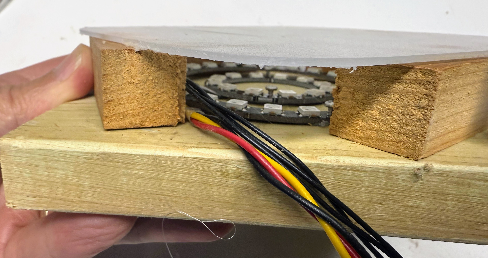

# Jake's Fire

<iframe width="560" height="315" src="https://www.youtube.com/embed/NRp6oRsooYY?si=jy_51_P1w6Z3De7N" title="YouTube video player" frameborder="0" allow="accelerometer; autoplay; clipboard-write; encrypted-media; gyroscope; picture-in-picture; web-share" referrerpolicy="strict-origin-when-cross-origin" allowfullscreen></iframe>

[Link to YouTube Video](https://www.youtube.com/watch?v=NRp6oRsooYY)

!!! Quote

    Hey, Dan!

    I'm starting a project, and would love your help with it, if you have the time. 

    I'm in need of a small, color-changing campfire that I can set on top of a wooden table- I was thinking about doing something with programmable RGB LEDs. Probably some actual wooden sticks, semi-transparent cellophane, and a bunch of hot glue to make the structure. 

    What I really need help with is getting the lighting controls settled and potentially incorporating some flickering effects.

    Let me know what you think, and if you can help! 

    Thanks! - Jake

In further discussions, we found it would be useful to change the patterns
for different versions of the game.

## Design



I used two NeoPixel rings.  The outer one had 24 pixels and the inner ring had 12 pixels.
I covered them with a thin translucent sheet of diffusion material.

## Sample Code

```py
# Simple Fire Effect for Pattern Integration
# Can be easily added to your main-demo-cycle.py
from machine import Pin, ADC
from neopixel import NeoPixel
from utime import sleep
from urandom import randint

import dual_ring_config

pot = ADC(dual_ring_config.POT_PIN)

NUMBER_PIXELS0 = dual_ring_config.NUMBER_PIXELS0
NUMBER_PIXELS1 = dual_ring_config.NUMBER_PIXELS1

# 24 pixels
strip0 = NeoPixel(Pin(dual_ring_config.NEOPIXEL_PIN0), NUMBER_PIXELS0)
# 12 pixels
strip1 = NeoPixel(Pin(dual_ring_config.NEOPIXEL_PIN1), NUMBER_PIXELS1)

def wheel(pos):
    # Input a value 0 to 255 to get a color value.
    # The colors are a transition r - g - b - back to r.
    if pos < 0 or pos > 255:
        return (0, 0, 0)
    if pos < 85:
        return (255 - pos * 3, pos * 3, 0)
    if pos < 170:
        pos -= 85
        return (0, 255 - pos * 3, pos * 3)
    pos -= 170
    return (pos * 3, 0, 255 - pos * 3)

def standard_fire(delay):
    for i in range(0, NUMBER_PIXELS0):
         green = 50 + randint(0,155)
         red = green + randint(25,50)
         strip0[randint(0,NUMBER_PIXELS0 - 1)] = (red, green, 0)
    strip0.write()
    for i in range(0, NUMBER_PIXELS1):
         green = 50 + randint(0,155)
         red = green + randint(25,50)
         strip1[randint(0,NUMBER_PIXELS1 - 1)] = (red, green, 0)
    strip1.write()
    sleep(delay)

def simulate_fire_pattern(pattern_number, delay):
    
    # TODO: Check that the pattern number is in the range of 0 to 7
    
    if (pattern_number == 0):
        standard_fire(delay)
    else:
        color_1 = (wheel(pattern_number * 16 + randint(0,16) % 255))
        color_2 = wheel((pattern_number * 16 + 128 + randint(0,16) % 256))
        for i in range(NUMBER_PIXELS0):
            strip0[i] = (color_1)
        strip0.write()
        for i in range(NUMBER_PIXELS1):
            strip1[i] = (color_2)
        strip1.write()
        sleep(delay)

# Erase all the pixels
def clear():
    for i in range(NUMBER_PIXELS0):
        strip0[i] = (0, 0, 0)
    strip0.write()
    for i in range(NUMBER_PIXELS1):
        strip1[i] = (0, 0, 0)
    strip1.write()

# Run the effect
try:
    print("Fire effect running - Press Ctrl+C to stop")
    while True:
        # shift over 13 bits to get a value from 0 to 7
        pattern = pot.read_u16() >> 13
        print(pattern, end=" ")
        simulate_fire_pattern(pattern, 0.1)
except KeyboardInterrupt:
    print("\nStopping fire effect")
    clear()
```

You can find the full source code and some unit tests here:

## Code Walk Through

Let's break down this fire simulation code step-by-step to understand how it creates realistic flickering fire effects on two NeoPixel rings.

### 1. Imports and Hardware Setup (Lines 33-48)

```python
from machine import Pin, ADC
from neopixel import NeoPixel
from utime import sleep
from urandom import randint
```

These imports give us access to:
- **Pin & ADC**: For controlling hardware pins and reading analog values from the potentiometer
- **NeoPixel**: The library to control addressable LED strips
- **sleep**: For timing delays between animation frames
- **randint**: For generating random numbers to create flickering effects

```python
pot = ADC(dual_ring_config.POT_PIN)
```

This creates an ADC (Analog-to-Digital Converter) object to read the potentiometer value. The potentiometer lets users select different fire patterns by turning a knob.

```python
strip0 = NeoPixel(Pin(dual_ring_config.NEOPIXEL_PIN0), NUMBER_PIXELS0)  # 24 pixels
strip1 = NeoPixel(Pin(dual_ring_config.NEOPIXEL_PIN1), NUMBER_PIXELS1)  # 12 pixels
```

Two separate LED rings are initialized:
- **strip0**: The outer ring with 24 LEDs
- **strip1**: The inner ring with 12 LEDs

### 2. The Color Wheel Function (Lines 50-61)

```python
def wheel(pos):
    if pos < 0 or pos > 255:
        return (0, 0, 0)
    if pos < 85:
        return (255 - pos * 3, pos * 3, 0)
    if pos < 170:
        pos -= 85
        return (0, 255 - pos * 3, pos * 3)
    pos -= 170
    return (pos * 3, 0, 255 - pos * 3)
```

The `wheel()` function converts a position (0-255) into an RGB color:
- **0-84**: Transitions from red to green (red decreases, green increases)
- **85-169**: Transitions from green to blue (green decreases, blue increases)
- **170-255**: Transitions from blue to red (blue decreases, red increases)

This creates a smooth color wheel effect useful for rainbow and color-cycling patterns.

### 3. Standard Fire Effect (Lines 63-74)

```python
def standard_fire(delay):
    for i in range(0, NUMBER_PIXELS0):
         green = 50 + randint(0,155)
         red = green + randint(25,50)
         strip0[randint(0,NUMBER_PIXELS0 - 1)] = (red, green, 0)
    strip0.write()
```

This function creates a realistic fire effect:

1. **For each LED in the outer ring** (24 pixels):
   - Generate a random green value between 50 and 205
   - Set red to be 25-50 units higher than green (fires are redder than green)
   - Pick a **random LED position** to update (creates flickering)
   - Set that LED to the calculated red-green color (no blue)

2. **Write to outer ring**: `strip0.write()` sends all color data to the LEDs

3. **Repeat for inner ring** with the same logic for 12 pixels

4. **Sleep**: Wait for the specified delay before the next frame

**Key insight**: By randomly selecting which pixels to update and using random intensity variations, this creates the chaotic, flickering appearance of real fire!

### 4. Simulate Fire Pattern Function (Lines 76-91)

```python
def simulate_fire_pattern(pattern_number, delay):
    if (pattern_number == 0):
        standard_fire(delay)
    else:
        color_1 = (wheel(pattern_number * 16 + randint(0,16) % 255))
        color_2 = wheel((pattern_number * 16 + 128 + randint(0,16) % 256))
```

This function provides 8 different visual patterns based on the pattern number (0-7):

- **Pattern 0**: Uses the standard orange/red fire effect
- **Patterns 1-7**: Create color-themed effects:
  - `color_1`: Base color calculated from pattern number × 16
  - `color_2`: Complementary color (opposite side of color wheel, 128 positions away)
  - Random variations (0-16) add subtle flickering

```python
        for i in range(NUMBER_PIXELS0):
            strip0[i] = (color_1)
        strip0.write()
        for i in range(NUMBER_PIXELS1):
            strip1[i] = (color_2)
        strip1.write()
```

All LEDs in the outer ring get `color_1`, while all LEDs in the inner ring get `color_2`, creating a two-tone effect.

### 5. Clear Function (Lines 94-100)

```python
def clear():
    for i in range(NUMBER_PIXELS0):
        strip0[i] = (0, 0, 0)
    strip0.write()
```

Sets all LEDs in both rings to (0, 0, 0) which is black (off). This is called when the program stops.

### 6. Main Program Loop (Lines 103-112)

```python
try:
    print("Fire effect running - Press Ctrl+C to stop")
    while True:
        pattern = pot.read_u16() >> 13
        print(pattern, end=" ")
        simulate_fire_pattern(pattern, 0.1)
```

The main loop:

1. **Read potentiometer**: `pot.read_u16()` returns a 16-bit value (0-65535)
2. **Convert to pattern number**: Shift right by 13 bits (`>> 13`) to get values 0-7
   - 65536 ÷ 8192 = 8 possible values
3. **Print pattern number**: Shows which pattern is active
4. **Call simulation**: Updates LEDs with 0.1 second delay (10 frames per second)

```python
except KeyboardInterrupt:
    print("\nStopping fire effect")
    clear()
```

When you press Ctrl+C:
- Catch the interrupt gracefully
- Turn off all LEDs
- Exit the program cleanly

### Key Computational Thinking Concepts

This project demonstrates several important programming concepts:

1. **Randomization**: Using `randint()` to create unpredictable, natural-looking fire
2. **Color Theory**: Understanding RGB color mixing and complementary colors
3. **Hardware Control**: Reading analog sensors and controlling digital LEDs
4. **Modularity**: Breaking code into reusable functions (`standard_fire`, `simulate_fire_pattern`, `clear`)
5. **User Input**: Converting potentiometer readings into discrete pattern selections
6. **Error Handling**: Using try/except to handle program interruption
7. **Bit Operations**: Using bit shifts (`>> 13`) for efficient division


