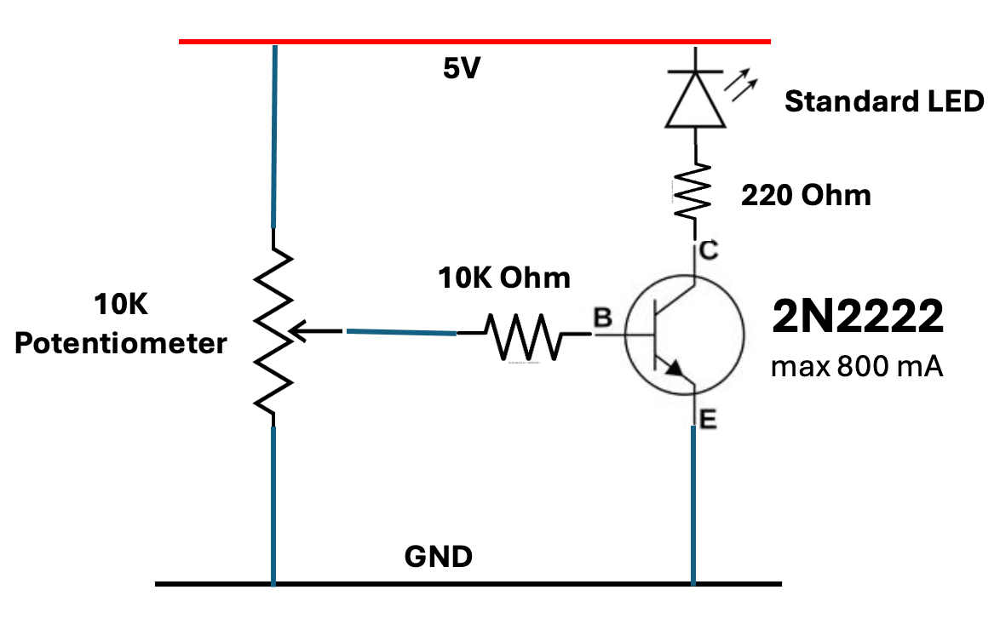

# LED Dimmer

<iframe src="../../sims/led-dimmer/main.html" height="505px" scrolling="no"></iframe>

## List of components

1. 5 volt power supply
2. Standard red LED
3. 220 ohm resistor to limit the current to the LED
4. 2N2222 NPN Transistor
5. 10K ohm base resistor to limit the current to the base of the transistor
6. 20K ohm potentiometer

## LED Dimmer Circuit

## Circuit Connections

1. The potentiometer has the outer ends connected to +5 volts and ground
2. The potentiometer has the center tap connected through the 10K ohm resistor
3. The positive anode end of the LED is connected to the +5 volt rail
4. The negative cathode end of the LED is connected to the top end of the 220 ohm resistor
5. The bottom end of the 220 ohm resistor is connected to the collector of the transistor
6. The emitter of the transistor is connected to ground

## How the Circuit Works

The LED dimmer circuit has three parts.

1. The left side is a voltage divider circuit.  As the potentiometer knob is turned, the center tap changes the
resistance values between the positive +5 volt power rail and the center tap.  It also changes the resistance values between ground and the center tab, but in a complementary way.  When one value goes up, the other goes down.  The key is that their sum is always the same.  The total resistance stays at 20k ohms.
As the potentiometer knob is turned, the voltage of the center tap will vary between 0 and 5 volts.

2. The center part of the circuit is the amplifier switch consisting of the 10K resistor and the transistor.
The transistor acts like an electronic valve or switch that controls how much current can flow through it. The voltage from the potentiometer's center tap goes through the 10K ohm resistor to the base of the transistor. Think of the base as the control knob of the valve. When a small voltage is applied to the base, it allows a much larger current to flow from the collector to the emitter. This is called amplification because a small signal controls a large current. As you turn the potentiometer and increase the voltage to the base, the transistor "opens up" more, allowing more current to flow through the LED. When you turn the knob the other way and decrease the voltage, the transistor "closes down," allowing less current through. The 10K resistor protects the transistor by limiting how much current can flow into the base.

3. The right side of circuit is the LED and the brightness limiting 220 ohm resistor.
An LED (Light Emitting Diode) produces light when electric current flows through it, but it needs the right amount of current to work properly. Too much current will burn out the LED, while too little won't make it light up. The 220 ohm resistor acts as a current limiter, like a speed bump that keeps the current at a safe level. Current flows from the +5 volt power supply, through the LED (which lights up), through the 220 ohm resistor, through the transistor's collector and emitter, and finally to ground. As you adjust the potentiometer, the transistor controls how much of this current can flow. More current makes the LED brighter, less current makes it dimmer. The resistor ensures that even at maximum brightness, the LED receives a safe amount of current that won't damage it.

