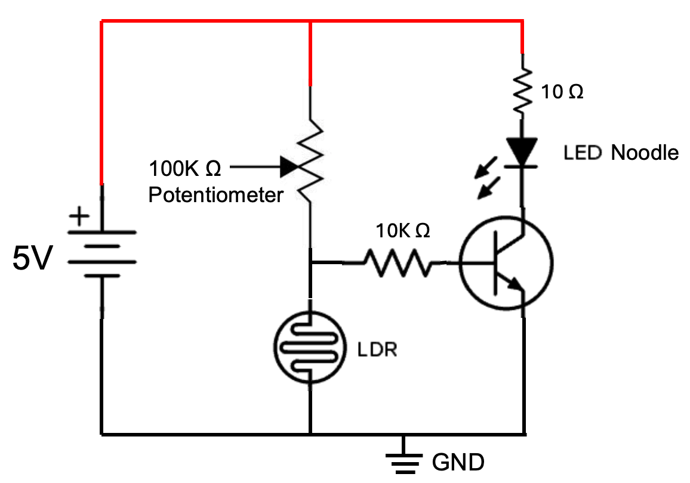

# LED Noodle Nightlight

The LED Noodle Nightlight is a simple, low-cost nightlight that turns
itself on when the room gets dark. It uses a bendable **LED noodle** (a
flexible strip of tiny LEDs that looks like a glowing string) instead of
a NeoPixel strip.

!!! tip "Pixel says..."
    This is one of my favorite first circuits! There's no code at all.
    The parts do all the thinking. When the room gets dark, the light
    turns on by itself. Like magic — but it's really just electronics!

## What you'll learn

- How a photoresistor senses darkness
- How a transistor works as an automatic switch
- How to tune a circuit with a resistor or potentiometer

## What you'll need

- An LED noodle (flexible LED filament)
- A photoresistor
- A transistor (such as a 2N2222)
- Resistors for sensitivity and brightness
- A 5V power source

## The Circuit

The circuit has three parts that work together:

1. **The sensor (left side).** A photoresistor and a "pull-up" resistor
   form a voltage divider. In the light, the photoresistor has low
   resistance, so the middle of the divider sits near ground. In the
   dark, the photoresistor's resistance climbs and the middle voltage
   rises toward 5 volts.

2. **The switch (middle).** That rising voltage feeds the base of a
   **transistor** (an electronic switch). When the room is dark, the
   base voltage is high, the transistor turns on, and current can flow.

3. **The light (right side).** When the transistor is on, current flows
   from the 5-volt rail, through the LED noodle and a brightness
   resistor, through the transistor, and down to ground. The noodle
   glows. When the room is bright, the transistor is off and the noodle
   stays dark.

## Tuning Your Nightlight

You can adjust two things about your nightlight:

- **Sensitivity** is how dark the room must get before the light turns
  on. The value of the "pull-up" resistor sets this. A 100K resistor
  means the room must be almost fully dark. A smaller value, like 50K,
  turns the light on at dusk. Swap a 100K potentiometer in here to make
  the sensitivity adjustable.

- **Brightness** is how strongly the noodle glows. The brightness
  resistor in series with the noodle sets this. A smaller resistor makes
  the noodle brighter; a larger one makes it dimmer and saves power.

!!! tip "Pixel's tip"
    Too bright at night hurts sleepy eyes. Too dim and you can't find
    your way. Try a few resistor values until the glow feels just right.

## How It Compares

This noodle nightlight is an **analog** circuit — it works with no code.
If you want patterns, colors, and a brightness knob, try the digital
versions that use the Pico:

- [Analog Nightlight kit](../analog-nightlight/index.md) — the same idea with a NeoPixel
- [Digital Nightlight kit](../digital-nightlight/index.md) — code-controlled with patterns
- [Photoresistor lesson](../../lessons/21-photo-resistor.md) — learn the sensor in code

## Try It Yourself

- Replace the sensitivity resistor with a potentiometer and find the
  setting where the light comes on right at sunset.
- Measure the photoresistor's value in a dark room and a bright room.
- Bend the noodle into a fun shape — a star, a heart, or your initial.
