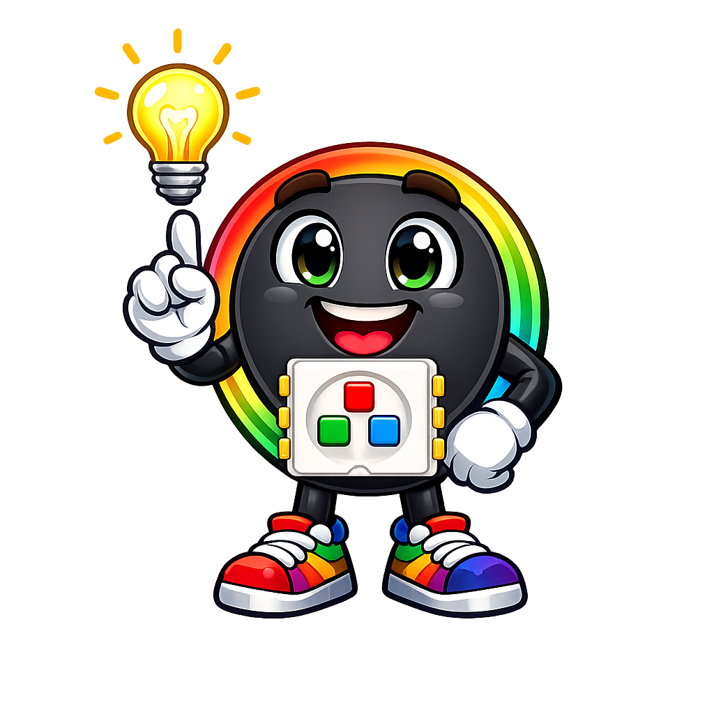
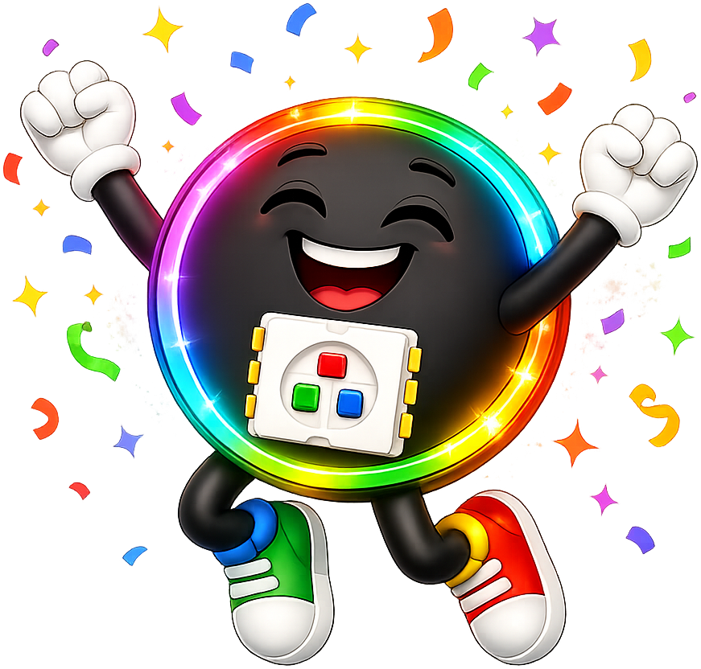

# Moving Rainbow Base Kit User's Guide


!!! tip "Pixel says..."
    
    Hi, I'm Pixel! This is the kit I live in. Thirty little lights, two buttons,
    and one tiny computer. Every lesson in this book runs on it. Let's light
    this up!

The base kit is the standard Moving Rainbow setup. It is a **Raspberry Pi
Pico** (a small computer chip you can program) driving a strip of **30
addressable LEDs**, plus **two push buttons** you can use to change patterns.  The
kit also contains a USB cable used to program and power your kit.

## Kit Contents

1. Raspberry Pi Pico Microcontroller
2. 400-tie solderless breadboard
3. 30-pixel addressable RGB LED strip
4. 2 momentary press buttons
5. USB cable
6. 22-gage hookup wire

## User's Guide

This page is the *user's guide* for the kit — how to wire it, power it, load
code onto it, and fix it when it acts up.

- To **buy or build** a kit, see the [Purchasing Guide](./purchasing-guide/index.md).
- To **learn the ideas** behind the code, see the [Chapters](../../chapters/index.md).
- To **write your first programs**, see the [Lessons](../../lessons/index.md).

## What You Can Build With It

Everything below runs on this one kit, with no extra parts:

- A pixel that **blinks**, then **fades**, then **moves** along the strip
- A full **rainbow** that slides down the strip and wraps around
- A **comet** with a glowing tail, a **candle** that flickers, and a **Larson scanner** like the Cylon eye
- A **clock** that shows the time as colored pixels
- A **mode machine** — one program with a dozen light shows, and buttons that switch between them

## Check Your Kit

Lay your parts out and check them off. Every kit should have these:

| Part | How many | What it does |
|------|----------|--------------|
| Raspberry Pi Pico | 1 | The computer chip that runs your code |
| 400-point breadboard | 1 | Connects parts together with no soldering |
| 30-pixel WS2812B LED strip | 1 | The lights, with three wires already soldered on |
| Momentary push button | 2 | Buttons that count only while you hold them down |
| Jumper wires | ~5 | Short wires that connect the parts |
| Micro USB data cable | 1 | Carries both your code and the power |

Some kits also include a **3-screw terminal header**, so you can swap strips
without soldering. It is nice to have, and nothing on this page needs it.

!!! warning "Check your USB cable"
    Make sure your cable is a **data cable**, not a charge-only cable. A
    charge-only cable lights up the board but hides it from your computer. It
    looks exactly like a dead board, and it fools almost everyone once.

## How the Parts Connect

There are only five connections in the whole kit: three for the strip and one
for each button.

### Where the Pico Sits

Put the Pico on the breadboard with the **USB connector at the top**. Push it
down until it sits flat. The pin in the top-left corner is now **GP0**, and
that is where the strip's data wire goes.


Many teachers mark the rails with a permanent marker before handing kits out —
black for ground, red for power, yellow for data. If your board has marks like
the ones above, follow them.

### The Three Wires to the LED Strip

An **addressable** LED strip is a chain of pixels that each read their own
color off a single wire. That is why 30 lights need only one data pin.

| Strip wire | Goes to | Pico pin |
|------------|---------|----------|
| Black — ground | Any `GND` pin | Pin 38 works well |
| Red — power | `VBUS` (the 5&nbsp;volts from USB) | Pin 40 |
| Yellow or green — data | `GP0` | Pin 1 |

Connect them in this order: **ground first, then power, then data.** Ground is
the shared return path for the whole circuit. Hooking up data before ground can
push current through the first pixel the wrong way.

!!! warning "Watch out!"
    
    The strip has a **direction**. Data goes in one end and flows out the
    other. Look for the tiny arrows printed between the pixels — they point
    *away* from the input end. Wire your data line to the end the arrows point
    away from. A backwards strip stays completely dark, and the wiring looks
    perfect the whole time.

Want to practice before you wire? Try the
[NeoPixel Wiring Diagram](../../sims/neopixel-wiring-diagram/index.md)
simulation first.

### The Two Buttons

Push the buttons into the breadboard so their legs **straddle the center
channel** — the groove down the middle. They are built to fit that way.

Each button needs just two connections:

| Button | One side goes to | The other side goes to |
|--------|------------------|------------------------|
| Button 1 | `GP15` (pin 20) | The ground rail |
| Button 2 | `GP14` (pin 19) | The ground rail |

No resistors are needed. The Pico has **internal pull-up resistors** — tiny
resistors inside the chip that hold the pin at 3.3&nbsp;volts until something
pulls it down. Your code turns one on like this:

```python
from machine import Pin

# PULL_UP holds the pin HIGH until the button connects it to ground
button = Pin(15, Pin.IN, Pin.PULL_UP)
```

So the pin reads **1 when the button is up**, and **0 when you press it**.
That feels backwards at first, and it is worth saying out loud once: pressed
means zero.


These buttons have **four** legs, not two. The four legs are really two pairs,
and each pair is already joined together inside the button. If you wire across
a joined pair, the button acts like it is pressed forever. Wire across the
button — corner to opposite corner — and you will always be on the right pair.

### The Pin Map

Every program in the kit reads its pin numbers from one shared file called
`config.py`:

```python
# config.py — the hardware settings for your kit
NEOPIXEL_PIN = 0      # data pin for the LED strip
NUMBER_PIXELS = 30    # how many pixels are on your strip
BUTTON_PIN_1 = 15     # first button
BUTTON_PIN_2 = 14     # second button
```

Because every program starts with `import config`, you never have to remember
pin numbers. You write `config.NEOPIXEL_PIN` and the right number fills in.

**This is the one file you may need to edit.** If your strip has 60 pixels
instead of 30, change `NUMBER_PIXELS` to `60` and every program follows along.
That is the **DRY principle** — Don't Repeat Yourself — doing real work for you.

## Your First Power-Up

Do these five steps in order. They take about fifteen minutes the first time
and about thirty seconds every time after.

**1. Install Thonny.** Thonny is the free program you write code in. The
[Desktop Setup](../../getting-started/desktop-setup.md) page walks through the
install for Windows, Mac, and Linux.

**2. Put MicroPython on the Pico.** A brand-new Pico has no Python on it yet.
Thonny can install it for you in about a minute. The Desktop Setup page covers
this too, including what to do if the automatic download stalls.

**3. Plug in the USB cable.** The green light on the Pico comes on. In the
bottom-right corner of Thonny you should see *MicroPython (Raspberry Pi Pico)*.

**4. Say hello in the Shell.** Click in the Thonny **Shell** panel at the
bottom and type these lines one at a time:

```python
from machine import Pin
from neopixel import NeoPixel
strip = NeoPixel(Pin(0), 30)
strip[0] = (32, 0, 0)
strip.write()
```

The first pixel turns dim red. That one line — `strip.write()` — is what
actually sends the colors down the wire. Nothing changes on the strip until
you call it.

**5. Turn it off again.**

```python
strip[0] = (0, 0, 0)
strip.write()
```

If both of those worked, your wiring is correct and your kit is ready. If the
pixel stayed dark, jump to [When Something Doesn't
Work](#when-something-doesnt-work) below.

!!! tip "Pixel's tip"
    
    Start every pixel dim — try `(32, 0, 0)` instead of `(255, 0, 0)`. Your
    eyes will thank you, your batteries will last longer, and you can still
    see every color perfectly. Full brightness is for showing off later!

## Getting Code onto the Kit

Your code lives on your computer. The Pico has its own small filesystem, and
you copy files over to it.

### Copy `config.py` first

Every other program needs it. In Thonny, open `config.py`, then choose
**File → Save as… → Raspberry Pi Pico** and keep the name `config.py`.

### Then copy the programs you want

Same steps for any program file. Save it to the Pico, press the green **Run**
arrow, and watch the strip.

### The fast way, for a whole class

If you are setting up many kits, copying files one at a time gets old. The kit
folder includes a script that copies everything at once using a tool called
`mpremote`.

Install the tool once:

```bash
pip install mpremote
```

Then plug in a Pico and run:

```bash
./src/kits/moving-rainbow-base/upload-code.sh
```

The script finds the board, copies every `.py` file in that folder, and lists
what landed on the Pico. Twenty kits take about a minute each.

All of the kit's source code lives in
[`src/kits/moving-rainbow-base/`](https://github.com/dmccreary/moving-rainbow/tree/master/src/kits/moving-rainbow-base)
if you would rather browse it on GitHub.

## The Programs on Your Kit

The files are numbered so you can work through them in order. Each one adds a
single new idea. Here are the ones worth running first:

| File | What you'll see | Lesson |
|------|-----------------|--------|
| `01-blink.py` | One red pixel blinks on and off | [Blink](../../lessons/01-blink.md) |
| `02-red-green-blue.py` | Red, green, and blue in different spots | [Red, Green and Blue](../../lessons/04-red-green-blue.md) |
| `03-dimmer.py` | One pixel fades up and down | [A Better Dimmer](../../lessons/06-linear-dimmer.md) |
| `04-move.py` | A single dot slides along the strip | [Moving Pixel](../../lessons/07-motion.md) |
| `06-color-wipe.py` | Color fills the strip one pixel at a time | [Color Wipe](../../lessons/08-color-wipe.md) |
| `07-random.py` | Pixels light in random colors | [Random Numbers](../../lessons/07-random.md) |
| `08-color-wheel.py` | Every color of the rainbow, from one function | [Color Wheel](../../lessons/05-color-wheel.md) |
| `09-rainbow.py` | A still rainbow across all 30 pixels | [Rainbow](../../lessons/08-rainbow.md) |
| `10-moving-rainbow.py` | The rainbow slides — the program the project is named for | [Moving Rainbow](../../lessons/10-moving-rainbow.md) |
| `12-moving-band.py` | A band of color travels down the strip | [Moving Bands](../../lessons/08-moving-bands.md) |
| `13-comet.py` | A bright head with a fading tail | [Comet Tail](../../lessons/09-comet-tail.md) |
| `15-candle-flicker.py` | A warm, random candle flame | [Candle Flicker](../../lessons/16-candle.md) |
| `16-theater-chase.py` | Classic chasing marquee lights | [Theater Chase](../../lessons/17-theater-chase.md) |
| `17-ripple.py` | Drops falling in a one-pixel-wide pond | [Ripple](../../lessons/18-ripple.md) |
| `18-twinkle.py` | Random pixels sparkle for a moment | [Twinkle](../../lessons/18-twinkle.md) |
| `20-clock.py` | The time, shown in colored pixels | [Clock](../../lessons/20-clock.md) |
| `21-larson-scanner.py` | The Cylon eye sweeping back and forth | [Larson Scanner](../../lessons/19-larson-scanner.md) |

And these bring the buttons in:

| File | What you'll see |
|------|-----------------|
| `30-button-test.py` | Prints `1` and `0` in the Shell as you press — the fastest way to prove a button is wired right |
| `31-button-led-test.py` | The Pico's own tiny green LED follows the button |
| `32-two-button-print.py` | A counter that goes up with one button and down with the other |
| `50-buttons-move-light.py` | Buttons push a lit pixel up and down the strip |
| `25-modes.py` | A **state machine** — twelve patterns in one program, buttons step through them |
| `60-pixel-demo.py` | The full demo program we run at science fairs |

!!! note "Two programs wire their buttons the other way"
    Two of the older programs — `25-modes.py` and `60-pixel-demo.py` — set
    their buttons up with `Pin.PULL_DOWN`, which expects the buttons wired to
    3.3&nbsp;volts instead of ground. If your buttons do nothing in those two,
    change `PULL_DOWN` to `PULL_UP` near the top of the file. Everything else
    in the kit uses `PULL_UP`.

## A Path Through the Kit

You do not have to follow this exactly. It is the order that has worked best
in classrooms.

**First hour.** Run `01-blink.py`. Change the color. Change the sleep time.
Change `strip[0]` to `strip[5]`. Four small edits, four instant results — that
loop of *change something, see something* is the whole method.

**First week.** Work through the single-pattern programs, roughly `01` to
`13`. Along the way you will meet `for` loops, lists, functions, and the RGB
color model. [Chapter 9](../../chapters/09-neopixel-programming/index.md)
explains what the NeoPixel library is doing underneath.

**Second week.** Add the buttons. Start with `30-button-test.py`, then
`32-two-button-print.py`, then `50-buttons-move-light.py`.
[Chapter 18](../../chapters/18-input-devices-and-sensors/index.md) covers
debouncing — the trick that keeps one press from counting as three.

**After that.** Open `25-modes.py` and read it as a map. It ties every pattern
you wrote into one program with a **mode variable**. The
[State Machine simulation](../../sims/state-machine-diagram/index.md) shows the
same idea as a picture.

**Then make it yours.** Add your own pattern to the mode list. That single
change is the most common capstone project in the course, and it is a real
one.

## Running Without a Computer

Once a program works, you can make the kit run it on its own.

Save your program to the Pico with the name **`main.py`**. MicroPython looks
for that exact name every time the board powers on, and runs it. Unplug from
the computer, plug into a USB phone charger or a USB battery pack, and your
light show starts by itself.

This is how the kit becomes a costume, a sign, or a shelf decoration. See
[Batteries](../../getting-started/batteries.md) for what to power it with.

To get back to editing, plug into your computer and press **Stop** in Thonny
before the program grabs the board. If it will not let go, the
[Troubleshooting Resets](../../getting-started/troubleshooting-resets.md) page
has the rescue steps.

## How Bright Can You Go?

Each pixel has a red, a green, and a blue LED inside. Each one draws about
**20 milliamps** at full power, so a single pixel showing full white draws
about **60 milliamps**.

Now multiply. All 30 pixels at full white is about **1,800 milliamps** — and a
normal USB port supplies only about **500**. That is more than three times what
the port can give.

Here is the safe rule for this kit:

> Keep your color values at **64 or below** when you light up the whole strip.

At 64, all 30 pixels together draw roughly 450 milliamps, which a USB port
handles comfortably. Patterns that light only a few pixels at a time — comets,
scanners, twinkle — can go brighter, because most of the strip is dark.

Try the [LED Current Predictor](../../sims/current-predictor/index.md) to see
the numbers change as you adjust brightness, and the
[Battery Life Calculator](../../sims/battery-life-calculator/index.md) to plan
a costume. [Chapter 17](../../chapters/17-power-and-battery-systems/index.md)
covers power in depth.

## When Something Doesn't Work

Every one of these has happened in a real classroom. Work down the list — the
top rows are the most common by far.

| What you see | What's likely going on | What to try |
|--------------|------------------------|-------------|
| Thonny doesn't see the Pico | Charge-only USB cable | Swap in a cable marked "data" or "sync". Keep one known-good cable for testing |
| Thonny still doesn't see it, on a Mac | A known macOS USB bug | See [macOS USB Bugs](../../getting-started/macos-usb-bugs.md) |
| No lights at all | Strip is wired backwards | Find the arrows between pixels; data goes in the end they point away from |
| No lights, wiring looks right | Missing `strip.write()` | Colors only appear after `strip.write()` runs |
| No lights, and no green light on the Pico | No power reaching the board | Reseat the USB cable and press the Pico flat into the breadboard |
| Only the first pixel lights | Data reaches pixel 1 and stops | Check the solder joint on the data pad, and check `NUMBER_PIXELS` in `config.py` |
| Red and green are swapped | Your strip uses a different color order | Swap the first two numbers in your color tuples: `(0, 255, 0)` instead of `(255, 0, 0)` |
| Far end flickers or goes white | Not enough current | Lower your brightness values, or power the strip from its own USB supply |
| A button does nothing | Wired across a joined pair of legs | Move the wire to the opposite corner of the button |
| A button acts permanently pressed | Same joined-pair problem, other way around | Same fix — wire corner to opposite corner |
| Buttons work in some programs only | `PULL_DOWN` vs `PULL_UP` mismatch | Change `PULL_DOWN` to `PULL_UP` in that file |
| One press counts as several | Contact bounce | Add a debounce delay — see [Chapter 18](../../chapters/18-input-devices-and-sensors/index.md) |
| The board won't stop or reset | A `main.py` program has the board busy | See [Troubleshooting Resets](../../getting-started/troubleshooting-resets.md) |

!!! tip "Test before you change anything"
    Run `30-button-test.py` or the five-line Shell test from Power-Up first.
    They tell you in ten seconds whether the problem is in your wiring or in
    your code, which cuts the list above in half.

## Taking the Kit Further

The base kit is the starting point for most of the other projects in this
book. When you are ready, these all build on the same Pico, the same strip,
and the same code you already know:

- [Holiday Hats](../holiday-hats/index.md) — wear your strip for five different holidays
- [Cylon Pumpkin](../cylon-pumpkin/index.md) — a scanner eye in a jack-o'-lantern
- [Digital Nightlight](../digital-nightlight/index.md) — add a light sensor so it turns itself on
- [Jake's Fire](../jakes-fire/index.md) — a flickering flame effect
- [Bookstore Sign](../bookstore-sign/index.md) — light up letters and shapes
- [8x8 NeoPixel Matrix](../8x8-neopixel-matrix/index.md) — move from a line of pixels to a grid

!!! success "You've got this!"
    
    Look at you — wired, powered, and glowing. Everything from here is just
    changing numbers and seeing what happens. That is what programmers
    actually do all day, and now you can do it too.

## What's Next

Start with [Lesson 1: Blink](../../lessons/01-blink.md). It uses one pixel and
about eight lines of code, and it is the beginning of every light show in this
book.
