# Purchasing Guide for the Moving Rainbow Base Kit

The base kit is a Raspberry Pi Pico driving a 30-pixel WS2812B LED strip, with
two push buttons for changing patterns. It is the kit every lesson in this book
is written against. One kit costs about **$13** if you buy the parts
individually; a classroom order of 20 brings that down to about **$9.65 per
student**, which is where most teachers land. Buying direct from China saves
roughly 40% on everything except the Pico, at the cost of 2–3 weeks of
shipping — so order a semester ahead if you can.

!!! note "Prices checked August 2026"
    Component prices move, and marketplace listings turn over constantly. Treat
    every figure here as a planning estimate, not a quote. The search links
    below always show current pricing.

## Summary of Parts List

**Required**

- [Raspberry Pi Pico](#raspberry-pi-pico) — the microcontroller that runs every lesson ($3.99 at Micro Center)
- [Solderless breadboard, 400 tie points](#solderless-breadboard) — holds the Pico and both buttons (~$3)
- [Addressable LED strip (WS2812B)](#addressable-led-strip) — 30 pixels, half of a 1-meter strip (~$2.50)
- [Momentary push buttons](#momentary-push-buttons) — two per kit, for changing patterns (~$0.40)
- [22-gauge solid-core wire](#jumper-wires) — custom-cut jumper wires (~$0.50)
- [Micro USB data cable](#micro-usb-data-cable) — programs and powers the kit (~$2.50)

**Optional**

- [Three-screw terminal header](#three-screw-terminal-header) — swap strips without re-soldering (~$0.40)
- [Heat shrink tubing](#heat-shrink-tubing) — strain-relieves and color-codes the strip leads (~$0.50)
- [Acrylic base](#acrylic-base) — mounts the breadboard and strip into something backpack-proof (~$2)

**Estimated total:** ~$13 for one kit · ~$9.65 per student for a class of 20

---

## Raspberry Pi Pico

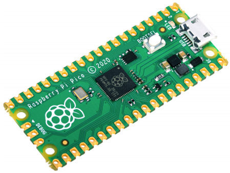

The Pico is the microcontroller at the heart of this project. It runs
MicroPython, drives all 30 pixels from a single GPIO pin, and reads both
buttons. The kit's configuration uses **GPIO 0** for the strip data line and
**GPIO 15 and GPIO 14** for the two buttons.

We always buy our Picos at [Micro
Center](https://www.microcenter.com/search/search_results.aspx?N=&cat=&Ntt=Raspberry+Pi+Pico),
which faithfully sells them for $3.99 USD — we have seen them on sale for
$2.99. No marketplace beats that, so this is the one part where the usual
order-from-China logic does not apply.

Two things to get right when ordering. First, boards ship **without headers**
unless the listing says "H" or "with headers" — a bare Pico needs about five
minutes of soldering before it will seat in a breadboard, so buy the "H"
variant for classroom kits. Second, the "W" variant adds WiFi for about $6;
none of the base lessons need it.

**Prep work:** None if you buy the "H" (pre-soldered header) variant. A bare
board needs 40 header pins soldered, roughly 5 minutes each with practice.

**Cost:** $3.99 each at Micro Center · $3.99 each at any quantity — Micro
Center does not discount further, but at that price it does not need to.
Expect $4–6 elsewhere.

**Search keywords:** `Raspberry Pi Pico`, `Raspberry Pi Pico H` (headers
pre-soldered), `Raspberry Pi Pico 2`, `RP2040`. Note that marketplace listings
are frequently clones — fine for classroom use, but order one and check it
before committing to twenty.

**Where to buy:**

- [Search Micro Center for "Raspberry Pi Pico"](https://www.microcenter.com/search/search_results.aspx?Ntt=Raspberry+Pi+Pico)
- [Search eBay for "Raspberry Pi Pico"](https://www.ebay.com/sch/i.html?_nkw=Raspberry+Pi+Pico)
- [Search Amazon for "Raspberry Pi Pico"](https://www.amazon.com/s?k=Raspberry+Pi+Pico)

## Solderless Breadboard

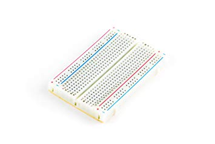

We only use the 1/2-size **400-tie-point** breadboards. They have exactly
enough room for the Pico and two buttons, which is all this kit needs, and they
cost noticeably less than the 830-point full-size boards. We buy them on eBay
in packs of 10 or 20 to keep the cost down.

**Prep work:** We use a permanent marker to mark the rails before handing kits
out — black for the GND pins, red for the power pins, and yellow for the data
pin that goes to GPIO 0 on row 1. It takes about two minutes per board and
eliminates an entire category of wiring mistakes.

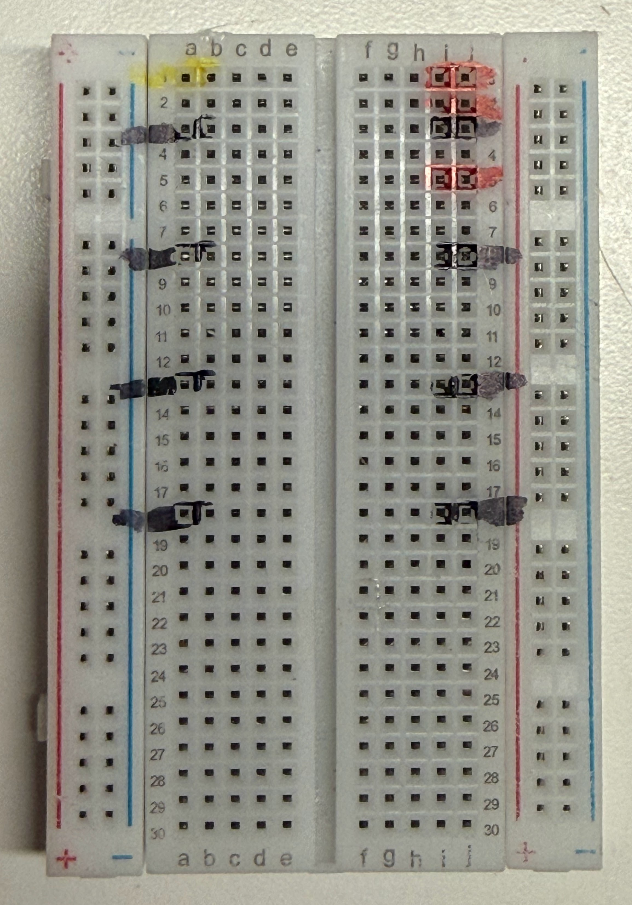

Here is how we place the Pico on the breadboard. Note that the USB connector is
at the top, so GPIO 0 (pin 1) is on row 1. The 5V connection is on VBUS, and
the black wire can go to any GND row.

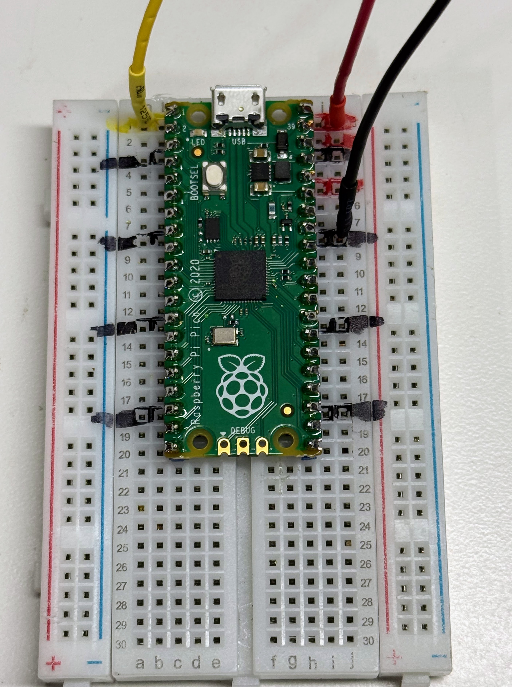

**Cost:** ~$2–4 each in quantity 1 · ~$1.50 each in packs of 10 or 20. This
part has one of the steepest pack discounts in the kit, so buy the pack.

**Search keywords:** `400 tie point breadboard`, `half size solderless
breadboard`, `mini breadboard 400 points`. Avoid `MB-102` — that is the
830-point full-size board.

**Where to buy:**

- [Search eBay for "400 tie point solderless breadboard"](https://www.ebay.com/sch/i.html?_nkw=400+tie+point+solderless+breadboard)
- [Search AliExpress for "400 tie point solderless breadboard"](https://www.aliexpress.com/w/wholesale-400-tie-point-solderless-breadboard.html)
- [Search Amazon for "400 tie point solderless breadboard"](https://www.amazon.com/s?k=400+tie+point+solderless+breadboard)

## Addressable LED Strip

This is the part that makes the kit worth building — a chain of WS2812B
"addressable" pixels, each holding a red, green and blue LED plus a small
controller that reads its own color off the data line and passes the rest
along. That chaining is why 30 pixels need only one GPIO pin.

We buy 1-meter strips at **60 pixels per meter** and cut each one in half, so
one strip yields two kits. Two specifications matter when comparing listings.
Buy the **5V** version: the 12V WS2815 looks identical in listing photos and
will not run from the Pico's VBUS pin. And buy **IP20** (uncoated) for indoor
classroom use — IP65 silicone coating is worth it for take-home projects and
costumes, but it makes soldering harder.

**Prep work:** Cut the strip at the 30-pixel mark, following the copper pad
line.

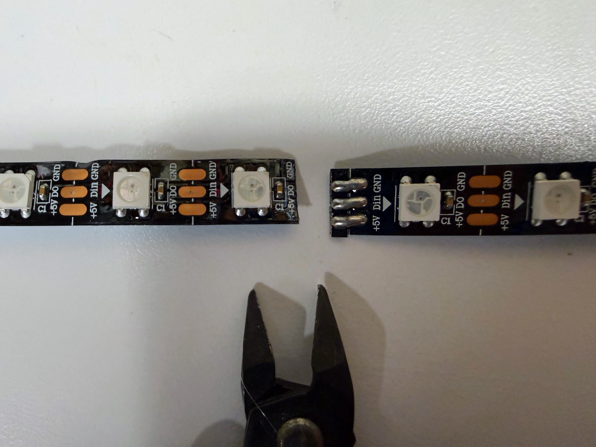

Solder wire to the three pads at the input end. Budget about 10 minutes per
strip.

We solder 22-gauge solid-core wire to the ends of the strip's stranded leads,
because stranded wire will not seat in a breadboard tie point.

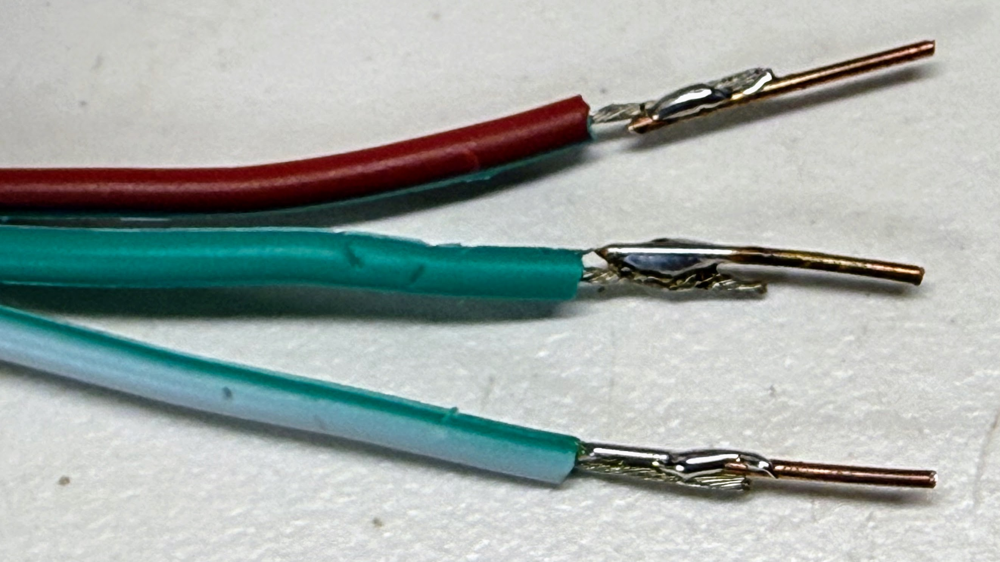

Then we slide colored heat shrink over each joint and shrink it. This
strain-relieves the connection — WS2812B pads lift easily — and color-codes
power, ground and data so students wire the strip correctly without tracing.

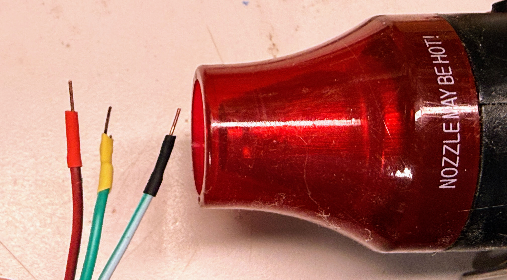

**Cost:** ~$3–6 per meter from eBay or AliExpress, so ~$2.50 per kit ·
~$3 per meter in a classroom order direct from China, so ~$1.50 per kit. The
same strip runs $10–15 per meter on Amazon. This is the part where ordering
ahead saves the most money.

**Search keywords:** `WS2812B LED strip 60 LED/m 5V`, `addressable RGB LED
strip`, `WS2812B IP20 1m`. Be aware that **"NeoPixel" is Adafruit's brand
name** for this part — searching it returns Adafruit product at several times
the price for an electrically identical strip.

**Where to buy:**

- [Search eBay for "WS2812B LED strip 60 LED/m 5V IP20"](https://www.ebay.com/sch/i.html?_nkw=WS2812B+LED+strip+60+LED%2Fm+5V+IP20)
- [Search AliExpress for "WS2812B LED strip 60 LED/m 5V IP20"](https://www.aliexpress.com/w/wholesale-ws2812b-led-strip-60-led-m-5v-ip20.html)
- [Search Amazon for "WS2812B LED strip 60 LED/m 5V IP20"](https://www.amazon.com/s?k=WS2812B+LED+strip+60+LED%2Fm+5V+IP20)

## Momentary Push Buttons

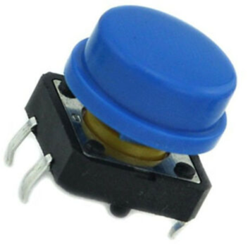

Our kits have two of these buttons so students can change the mode of the kit.
The normal arrangement is one pattern per mode, with the buttons moving the
mode selection forward or backward. Advanced students can use the second button
to change a setting within a mode, or attempt a double-click to change a
parameter — which is genuinely hard and makes a good extension challenge. The
kit configuration reads them on GPIO 15 and GPIO 14.

Buy the **6mm × 6mm four-pin tactile** type. Its leads straddle the breadboard's
center channel as shipped, which is why no prep work is needed.

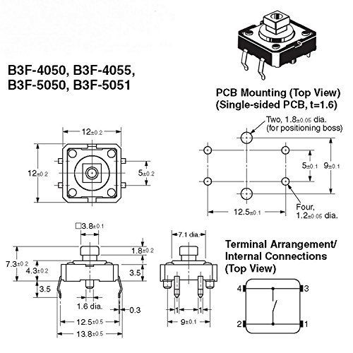

One thing worth telling students before they wire: the four pins are two pairs
that are *internally connected*. Wiring across the wrong pair makes the button
look permanently pressed, and it is the most common debugging session of the
whole unit.

Colored caps are a cheap addition that makes the two mode buttons visually
distinct, which helps a lot when a student is explaining their project to
someone else.

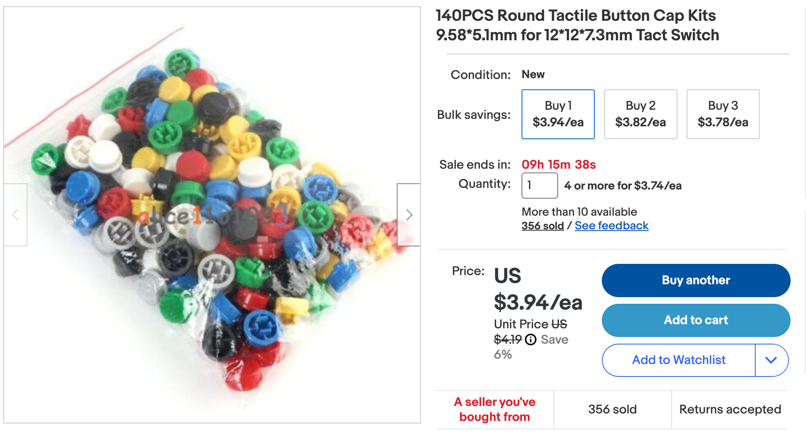

**Prep work:** None — it is breadboard-ready as shipped.

**Cost:** ~$0.10–0.25 each in quantity 1 · effectively free in a classroom
order, since packs of 100 run $5–10 and a class of 20 needs only 40.

**Search keywords:** `6x6mm tactile push button switch`, `momentary tactile
switch 4 pin breadboard`, `tactile switch caps 6x6mm`. The larger `12x12mm
tactile switch with cap` is easier for younger students to press.

**Where to buy:**

- [Search eBay for "6x6mm tactile push button switch"](https://www.ebay.com/sch/i.html?_nkw=6x6mm+tactile+push+button+switch)
- [Search AliExpress for "6x6mm tactile push button switch"](https://www.aliexpress.com/w/wholesale-6x6mm-tactile-push-button-switch.html)
- [Search Amazon for "6x6mm tactile push button switch"](https://www.amazon.com/s?k=6x6mm+tactile+push+button+switch)

## Jumper Wires

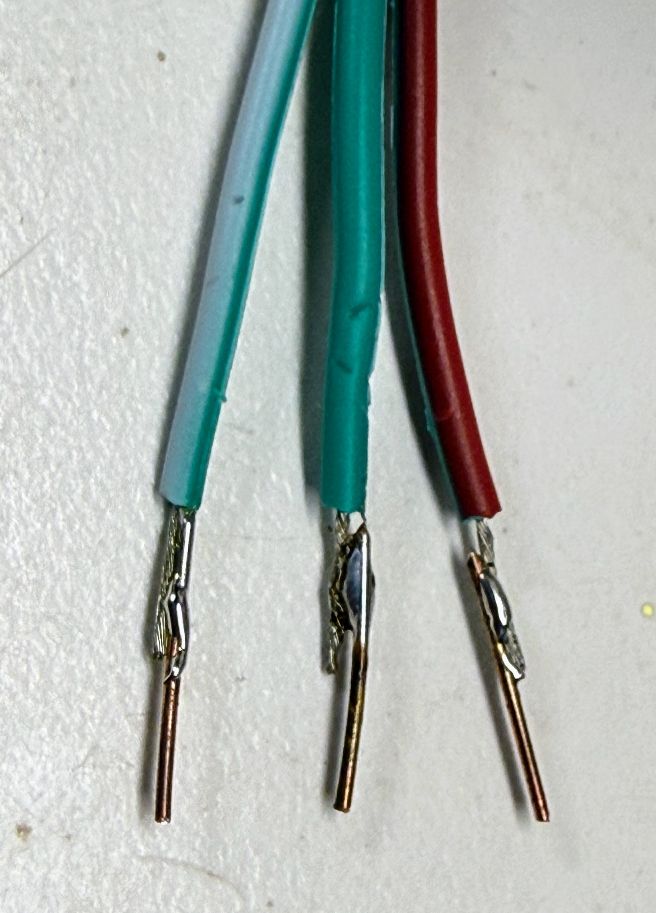

We use 22-gauge **solid-core** jumper wires, custom cut to length, rather than
the pre-made Dupont bundles. Cut-to-length wires lie flat against the board, so
students can actually see the circuit they built instead of a nest of loops.
Each kit uses three black ground wires and two colored wires connecting each
button to GND.

Solid core is not a preference here: stranded wire frays at the tip and will not
enter a breadboard tie point.

**Prep work:** Cut to length and strip about 1/4 inch from each end. Figure
10–15 minutes to cut a full set for one kit, which makes this a good task for a
prep session with volunteers.

**Cost:** ~$8–15 for a multi-color spool set in quantity 1 · one spool set
serves an entire classroom, so budget it per classroom (~$12), not per student.

**Search keywords:** `22 AWG solid core hookup wire kit`, `22 gauge solid wire
breadboard`, `hookup wire spool set 6 colors`. Do not search for "jumper wires"
alone — that mostly returns pre-made stranded Dupont bundles.

**Where to buy:**

- [Search eBay for "22 AWG solid core hookup wire kit"](https://www.ebay.com/sch/i.html?_nkw=22+AWG+solid+core+hookup+wire+kit)
- [Search AliExpress for "22 AWG solid core hookup wire kit"](https://www.aliexpress.com/w/wholesale-22-awg-solid-core-hookup-wire-kit.html)
- [Search Amazon for "22 AWG solid core hookup wire kit"](https://www.amazon.com/s?k=22+AWG+solid+core+hookup+wire+kit)

## Micro USB Data Cable

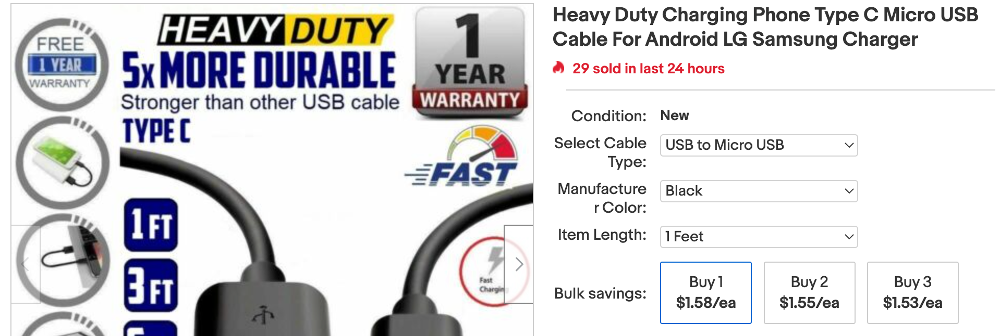

The cable both programs the Pico from Thonny and powers the strip during
lessons, so every student needs one at their station. The original Pico and the
Pico 2 use **micro-USB**; some clone boards use USB-C, so confirm the connector
on the board you actually ordered.

The failure worth warning teachers about: many cheap micro-USB cables are
**charge-only** and carry no data lines. A charge-only cable powers the board
perfectly while making it completely invisible to Thonny, which looks exactly
like a dead board. Buy cables explicitly listed as data or sync cables, and
keep one known-good cable aside for debugging.

**Prep work:** None. Label them if your students share a cart — cables migrate.

**Cost:** ~$2–3 each in quantity 1 · ~$1.50 each in multi-packs of 5 or 10.
Many classrooms already have a drawer of these, so check before ordering.

**Search keywords:** `micro USB data cable`, `micro USB sync cable 3ft`,
`USB A to micro B data cable`. The words "data" or "sync" in the listing are
what separate a working cable from a charge-only one.

**Where to buy:**

- [Search eBay for "micro USB data cable"](https://www.ebay.com/sch/i.html?_nkw=micro+USB+data+cable)
- [Search AliExpress for "micro USB data cable"](https://www.aliexpress.com/w/wholesale-micro-usb-data-cable.html)
- [Search Amazon for "micro USB data cable"](https://www.amazon.com/s?k=micro+USB+data+cable)

---

## Three-Screw Terminal Header

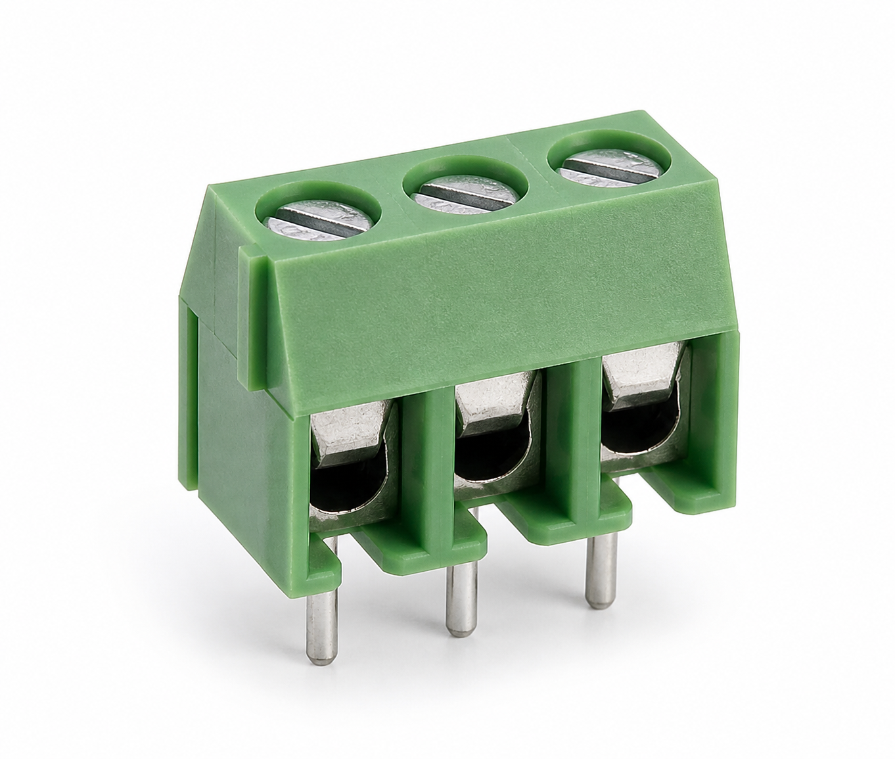{ width="300" }

Some of our kits are designed to let students quickly attach different types of
NeoPixel strips or NeoPixel rings and keep them connected even when the kit is
thrown into a school backpack. We use a three-terminal screw header for those
kits.

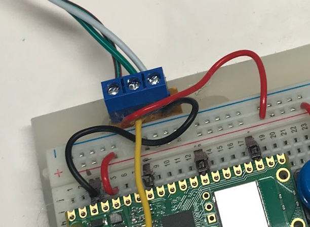

The specification people get wrong is the **pitch**. Buy 5.08mm pitch, which
sits cleanly next to a breadboard; 3.5mm terminals are also common and will not
line up the same way.

**Prep work:** Solder short 22-gauge solid-core leads to the header's pins so
it seats in the breadboard. About 5 minutes each. The payoff is that the strip's
stranded wire clamps into the screw terminals with no soldering at all, so
students can swap strips themselves.

**Cost:** ~$0.30–0.80 each in quantity 1 · ~$0.20–0.40 each in packs of 10–20.

**Search keywords:** `3 pin screw terminal block 5.08mm`, `PCB screw terminal
connector 3 way`, `KF128 3P 5.08mm`

**Where to buy:**

- [Search eBay for "3 pin screw terminal block 5.08mm"](https://www.ebay.com/sch/i.html?_nkw=3+pin+screw+terminal+block+5.08mm)
- [Search AliExpress for "3 pin screw terminal block 5.08mm"](https://www.aliexpress.com/w/wholesale-3-pin-screw-terminal-block-5-08mm.html)
- [Search Amazon for "3 pin screw terminal block 5.08mm"](https://www.amazon.com/s?k=3+pin+screw+terminal+block+5.08mm)

## Heat Shrink Tubing

Colored heat shrink over the strip's soldered joints does two useful jobs at
once. It strain-relieves the connection, which matters because WS2812B pads
lift off the strip easily when a wire gets tugged. And it color-codes the three
leads — red for 5V, black for ground, and a third color for data — so students
wire the strip correctly without tracing each wire back to the pad.

This is optional in the sense that the kit works without it. In practice it is
the difference between kits that survive a semester and kits that come back
with a lifted pad.

**Prep work:** Slide the tubing over each wire *before* soldering, then shrink
it afterward with a heat gun. Sliding it on after the joint is made is not
possible, which is the mistake everyone makes exactly once. About 2 minutes per
strip.

**Cost:** ~$6–12 for an assorted multi-color, multi-diameter box · one box
prepares a whole classroom's strips, so budget it per classroom (~$10), not per
student. A heat gun runs $15–25; the side of a soldering iron also works, but a
hair dryer will not get hot enough.

**Search keywords:** `heat shrink tubing assortment kit`, `colored heat shrink
tubing 2mm 3mm`, `3:1 adhesive lined heat shrink`

**Where to buy:**

- [Search eBay for "heat shrink tubing assortment kit"](https://www.ebay.com/sch/i.html?_nkw=heat+shrink+tubing+assortment+kit)
- [Search AliExpress for "heat shrink tubing assortment kit"](https://www.aliexpress.com/w/wholesale-heat-shrink-tubing-assortment-kit.html)
- [Search Amazon for "heat shrink tubing assortment kit"](https://www.amazon.com/s?k=heat+shrink+tubing+assortment+kit)

## Acrylic Base

<!-- TODO: image needed — see acrylic-base-image-description.md -->
*Photo pending — see the [image brief](./acrylic-base-image-description.md).*

A base turns a loose breadboard and a dangling strip into an object a student
can carry home and put on a shelf. We mount the breadboard on a rectangle of
3mm clear acrylic using its adhesive backing, and run the LED strip along the
front edge. Any rigid flat material works — plywood and foam board are both
fine — but acrylic looks finished and lets the strip's light glow through the
edge.

**Prep work:** Cut to roughly 4" × 8" and drill mounting holes if you are
screwing the strip down rather than using its adhesive. Peel the protective
film only at the very end, or it will collect fingerprints during assembly.
About 10 minutes each, or considerably less with a laser cutter.

**Cost:** ~$2–5 each cut to size in quantity 1 · cheapest by a wide margin as
one large sheet cut down locally (~$25–40 for 20), or free as offcuts from a
maker space or sign shop, which are usually happy to hand over scrap.

**Search keywords:** `3mm clear acrylic sheet`, `plexiglass sheet cut to size`,
`acrylic sheet 12x12 3mm`

**Where to buy:**

- [Search eBay for "3mm clear acrylic sheet"](https://www.ebay.com/sch/i.html?_nkw=3mm+clear+acrylic+sheet)
- [Search AliExpress for "3mm clear acrylic sheet"](https://www.aliexpress.com/w/wholesale-3mm-clear-acrylic-sheet.html)
- [Search Amazon for "3mm clear acrylic sheet"](https://www.amazon.com/s?k=3mm+clear+acrylic+sheet)

---

## Purchasing Strategy

**Lead time is the real tradeoff.** Direct-from-China listings on AliExpress and
many eBay sellers run 40–70% cheaper than Amazon for the same commodity part, at
2–3 weeks of transit — sometimes 4–6 weeks around Lunar New Year, when Chinese
factories and shipping largely stop for two weeks or more. Order a semester
ahead and the savings are free; order the week before the unit starts and you
pay the Amazon premium for the privilege. The Pico is the exception: Micro
Center's $3.99 price beats every other channel, domestic or not.

**Buy one, then buy twenty.** Order a single unit from a seller, confirm it is
the right part, *then* place the classroom order with that same seller.
Listings for commodity parts vary in quality far more than the photos suggest,
and this applies double to Pico clones and LED strips.

**Order spares.** Add 10–15% over the class count. Buttons get lost, strips get
cut short, someone reverses power and ground. Spares are cheaper than a dead
station in the middle of a lesson.

**Watch the pack sizes.** Most of the classroom savings comes from pack
breakpoints — breadboards in tens, buttons in hundreds — not from negotiated
discounts. Round the order up to the pack, not to the roster.

**Check your district's purchasing rules first.** Many districts cannot
reimburse AliExpress or direct international orders and require a domestic
vendor with a W-9. If that is your constraint, the Amazon column is your real
price, and the per-student figure lands closer to $15 than $10 — worth knowing
before you promise a number to an administrator.

## Classroom Order Worksheet

Quantities for a class of 20, rounded up to realistic pack sizes and including
spares.

| Part | Required? | Qty per kit | Qty to order for 20 | Est. cost |
|------|-----------|-------------|---------------------|-----------|
| Raspberry Pi Pico | Required | 1 | 20 | $80 |
| Solderless breadboard | Required | 1 | 20 (2 packs of 10) | $30 |
| WS2812B LED strip, 1m | Required | 1/2 | 11 meters (1 spare) | $35 |
| Momentary push button | Required | 2 | 100 (1 pack) | $6 |
| 22-gauge solid-core wire | Required | ~5 wires | 1 spool set | $12 |
| Micro USB data cable | Required | 1 | 20 (multi-packs) | $30 |
| | | | **Required subtotal** | **$193** |
| Three-screw terminal header | Optional | 1 | 20 (packs of 10) | $8 |
| Heat shrink tubing | Optional | ~3 pieces | 1 assortment box | $10 |
| Acrylic base | Optional | 1 | 1 sheet, cut down | $30 |
| | | | **With optional parts** | **$241** |

**Per student:** ~$9.65 required · ~$12.05 with the optional parts

### Shared classroom tools

These are bought once and used for years, so they are deliberately kept out of
the per-student figure — folding a $30 soldering iron into a $10 kit
misrepresents what the kit actually costs to run in year two.

| Tool | Cost | How many |
|------|------|----------|
| Soldering iron | $15–40 | 1 per 4–6 students |
| Solder | $8–15 | 1 spool per classroom |
| Wire strippers | $8–15 | 1 per pair of students |
| Flush cutters | $5–10 | 1 per pair of students |
| Heat gun | $15–25 | 1 per classroom |
| Multimeter | $10–25 | 1–2 per classroom |

Prepping 20 strips is a lot of soldering for one person. We run it as a
soldering party with parent volunteers — it takes an evening and it is
considerably more fun than doing it alone.
