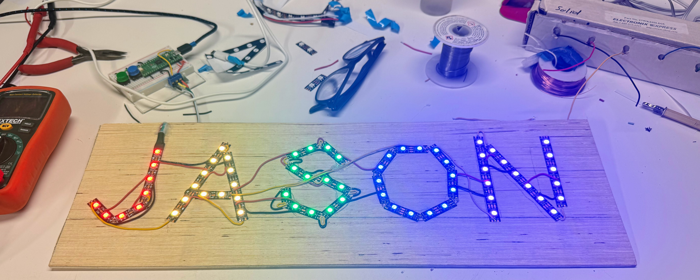
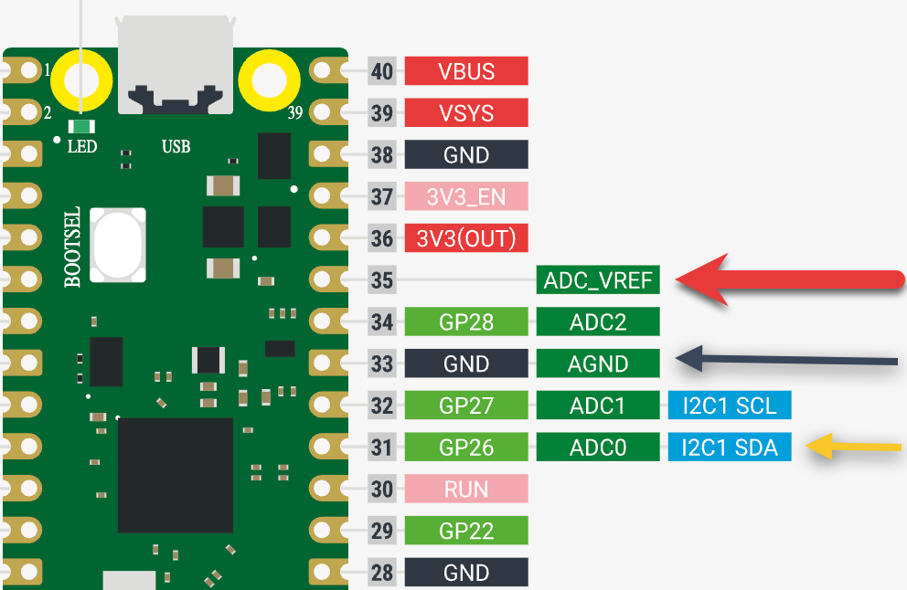
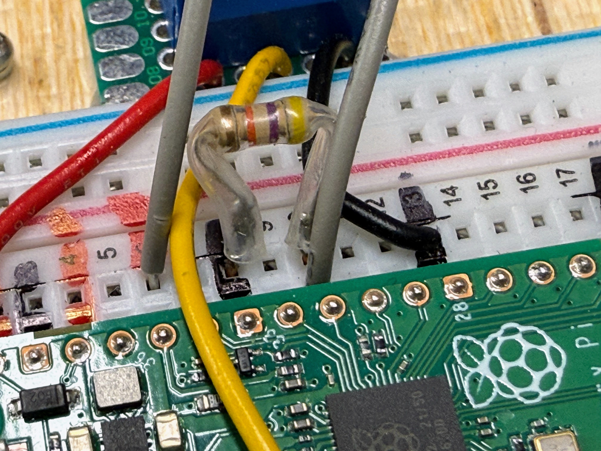

# Name Sign Night Light


## Project Description

This is a NeoPixel sign of the letters "JASON" that has a photo sensor on the back.
When the light goes out, the sign stays on for 10 minutes and then fades out.  Push
buttons on the back allow the user to change the pattern.

## Parts Used

1. 65 NeoPixels on a 60 pixels per meter LED strip ($6)
2. Raspberry Pi Pico ($4)
3. Breadboard ($2)
4. Photo resistor (under $1 each) when you buy in packs of 10
5. 47K ohm resistor ($.10)
6. Two momentary push buttons ($.25 each)
7. Hookup wire (black, red and yellow)
8. Scrap wood (1/4 inch plywood)
9. Diffusion plexiglass from a surplus store (under $2)

Total part cost: Under $16

## Hardware


We use a 60-pixels per meter LED strip that uses standards WS-1812B NeoPixels.
We traced out a design using PowerPoint.  We use a template that had a two
circles that were 1/60 of a meter apart and placed the circles within the
text of the word "JASON" in about 300 point.  The sign spread over two pages
so "JAS" was on the first page and "ON" was on the second page.  We then
printed the PowerPoint and cut out the shapes.  We traced them on a 1/4 in
piece of plywood and then placed the LED strips within the outline.  The
letter "J" used the first 8 pixels, and the letter "A" started at the 9th
pixel.  We kept track of how many pixels were in each letter so we could
assign their start and end pixel indexes.

The most time consuming part was to solder all the data lines together
and then to make sure each segment had a 5V and GND connection.  This
took about three hours of detailed soldering.  Using a string of fairy
lights with individual wires between them would be another option.

### Light Sensor

#### MicroSim of the Pico ADC Light Sensor Circuit
<iframe src="../../sims/pico-light-sensor/main.html" width="100%" height="485px" scrolling="no"></iframe>

[Run the Pico Light Sensor MicroSim Fullscreen](../../sims/pico-light-sensor/main.html)
[]()



We used a standard light-dependant resistor (LDR) in a voltage divider configuration
where the lower part of the voltage divider had a 47K ohm resistor.  The center
tap of the voltage divider went to to the Analog to Digital converter port of the Raspberry Pi Pico.

Note that I was carful to hook the ground to the `AGND` pin (breadboard row 8) and the top end of the divider to the `ADC_AREF` port (breadboard row 6).

You can see the connections below.  Note that the gray wires go to the light-dependant photo resistor.


### Testing the Photo Resistor

We can test that the photo resistor is connected and working correctly
by using the following program that uses the `read_u16` which reads
the unsigned 16-bit value from ADC 0 on port 26.

```python
import machine
import time
photo_pin = machine.ADC(26)

while True:
    // shift the ADC value over eight bits so we get a value between 0 and 255
    val = photo_pin.read_u16() >> 8
    print(val)
    time.sleep(.1)
```

To make sure the voltage divider is working, test in a bright light and also
in a dark room.  The printed values should change from a low value (around 10) to a high values (around 240).  The exact values are not critical, since we can adjust the threshold
in our code that goes from a bright to dark room to turn on the nightlight.

## AI Prompts

!!! prompt
    Please create a new MicroPython program for a LED sign that spells "JASON".  
    Make each letter a different color.  Use the config.py file in the directory.
    
    Here are the index start and end of each letter.

    j = (0, 7)
    a = (8, 20)
    s = (21, 33)
    o = (34, 47)
    n = (48, 64)

### Sample Hardware Config File

```python
# Moving Rainbow Configuration file
# Filename: config.py
# This file contains the hardware configuration for your kit
# This file can be imported by each program

# The pin that we connect the NeoPixel data pin
NEOPIXEL_PIN = 0

# The number of pixels in the sign
NUMBER_PIXELS = 65

# pins to change the sign mode
BUTTON_PIN_1 = 15
BUTTON_PIN_2 = 14

# The pin we connect the centerpoint of the voltage divider to the photoresitor
# The positive end is ADC_VREF and the negate is AGND
ADC_PIN_0 = 26

# Define pixel ranges for each letter (start, end) - end is inclusive
LETTERS = {
    'J': (0, 7),
    'A': (8, 20),
    'S': (21, 33),
    'O': (34, 47),
    'N': (48, 64)
}
```

### Night Light Prompt

!!! prompt
    Go into @src/jason-sign/ and create a new main.py file.  
    This main will use the mode buttons to change the mode.  
    The default mode=0 is a nightlight.  
    A rainbow pattern goes on when the light is out.  
    The pattern stays on for 10 minutes and then slowly fades over the remaining 10 minutes.  
    Turning the lights on will reset the sign to mode=0 - the default mode.
    For mode=0, set each pixel 0 to 64 to a value of wheel() so that the entire rainbow 
    of colors is shown.  Slowly move the colors down the strip. 

    If the user presses either mode button, 
    
    1. For mode = 1 the sign with display one color for each letter 
    2. For mode =2 the sign will rotate through all the colors of the rainbow uniform for the entire sign the same color. 
    3. For more = 3 the colors will all be random slowly changing each pixel through 0-255 using the wheel() function.

    Add a countdown timer on the console every 15 seconds to show how much time is left for the nightlight to turn off. 

### Gamma Correction Prompt

!!! prompt
    This code is pretty good.  However, I would like to work on a gradual fade.
    Right now it "appears" that the sign is really bright when we turn the lights off about 19 minutes.  It is only in the last 30 seconds that we perceive it to dim, 
    and then it goes off really fast.

    Can you use a gamma corrected table of brightness so the brightness appears to fade 
    slowly over the final 10 minutes?  Keep just a few pixels on for the final minute. 

### Response

Good observation! Human perception of brightness is logarithmic, so linear fading appears to stay bright until the very end. I'll add gamma correction and a special "night light" mode for the final minute with just a few dim pixels.

## Link to Source Code

[JASON Sign Source Code](https://github.com/dmccreary/moving-rainbow/tree/master/src/jason-sign)

---

## Quiz Time!

Let's see what you learned about the JASON sign! Pick the best answer for each question.

---

#### 1. What name does the LED sign spell?

<div class="upper-alpha" markdown>
1. JAMES
2. JASON
3. JACOB
4. JAMIE
</div>

??? question "Show Answer"
    The correct answer is **B**. The sign spells JASON using 65 colorful LED lights!

---

#### 2. What happens to the sign when you turn off the lights in the room?

<div class="upper-alpha" markdown>
1. The sign turns off right away
2. The sign gets brighter
3. The sign stays on like a nightlight
4. The sign makes a sound
</div>

??? question "Show Answer"
    The correct answer is **C**. When the room gets dark, the sign stays on like a nightlight to help you see! It slowly gets dimmer over time.

---

#### 3. How many letters are in the word JASON?

<div class="upper-alpha" markdown>
1. 3 letters
2. 4 letters
3. 5 letters
4. 6 letters
</div>

??? question "Show Answer"
    The correct answer is **C**. JASON has 5 letters: J - A - S - O - N. Can you count them on your fingers?

---

#### 4. In Mode 1, each letter is a different color. What does this mean?

<div class="upper-alpha" markdown>
1. All letters are the same color
2. The J might be red, A might be blue, S might be green, and so on
3. The letters are invisible
4. Only one letter lights up
</div>

??? question "Show Answer"
    The correct answer is **B**. In Mode 1, each letter gets its own special color! The J could be red, A could be blue, S could be green - each letter is different and pretty!

---

#### 5. What do the buttons on the back of the sign do?

<div class="upper-alpha" markdown>
1. Turn the sign upside down
2. Make the sign louder
3. Change the color patterns
4. Make the sign bigger
</div>

??? question "Show Answer"
    The correct answer is **C**. The buttons let you change how the colors look! You can pick rainbow colors, different colors for each letter, or fun random colors.