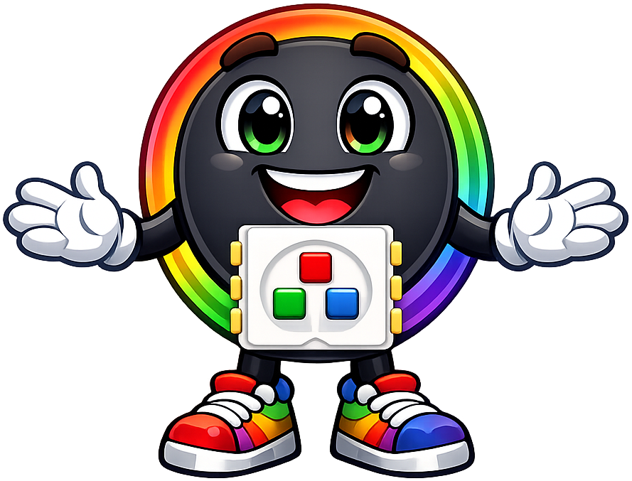
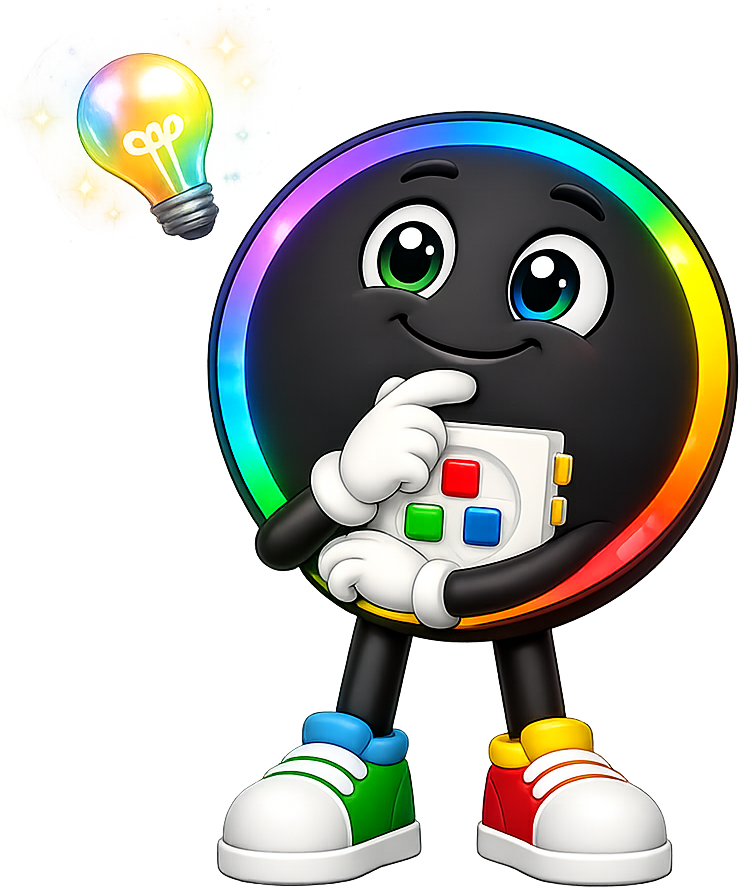
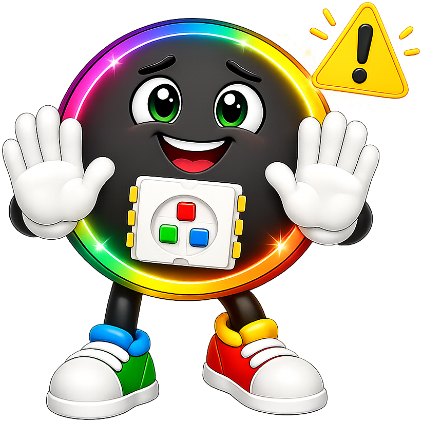

# Lab 3: Test the Knob

This program tests the **rotary encoder** — the knob you can spin on your box.
A rotary encoder is a knob that tells the chip when it turns and which way it
turns. You won't need the LED strip for this lab. Watch the console for your
results.

!!! tip "Pixel says..."
    
    Spinning a knob feels simple to you. But the chip has to do some clever
    detective work to know which way you turned it. The secret is **memory** —
    the chip remembers what it saw a moment ago. Let's spin this up!

## What You'll Learn

By the end of this lab, you'll be able to:

- Explain how a rotary encoder uses two switches, called **A** and **B**
- Use a variable to **remember** a value between loop passes
- Compare a new reading to the saved one to find the spin **direction**
- Make a **counter** that goes up when you spin one way and down the other way

## What You'll Need

- Your Rotary Spinner Box with the Pico inside
- A USB cable to connect the box to your computer
- The Thonny program open on your computer

You do **not** need the LED strip or the buttons for this lab. You only need the
knob.

## How a Rotary Encoder Works

Inside the knob are two tiny switches. We call them **A** and **B**. As you
turn the knob, each switch flips on and off. A turns and B turns, but they don't
flip at the exact same moment. One always changes a little before the other.

That tiny gap in timing is the whole trick. If A flips first, you spun one way.
If B flips first, you spun the other way. The chip watches the order to figure
out the direction.

In our box, switch A connects to **GPIO pin 12** and switch B connects to
**GPIO pin 13**. A **pin** is a metal connection point on the chip. In the code,
switch A is named `clk` and switch B is named `dt`.

## Setting Up the Pins

First, the program brings in its tools and reads the pin numbers from a settings
file called `config.py`.

```python
import utime
import machine
from machine import Pin

import config

# Set up the two encoder pins as inputs with internal pull-up resistors
clk = machine.Pin(config.ROTARY_ENCODER_PIN_A, machine.Pin.IN, machine.Pin.PULL_UP)
dt = machine.Pin(config.ROTARY_ENCODER_PIN_B, machine.Pin.IN, machine.Pin.PULL_UP)
```

After this runs, the chip is ready to read both switches as **inputs** (signals
coming *in* from the knob).

A **pull-up resistor** keeps each pin at a steady value when nothing is pressing
on it. Without it, the reading would jump around on its own. The chip has these
resistors built in, so we turn them on with `machine.Pin.PULL_UP`.

## Remembering the Last Reading

Here is the key idea of this whole lab. The program saves the value of switch A
*before* the loop starts. That saved value is the chip's memory.

```python
# Remember the last value of CLK so we can see when it changes
last_clk = clk.value()

# The running counter
counter = 0
```

The variable `last_clk` holds what switch A looked like a moment ago. The
variable `counter` starts at `0` and will count your spins.

!!! info "Pixel thinks..."
    
    Why save the old value? Because one reading alone tells us nothing. A `1`
    by itself isn't going anywhere. Only by comparing the new reading to the
    old one can we tell that something *changed*. This idea of remembering the
    past to understand the present is called **state**.

## Finding the Direction

Now the loop runs over and over. Each time, it reads switch A and compares it to
the saved value.

```python
while True:
    current_clk = clk.value()
    # We act only on the falling edge of CLK (when it changes from 1 to 0)
    if current_clk != last_clk and current_clk == 0:
        if dt.value() != current_clk:
            counter += 1
            print('CW  -> count:', counter)
        else:
            counter -= 1
            print('CCW -> count:', counter)
    last_clk = current_clk
```

When you spin the knob, the console prints `CW` (clockwise) and counts up, or
`CCW` (counterclockwise) and counts down.

Let's read the loop step by step. **Iteration** means repeating these steps
again and again.

- `current_clk = clk.value()` reads switch A right now.
- `current_clk != last_clk` checks if switch A **changed** since last time. The
  `!=` symbol means "is not equal to."
- `and current_clk == 0` makes sure we act only when A drops to `0`. This is
  called the **falling edge**, and it gives us one clean count per click.
- `if dt.value() != current_clk:` peeks at switch B. If B does not match A, you
  spun **clockwise**, so `counter += 1` adds 1.
- `else:` covers the other case. B matches A, so you spun **counterclockwise**,
  and `counter -= 1` takes away 1.
- `last_clk = current_clk` saves the new reading. This updates the chip's memory
  for the next loop pass.

That last line is the heart of **state**. Each pass remembers what it saw, so
the next pass can spot the next change.

!!! warning "Watch out!"
    
    If your counter jumps by 2 or skips numbers, that's normal for a cheap knob.
    Spin slowly and steadily for the cleanest counts. Fast spins can fool the
    chip into missing a click. That's a puzzle to solve, not a failure!

## Try It Yourself

1. **Swap the direction.** If clockwise counts *down* instead of up, your two
   wires are flipped. In `config.py`, swap the values for
   `ROTARY_ENCODER_PIN_A` and `ROTARY_ENCODER_PIN_B`. Now clockwise should count
   up again.
2. **Start somewhere else.** Change `counter = 0` to `counter = 100`. Watch the
   numbers climb and fall from your new starting point.
3. **Count by tens.** Change `counter += 1` to `counter += 10` and `counter -= 1`
   to `counter -= 10`. How fast can you reach 100 now?

## Check Your Understanding

1. How many switches are inside a rotary encoder, and what do we call them?
2. What does the variable `last_clk` remember?
3. How does the chip tell clockwise from counterclockwise?
4. What does `counter += 1` do?
5. What is the name for remembering a past value to understand the present?

!!! success "Chapter complete!"
    
    You taught a chip to feel which way you turn a knob — using nothing but
    memory! That same idea, comparing now to before, powers game controllers,
    car dashboards, and volume dials everywhere. You're already glowing!

## What's Next

In [Lab 4: Test the Strip](04-strip-test.md), you'll light up all 12 pixels and
make sure every one of them works.
