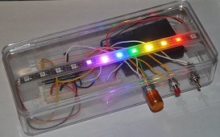
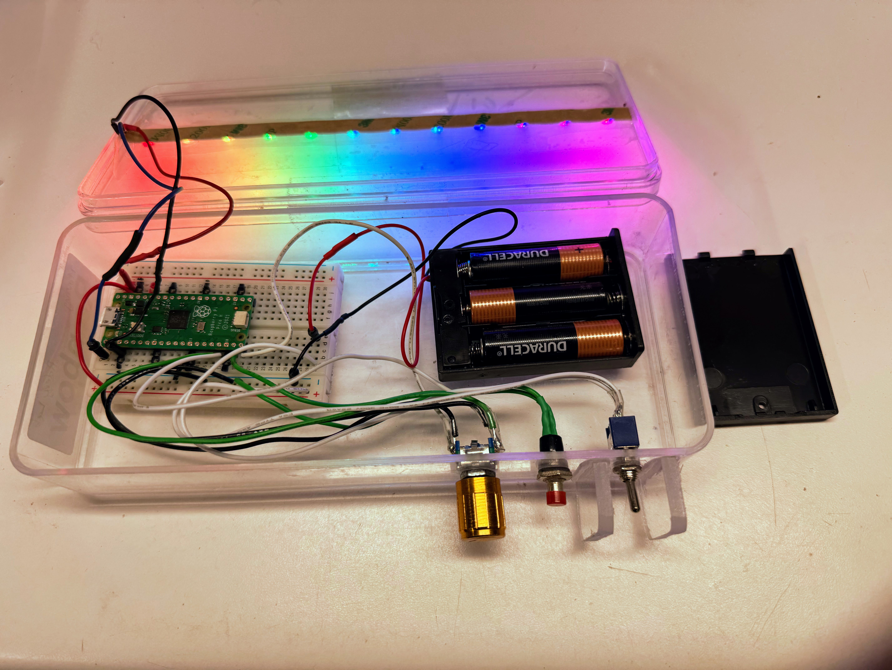
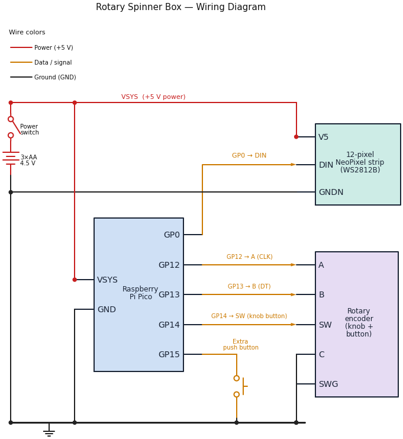

# Rotary Spinner Box

{ height="200px" align="left" }
{ height="200px" align="right" }

The Rotary Spinner Box is a small light-up box you can hold in your hands.
Inside is a strip of 12 color LEDs (lights). You control them with a **knob you
spin** and **two buttons you press**. Turn the knob and watch the lights
react right away!

!!! tip "Pixel says..."
    
    Hi, I'm Pixel! This box is one of my favorites. You spin the knob and the
    lights move. You press a button and a whole new pattern shows up. Best of
    all, *you* write the code that makes it happen. Let's light this up!

## What You'll Learn

These labs take you from your very first blink all the way to a program with
nine light shows in one box. Along the way you'll learn to:

- Run your first program on a real computer chip
- Read a **button press** and a **knob turn** in code
- Make a light **move** along the strip
- Use a **variable** (a named box that holds a value) to change a pattern
- Build a **state machine** (a program that can be in one of several modes)

Every lab is a small, working program. You can run each one on its own.

## What's in the Kit

Your kit has everything you need for about **\$15**:

- Raspberry Pi Pico microcontroller (the small computer chip that runs your code)
- Rotary encoder with a built-in push button (the knob you spin and press)
- 1/2-size breadboard with 400 tie points (a board for connecting parts with no solder)
- 12-pixel addressable NeoPixel RGB LED strip (WS2812B) — a straight strip, not a ring
- One extra momentary push button (a button that only counts while you hold it down)
- Power switch
- 3 AA batteries and a battery case
- 22 gauge solid jumper wires (the wires that connect the parts)
- USB cable (some kits include both a USB-A and a USB-C cable)

## Putting the Box Together

!!! note "Assembly steps coming soon"
    Step-by-step build instructions with photos will go here in the next
    update. For now, if your box is already built, you're ready to start the
    labs below.

    *Placeholder — assembly walkthrough to be added.*

## How the Parts Connect

The diagram below shows how the strip, the knob, and the buttons connect to
the Pico.

Follow the colors: **red** wires carry *power*, **amber** wires carry *data
and button signals*, and **black** wires are *ground* (the shared return
path).

- The NeoPixel strip's **DIN** (data-in) goes to **GP0**.
- The knob's **A** and **B** go to **GP12** and **GP13**, and its built-in
  button (**SW**) goes to **GP14**.
- The **extra push button** goes to **GP15**.
- Power comes from the **3×AA battery pack** through the **power switch** into
  the Pico's **VSYS** pin, which also feeds the strip's **+5 V**.
- Every part shares one **ground** rail along the bottom.

The push buttons and the knob use the Pico's *internal pull-up resistors*, so
their other side connects straight to ground — no extra resistors needed.

!!! tip "How to read it"
    
    A dot where two wires meet means they are connected. Wires that simply
    cross with no dot are *not* connected — they just pass over each other.

The pin connections your code uses are stored in one shared file,
[`config.py`](https://github.com/dmccreary/moving-rainbow/tree/master/src/kits/rotary-spinner-box):

| Part | Pico GPIO Pin |
|------|---------------|
| NeoPixel LED strip (12 pixels) | 0 |
| Rotary encoder (knob) A / B | 12 / 13 |
| Push button 1 | 14 |
| Push button 2 | 15 |

Because every program imports `config.py`, you never have to remember pin
numbers. You just write `config.NEOPIXEL_PIN`, and the right number fills in.

## Getting Your Code onto the Box

You write code on your computer, then copy it to the Pico. We use a free
program called **Thonny** to do this. Each lab tells you which file to run.

!!! tip "Pixel's tip"
    
    Only one program can talk to the Pico at a time. If your code won't upload,
    make sure Thonny is the only thing connected to the box.

## The Labs

Work through these in order. Each one adds one new idea.

| Lab | Title | The big idea (computational thinking) |
|-----|-------|----------------------------------------|
| 1 | [Blink the Onboard LED](01-blink-internal-led.md) | Sequencing and loops — your first program |
| 2 | [Test the Buttons](02-button-test.md) | Events — code that reacts to input |
| 3 | [Test the Knob](03-rotary-test.md) | State — remembering the last value to find direction |
| 4 | [Test the Strip](04-strip-test.md) | Iteration — doing the same thing to every pixel |
| 5 | [The Scanner](05-spinner.md) | Variables and direction — moving and bouncing |
| 6 | [The Comet](06-comet.md) | Decomposition — a color for every pixel |
| 7 | [The Rainbow](07-rainbow.md) | Functions — the color wheel as a reusable tool |
| 8 | [The Moving Rainbow](08-moving-rainbow.md) | Animation — changing a variable over time |
| 9 | [Knob Brightness](09-rotary-brightness.md) | Parameters — an input that changes a value |
| 10 | [Knob Color](10-rotary-color.md) | Parameters and wrap-around (modulo) |
| 11 | [Button Speed](11-button-speed.md) | Interrupts — reacting without waiting |
| 12 | [The Mode Machine](20-mode-machine.md) | State machines — many modes in one program |
| 13 | [The Capability Demo](21-demo.md) | Abstraction — data that drives nine patterns |

## Why This Teaches Computational Thinking

**Computational thinking** means solving problems the way a computer scientist
does. These labs grow five big skills:

- **Decomposition** — break a big light show into small steps.
- **Patterns** — notice that "move a dot" and "move a comet" share an idea.
- **Abstraction** — hide the messy details inside a function like `color_wheel`.
- **Algorithms** — write clear, step-by-step instructions.
- **Debugging** — when the lights do something odd, that's a puzzle to solve.

!!! success "You've got this!"
    
    You don't need to know any of this yet. That's what the labs are for. Start
    with Lab 1, take it one step at a time, and you'll be writing real light
    shows before you know it.

## What's Next

Start with [Lab 1: Blink the Onboard LED](01-blink-internal-led.md) — it runs
with no wiring at all.
