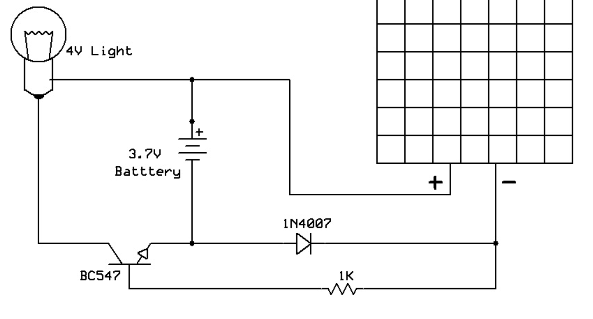

# Solar Powered Nightlight

The Solar Powered Nightlight charges itself during the day and lights up
on its own at night. There is no code and no power switch to flip. The
sun does the charging, and the dark does the switching.

!!! tip "Pixel says..."
    This is my dream gadget — it never needs new batteries! All day it
    drinks up sunlight to charge. When the sun goes down, it wakes up
    and glows. Let's see how the parts pull off this trick.

## What you'll learn

- How a solar panel charges a battery
- How a diode keeps current flowing the right way
- How a transistor switches the lamp on at night

## What you'll need

- A small solar panel
- A rechargeable battery (about 3.7V)
- A diode (1N4007)
- An NPN transistor (BC547)
- A 1 kΩ resistor
- A small lamp or LED (about 4V)

## The Circuit

The nightlight has two jobs: **charge by day** and **light up at night**.

- **During the day,** the solar panel makes a voltage higher than the
  battery. Current flows through the diode and charges the battery. That
  same panel voltage keeps the transistor switched off, so the lamp
  stays dark and no power is wasted.

- **At night,** the panel makes almost no voltage. Nothing holds the
  transistor off anymore, so it switches on. Current flows from the
  battery, through the lamp, and the lamp glows.

For a full part-by-part walkthrough, see:

[How the Solar Powered Nightlight Works](./how-it-works.md)

## Explore the Circuit

Want to play with the circuit before you build it? Try the interactive
simulation:

[Solar Powered Nightlight MicroSim](./microsim.md)

## Build the Circuit Diagram

The circuit diagram was drawn with a tool called CircuiTikz. You can see
how an AI helper turned a sketch into a real diagram here:

[Circuit Diagram Prompt](./prompt.md)

!!! info "Pixel thinks..."
    The diode is the secret hero here. It's a one-way gate for
    electricity. It lets the panel charge the battery, but stops the
    battery from leaking backward into the panel at night.

## Try It Yourself

- Cover the solar panel with your hand and watch the lamp turn on.
- Measure the battery voltage in the morning and again at night.
- Trace the path the current takes at night with your finger:
  battery → lamp → transistor → back to the battery.

## Related Kits

- [Analog Nightlight kit](../analog-nightlight/index.md)
- [Digital Nightlight kit](../digital-nightlight/index.md)
- [LED Noodle Nightlight kit](../led-noodle-nightlight/index.md)
