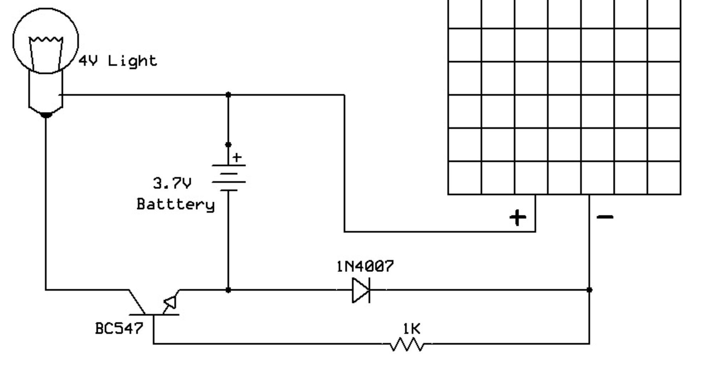

# Prompt

!!! prompt
    Given this sketch of a solar powered nightlight, create a LaTeX Circuititz file that represents the circuit.



Result

```latex
\documentclass[border=2pt]{standalone}
\usepackage[american]{circuitikz}

\begin{document}
\begin{circuitikz}[scale=1, transform shape]
    %--- Place the lamp at top-left
    \node[lamp, label=above:4V Light] (lamp) at (0,3) {};

    %--- Place an NPN transistor below the lamp
    \node[npn, label=left:BC547] (Q1) at (0,1.5) {};

    %--- Connect the lamp to the transistor collector
    \draw (lamp.base) -- (Q1.collector);

    %--- Battery in the middle
    \node[battery1, rotate=270,
          label={[shift={(0,0.3)}]above:3.7V Battery}] (Bat) at (2,2) {};

    %--- Transistor emitter to battery negative
    \coordinate (neg) at (0,0);
    \draw (Q1.emitter) -- (neg);
    \draw (Bat.negative) -- ++(-0.5,0) |- (neg);

    %--- Battery positive to lamp
    \draw (Bat.positive) -- ++(0.5,0) |- (lamp.top);

    %--- Solar panel on the right (just drawn as a rectangle)
    \draw (4,3) rectangle (6,0);
    % Label inside the rectangle
    \node at (5,1.5) {Solar Panel};

    % Mark the + and - leads on left edge of panel
    \draw (4,3) node[left] {$+$};
    \draw (4,0) node[left] {$-$};

    %--- Connect battery + to solar panel +
    \draw (Bat.positive) -- (4,3);

    %--- Diode and resistor from solar panel – to battery negative
    \draw (4,0)
       to [D, l^=1N4007] (5.5,0)
       to [R, l^=1k$\Omega$] (neg);

\end{circuitikz}
\end{document}
```

**Explanation of the main pieces:**

-   The lamp (`lamp`) is placed at the top left.
-   The **BC547** transistor (`npn`) is placed below the lamp.
-   The battery is drawn with `\node[battery1, rotate=270]{}` so that its positive terminal is up and negative is down.
-   The solar panel is simply a rectangle labeled *"Solar Panel"* with its + and -- terminals on the left edge.
-   A diode (1N4007) in series with a 1 k Ω resistor connects from the panel's negative side back to the circuit negative (transistor emitter and battery negative).