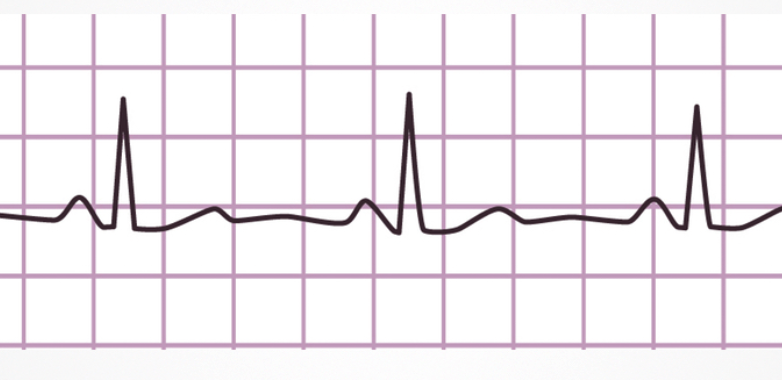

# Lab 23: Heartbeat

!!! tip "Pixel says..."
    
    Lub-dub, lub-dub! We're going to make one pixel beat like a heart, with a strong
    pulse, a soft pulse, and a rest. Let's light this up!

**Program file:** [`23-heartbeat.py`](https://github.com/dmccreary/moving-rainbow/blob/master/src/kits/moving-rainbow-base/23-heartbeat.py)

## What you'll learn

- How to write a function with a parameter, like `pulse(peak)`
- How calling one function twice with two different numbers makes two different beats
- How `range` counts up in steps of 10 and back down with a negative step
- How `sleep` times add up to set the heart rate
- What a brightness envelope is

## What you'll need

- Your base kit: a Pico, a breadboard, and the 30-pixel LED strip, wired as shown in the [Kit User's Guide](../kits/moving-rainbow-base/index.md)
- The `config.py` file saved on the Pico (see [Getting Code onto the Kit](../kits/moving-rainbow-base/index.md#getting-code-onto-the-kit))
- Thonny open and connected to your Pico
- A little practice with `range` from [Lab 04: Dimmer](04-dimmer.md). Its "Going further" section asks you to build a heartbeat, and this lab is the finished version.

## The program

This program makes the first pixel beat like a heart: a strong red pulse, a short pause, a softer red pulse, and a longer rest.

```python title="23-heartbeat.py"
--8<-- "src/kits/moving-rainbow-base/23-heartbeat.py"
```

Run it. Pixel number 0 glows and fades twice, first bright and then softer, and then rests. The rest of the strip stays dark.

## How it works

### The shape of a heartbeat

Each heartbeat makes two sounds, which we write as "lub" and "dub." The first is strong and the second is softer. Then the heart rests before the next beat.

Doctors record a heart's electrical signal on a chart called an **EKG**. Each beat shows up as a tall spike, with a quiet stretch in between.



Our light can't draw an EKG, but it can copy the rhythm. The shape that says how bright a light is over time is a **brightness envelope**. Ours has a big bump, a small bump, and a flat rest. [Chapter 14](../chapters/14-advanced-animation-patterns/index.md) explains envelopes, and the [Brightness Envelopes](../sims/brightness-envelope-comparison/index.md) MicroSim lets you compare a few.

### Two settings

```python
STEP = 10           # how much the brightness changes at each step
RAMP_DELAY = 0.01   # seconds between steps: a small number makes a quick pulse
```

These two names are **constants** (values we choose once and then leave alone). Capital letters are the hint. `STEP` is how much the brightness changes at each step. `RAMP_DELAY` is how many seconds the pulse waits between steps.

A bigger `STEP` means fewer steps, so the pulse is quicker.

### A function with a parameter

The `pulse` function draws one beat. A **function** is a named block of code that you can run again and again. A **parameter** is a named slot for a value you hand to the function. Here the parameter is `peak`, the brightest level of the beat.

```python
def pulse(peak):
    # brightness rises up to the peak...
    for level in range(0, peak, STEP):
        strip[0] = (level, 0, 0)
        strip.write()
        sleep(RAMP_DELAY)
```

The `def` line only defines the function. Nothing happens until the program **calls** it. When the program calls `pulse(120)`, the name `peak` holds 120. When it calls `pulse(80)`, `peak` holds 80. It's the same code with a different size of beat.

!!! info "Key idea"
    One function makes two beats. Without a parameter, we would write the whole pulse twice, once for each beat. With `peak`, we write it once and change only the number.

### Count up, then count down

The loop above counts up. For `pulse(120)`, `range(0, peak, STEP)` makes 0, 10, 20, and so on up to 110. The stop number is not included, so that is 12 steps. Each step sets the red brightness to `level`, writes it, and waits.

Here is the loop inside `pulse` that counts back down, plus the two lines that finish the beat.

```python
# ...and then falls back down to dark
for level in range(peak, 0, -STEP):
    strip[0] = (level, 0, 0)
    strip.write()
    sleep(RAMP_DELAY)
strip[0] = (0, 0, 0)
strip.write()
```

As you saw in Lab 04, `range` counts down when its step is negative. Here `-STEP` is -10, so the loop counts 120, 110, 100, and so on down to 10. That is 12 steps again. The brightest moment is 120, the first step of this loop.

The loop stops before 0, so the last two lines turn the pixel fully off.

So the strong beat has 12 steps up and 12 steps down. The softer beat, `pulse(80)`, has 8 steps up and 8 steps down. Every step sleeps 0.01 seconds. The strong beat takes about 0.24 seconds, and the soft beat takes about 0.16 seconds.

### Lub, dub, rest

```python
while True:
    pulse(120)      # "lub": the strong beat
    sleep(0.1)
    pulse(80)       # "dub": the softer beat
    sleep(0.4)      # rest before the next heartbeat
```

The main loop calls `pulse(120)` for the strong "lub." It waits 0.1 seconds, calls `pulse(80)` for the softer "dub," and then rests for 0.4 seconds. Then `while True:` starts the next beat.

Add up the time the program sleeps in one heartbeat:

| Part | Time |
|------|------|
| "lub": 24 steps × 0.01 seconds | 0.24 seconds |
| short pause | 0.10 seconds |
| "dub": 16 steps × 0.01 seconds | 0.16 seconds |
| rest | 0.40 seconds |
| **One heartbeat** | **0.90 seconds** |

There are 60 seconds in a minute, and 60 ÷ 0.9 is about 67. Each `strip.write()` takes a moment too, so the real heart rate is a bit slower. Expect about 65 beats a minute. That's close to the pace of a calm, resting heart.

Only the first pixel lights, and its red tops out at 120. That is gentle: about 9 **milliamps** (mA, a small unit of electric current).

## Try it yourself

1. Change the heart rate. Change the last `sleep(0.4)` to `sleep(0.8)` and watch the beat slow down. Then aim for exactly 120 beats a minute. One beat must last 60 ÷ 120 = 0.5 seconds. The steps already sleep for 0.4 seconds, so the two rests must add up to about 0.1 seconds. Try `sleep(0.05)` for both, then check with a stopwatch: 30 beats should take 15 seconds. Each `strip.write()` adds a little time, so you may need to trim the rests a bit more.
2. Make the whole strip beat. Replace the `pulse` function with the version below. The small `for i in range(NUMBER_PIXELS)` loop sets every pixel instead of only pixel 0.

```python title="Your change"
def pulse(peak):
    for level in range(0, peak, STEP):
        for i in range(NUMBER_PIXELS):     # set every pixel to the same level
            strip[i] = (level, 0, 0)
        strip.write()
        sleep(RAMP_DELAY)
    for level in range(peak, 0, -STEP):
        for i in range(NUMBER_PIXELS):
            strip[i] = (level, 0, 0)
        strip.write()
        sleep(RAMP_DELAY)
    for i in range(NUMBER_PIXELS):
        strip[i] = (0, 0, 0)
    strip.write()
```

Run it. All 30 pixels pulse together like one big heart. Try removing the last loop to see what it does. The down loop ends at 10, so pixels 1 to 29 would keep a faint red glow during the rest.

With all 30 pixels at red 120, the strip draws about 283 mA. That is under the 500 mA a USB port supplies, so it's safe. Before you raise the peaks, work out the new total with [How Bright Can You Go?](../kits/moving-rainbow-base/index.md#how-bright-can-you-go)

The `for i in range(NUMBER_PIXELS)` loop now appears three times. Can you put it in a small function of its own?

## Check your understanding

1. In the call `pulse(80)`, what number does `peak` hold?
2. Which numbers does `range(0, peak, STEP)` make when `peak` is 120? How many steps is that?
3. Why does the second loop use `-STEP`?
4. Add up the sleeps in one heartbeat. How long is it, and about how many beats a minute does that make?
5. Why does `pulse` end with `strip[0] = (0, 0, 0)`?

!!! success "Lab complete!"
    
    You made a light with a pulse! One function and two different numbers gave you both the lub and the dub.

**What's next:** In [Lab 24: Fading Stars](24-fading-stars.md), stars flare up at random places, and a list remembers how bright each pixel is as it fades.
