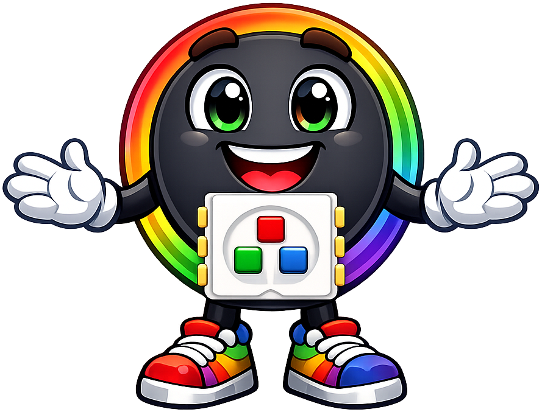

# Lab 33: Button and Built-in LED

!!! tip "Pixel says..."
    
    Here's where your code stops watching and starts reacting! You press a button, and a light answers. That's the heart of every interactive project.

**Program file:** [`33-button-led-test.py`](https://github.com/dmccreary/moving-rainbow/blob/master/src/kits/moving-rainbow-base/33-button-led-test.py)

## What you'll learn

- How to turn an output on and off with `led.on()` and `led.off()`
- How to use `if` and `else` to react to a button
- How `old_value` lets a program print only when something changes
- Where the Pico's built-in LED lives, and how to reach it on a Pico W

## What you'll need

- Your base kit: a Pico, a breadboard, and a push button wired as shown in [The Two Buttons](../kits/moving-rainbow-base/index.md#the-two-buttons). This lab uses Button 1 only.
- The `config.py` file saved on the Pico (see [Getting Code onto the Kit](../kits/moving-rainbow-base/index.md#getting-code-onto-the-kit))
- Thonny open and connected to your Pico

This lab builds on [Lab 32: Button Test](32-button-test.md), which explains why a pressed button reads `0`. It does not use the LED strip.

## The program

This program turns the Pico's built-in LED on while you hold Button 1. It also prints the button's value each time the value changes.

```python title="33-button-led-test.py"
--8<-- "src/kits/moving-rainbow-base/33-button-led-test.py"
```

Run it. The small green LED on the Pico board glows while you press Button 1 and goes dark when you let go. The Shell prints `1` at the start, `0` when you press, and `1` when you release.

## How it works

### One pin listens, one pin sends

```python
button = Pin(BUTTON_PIN_1, Pin.IN, Pin.PULL_UP)
...
led = Pin(BUILT_IN_LED_PIN, Pin.OUT)
```

The `button` is an input, as in Lab 32. The `led` is an **output**: a pin the Pico controls, so it can turn something on. `BUILT_IN_LED_PIN` is 25, the pin that connects to the LED on the board. Every standard Pico uses the same pin, so it lives in the program and not in `config.py`.

!!! warning "Heads up"
    A Pico W is different. Its built-in LED is not on pin 25. On a Pico W, replace the `led = ...` line with the version below.

```python title="Your change"
led = Pin("LED", Pin.OUT)
```

### React to the button

This part reads the button and picks what the LED does.

```python
    button_value = button.value()
    
    # change the LED to on when the button is pressed
    if button_value == 1:
        led.off()
    else:
        led.on()
```

The `==` sign asks "are these two things equal?" A single `=` stores a value instead. If `button_value` is `1`, the button is released, so `led.off()` runs. Otherwise the value must be `0`, so the button is pressed and `led.on()` runs. The LED is on exactly while you hold the button.

### Print only when the value changes

The program starts with two variables.

```python
button_value = 0
old_value = 0
```

Then the last part of the loop compares them.

```python
    if button_value != old_value:
        print(button_value)
        old_value = button_value
```

The `!=` sign means "is not equal to". The `old_value` variable remembers the value from the last time we printed. If the new value is different, the program prints it and updates `old_value`. Without this check, the Shell would fill with `1`s or `0`s as fast as the loop can run.

You may wonder why a `1` appears before you press anything. `old_value` starts at `0`, but a released button reads `1`. On the first pass they differ, so the program prints `1`. That is the program noticing the button's real value, not a press.

Unlike Lab 32, this loop has no `sleep()`. It checks the button as fast as it can, so it catches even a quick tap.

!!! info "Key idea"
    Because the loop is so fast, a button can print an extra pair of numbers now and then. The reason is **bounce**: the metal contacts inside touch and separate a few times in a few thousandths of a second. [Lab 34](34-two-button-print.md) shows how to handle it.

## Try it yourself

1. Make the LED normally on and off while you press. Swap the two lines `led.off()` and `led.on()`.
2. Print words instead of numbers. Replace the `if button_value != old_value:` block with this version. Keep it indented inside the loop.

```python title="Your change"
if button_value != old_value:
    if button_value == 0:
        print("pressed")
    else:
        print("released")
    old_value = button_value
```

## Check your understanding

1. Which pin is the built-in LED on for a standard Pico? How do you name it on a Pico W?
2. Why does the LED turn on when `button_value` is `0`?
3. Why does the Shell print a `1` before you press anything?
4. What would happen if we removed the `old_value` check?

!!! success "Lab complete!"
    
    A press went in and a light came out! That input-to-output idea is inside every interactive project you'll build.

**What's next:** In [Lab 34: Two Buttons](34-two-button-print.md), you'll add a second button and meet a faster way to catch a press.
