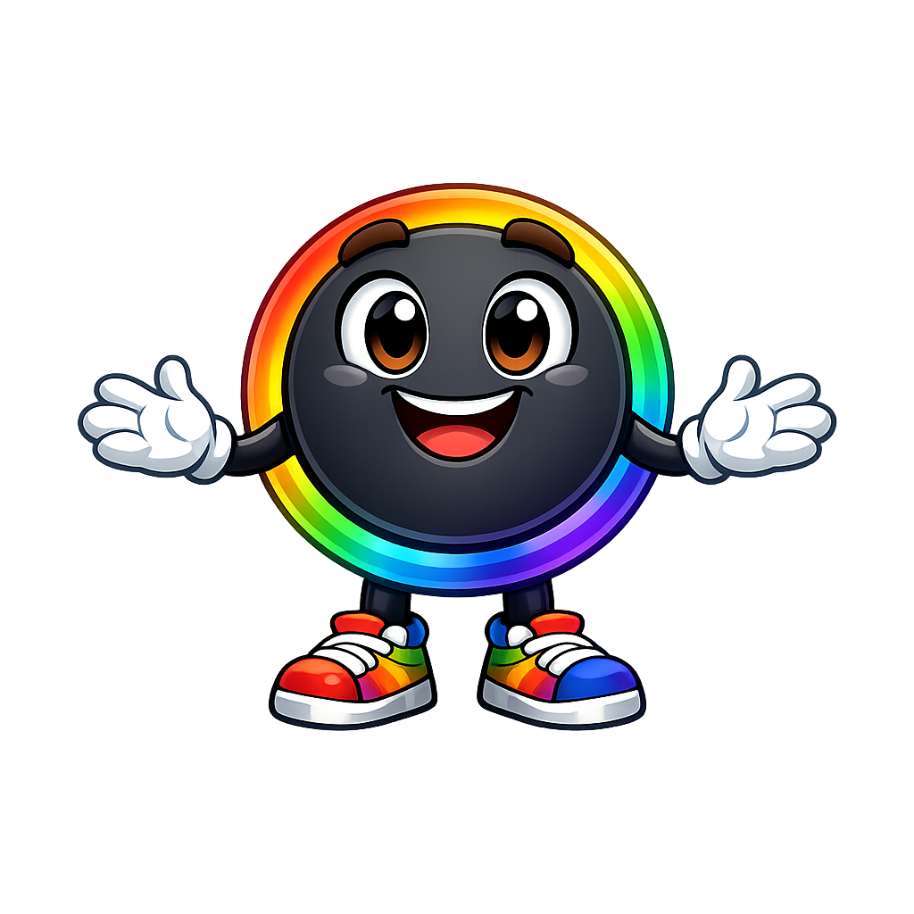

# Pixel Mascot Style Guide

This page shows all seven of Pixel's admonition styles for reference and testing.
Use it to verify that images load, colors look right, and text wraps cleanly
around each pose. Image paths use `../../img/mascot/` because this page renders
two directories deep (`learning-graph/mascot-test/index.html`).

---

!!! mascot-neutral "Just a Note from Pixel"
    { class="mascot-admonition-img" }
    Hi there! I'm Pixel — your guide through the Moving Rainbow textbook.
    This is my **neutral** style, used for general sidebars and introductions
    where no particular emotion is needed. Think of it as my "just hanging out" look.

---

!!! mascot-welcome "Welcome!"
    { class="mascot-admonition-img" }
    Welcome, coder! I'm so excited you're here. Every chapter starts with
    a welcome box like this one where I'll tell you what we're about to learn
    and why it's going to be awesome. Let's light this up!

---

!!! mascot-thinking "Key Insight"
    { class="mascot-admonition-img" }
    This is my **thinking** style — used when there's an important idea worth
    pausing on. Notice how my rainbow ring glows a little brighter when I'm
    concentrating? That's because thinking takes *all the watts*.

---

!!! mascot-tip "Pixel's Tip"
    { class="mascot-admonition-img" }
    This is my **tip** style — used when I have a helpful hint that will save
    you time or make your code cleaner. See that sparkle near my hand?
    That means the tip is extra good. (They're all extra good, I promise.)

---

!!! mascot-warning "Watch Out!"
    { class="mascot-admonition-img" }
    This is my **warning** style — used for common mistakes that beginners
    run into. My hands are up, but I'm smiling because everyone makes these
    mistakes! The important thing is now you'll know what to look for.

---

!!! mascot-encourage "You Can Do This!"
    { class="mascot-admonition-img" }
    This is my **encouraging** style — used when the going gets a little tough.
    Thumbs up from me means I genuinely believe in you. Every great coder
    got stuck on exactly what you're working on right now. Keep going!

---

!!! mascot-celebration "Great Work!"
    { class="mascot-admonition-img" }
    This is my **celebration** style — used at the end of chapters and whenever
    something truly excellent happens. My rainbow ring is blazing at full power
    right now, and that's *exactly* how proud I am of you!

---

## Image Border Test

Use the section below to check for excess transparent padding — if Pixel looks
too small inside the boxes, run the trim script on the affected PNG files.

| Pose | Preview |
|------|---------|
| neutral | { width=120 } |
| welcome | { width=120 } |
| thinking | { width=120 } |
| tip | { width=120 } |
| warning | { width=120 } |
| encouraging | { width=120 } |
| celebration | { width=120 } |

If a pose image is missing (broken image icon), it hasn't been generated yet.
Use the prompts in [`../../img/mascot/mascot-image-prompts.md`](../../img/mascot/mascot-image-prompts.md)
to generate it, then save it to `docs/img/mascot/` with the correct filename.
