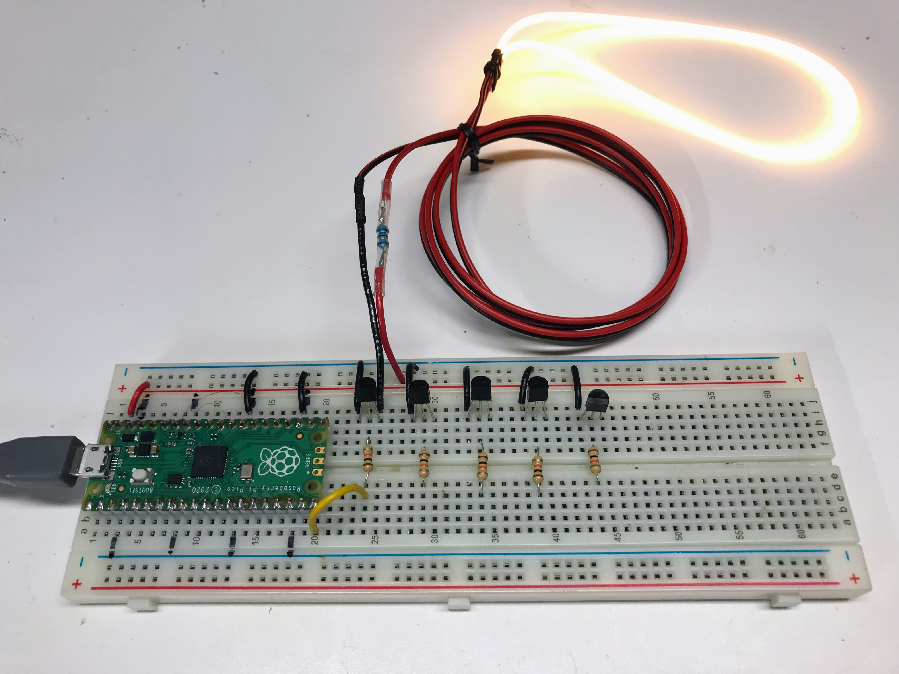
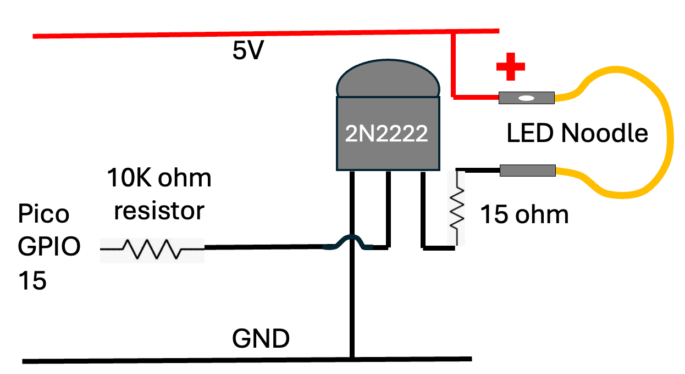

# LED Noodle Labs



## Parts

1. Breadboard
2. Raspberry Pi Pico
3. LED Noodle
4. 15 ohm current limiting resistor
5. 10K base resistor
6. 2N2222 NPN resistor

## Circuit

LED noodles can use over 100 milliamps.
Most digital outputs are rated at only 20 milliamps.
So to get enough current, we need to use a transistor
as a switch to turn the LED noodle on and off.



1. Connect the output of GPIO 15 to the 10k base resistor
2. Connect the other end of the base resistor to the middle pin of the 2N2222 transistor
3. Connect the emitter to ground
4. Connect the collector to the 15 ohm current limiting resistor
5. Connect the other end of the 15 ohm current limiting resistor to the cathode end (no hole) of the LED noodle
6. Connect the other end of the LED noodle (anode with hole) to the 5 volt rail

## Blink

```py
from machine import Pin, PWM
from time import sleep

# lower left corner of the Pico
LED_PIN_1 = 15
led_1 = machine.Pin(LED_PIN_1, machine.Pin.OUT)
delay = 1.0 3 # one second on and one second off

# Main loop: Repeat the forever...
while True:
    print('high')
    led_1.high() # turn on the LED
    sleep(delay) # leave it on for 1 second
    
    print('low')
    led_1.low()  # Turn off the LED
    sleep(delay) # leave it off for 1 second
```

## Fade In and Out

```py
from machine import Pin, PWM
from time import sleep

# lower left corner of the Pico
LED_PIN_1 = 15
pwm = PWM(Pin(LED_PIN_1))

pwm.freq(1000)
MAX_BRIGHTNESS = 65025

while True:
    for duty in range(MAX_BRIGHTNESS):
        pwm.duty_u16(duty)
        sleep(0.0001)
    for duty in range(MAX_BRIGHTNESS, 0, -1):
        pwm.duty_u16(duty)
        sleep(0.0001)
```

Note that the brightness does not change much
for the second half of the brightness.   To
get a more even change, you can change the
```MAX_BRIGHTNESS = 32000```.


## Sequential Fade In and Out

Now, let's connect five different LED noodles of different colors up
and have them turn on in a sequence, one after another.

We can just create five copies of the lines that define the LEDs and repeat this pattern over and over.

```py
from machine import Pin, PWM
from time import sleep, sleep_ms

# lower left corner of the Pico
LED_PIN_1 = 11
LED_PIN_2 = 12
LED_PIN_3 = 13
LED_PIN_4 = 14
LED_PIN_5 = 15
# led_1 = machine.Pin(LED_PIN_1, machine.Pin.OUT)
pwm_1 = PWM(Pin(LED_PIN_1))
pwm_2 = PWM(Pin(LED_PIN_2))
pwm_3 = PWM(Pin(LED_PIN_3))
pwm_4 = PWM(Pin(LED_PIN_4))
pwm_5 = PWM(Pin(LED_PIN_5))

pwm_1.freq(1000)
pwm_2.freq(1000)
pwm_3.freq(1000)
pwm_4.freq(1000)
pwm_5.freq(1000)

MAX_BRIGHTNESS = 32000
DELAY_MS = 1
while True:
    # turn up the brightness
    for duty in range(0, MAX_BRIGHTNESS, 100):
        pwm_1.duty_u16(duty)
        sleep_ms(DELAY_MS)
    # turn down the brightness
    for duty in range(MAX_BRIGHTNESS, 0, -100):
        pwm_1.duty_u16(duty)
        sleep_ms(DELAY_MS)
        
    for duty in range(0, MAX_BRIGHTNESS, 100):
        pwm_2.duty_u16(duty)
        sleep_ms(DELAY_MS)
    for duty in range(MAX_BRIGHTNESS, 0, -100):
        pwm_2.duty_u16(duty)
        sleep_ms(DELAY_MS)
        
    for duty in range(0, MAX_BRIGHTNESS, 100):
        pwm_3.duty_u16(duty)
        sleep_ms(DELAY_MS)
    for duty in range(MAX_BRIGHTNESS, 0, -100):
        pwm_3.duty_u16(duty)
        sleep_ms(DELAY_MS)
        
    for duty in range(0, MAX_BRIGHTNESS, 100):
        pwm_4.duty_u16(duty)
        sleep_ms(DELAY_MS)
    for duty in range(MAX_BRIGHTNESS, 0, -100):
        pwm_4.duty_u16(duty)
        sleep_ms(DELAY_MS)
        
    for duty in range(0, MAX_BRIGHTNESS, 100):
        pwm_5.duty_u16(duty)
        sleep_ms(DELAY_MS)
    for duty in range(MAX_BRIGHTNESS, 0, -100):
        pwm_5.duty_u16(duty)
        sleep_ms(DELAY_MS)
```

## Heartbeat

We can add a one second sleep to the off period to simulate
the beating of a heart.

```py
from machine import Pin, PWM
from time import sleep, sleep_ms

# lower left corner of the Pico
LED_PIN_1 = 12
pwm = PWM(Pin(LED_PIN_1))
pwm.freq(1000)
MAX_BRIGHTNESS = 20000

while True:
    for duty in range(0, MAX_BRIGHTNESS, 200):
        pwm.duty_u16(duty)
        sleep_ms(2)
    for duty in range(MAX_BRIGHTNESS, 0, -200):
        pwm.duty_u16(duty)
        sleep_ms(2)
    sleep(1)
```

