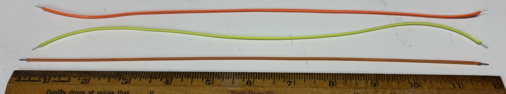

# LED Noodles

LED Noodles or "filament" LEDs are 3-volt flexible LEDs that are perfect
for costumes and other wearable items.  They come in multiple colors
and typically draw about 100 milliamps.  Our STEM students love
to work with them because of their combination of brightness and flexibility.

These lesson plans begin with simple static battery circuits with a current limiting
resistor.  After that, we proceed to dynamic circuits that are controlled by a
Raspberry Pi Pico running MicroPython.

## Static Circuits

Our first section gives you recipes for simple
LED Noodle circuits using a variety of battery
packs and USB power packs.  The circuits are
simple and just are turned on and off or
are controlled by a dimmer or photo-sensor.  They
are ideal for beginner projects that focus on
how the LEDs are used with flexible fabric and
clothing.

[Static Circuits](./static-circuits.md)

## LED Noodle Dimmer

Our LED Noodles can get very bright in a dark room.
Many of our users want to control how bright they are
on a costume.  To do this we created a simple LED
dimmer circuit using a potentiometer and transistor.

[LED Noodle Dimmer Circuit](./led-noodle-dimmer.md)

## LED Noodle Nightlight

This fun project makes our LED Noodle only turn on
when it is dark.  The circuit is perfect for a nightlight.
We use a photo-sensor and a transistor to turn on
the LED.

[LED Noodle Nightlight](./led-noodle-nightlight.md)

## Calculating Battery Life

So your LED costume is the hit of your Halloween party.
But will your costume work all night?  This lab
and MicroSim will help you find out!

[Calculating Battery Life](calculating-battery-life.md)

## Dynamic Circuits

Once we are familiar with how LED Noodles are
controlled, we can take the next step and power
them by microcontrollers like the Raspberry Pi
Pico and MicroPython.  These projects allow us to not only
control the brightness of a single LED Noodle
but also allow the LED Noodles to sequently
light up in waves.

[Dynamic Projects](./dynamic-projects.md)

## Voltage Current Curve

For a given voltage across the LED, how can we
calculate the amount of current that will be sent
through the LED Noodle?  The answer is not
as simple as you might expect.

[Voltage Current Curve](./voltage-current-curve.md)

## Other Project Ideas

[Project Ideas](./project-ideas.md)