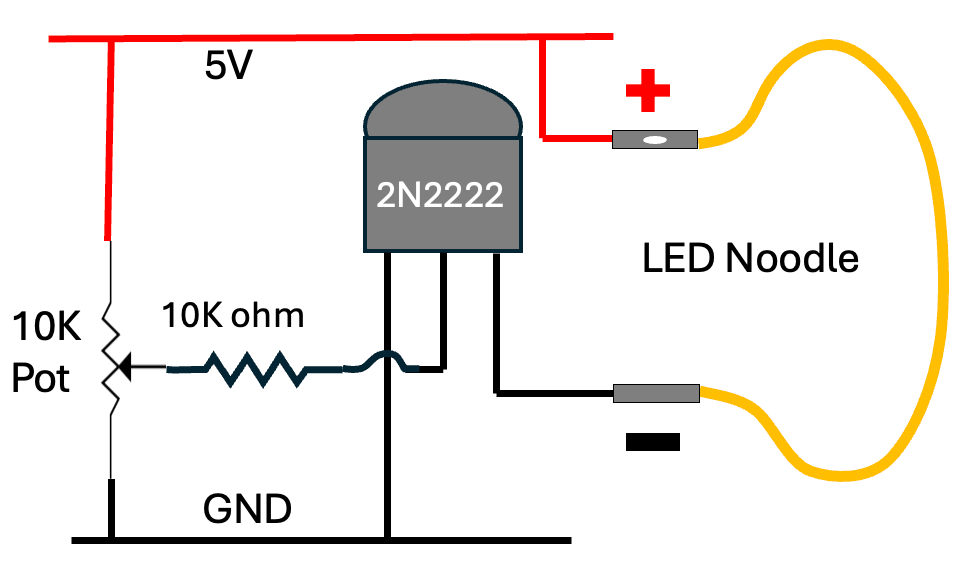
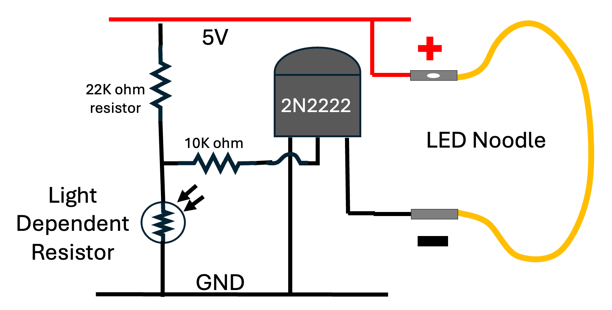
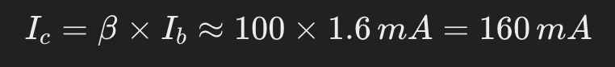
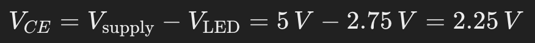
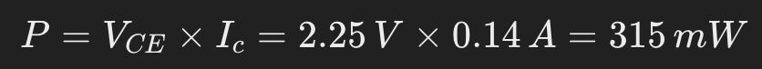

# LED Noodle Dimmer

<iframe width="560" height="315" src="https://www.youtube.com/embed/crtmArR-5nQ?si=OpGVJ7D90MnP3fNo" title="YouTube video player" frameborder="0" allow="accelerometer; autoplay; clipboard-write; encrypted-media; gyroscope; picture-in-picture; web-share" referrerpolicy="strict-origin-when-cross-origin" allowfullscreen></iframe>

LED noodles can be very bright.  When used in a costume at
a party in a dark room, the brightness can been overwhelming!
To be attractive, the brightness of the LEDs need to be turned
down.

In this lesson, we will use a potentiometer to change
the brightness of one or more LED noodles.  We
will start using a simple potentiometer in series
with the LED and then move on to circuits with
finer grain of control.

!!! Warning
    Be carful when you are adjusting the resistance of
    these circuits.  We never want the current limiting
    resistor to go to zero.  That will burn out the LED
    noodle.  We suggest ALWAYS having a 15 ohm resistor
    in series with the LED noodle so you don't accidentally
    burn it out using a 5 volt power supply.

## Designing our Dimmer Circuit

To design a dimmer circuit for your LED noodle using a 10 kΩ potentiometer and NPN transistors like the 2N2222, we'll create a simple adjustable current control circuit that utilizes the full range of your potentiometer.

### **Circuit Components:**

-   **Power Supply:** 5 V USB source
-   **LED Noodle:** Requires 2.39 V (no current) to 2.75 V (max 140 mA)
-   **Potentiometer:** 10 kΩ linear taper
-   **Transistor:** NPN transistor (e.g., 2N2222)
-   **Resistor​:** 10 kΩ resistor to limit base current to the transistor

## Circuit Connections

1.  **Potentiometer Setup:**

    -   Connect the **two outer terminals** of the 10 kΩ potentiometer to **+5 V** and **GND**.
    -   The **wiper (middle terminal)** provides a variable voltage from 0 V to 5 V as you turn the potentiometer.

2.  **Base Connection:**

    -   Connect the **wiper** through a **10 kΩ resistor ​** to the **base** of the NPN transistor.  This is the middle pin of the 2N2222 transistor.
    -   This resistor limits the base current to protect the transistor.
3.  **Emitter Connection:**

    -   Connect the **emitter** of Q1Q1Q1 directly to **GND**.
4.  **Collector Connection:**

    -   Connect the **collector** of Q1Q1Q1 to the **cathode** of the LED noodle.
    -   Connect the **anode** of the LED noodle to **+5 V**.

## Circuit Description

### Variable Voltage Control

-   The potentiometer adjusts the voltage at the base of the transistor from 0 V to approximately 5 V.
-   As the base voltage increases, the transistor allows more collector current, increasing the brightness of the LED noodle.

### Current Regulation

-   The 2.7 kΩ resistor RbR\_bRb​ ensures the base current (I-base)​ doesn't exceed safe levels.
-   Maximum base current when the wiper is at 5 V: I-base

-   The transistor's current gain (β ≈ 100) allows collector current I​ up to:

-   The value of 160 milliamps exceeds our required 140 mA, providing a full dimming range.

### Full Range Potentiometer Use

-   The potentiometer adjusts from **minimum brightness (off)** at 0 V to **maximum brightness** at 5 V.
-   This setup utilizes the full mechanical range of the potentiometer for smooth dimming control.

### Power Dissipation Check

-   **Transistor Power Dissipation:**
-   At maximum current (140 mA), the voltage across the transistor VCEV is:

We can now calculate the power dissipation in the 2N222 transistor:

-   The 2N2222 transistor can handle this power, as its maximum rating is around 625 mW.

## Final Notes

### Transistor Selection

-   Ensure your transistor can handle the maximum collector current (140 mA) and power dissipation.
-   The 2N2222 is suitable, but alternatives like the 2N4401 or any NPN transistor with similar or better ratings can also be used.

### Heat Considerations

-   At higher currents, the transistor may get warm. If necessary, attach a small heat sink to dissipate heat.

## Safety Measures

-   Double-check all connections before powering the circuit.
-   Ensure all components are rated appropriately to prevent overheating or damage.

## Conclusion

By following this circuit design, we can smoothly control the brightness of our LED noodle using the full range of your 10 kΩ potentiometer, with readily available components and without exceeding the specifications of your components.