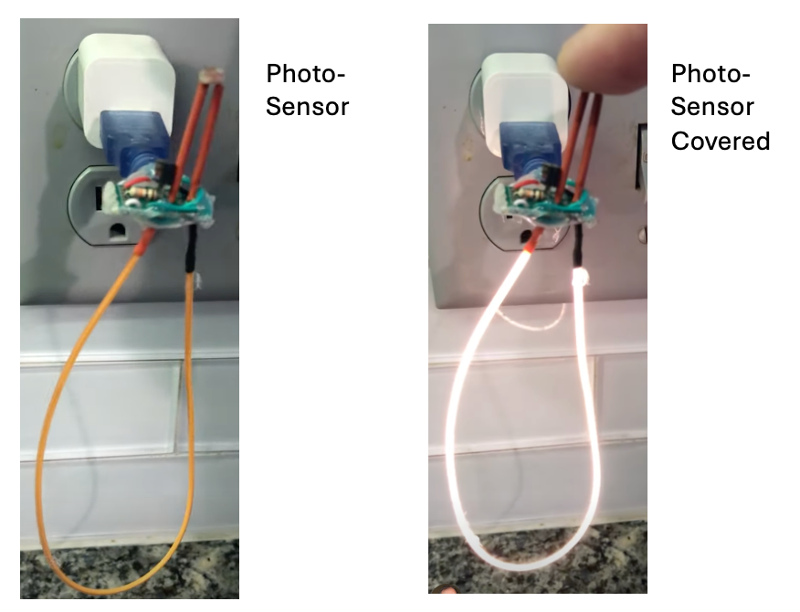
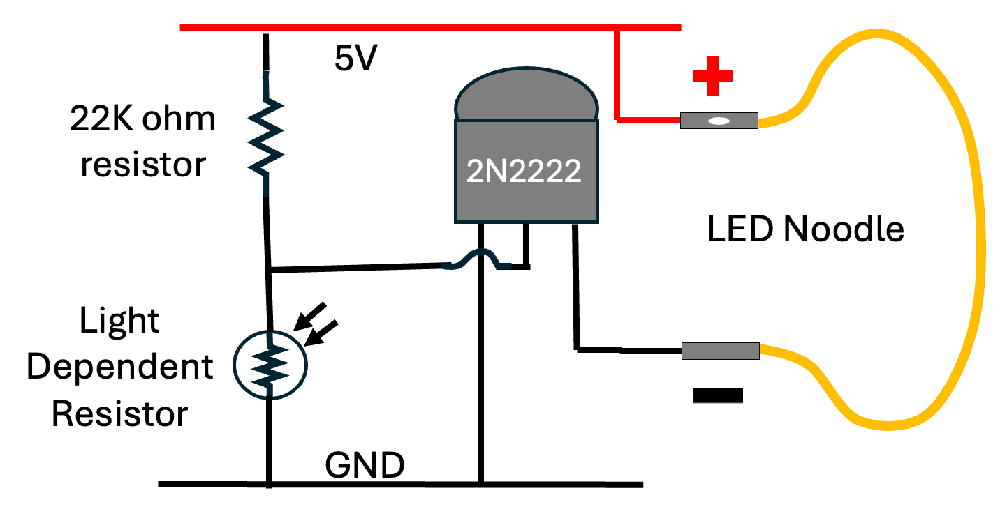
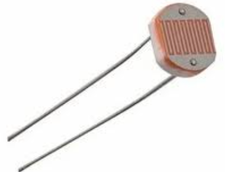
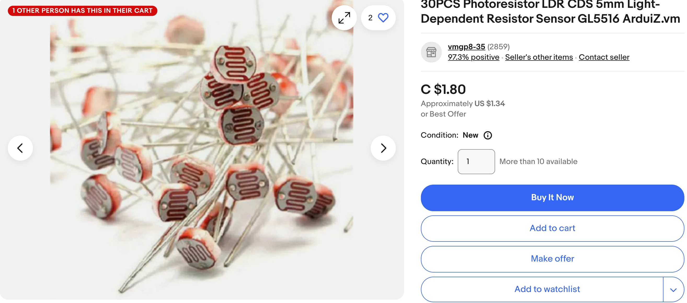

# LED Noodle Nightlight

We can create a nightlight that only goes on at night
by adding a photo-sensor to our LED circuit.
[https://youtube.com/shorts/LriJtNihyxY?si=2bpKlWYxMg4UexWk](https://youtube.com/shorts/LriJtNihyxY?si=2bpKlWYxMg4UexWk)

## Light Dependant Resistors

The photo-sensor we use is called a light-dependant-resistor or (LDR).  The LDR high resistance when it is dark, but when there is light shining on the sensor the resistance is low.  
In our circuit, light on the LDR pulls the voltage of the base
down to ground and shuts off the flow of current between the collector and the emitter.

When it is dark, the resistance of the LDR is high, which causes
the 10K bias resistor to pull the base up to 5V.  This lets
the current flow between the collector and the emitter.

LDR sensors are inexpensive.  You can typically get 30 of them on eBay
for under $2.

You can also combine them in parallel to create very sensitive sensors.

## Dividing the Voltage

This circuit illustrates the concept of a "voltage divider".  A voltage divider uses two resistor in series between the rails of a power supply.
When you measure the voltage of the center between the resistors, the voltage is somewhere between the positive voltage and ground.  The exact value is a ratio of the resistors.

For example, if you have a 10K on the top and a 20K on the bottom, the value will be 1/3 of the way between the top and the bottom.

In the case of the LDR, we can measure the resistance with light and without light and select a pull-up resistor that is about 1/2 the value of the on and off resistances.

## Project Ideas

You can cover the LED Noodle with a cutout of a pumpkin for Halloween or make a star or Christmas tree glow at night, but stay off during the day.

## References

[Build Electronics Circuits](https://www.build-electronic-circuits.com/night-light-circuit/) - This version uses a similar circuit, but it uses a 9-volt battery, a 100K resistor and a BC947 transistor.  However, the principal is the same.